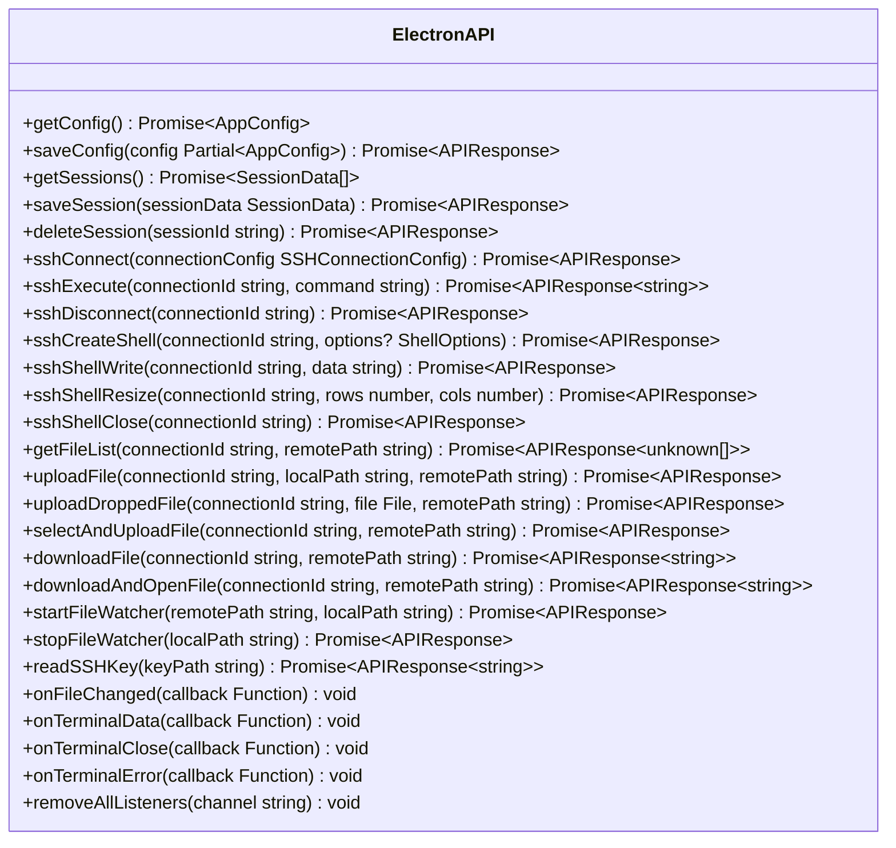
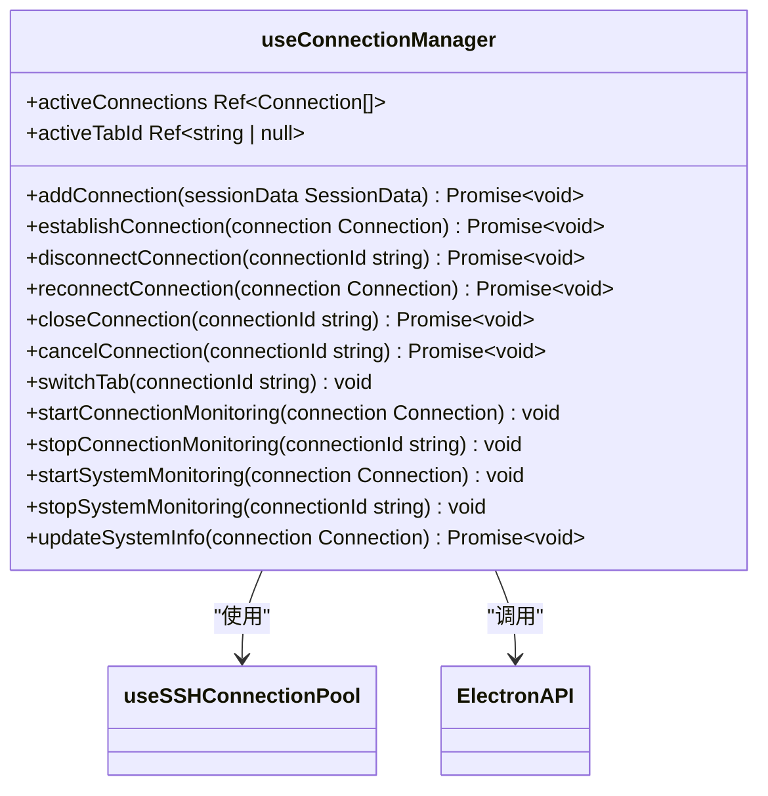
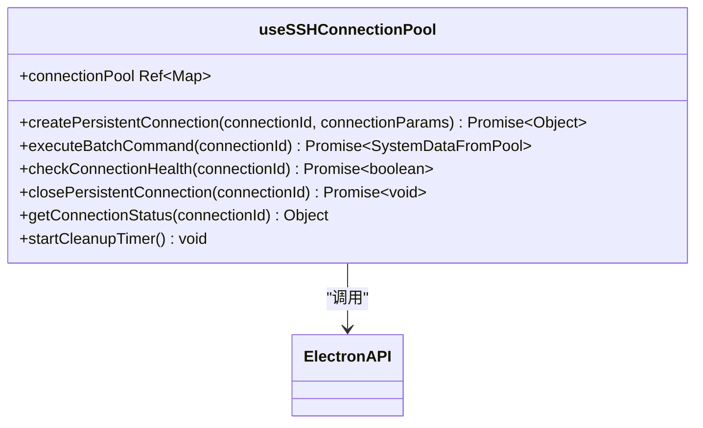
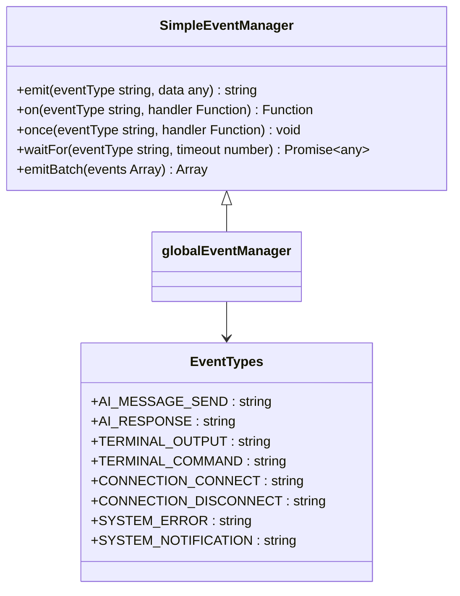

# API参考

<cite>
**本文档引用的文件**  
- [preload.ts](file://preload.ts)
- [useConnectionManager.ts](file://src/composables/useConnectionManager.ts)
- [useSSHConnectionPool.js](file://src/composables/useSSHConnectionPool.js)
- [eventSystem.ts](file://src/utils/eventSystem.ts)
- [electron.d.ts](file://src/types/electron.d.ts)
- [terminal.ts](file://src/types/terminal.ts)
- [ssh.ts](file://src/types/ssh.ts)
- [index.ts](file://src/types/index.ts)
</cite>

## 目录
1. [Electron IPC接口](#electron-ipc接口)
2. [连接管理Hook](#连接管理hook)
3. [SSH连接池组合函数](#ssh连接池组合函数)
4. [事件系统](#事件系统)

## Electron IPC接口

`preload.ts` 文件通过 `contextBridge.exposeInMainWorld('electronAPI', {...})` 向渲染进程暴露了主进程的API，实现了安全的进程间通信。这些API封装了SSH连接、文件操作、配置管理等核心功能。

**图示来源**
- [preload.ts](file://preload.ts#L1-L80)
- [electron.d.ts](file://src/types/electron.d.ts#L1-L64)

### 函数签名与说明

#### 配置管理
- **`getConfig()`**
  - **安全上下文**: 从主进程安全读取应用配置。
  - **异步行为**: 返回 `Promise<AppConfig>`，需 `await` 或 `.then()` 处理。
  - **错误处理**: 内部捕获文件读取错误，返回默认配置。
  - **返回值**: `Promise<AppConfig>`，包含AI、通用、终端和安全配置。

- **`saveConfig(config: Partial<AppConfig>)`**
  - **安全上下文**: 安全地将配置写入主进程的文件系统。
  - **异步行为**: 返回 `Promise<APIResponse>`。
  - **错误处理**: 捕获文件写入异常，返回 `{ success: false, error: string }`。

#### 会话管理
- **`getSessions()`**
  - **返回值**: `Promise<SessionData[]>`，返回所有保存的会话列表。
  - **错误处理**: 若文件不存在或读取失败，返回空数组。

- **`saveSession(sessionData: SessionData)`**
  - **异步行为**: 异步写入 `data/sessions.json` 文件。
  - **错误处理**: 返回 `APIResponse` 对象。

- **`deleteSession(sessionId: string)`**
  - **异步行为**: 从 `sessions.json` 中移除指定ID的会话。

#### SSH连接
- **`sshConnect(connectionConfig: SSHConnectionConfig)`**
  - **安全上下文**: 在主进程执行SSH连接，避免密钥和密码暴露在渲染进程。
  - **异步行为**: 返回 `Promise<APIResponse>`，连接成功时 `success: true`。
  - **错误处理**: 返回详细的错误信息，如认证失败、主机无法解析等。

- **`sshExecute(connectionId: string, command: string)`**
  - **异步行为**: 在指定连接上执行命令并返回输出。
  - **返回值**: `Promise<APIResponse<string>>`，`output` 字段包含命令输出。

- **`sshDisconnect(connectionId: string)`**
  - **异步行为**: 异步关闭SSH连接和相关资源。

#### SSH Shell会话
- **`sshCreateShell(connectionId: string, options?: ShellOptions)`**
  - **异步行为**: 创建一个交互式Shell会话。
  - **事件触发**: 成功后，主进程会通过 `ipcRenderer.send('terminal-data', ...)` 发送数据。

- **`sshShellWrite(connectionId: string, data: string)`**
  - **异步行为**: 向Shell会话写入数据（如用户输入）。
  - **错误处理**: 如果Shell会话不存在，返回错误。

- **`sshShellResize(connectionId: string, rows: number, cols: number)`**
  - **异步行为**: 调整远程Shell的终端窗口大小。

#### 文件操作
- **`getFileList(connectionId: string, remotePath: string)`**
  - **返回值**: `Promise<APIResponse<unknown[]>>`，`files` 字段包含目录列表。
  - **错误处理**: 处理路径不存在、权限不足等SFTP错误。

- **`uploadFile(connectionId: string, localPath: string, remotePath: string)`**
  - **安全上下文**: 文件上传在主进程完成，`localPath` 是主进程可访问的路径。

- **`uploadDroppedFile(connectionId: string, file: File, remotePath: string)`**
  - **特殊说明**: `file` 对象来自渲染进程的拖拽事件，其 `path` 属性被传递给主进程。

- **`downloadFile(connectionId: string, remotePath: string)`**
  - **返回值**: `Promise<APIResponse<string>>`，`output` 字段包含下载文件的本地路径。

#### 事件监听器
- **`onFileChanged(callback)`**
  - **异步行为**: 注册一个监听器，当被监控的文件发生变化时触发。
  - **参数**: `callback(event, data)`，`data` 类型为 `FileChangedEventData`。

- **`onTerminalData(callback)`**
  - **参数**: `data` 类型为 `TerminalDataEventData`，包含 `connectionId` 和 `data` (字符串)。

- **`onTerminalClose(callback)`**
  - **参数**: `data` 类型为 `TerminalCloseEventData`，包含退出码和信号。

- **`onTerminalError(callback)`**
  - **参数**: `data` 类型为 `TerminalErrorEventData`，包含错误信息。

- **`removeAllListeners(channel)`**
  - **用途**: 清理事件监听器，防止内存泄漏。

**本节来源**
- [preload.ts](file://preload.ts#L1-L80)
- [electron.d.ts](file://src/types/electron.d.ts#L1-L64)
- [main.ts](file://main.ts#L1-L996)

## 连接管理Hook

`useConnectionManager.ts` 是一个Vue组合式函数，负责管理所有活动的SSH连接的生命周期，包括连接、断开、重新连接和状态监控。

**图示来源**
- [useConnectionManager.ts](file://src/composables/useConnectionManager.ts#L10-L538)
- [useSSHConnectionPool.js](file://src/composables/useSSHConnectionPool.js#L2-L258)

### 核心方法

#### `useConnectionManager(emit)`
- **参数**: `emit` - 一个函数，用于向父组件发射事件（如显示通知）。
- **返回值**: 一个包含状态和方法的对象。

#### 连接生命周期方法
- **`addConnection(sessionData: SessionData)`**
  - **功能**: 根据会话数据创建一个新的 `Connection` 对象并添加到 `activeConnections` 中，然后调用 `establishConnection`。
  - **异步行为**: 内部调用 `establishConnection`，是异步的。
  - **错误处理**: 通过 `emit` 发送错误通知。

- **`establishConnection(connection: Connection)`**
  - **功能**: 执行实际的SSH连接逻辑。它调用 `window.electronAPI.sshConnect()`，并根据结果更新连接状态。
  - **安全上下文**: 通过 `electronAPI` 在主进程建立连接。
  - **异步行为**: 完全异步，包含多个 `await` 调用。
  - **错误处理**: 捕获所有异常，更新 `connection.errorMessage` 并通过 `emit` 发送通知。

- **`disconnectConnection(connectionId: string)`**
  - **功能**: 断开指定ID的连接。它会先尝试通过连接池关闭持久连接，然后调用 `electronAPI.sshDisconnect()`。
  - **异步行为**: 包含 `await` 调用。
  - **错误处理**: 捕获错误并通过 `emit` 发送通知。

- **`reconnectConnection(connection: Connection)`**
  - **功能**: 重新连接。它首先调用 `closePersistentConnection` 清理旧的持久连接，然后调用 `establishConnection`。
  - **异步行为**: 完全异步。

- **`closeConnection(connectionId: string)`**
  - **功能**: 关闭连接，包括断开连接、清理连接池和从 `activeConnections` 数组中移除。如果关闭的是当前活动标签，会自动切换到其他标签。
  - **异步行为**: 包含 `await disconnectConnection()`。

- **`cancelConnection(connectionId: string)`**
  - **功能**: 取消正在进行的连接。它将连接状态设为 `cancelled`，并尝试调用 `sshDisconnect` 来清理资源。

#### 事件回调与监控
- **`startConnectionMonitoring(connection: Connection)`**
  - **功能**: 为指定连接启动一个定时器（每30秒），调用 `checkConnectionHealth` 来检查连接是否存活。
  - **异步行为**: 定时器内异步执行 `checkConnectionHealth`。

- **`stopConnectionMonitoring(connectionId: string)`**
  - **功能**: 清除指定连接的监控定时器。

- **`checkConnectionHealth(connection: Connection)`**
  - **功能**: 通过执行 `echo "heartbeat"` 命令来测试连接。如果命令失败，会将连接状态设为 `disconnected` 并发送通知。

- **`startSystemMonitoring(connection: Connection)`**
  - **功能**: 为指定连接启动一个定时器（每秒），调用 `updateSystemInfo` 来获取CPU、内存等系统信息。
  - **异步行为**: 定时器内异步执行 `updateSystemInfo`。

- **`stopSystemMonitoring(connectionId: string)`**
  - **功能**: 清除指定连接的系统监控定时器。

- **`updateSystemInfo(connection: Connection)`**
  - **功能**: 更新连接的系统信息。它优先使用 `useSSHConnectionPool` 的 `executeBatchCommand` 来高效获取数据，失败时会降级处理。
  - **异步行为**: 完全异步。

**本节来源**
- [useConnectionManager.ts](file://src/composables/useConnectionManager.ts#L10-L538)

## SSH连接池组合函数

`useSSHConnectionPool.js` 提供了一个连接池管理机制，用于优化频繁的系统监控命令执行，减少SSH连接的开销。

**图示来源**
- [useSSHConnectionPool.js](file://src/composables/useSSHConnectionPool.js#L2-L258)

### 核心接口

#### `useSSHConnectionPool()`
- **返回值**: 一个包含连接池实例和管理方法的对象。

#### 连接池管理接口
- **`createPersistentConnection(connectionId, connectionParams)`**
  - **功能**: 在连接池中创建一个持久的SSH连接。它调用 `electronAPI.sshConnect()` 建立连接，并在内部维护一个状态对象。
  - **异步行为**: 返回 `Promise`。
  - **错误处理**: 抛出错误，由调用者（如 `useConnectionManager`）处理。

- **`executeBatchCommand(connectionId)`**
  - **功能**: 在指定的持久连接上执行一个预定义的批量命令（`buildSystemMonitorCommand`），该命令一次性获取CPU、内存、磁盘等信息。
  - **异步行为**: 返回 `Promise<SystemDataFromPool>`。
  - **错误处理**: 捕获错误，增加错误计数，错误超过3次会将连接标记为 `error` 状态。

- **`closePersistentConnection(connectionId)`**
  - **功能**: 关闭并从连接池中移除指定的持久连接。它会调用 `electronAPI.sshDisconnect()`。
  - **异步行为**: 包含 `await` 调用。

- **`getConnectionStatus(connectionId)`**
  - **功能**: 同步获取指定连接在池中的状态（如 `connected`, `error`, `lastUsed`）。
  - **返回值**: 一个包含状态信息的对象，或 `null`。

- **`checkConnectionHealth(connectionId)`**
  - **功能**: 通过执行心跳命令检查池中连接的健康状况。
  - **异步行为**: 返回 `Promise<boolean>`。

- **`startCleanupTimer()`**
  - **功能**: 启动一个定时器（每分钟），清理超过5分钟未使用或处于 `error` 状态的连接。

**本节来源**
- [useSSHConnectionPool.js](file://src/composables/useSSHConnectionPool.js#L2-L258)

## 事件系统

`eventSystem.ts` 实现了一个轻量级的事件总线，用于组件间的解耦通信。

**图示来源**
- [eventSystem.ts](file://src/utils/eventSystem.ts#L11-L33)
- [eventSystem.ts](file://src/utils/eventSystem.ts#L35-L287)

### 可监听事件

事件类型定义在 `EventTypes` 常量中：

- **`AI_MESSAGE_SEND`**: 当AI助手收到用户消息时触发。
- **`AI_RESPONSE`**: 当AI助手返回响应时触发。
- **`TERMINAL_OUTPUT`**: 当有新的终端输出时触发。
- **`TERMINAL_COMMAND`**: 当用户在终端输入命令时触发。
- **`SSH_COMMAND_EXECUTE`**: 当执行SSH命令时触发。
- **`CONNECTION_CONNECT`**: 当成功建立SSH连接时触发。
- **`CONNECTION_DISCONNECT`**: 当SSH连接断开时触发。
- **`SYSTEM_ERROR`**: 当发生系统级错误时触发。
- **`SYSTEM_NOTIFICATION`**: 当需要显示系统通知时触发。

### 事件触发条件

- **`emit(eventType, data)`**: 手动发送一个事件。
- **`on(eventType, handler)`**: 注册一个事件监听器。
- **`once(eventType, handler)`**: 注册一个只执行一次的事件监听器。
- **`waitFor(eventType, timeout)`**: 返回一个Promise，当指定事件在超时前触发时，Promise会resolve。

**本节来源**
- [eventSystem.ts](file://src/utils/eventSystem.ts#L11-L287)