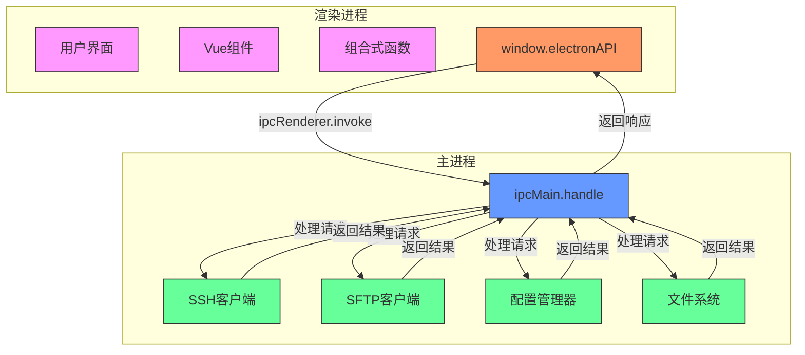
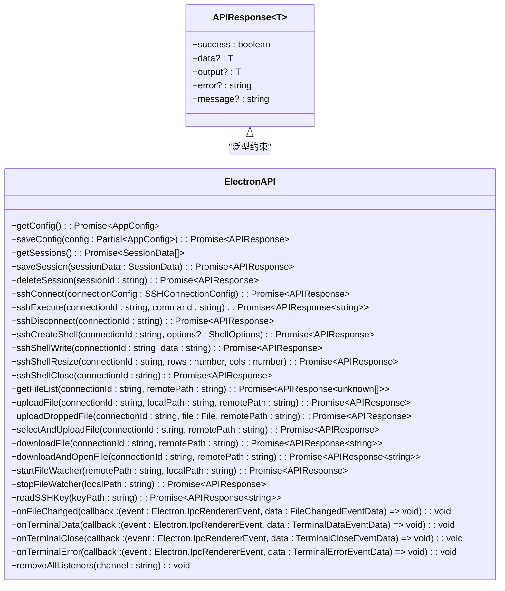
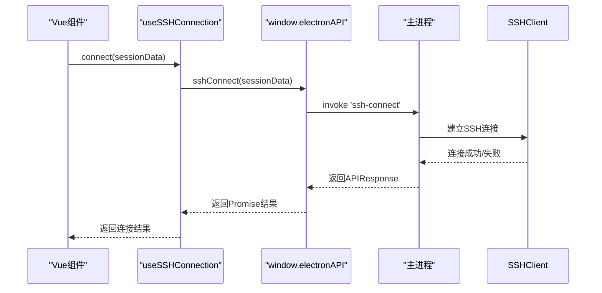
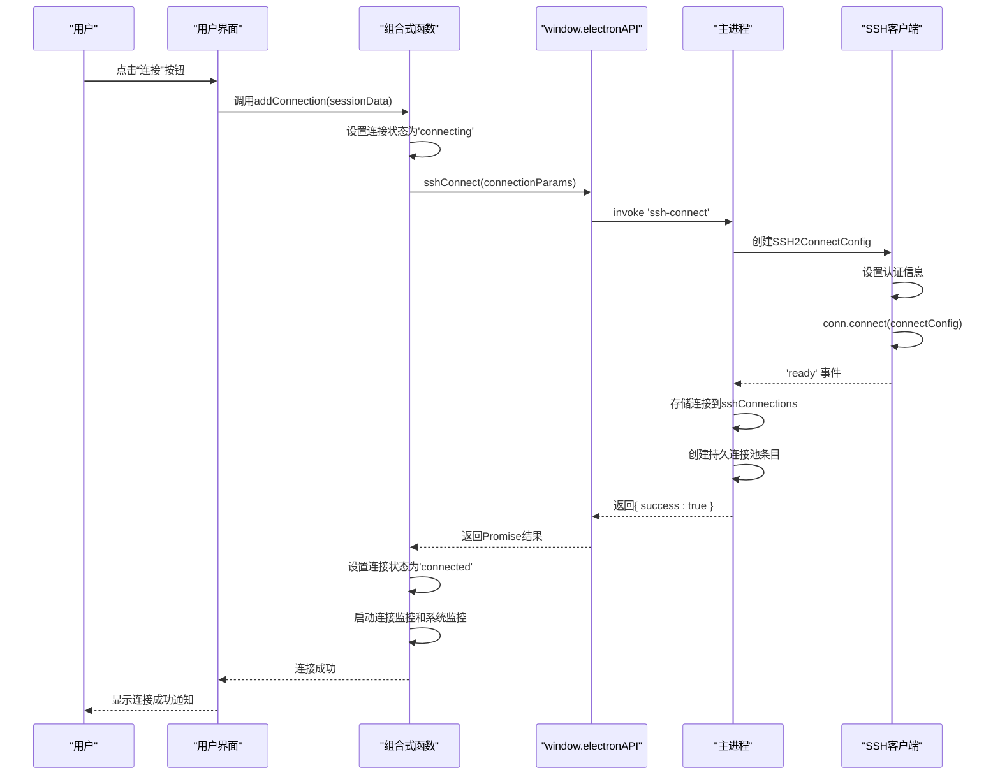

# IPC接口

<cite>
**Referenced Files in This Document**  
- [preload.ts](file://preload.ts)
- [main.ts](file://main.ts)
- [src/types/electron.d.ts](file://src/types/electron.d.ts)
- [src/types/ssh.ts](file://src/types/ssh.ts)
- [src/types/api.ts](file://src/types/api.ts)
- [src/hooks/useElectronAPI.ts](file://src/hooks/useElectronAPI.ts)
- [src/composables/useConnectionManager.ts](file://src/composables/useConnectionManager.ts)
- [src/modules/terminal/composables/useTerminalManager.ts](file://src/modules/terminal/composables/useTerminalManager.ts)
- [src/modules/ai-assistant/utils/aiService.ts](file://src/modules/ai-assistant/utils/aiService.ts)
- [src/composables/useSSHConnectionPool.js](file://src/composables/useSSHConnectionPool.js)
</cite>

## 目录
1. [引言](#引言)
2. [IPC通信架构](#ipc通信架构)
3. [预加载脚本API](#预加载脚本api)
4. [主进程处理逻辑](#主进程处理逻辑)
5. [渲染进程调用示例](#渲染进程调用示例)
6. [消息序列图](#消息序列图)
7. [安全配置与错误处理](#安全配置与错误处理)
8. [跨进程安全风险与防范](#跨进程安全风险与防范)

## 引言

本文档详细说明了sshcode应用中Electron主进程与渲染进程之间的IPC（进程间通信）机制。sshcode是一款基于Electron的SSH客户端应用，通过精心设计的IPC接口实现了安全、高效的跨进程通信。文档将深入分析`preload.ts`中暴露给渲染进程的所有API函数，包括`sshConnect`、`sshDisconnect`、`sshExecute`等方法的函数签名、参数类型、返回值格式和调用上下文。同时，文档将解释每个IPC通道的安全配置、沙箱隔离策略和错误处理模式，为开发者提供全面的参考。

**Section sources**
- [preload.ts](file://preload.ts#L1-L80)
- [main.ts](file://main.ts#L1-L996)

## IPC通信架构

sshcode应用的IPC通信架构基于Electron的安全最佳实践，采用预加载脚本（preload script）作为主进程与渲染进程之间的安全桥梁。该架构确保了渲染进程无法直接访问Node.js和Electron的敏感API，同时又能通过受控的接口与主进程进行通信。

主进程负责处理所有与操作系统和网络相关的敏感操作，如SSH连接、文件系统访问和配置管理。渲染进程则专注于用户界面的展示和交互。两者通过`ipcRenderer.invoke`和`ipcMain.handle`方法进行异步通信，确保了应用的响应性和稳定性。



**Diagram sources**
- [preload.ts](file://preload.ts#L1-L80)
- [main.ts](file://main.ts#L1-L996)

**Section sources**
- [preload.ts](file://preload.ts#L1-L80)
- [main.ts](file://main.ts#L1-L996)

## 预加载脚本API

`preload.ts`文件通过`contextBridge.exposeInMainWorld`方法向渲染进程暴露了一个名为`electronAPI`的安全API对象。该对象包含了所有允许渲染进程调用的主进程功能，每个方法都通过`ipcRenderer.invoke`与主进程的`ipcMain.handle`处理器进行通信。

### API函数签名与类型定义

所有IPC API的返回值都遵循`APIResponse<T>`接口，该接口定义了统一的响应格式，包含`success`、`data`、`error`等字段，便于前端进行一致的错误处理。



**Diagram sources**
- [src/types/api.ts](file://src/types/api.ts#L4-L10)
- [src/types/electron.d.ts](file://src/types/electron.d.ts#L13-L63)

#### SSH连接管理API

`preload.ts`暴露了三个核心的SSH连接管理API：`sshConnect`、`sshExecute`和`sshDisconnect`。这些方法构成了应用与远程服务器交互的基础。

- **sshConnect**: 建立与远程SSH服务器的连接。接收一个`SSHConnectionConfig`对象作为参数，包含主机、端口、用户名、认证方式等信息。成功时返回`{ success: true }`，失败时返回带有错误信息的对象。
- **sshExecute**: 在已建立的SSH连接上执行命令。接收连接ID和命令字符串作为参数。成功时返回`{ success: true, output: "命令输出" }`，其中`output`字段包含命令的执行结果。
- **sshDisconnect**: 断开指定的SSH连接。接收连接ID作为参数。成功时返回`{ success: true }`。

```mermaid
classDiagram
class SSHConnectionConfig {
+id : string
+name : string
+host : string
+port : number
+username : string
+authType : 'password' | 'key'
+password? : string
+privateKey? : string
+keyContent? : string
}
class APIResponse~T~ {
+success : boolean
+data? : T
+output? : T
+error? : string
+message? : string
}
sshConnect : (connectionConfig : SSHConnectionConfig) => Promise~APIResponse~
sshExecute : (connectionId : string, command : string) => Promise~APIResponse~string~~
sshDisconnect : (connectionId : string) => Promise~APIResponse~
sshConnect --> SSHConnectionConfig : "参数"
sshConnect --> APIResponse : "返回值"
sshExecute --> APIResponse : "返回值"
sshDisconnect --> APIResponse : "返回值"
```

**Diagram sources**
- [preload.ts](file://preload.ts#L1-L80)
- [src/types/ssh.ts](file://src/types/ssh.ts#L1-L105)
- [src/types/api.ts](file://src/types/api.ts#L4-L10)

**Section sources**
- [preload.ts](file://preload.ts#L1-L80)
- [src/types/electron.d.ts](file://src/types/electron.d.ts#L13-L63)
- [src/types/ssh.ts](file://src/types/ssh.ts#L1-L105)
- [src/types/api.ts](file://src/types/api.ts#L4-L10)

## 主进程处理逻辑

主进程在`main.ts`文件中通过`ipcMain.handle`方法注册了所有IPC事件的处理器。这些处理器负责执行实际的业务逻辑，并将结果返回给渲染进程。

### SSH连接处理

`ipcMain.handle('ssh-connect', ...)`处理器使用`ssh2`库建立与远程服务器的连接。它首先根据连接配置创建`SSH2ConnectConfig`对象，然后根据认证方式（密码或密钥）设置相应的认证信息。连接成功后，连接实例被存储在`sshConnections`对象中，以便后续的命令执行和断开连接操作。

### 命令执行处理

`ipcMain.handle('ssh-execute', ...)`处理器负责在已建立的SSH连接上执行命令。它首先检查连接是否存在，然后使用`conn.exec`方法执行命令。为了模拟真实的终端环境，它设置了`TERM`、`SHELL`、`PATH`等环境变量。命令的输出通过`data`事件收集，并在`close`事件触发时将完整的输出返回给渲染进程。

### 连接管理处理

`ipcMain.handle('ssh-disconnect', ...)`处理器负责清理与指定连接相关的所有资源。它会关闭SSH连接、关闭任何打开的Shell会话，并从`sshConnections`和`sshConnectionConfigs`对象中删除相应的条目，确保内存的正确释放。

```mermaid
flowchart TD
A[渲染进程调用<br/>window.electronAPI.sshConnect] --> B[ipcMain.handle('ssh-connect')]
B --> C{连接配置有效?}
C --> |是| D[创建SSH2ConnectConfig]
C --> |否| E[返回错误: 缺少认证信息]
D --> F[根据authType设置密码或私钥]
F --> G[conn.connect(connectConfig)]
G --> H{连接成功?}
H --> |是| I[存储连接到sshConnections]
H --> |否| J[解析错误级别<br/>返回友好错误信息]
I --> K[返回{ success: true }]
J --> L[返回{ success: false, error: "..." }]
K --> M[渲染进程收到成功响应]
L --> N[渲染进程收到错误响应]
style A fill:#f9f,stroke:#333
style B fill:#69f,stroke:#333
style C fill:#ff9,stroke:#333
style D fill:#6f9,stroke:#333
style E fill:#f66,stroke:#333
style F fill:#6f9,stroke:#333
style G fill:#6f9,stroke:#333
style H fill:#ff9,stroke:#333
style I fill:#6f9,stroke:#333
style J fill:#f66,stroke:#333
style K fill:#6f9,stroke:#333
style L fill:#f66,stroke:#333
style M fill:#f9f,stroke:#333
style N fill:#f9f,stroke:#333
```

**Diagram sources**
- [main.ts](file://main.ts#L1-L996)

**Section sources**
- [main.ts](file://main.ts#L1-L996)

## 渲染进程调用示例

在Vue组件中，可以通过`window.electronAPI`对象调用暴露的IPC API。以下是在`useElectronAPI.ts`和`useConnectionManager.ts`中调用这些API的实际代码示例。

### 使用组合式函数调用



**Diagram sources**
- [src/hooks/useElectronAPI.ts](file://src/hooks/useElectronAPI.ts#L96-L120)
- [src/composables/useConnectionManager.ts](file://src/composables/useConnectionManager.ts#L1-L540)

### 异步调用最佳实践

在调用IPC API时，应始终使用`async/await`或`.then()`来处理异步操作。同时，必须使用`try/catch`块来捕获可能的错误，以提供良好的用户体验。

```typescript
// src/hooks/useElectronAPI.ts
const connect = async sessionData => {
  if (!window.electronAPI) return null;

  try {
    const connection = await window.electronAPI.sshConnect(sessionData);
    if (connection.success) {
      // 处理成功连接
      return connection;
    }
    throw new Error(connection.error || '连接失败');
  } catch (error) {
    console.error('SSH连接失败:', error);
    throw error;
  }
};
```

**Section sources**
- [src/hooks/useElectronAPI.ts](file://src/hooks/useElectronAPI.ts#L96-L120)
- [src/composables/useConnectionManager.ts](file://src/composables/useConnectionManager.ts#L1-L540)
- [src/modules/terminal/composables/useTerminalManager.ts](file://src/modules/terminal/composables/useTerminalManager.ts#L1-L270)
- [src/modules/ai-assistant/utils/aiService.ts](file://src/modules/ai-assistant/utils/aiService.ts#L1-L721)

## 消息序列图

以下序列图说明了从用户点击连接按钮到成功建立SSH连接的完整IPC交互过程。



**Diagram sources**
- [src/composables/useConnectionManager.ts](file://src/composables/useConnectionManager.ts#L1-L540)
- [preload.ts](file://preload.ts#L1-L80)
- [main.ts](file://main.ts#L1-L996)

## 安全配置与错误处理

### 安全配置

sshcode应用的IPC通信遵循Electron的安全最佳实践。`BrowserWindow`的`webPreferences`中设置了`nodeIntegration: false`和`contextIsolation: true`，这确保了渲染进程无法直接访问Node.js的API。所有与主进程的通信都必须通过`preload.ts`中暴露的`electronAPI`对象进行，该对象通过`contextBridge`进行了加固，防止原型污染等安全攻击。

### 错误处理模式

主进程的IPC处理器采用了统一的错误处理模式。它们都返回一个`APIResponse`对象，其中`success`字段指示操作是否成功，`error`字段包含详细的错误信息。主进程会将底层的错误（如网络超时、认证失败）转换为对用户友好的错误消息，例如将`ETIMEDOUT`错误转换为“连接超时，请检查网络连接”。

```mermaid
flowchart TD
A[主进程IPC处理器] --> B{操作成功?}
B --> |是| C[返回{ success: true, ... }]
B --> |否| D[捕获错误]
D --> E{错误级别?}
E --> |client-authentication| F[返回"认证失败，请检查用户名和密码/密钥"]
E --> |ENOTFOUND| G[返回"主机地址无法解析，请检查主机名或IP地址"]
E --> |ECONNREFUSED| H[返回"连接被拒绝，请检查主机地址和端口"]
E --> |ETIMEDOUT| I[返回"连接超时，请检查网络连接"]
E --> |其他| J[返回原始错误消息]
F --> K[返回{ success: false, error: "..." }]
G --> K
H --> K
I --> K
J --> K
C --> L[渲染进程处理成功]
K --> M[渲染进程处理错误]
style A fill:#69f,stroke:#333
style B fill:#ff9,stroke:#333
style C fill:#6f9,stroke:#333
style D fill:#f66,stroke:#333
style E fill:#ff9,stroke:#333
style F fill:#f66,stroke:#333
style G fill:#f66,stroke:#333
style H fill:#f66,stroke:#333
style I fill:#f66,stroke:#333
style J fill:#f66,stroke:#333
style K fill:#f66,stroke:#333
style L fill:#f9f,stroke:#333
style M fill:#f9f,stroke:#333
```

**Diagram sources**
- [main.ts](file://main.ts#L1-L996)

**Section sources**
- [main.ts](file://main.ts#L1-L996)
- [src/types/api.ts](file://src/types/api.ts#L4-L10)

## 跨进程安全风险与防范

### 潜在安全风险

尽管采用了安全的IPC架构，但仍存在一些潜在的风险：
- **输入验证不足**：如果主进程对来自渲染进程的输入参数验证不足，可能导致命令注入或路径遍历攻击。
- **权限提升**：如果某些IPC API被滥用，可能允许渲染进程执行超出其权限的操作。
- **信息泄露**：错误处理不当可能泄露敏感的系统信息。

### 防范措施

sshcode应用采取了以下措施来防范这些风险：
- **严格的输入验证**：主进程在处理任何操作前都会验证输入参数的有效性，例如检查文件路径是否合法。
- **最小权限原则**：每个IPC API都只暴露完成其功能所必需的最小权限集。
- **错误信息脱敏**：主进程会将底层的错误信息转换为对用户友好的、不包含敏感细节的消息。
- **沙箱隔离**：通过`contextIsolation`和`nodeIntegration: false`确保渲染进程处于沙箱环境中。

**Section sources**
- [preload.ts](file://preload.ts#L1-L80)
- [main.ts](file://main.ts#L1-L996)
- [src/types/electron.d.ts](file://src/types/electron.d.ts#L13-L63)
- [src/types/ssh.ts](file://src/types/ssh.ts#L1-L105)
- [src/types/api.ts](file://src/types/api.ts#L4-L10)