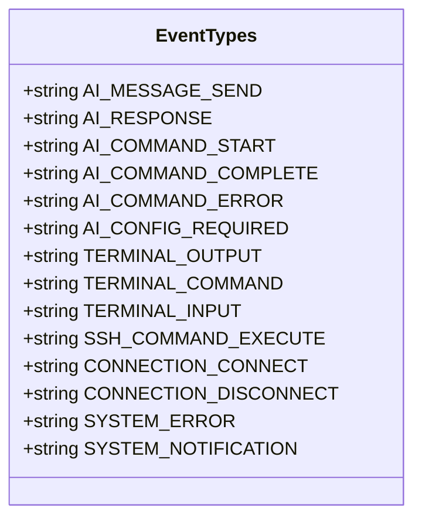
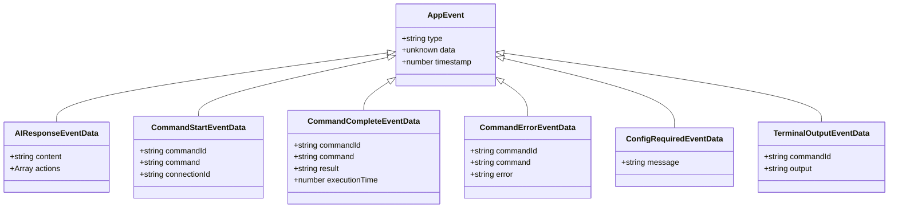
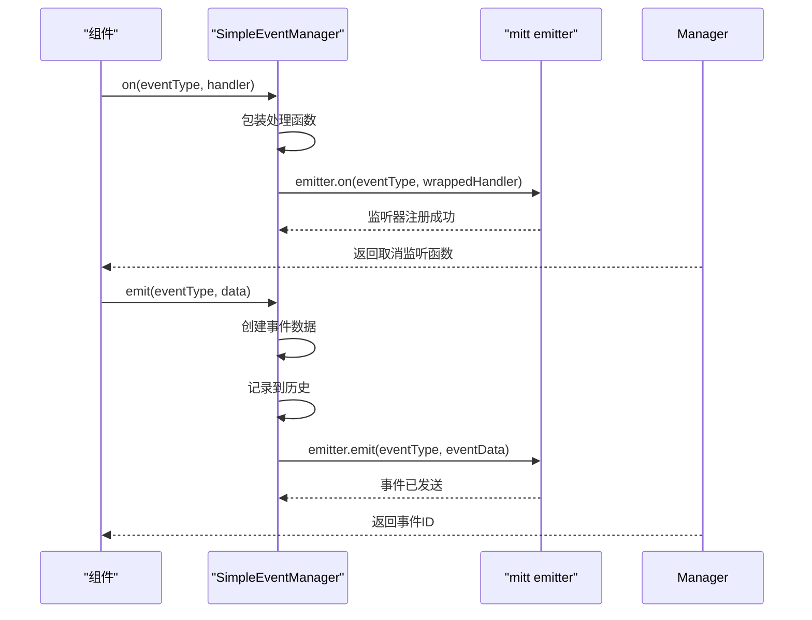
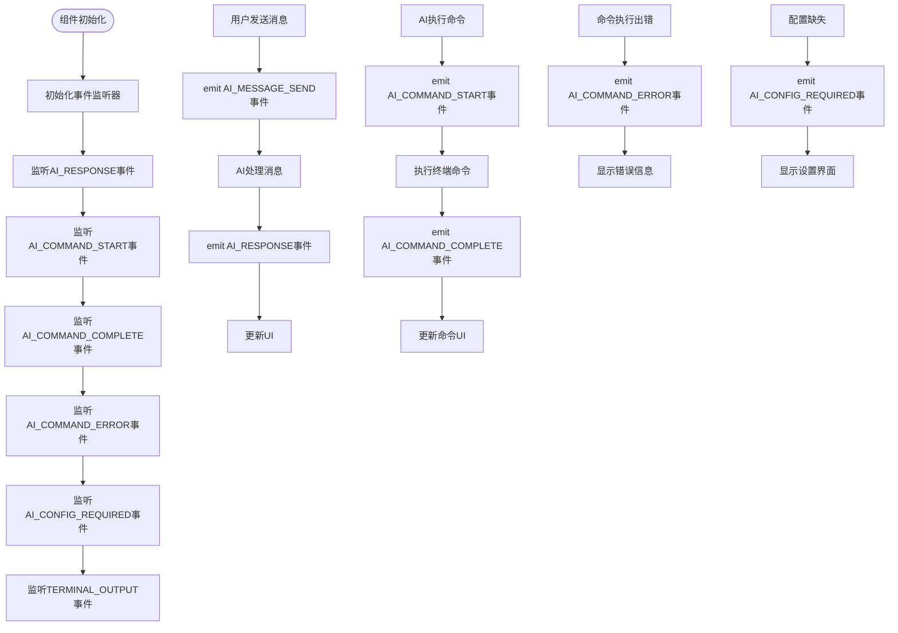
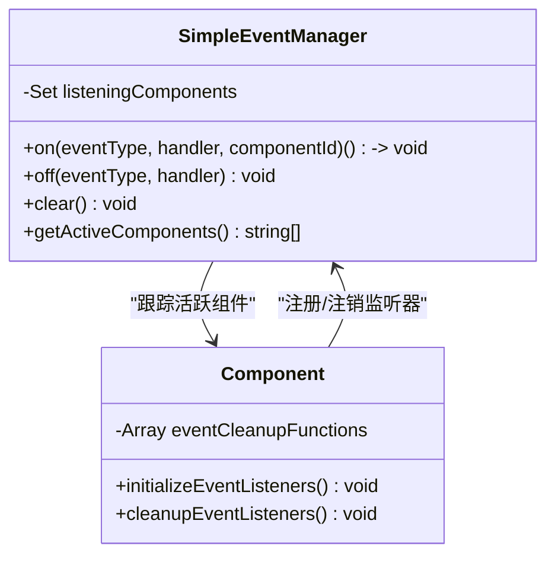
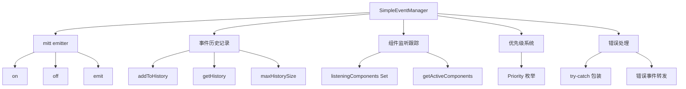
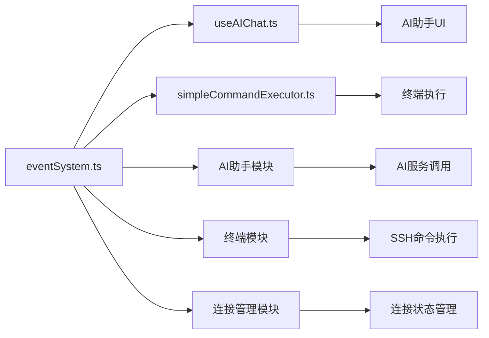

# 事件系统

<cite>
**Referenced Files in This Document**   
- [eventSystem.ts](file://src/utils/eventSystem.ts)
- [events.ts](file://src/types/events.ts)
- [useAIChat.ts](file://src/modules/ai-assistant/composables/useAIChat.ts)
- [simpleCommandExecutor.ts](file://src/modules/terminal/utils/simpleCommandExecutor.ts)
</cite>

## 目录
1. [简介](#简介)
2. [核心组件](#核心组件)
3. [事件类型与载荷结构](#事件类型与载荷结构)
4. [事件系统使用方式](#事件系统使用方式)
5. [事件命名规范与内存泄漏防范](#事件命名规范与内存泄漏防范)
6. [事件系统架构设计](#事件系统架构设计)
7. [依赖分析](#依赖分析)

## 简介
本文档详细说明了全局事件系统（globalEventManager）的实现机制和使用方式。该系统采用轻量级设计原则，不依赖第三方库而使用原生JavaScript实现观察者模式的内部构造。通过`installEventSystem`函数将事件管理器注入Vue应用实例和依赖注入系统，使得所有组件可通过`$events`或`inject('eventManager')`访问全局事件总线。

## 核心组件

事件系统的核心组件包括`globalEventManager`实例和`installEventSystem`函数。`globalEventManager`是`SimpleEventManager`类的单例实例，负责管理所有事件的发布、订阅和历史记录。`installEventSystem`函数将事件管理器注入Vue应用，使其在全局属性和依赖注入系统中可用。

**Section sources**
- [eventSystem.ts](file://src/utils/eventSystem.ts#L259-L259)
- [eventSystem.ts](file://src/utils/eventSystem.ts#L281-L286)

## 事件类型与载荷结构

### 事件类型定义
事件系统定义了多种事件类型，涵盖AI聊天、终端操作、连接管理和系统事件等核心功能。

**Diagram sources**
- [eventSystem.ts](file://src/utils/eventSystem.ts#L11-L33)

### 核心事件载荷结构
系统中所有可触发和监听的事件类型都有明确的载荷结构定义。

**Diagram sources**
- [events.ts](file://src/types/events.ts#L0-L51)

#### 核心事件触发时机
- **connection:connected/connection:disconnected**: 连接状态变更时触发
- **notification:show**: 系统需要显示通知时触发
- **error:occurred**: 系统发生错误时触发
- **ai-command-start**: AI助手开始执行命令时触发
- **ai-command-complete**: AI助手完成命令执行时触发
- **ai-command-error**: AI助手执行命令出错时触发

## 事件系统使用方式

### 在组件中使用事件系统
组件可以通过`$events`或`inject('eventManager')`访问全局事件总线。

**Diagram sources**
- [eventSystem.ts](file://src/utils/eventSystem.ts#L49-L102)
- [eventSystem.ts](file://src/utils/eventSystem.ts#L104-L154)

### 代码示例
在组件中使用`on`、`off`、`emit`方法进行事件订阅和发布。

**Diagram sources**
- [useAIChat.ts](file://src/modules/ai-assistant/composables/useAIChat.ts#L78-L84)
- [simpleCommandExecutor.ts](file://src/modules/terminal/utils/simpleCommandExecutor.ts#L274-L310)

**Section sources**
- [useAIChat.ts](file://src/modules/ai-assistant/composables/useAIChat.ts#L78-L84)
- [simpleCommandExecutor.ts](file://src/modules/terminal/utils/simpleCommandExecutor.ts#L274-L310)

## 事件命名规范与内存泄漏防范

### 事件命名规范
事件命名采用小写字母和连字符分隔的格式，按功能模块分类：
- AI聊天相关：`ai-message-send`, `ai-response`
- 终端操作：`terminal-output`, `terminal-command`
- 连接管理：`connection-connect`, `connection-disconnect`
- 系统事件：`system-error`, `system-notification`

### 内存泄漏防范措施
事件系统通过以下机制防范内存泄漏：

**Diagram sources**
- [eventSystem.ts](file://src/utils/eventSystem.ts#L44-L256)
- [useAIChat.ts](file://src/modules/ai-assistant/composables/useAIChat.ts#L120-L150)

1. **组件ID跟踪**：`on`方法支持`componentId`参数，用于跟踪哪些组件正在监听事件
2. **自动清理**：返回的取消监听函数会自动从`listeningComponents`集合中移除组件ID
3. **批量清理**：`clear()`方法可清除所有监听器和组件跟踪
4. **生命周期集成**：在组件的`onUnmounted`钩子中调用`cleanupEventListeners`确保资源释放

## 事件系统架构设计

### 轻量级设计原则
事件系统采用轻量级设计，不依赖第三方库而使用原生JavaScript实现观察者模式。

**Diagram sources**
- [eventSystem.ts](file://src/utils/eventSystem.ts#L44-L256)

### 内部构造
事件系统内部构造包括：
- **事件发射器**：基于`mitt`库的轻量级事件发射器
- **事件历史**：记录最近100个事件，支持按类型查询
- **组件跟踪**：使用`Set`跟踪活跃的监听组件
- **优先级系统**：定义事件优先级（CRITICAL, HIGH, NORMAL, LOW）
- **错误处理**：包装处理函数，捕获异常并转发为系统错误事件

## 依赖分析

### 核心依赖关系
事件系统与其他模块的依赖关系如下：

**Diagram sources**
- [eventSystem.ts](file://src/utils/eventSystem.ts)
- [useAIChat.ts](file://src/modules/ai-assistant/composables/useAIChat.ts)
- [simpleCommandExecutor.ts](file://src/modules/terminal/utils/simpleCommandExecutor.ts)

**Section sources**
- [eventSystem.ts](file://src/utils/eventSystem.ts)
- [useAIChat.ts](file://src/modules/ai-assistant/composables/useAIChat.ts)
- [simpleCommandExecutor.ts](file://src/modules/terminal/utils/simpleCommandExecutor.ts)