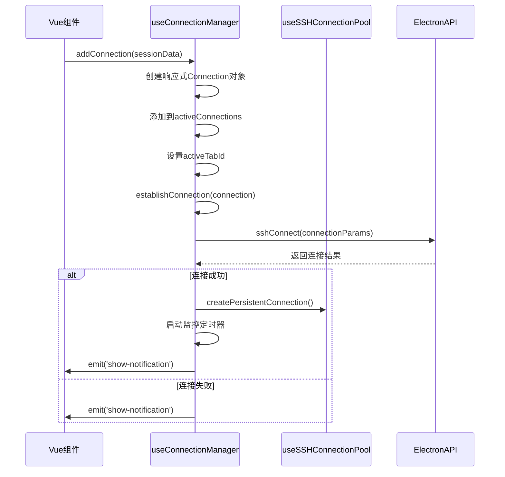
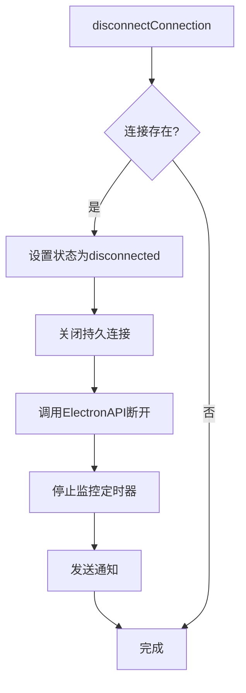
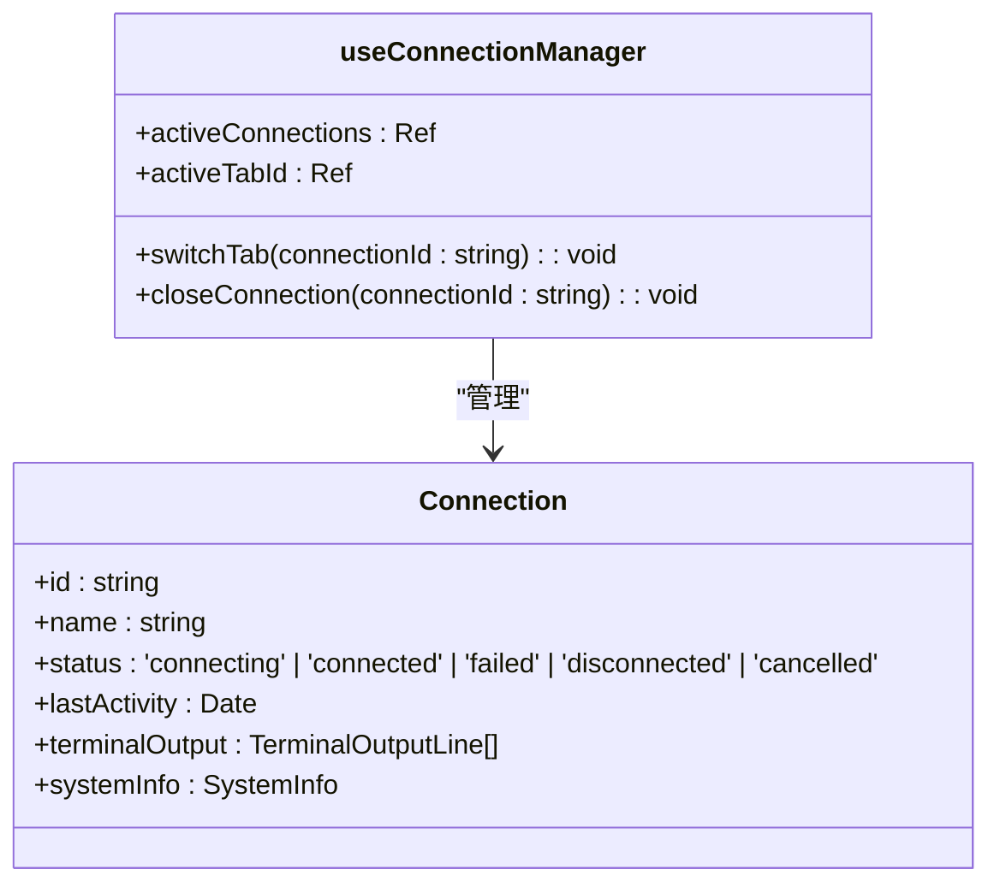
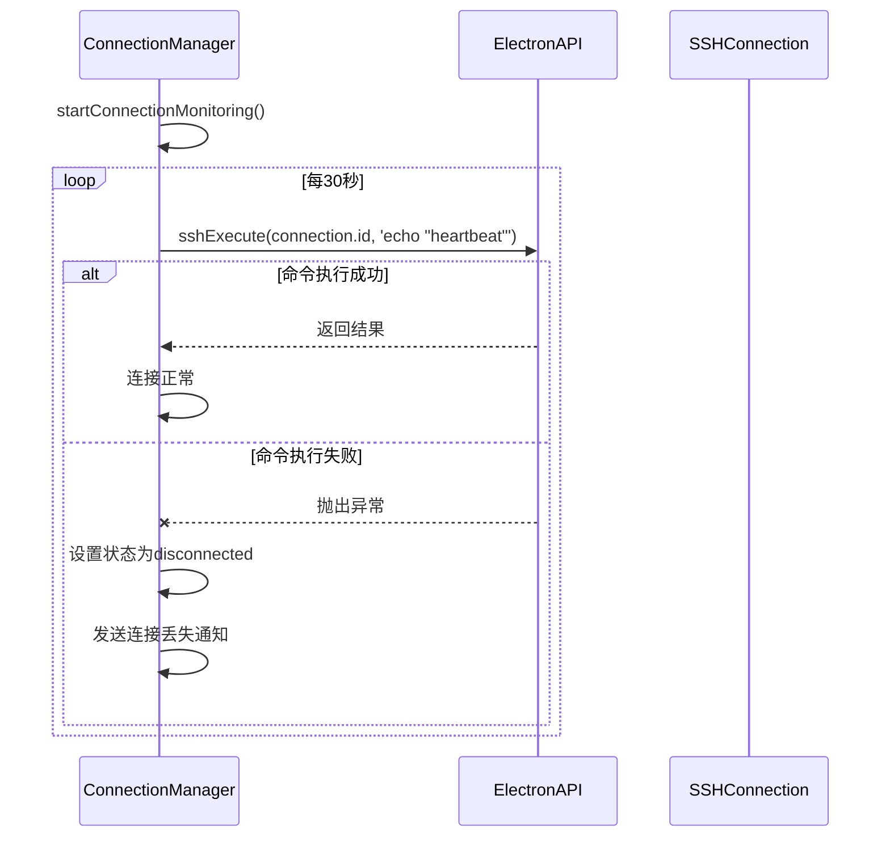
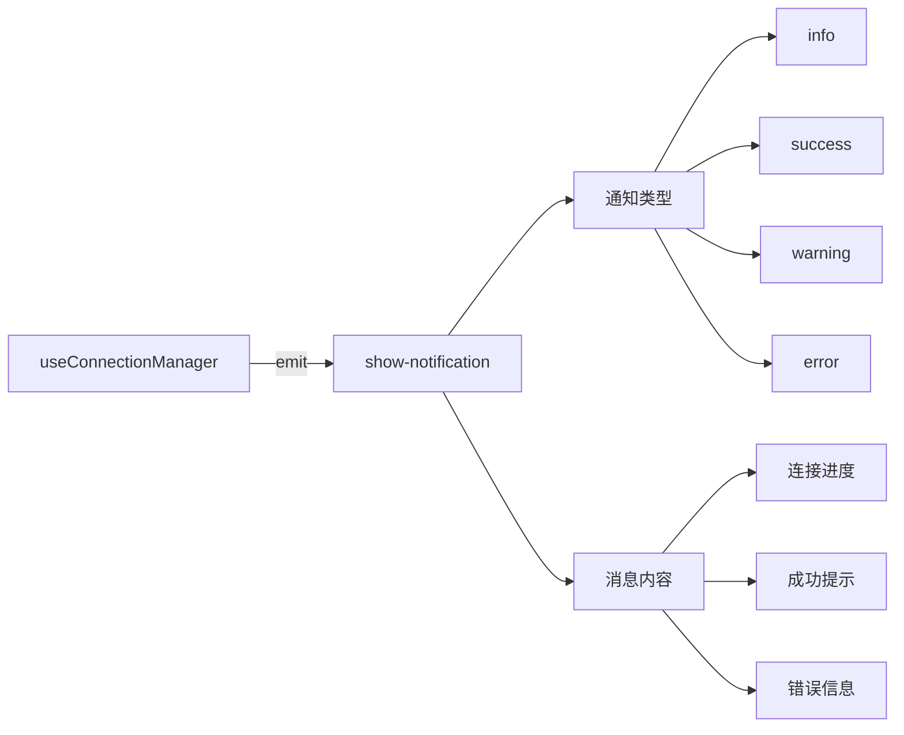
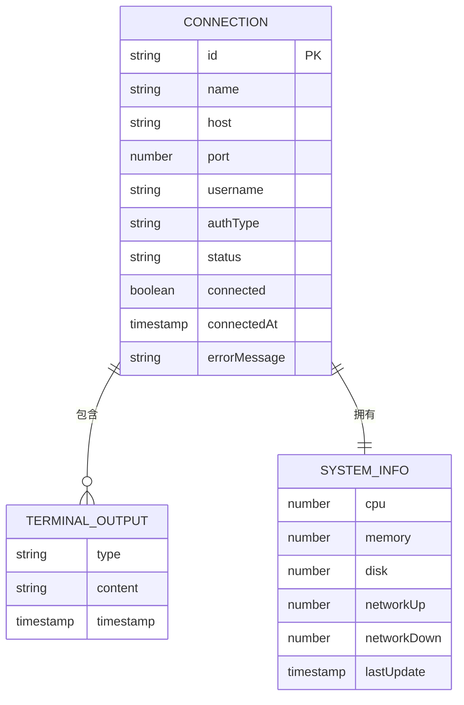

# useConnectionManager 组合式函数

<cite>
**Referenced Files in This Document**   
- [useConnectionManager.ts](file://src/composables/useConnectionManager.ts)
- [useSSHConnectionPool.js](file://src/composables/useSSHConnectionPool.js)
- [ssh.ts](file://src/types/ssh.ts)
- [terminal.ts](file://src/types/terminal.ts)
</cite>

## 目录
1. [核心职责概述](#核心职责概述)
2. [连接管理核心机制](#连接管理核心机制)
3. [连接生命周期管理](#连接生命周期管理)
4. [多标签会话管理](#多标签会话管理)
5. [连接健康监控](#连接健康监控)
6. [事件通信机制](#事件通信机制)
7. [状态管理与数据结构](#状态管理与数据结构)

## 核心职责概述

`useConnectionManager` 组合式函数是SSH连接管理系统的核心，负责管理所有SSH连接的创建、维护、监控和销毁。该函数通过响应式状态管理、定时任务调度和ElectronAPI调用，实现了完整的SSH会话生命周期管理。

**Section sources**
- [useConnectionManager.ts](file://src/composables/useConnectionManager.ts#L10-L538)

## 连接管理核心机制

### addConnection方法实现

`addConnection` 方法是创建新SSH连接的入口点，负责初始化连接对象并启动连接流程。该方法接收 `SessionData` 类型的会话数据，创建一个响应式的 `Connection` 对象，并将其添加到 `activeConnections` 数组中。

**Diagram sources**
- [useConnectionManager.ts](file://src/composables/useConnectionManager.ts#L31-L79)
- [useConnectionManager.ts](file://src/composables/useConnectionManager.ts#L82-L211)

### establishConnection流程

`establishConnection` 方法执行实际的SSH连接建立过程。该方法首先验证 `window.electronAPI` 的可用性，然后封装连接参数并调用ElectronAPI的 `sshConnect` 方法。连接参数包括连接ID、主机名、端口、用户名、密码和私钥内容等关键信息。

**Section sources**
- [useConnectionManager.ts](file://src/composables/useConnectionManager.ts#L82-L211)
- [ssh.ts](file://src/types/ssh.ts#L37-L47)

## 连接生命周期管理

### 断开与重新连接

`disconnectConnection` 和 `reconnectConnection` 方法共同管理连接的生命周期。`disconnectConnection` 负责优雅地断开现有连接，包括关闭持久连接池中的连接、调用ElectronAPI的断开方法，并停止相关的监控定时器。

**Diagram sources**
- [useConnectionManager.ts](file://src/composables/useConnectionManager.ts#L245-L295)

### 连接关闭与清理

`closeConnection` 方法负责完全关闭并从系统中移除连接。该方法首先检查连接状态，如果连接处于活动状态则先调用 `disconnectConnection`，然后从 `activeConnections` 数组中移除连接对象，并处理活动标签页的切换逻辑。

**Section sources**
- [useConnectionManager.ts](file://src/composables/useConnectionManager.ts#L300-L348)

## 多标签会话管理

### 标签切换机制

`switchTab` 方法实现多标签会话的切换功能。该方法接收连接ID作为参数，更新 `activeTabId` 状态以激活指定的标签页，并更新连接对象的最后活动时间戳。

**Diagram sources**
- [useConnectionManager.ts](file://src/composables/useConnectionManager.ts#L239-L243)
- [ssh.ts](file://src/types/ssh.ts#L50-L56)

## 连接健康监控

### 心跳检测机制

`startConnectionMonitoring` 方法通过 `setInterval` 启动30秒间隔的心跳检测。该定时器定期调用 `checkConnectionHealth` 方法，通过向SSH连接发送 `echo "heartbeat"` 命令来检测连接的健康状态。

**Diagram sources**
- [useConnectionManager.ts](file://src/composables/useConnectionManager.ts#L352-L361)
- [useConnectionManager.ts](file://src/composables/useConnectionManager.ts#L364-L383)

### 系统资源监控

`startSystemMonitoring` 方法启动1秒间隔的系统资源监控。该方法优先使用连接池的 `executeBatchCommand` 方法批量获取CPU、内存、磁盘和网络使用率等系统信息，并通过 `processSystemData` 方法计算网络速率。

**Section sources**
- [useConnectionManager.ts](file://src/composables/useConnectionManager.ts#L389-L410)
- [useSSHConnectionPool.js](file://src/composables/useSSHConnectionPool.js#L50-L100)

## 事件通信机制

### emit事件通信

`useConnectionManager` 通过emit参数与Vue组件进行事件通信，主要使用 `show-notification` 事件向用户展示连接状态信息。该机制允许组合式函数在连接建立、断开、失败等关键节点向UI层发送通知。

**Section sources**
- [useConnectionManager.ts](file://src/composables/useConnectionManager.ts#L97-L384)
- [useConnectionManager.ts](file://src/composables/useConnectionManager.ts#L1-L10)

## 状态管理与数据结构

### 响应式状态管理

`activeConnections` 状态数组使用Vue的 `ref` 和 `reactive` 实现响应式管理。每个连接对象都是响应式的，确保UI能够实时反映连接状态的变化。

**Diagram sources**
- [useConnectionManager.ts](file://src/composables/useConnectionManager.ts#L15-L20)
- [ssh.ts](file://src/types/ssh.ts#L50-L56)
- [terminal.ts](file://src/types/terminal.ts#L48-L52)

### 输出历史记录限制

`addTerminalOutput` 方法实现对终端输出历史记录的管理，当输出行数超过1000条时，自动保留最近的500条记录，确保内存使用效率。

**Section sources**
- [useConnectionManager.ts](file://src/composables/useConnectionManager.ts#L230-L236)
- [terminal.ts](file://src/types/terminal.ts#L48-L52)