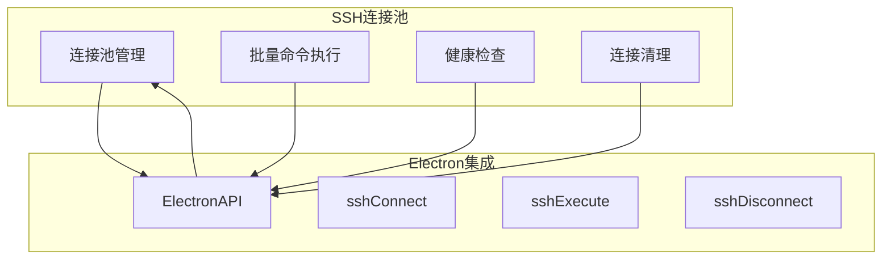
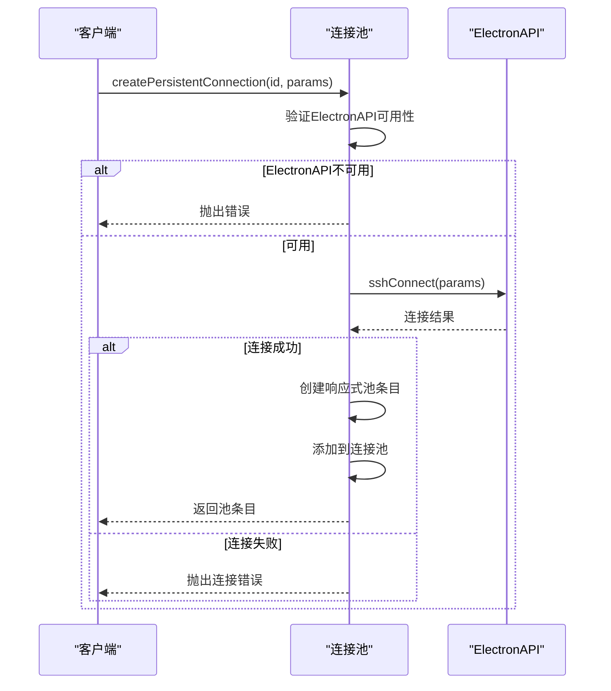
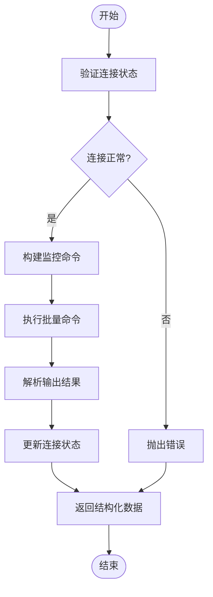
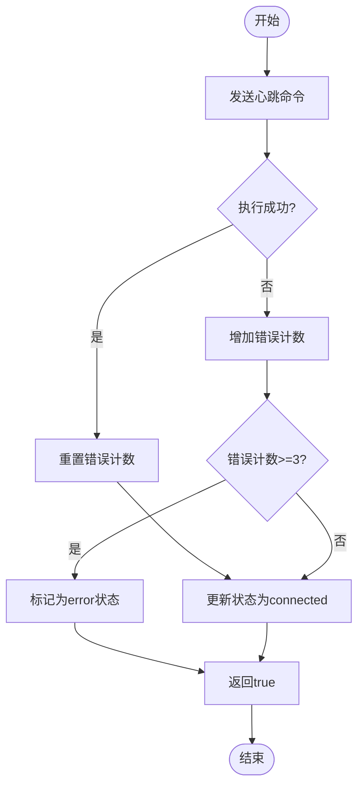
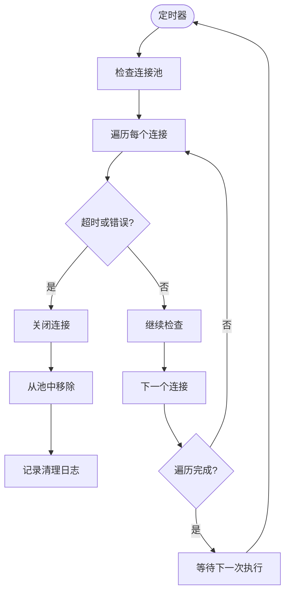
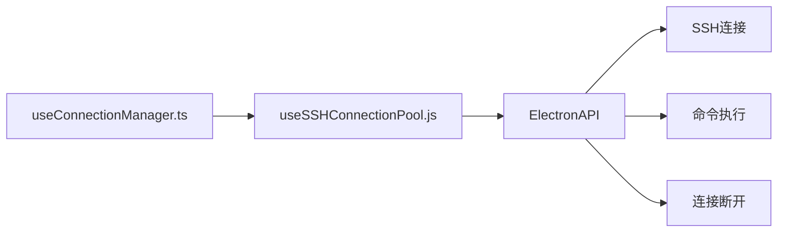

# useSSHConnectionPool 组合式函数

<cite>
**Referenced Files in This Document**   
- [useSSHConnectionPool.js](file://src/composables/useSSHConnectionPool.js)
- [useConnectionManager.ts](file://src/composables/useConnectionManager.ts)
- [useElectronAPI.ts](file://src/hooks/useElectronAPI.ts)
</cite>

## 目录
1. [简介](#简介)
2. [核心组件](#核心组件)
3. [架构概述](#架构概述)
4. [详细组件分析](#详细组件分析)
5. [依赖分析](#依赖分析)
6. [性能考虑](#性能考虑)
7. [故障排除指南](#故障排除指南)
8. [结论](#结论)

## 简介
`useSSHConnectionPool` 是一个组合式函数，作为SSH连接池管理器，负责管理多个SSH连接的生命周期、状态监控和资源清理。该函数通过响应式数据结构和Electron API实现持久化连接管理，为系统监控和命令执行提供稳定的基础。

**Section sources**
- [useSSHConnectionPool.js](file://src/composables/useSSHConnectionPool.js#L1-L258)

## 核心组件
`useSSHConnectionPool` 提供了创建、执行、检查、关闭和清理SSH连接的核心功能。其主要组件包括连接池管理、批量命令执行、健康检查和自动清理机制。

**Section sources**
- [useSSHConnectionPool.js](file://src/composables/useSSHConnectionPool.js#L1-L258)

## 架构概述
`useSSHConnectionPool` 作为SSH连接管理的核心模块，通过Map数据结构维护连接池，每个连接条目包含完整的状态信息和执行历史。该模块与Electron API交互，实现底层SSH连接操作，并通过定时器机制实现自动资源清理。

**Diagram sources**
- [useSSHConnectionPool.js](file://src/composables/useSSHConnectionPool.js#L1-L258)
- [useElectronAPI.ts](file://src/hooks/useElectronAPI.ts#L1-L134)

## 详细组件分析

### 创建持久连接分析
`createPersistentConnection` 函数负责创建包含完整连接参数、状态和历史的响应式池条目。该函数首先验证Electron API的可用性，然后通过`window.electronAPI.sshConnect`建立基础连接，最后创建一个响应式的池条目对象并添加到连接池中。

**Diagram sources**
- [useSSHConnectionPool.js](file://src/composables/useSSHConnectionPool.js#L8-L43)

**Section sources**
- [useSSHConnectionPool.js](file://src/composables/useSSHConnectionPool.js#L8-L43)

### 批量命令执行分析
`executeBatchCommand` 函数实现了系统监控命令的批量执行和结果解析。该函数首先检查连接状态，然后调用`buildSystemMonitorCommand`构建包含六项系统指标的复合Shell命令，通过Electron API执行后，使用`parseBatchOutput`解析多行输出并转换为结构化数据。

**Diagram sources**
- [useSSHConnectionPool.js](file://src/composables/useSSHConnectionPool.js#L46-L103)

**Section sources**
- [useSSHConnectionPool.js](file://src/composables/useSSHConnectionPool.js#L46-L103)

### 健康检查机制分析
`checkConnectionHealth` 函数基于心跳命令实现连接健康检查。该函数向指定连接发送"echo 'heartbeat'"命令，根据执行结果更新连接状态。当连续三次执行失败时，错误计数器达到阈值，连接状态被标记为'error'，实现容错策略。

**Diagram sources**
- [useSSHConnectionPool.js](file://src/composables/useSSHConnectionPool.js#L176-L196)

**Section sources**
- [useSSHConnectionPool.js](file://src/composables/useSSHConnectionPool.js#L176-L196)

### 资源清理机制分析
`cleanupConnections` 函数实现连接资源的自动清理，每分钟由`startCleanupTimer`启动执行。该函数遍历连接池，清理超过5分钟未使用或处于'error'状态的连接，通过`closePersistentConnection`完成资源释放。

**Diagram sources**
- [useSSHConnectionPool.js](file://src/composables/useSSHConnectionPool.js#L231-L246)

**Section sources**
- [useSSHConnectionPool.js](file://src/composables/useSSHConnectionPool.js#L231-L246)

## 依赖分析
`useSSHConnectionPool` 依赖于Electron API进行底层SSH操作，并被`useConnectionManager`引用以实现高级连接管理功能。该模块通过import语句从`./useSSHConnectionPool.js`导入，并在`useConnectionManager`中实例化使用。

**Diagram sources**
- [useSSHConnectionPool.js](file://src/composables/useSSHConnectionPool.js#L1-L258)
- [useConnectionManager.ts](file://src/composables/useConnectionManager.ts#L1-L538)

**Section sources**
- [useSSHConnectionPool.js](file://src/composables/useSSHConnectionPool.js#L1-L258)
- [useConnectionManager.ts](file://src/composables/useConnectionManager.ts#L1-L538)

## 性能考虑
`useSSHConnectionPool` 通过连接池复用机制减少频繁建立SSH连接的开销，批量命令执行减少网络往返次数。定时清理机制防止资源泄漏，但每分钟的检查频率需要根据实际连接数量评估性能影响。建议在高并发场景下监控定时器的执行性能。

[No sources needed since this section provides general guidance]

## 故障排除指南
当连接池功能异常时，应首先检查Electron API的可用性，确认`window.electronAPI`是否正确初始化。对于连接频繁断开的问题，检查健康检查的心跳命令执行情况和错误计数器状态。资源泄漏问题可通过监控`cleanupConnections`的执行日志来诊断。

**Section sources**
- [useSSHConnectionPool.js](file://src/composables/useSSHConnectionPool.js#L1-L258)
- [useElectronAPI.ts](file://src/hooks/useElectronAPI.ts#L1-L134)

## 结论
`useSSHConnectionPool` 作为一个功能完整的SSH连接池管理器，提供了连接生命周期管理、系统监控、健康检查和自动清理等核心功能。通过与`useConnectionManager`的集成，为应用程序提供了稳定可靠的SSH连接基础，有效提升了系统监控的效率和用户体验。

[No sources needed since this section summarizes without analyzing specific files]