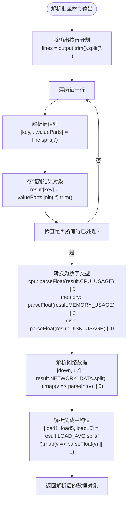
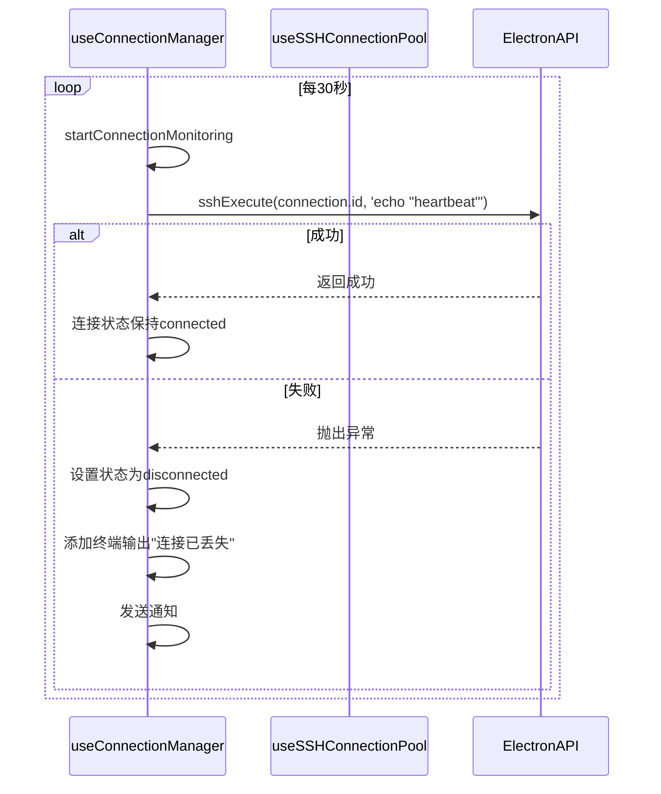
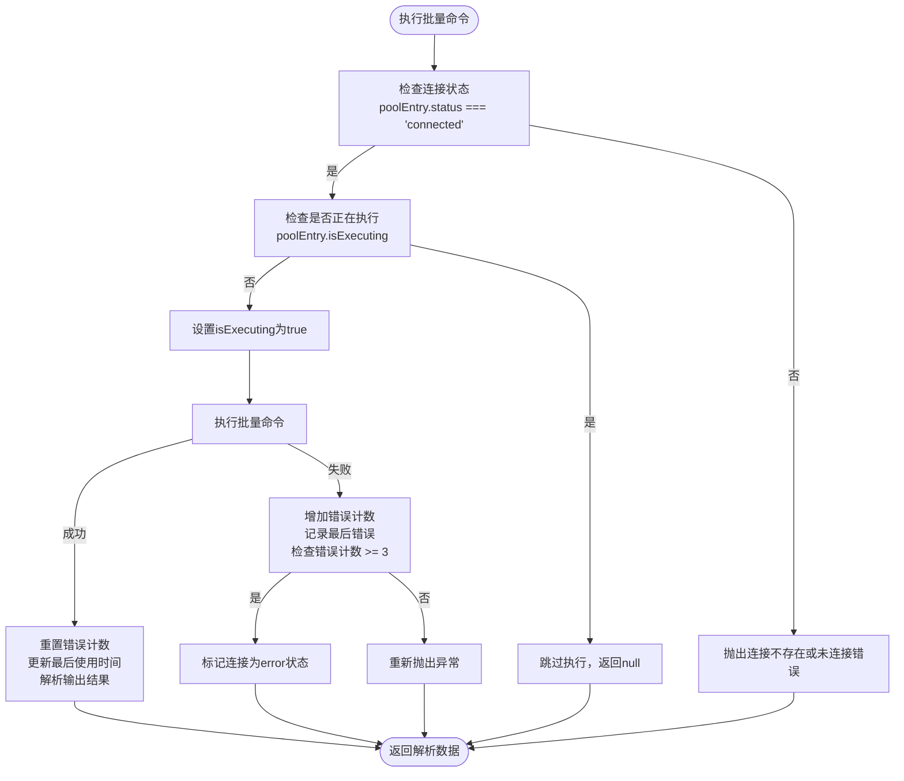
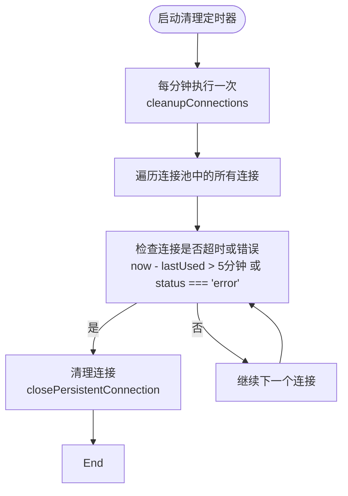

# 组合式函数API

<cite>
**Referenced Files in This Document**   
- [useConnectionManager.ts](file://src/composables/useConnectionManager.ts)
- [useSSHConnectionPool.js](file://src/composables/useSSHConnectionPool.js)
- [index.ts](file://src/types/index.ts)
- [terminal.ts](file://src/types/terminal.ts)
</cite>

## 目录
1. [简介](#简介)
2. [核心组件](#核心组件)
3. [连接生命周期管理](#连接生命周期管理)
4. [连接池管理机制](#连接池管理机制)
5. [响应式状态管理](#响应式状态管理)
6. [健康检查与错误处理](#健康检查与错误处理)
7. [Vue组件使用示例](#vue组件使用示例)
8. [结论](#结论)

## 简介
本文档深入解析SSH连接管理系统的两个核心组合式函数：`useConnectionManager`和`useSSHConnectionPool`。这两个函数共同构建了一个高可用的SSH连接管理架构，实现了连接的创建、监控、维护和资源清理等关键功能。`useConnectionManager`负责连接的生命周期管理，而`useSSHConnectionPool`则提供了高效的连接池机制，支持批量命令执行和系统监控。通过这两个组合式函数的协同工作，系统能够提供稳定、高效的远程连接服务。

## 核心组件

`useConnectionManager`和`useSSHConnectionPool`是系统中两个核心的组合式函数，它们通过职责分离和协同工作实现了完整的SSH连接管理功能。`useConnectionManager`作为高层连接管理器，负责连接的创建、销毁和状态维护，而`useSSHConnectionPool`则专注于连接的持久化管理和批量操作优化。

**Section sources**
- [useConnectionManager.ts](file://src/composables/useConnectionManager.ts#L10-L538)
- [useSSHConnectionPool.js](file://src/composables/useSSHConnectionPool.js#L2-L258)

## 连接生命周期管理

`useConnectionManager`提供了完整的连接生命周期管理方法，包括连接的添加、断开和重新连接。

### addConnection方法
`addConnection`方法用于添加新的SSH连接。该方法接收`SessionData`类型的参数，包含连接所需的所有配置信息。方法首先创建一个响应式的连接对象，然后将其添加到`activeConnections`数组中，并启动连接建立过程。

**Section sources**
- [useConnectionManager.ts](file://src/composables/useConnectionManager.ts#L31-L79)

### disconnectConnection方法
`disconnectConnection`方法用于断开指定ID的连接。该方法会先关闭连接池中的持久连接，然后通过Electron API断开实际的SSH连接，最后停止相关的监控定时器。

**Section sources**
- [useConnectionManager.ts](file://src/composables/useConnectionManager.ts#L261-L296)

### reconnectConnection方法
`reconnectConnection`方法用于重新连接已断开的连接。该方法会先关闭现有的持久连接，然后调用`establishConnection`重新建立连接。

**Section sources**
- [useConnectionManager.ts](file://src/composables/useConnectionManager.ts#L299-L308)

## 连接池管理机制

`useSSHConnectionPool`提供了高效的连接池管理功能，支持持久连接、批量命令执行和连接状态监控。

### createPersistentConnection方法
`createPersistentConnection`方法创建持久化的SSH连接。该方法将连接信息存储在`connectionPool` Map中，并维护连接的状态、最后使用时间等元数据。

**Section sources**
- [useSSHConnectionPool.js](file://src/composables/useSSHConnectionPool.js#L8-L43)

### executeBatchCommand方法
`executeBatchCommand`方法执行批量系统监控命令。该方法会检查连接状态，构建并执行批量命令，然后解析返回结果。

**Section sources**
- [useSSHConnectionPool.js](file://src/composables/useSSHConnectionPool.js#L46-L103)

### getConnectionStatus方法
`getConnectionStatus`方法返回指定连接的当前状态信息，包括连接ID、状态、最后使用时间、错误计数等。

**Section sources**
- [useSSHConnectionPool.js](file://src/composables/useSSHConnectionPool.js#L216-L228)

### 批量命令构建与解析
连接池通过`buildSystemMonitorCommand`和`parseBatchOutput`方法实现高效的批量命令执行和结果解析。

#### 批量命令构建逻辑
```mermaid
flowchart TD
Start([构建系统监控命令]) --> CPU["获取CPU使用率\nCPU_USAGE=$(top -bn1 | grep 'Cpu(s)' | sed 's/.*, *\\([0-9.]*\\)%* id.*/\\1/' | awk '{print 100 - $1}' || echo \"0\")"]
CPU --> Memory["获取内存使用率\nMEMORY_USAGE=$(free | grep Mem | awk '{printf \"%.1f\", $3/$2 * 100.0}' || echo \"0\")"]
Memory --> Disk["获取磁盘使用率\nDISK_USAGE=$(df -h / | tail -1 | awk '{print $5}' | sed 's/%//' || echo \"0\")"]
Disk --> Network["获取网络数据\nNETWORK_DATA=$(cat /proc/net/dev | grep -E '(eth0|enp|ens|eno|wlan0|wlp)' | head -1 | awk '{print $2, $10}' || echo \"0 0\")"]
Network --> Load["获取系统负载\nLOAD_AVG=$(cat /proc/loadavg | awk '{print $1, $2, $3}' || echo \"0 0 0\")"]
Load --> Process["获取进程信息\nPROCESS_COUNT=$(ps aux | wc -l || echo \"0\")"]
Process --> Output["输出JSON格式结果\necho \"CPU_USAGE:$CPU_USAGE\"\necho \"MEMORY_USAGE:$MEMORY_USAGE\" \necho \"DISK_USAGE:$DISK_USAGE\"\necho \"NETWORK_DATA:$NETWORK_DATA\"\necho \"LOAD_AVG:$LOAD_AVG\"\necho \"PROCESS_COUNT:$PROCESS_COUNT\"\necho \"TIMESTAMP:$(date +%s)\""]
Output --> End([返回命令字符串])
```

**Diagram sources**
- [useSSHConnectionPool.js](file://src/composables/useSSHConnectionPool.js#L106-L135)

#### 输出解析流程


**Diagram sources**
- [useSSHConnectionPool.js](file://src/composables/useSSHConnectionPool.js#L138-L173)

## 响应式状态管理

两个组合式函数都使用Vue的响应式系统来管理状态。

### activeConnections状态
`activeConnections`是`useConnectionManager`中的核心响应式状态，用于存储所有活动的连接。它是一个`Ref<Connection[]>`类型的引用，通过`ref`函数创建。

**Section sources**
- [useConnectionManager.ts](file://src/composables/useConnectionManager.ts#L12-L12)

### connectionPool状态
`connectionPool`是`useSSHConnectionPool`中的核心响应式状态，用于存储持久化连接。它是一个`Map`类型的响应式引用，通过`ref`函数创建。

**Section sources**
- [useSSHConnectionPool.js](file://src/composables/useSSHConnectionPool.js#L3-L3)

## 健康检查与错误处理

系统实现了完善的健康检查机制和错误重试策略。

### 健康检查机制


**Diagram sources**
- [useConnectionManager.ts](file://src/composables/useConnectionManager.ts#L352-L372)

### 错误重试策略


**Diagram sources**
- [useSSHConnectionPool.js](file://src/composables/useSSHConnectionPool.js#L46-L103)

### 自动清理定时器


**Diagram sources**
- [useSSHConnectionPool.js](file://src/composables/useSSHConnectionPool.js#L231-L241)

## Vue组件使用示例

在Vue组件中使用这些组合式函数的示例如下：

```vue
<script setup>
import { useConnectionManager } from '@/composables/useConnectionManager'
import { useSSHConnectionPool } from '@/composables/useSSHConnectionPool'

// 初始化连接管理器
const emit = defineEmits(['show-notification'])
const { 
  activeConnections, 
  addConnection, 
  disconnectConnection,
  reconnectConnection 
} = useConnectionManager(emit)

// 获取连接池实例
const { 
  createPersistentConnection, 
  executeBatchCommand,
  getConnectionStatus 
} = useSSHConnectionPool()

// 使用响应式状态
console.log('当前活动连接数:', activeConnections.value.length)

// 添加新连接
const sessionData = {
  id: 'conn-001',
  name: '测试服务器',
  host: '192.168.1.100',
  port: 22,
  username: 'user',
  authType: 'password',
  password: 'password'
}
await addConnection(sessionData)
</script>
```

**Section sources**
- [useConnectionManager.ts](file://src/composables/useConnectionManager.ts#L10-L538)
- [useSSHConnectionPool.js](file://src/composables/useSSHConnectionPool.js#L2-L258)

## 结论
`useConnectionManager`和`useSSHConnectionPool`两个组合式函数通过清晰的职责划分和高效的协同工作，构建了一个稳定可靠的SSH连接管理系统。`useConnectionManager`负责高层的连接生命周期管理，而`useSSHConnectionPool`则提供了底层的连接池优化和批量操作能力。系统通过健康检查、错误重试和自动清理等机制确保了连接的高可用性。开发者可以通过简单的API调用，轻松实现复杂的SSH连接管理功能。