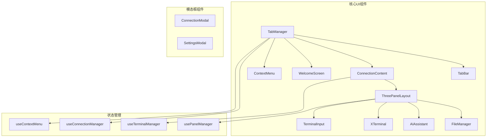
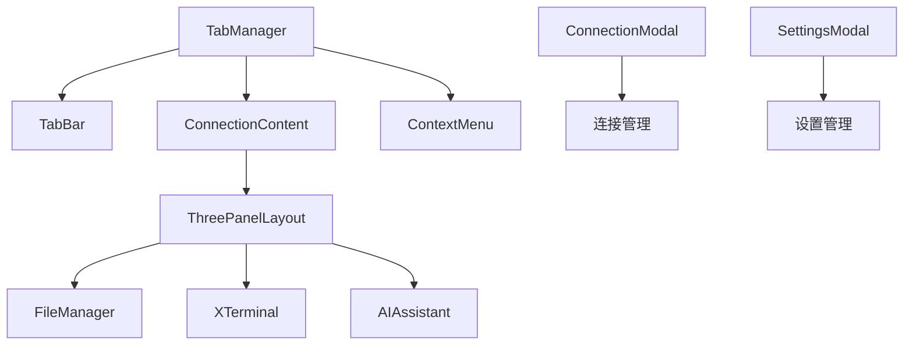
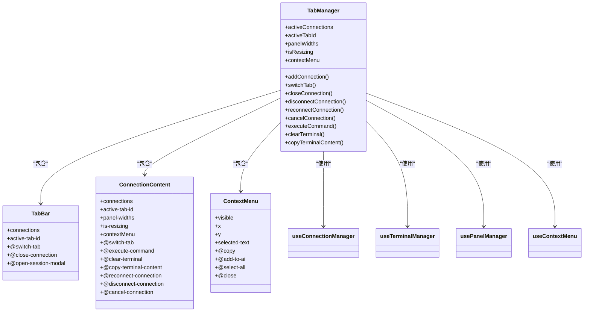
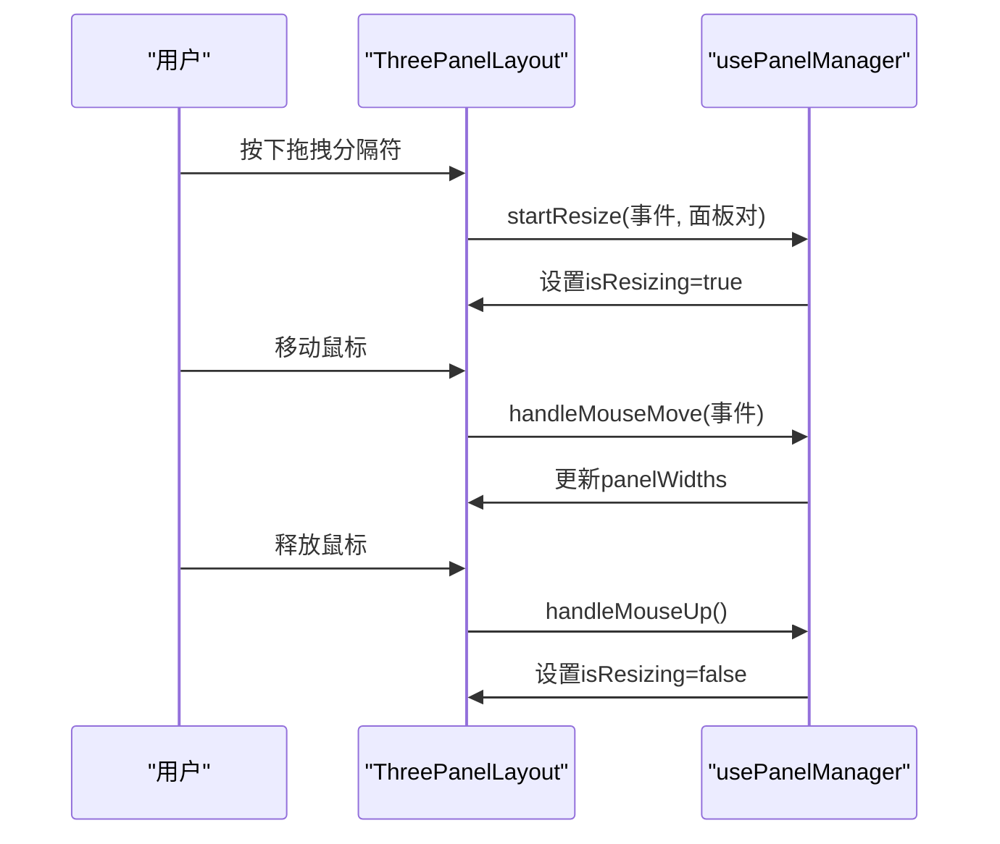
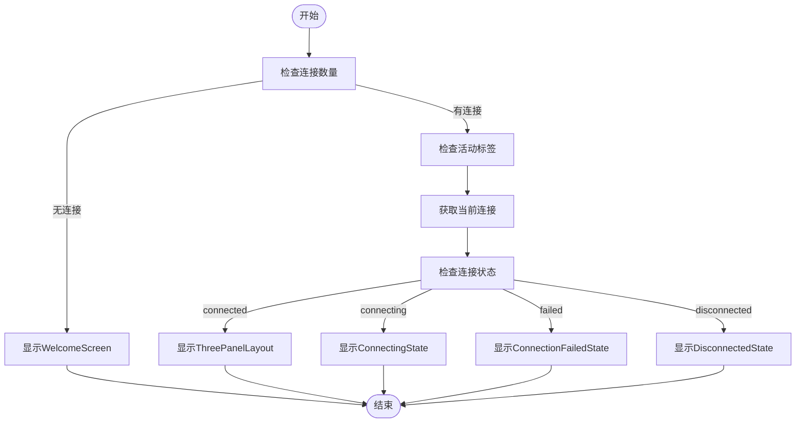
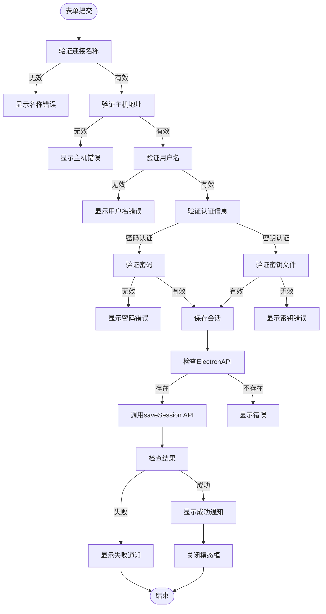
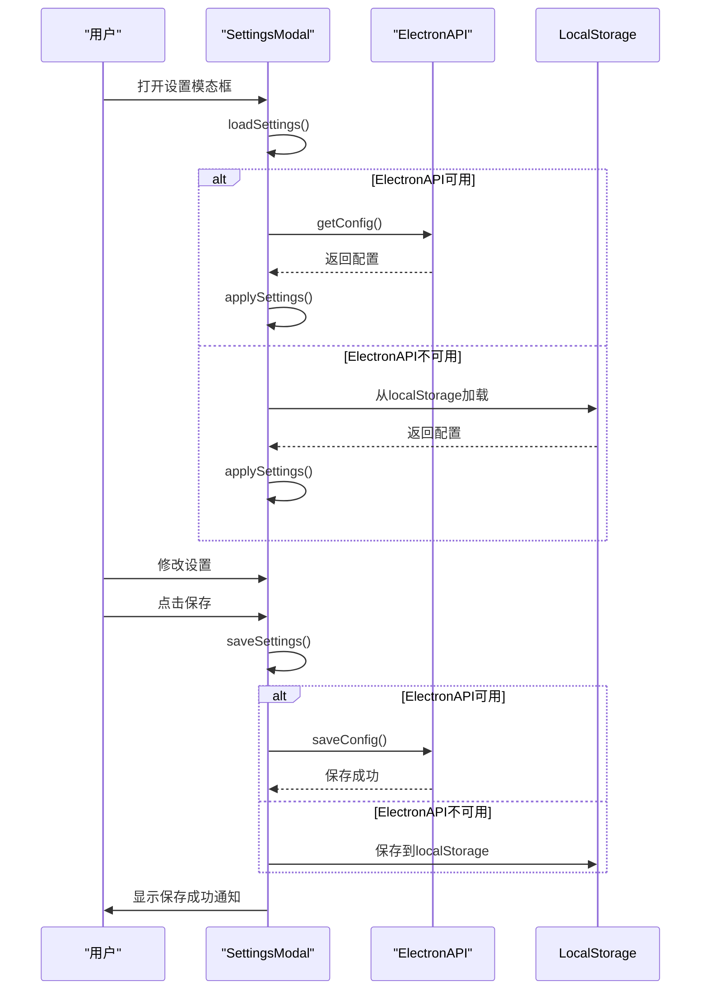
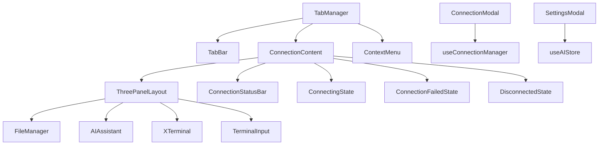

# UI组件

<cite>
**本文档引用的文件**
- [TabManager.vue](file://src/components/TabManager.vue)
- [ThreePanelLayout.vue](file://src/components/layout/ThreePanelLayout.vue)
- [ConnectionContent.vue](file://src/components/tabs/ConnectionContent.vue)
- [ConnectionModal.vue](file://src/components/ConnectionModal.vue)
- [SettingsModal.vue](file://src/components/SettingsModal.vue)
</cite>

## 目录
1. [简介](#简介)
2. [项目结构](#项目结构)
3. [核心组件](#核心组件)
4. [架构概览](#架构概览)
5. [详细组件分析](#详细组件分析)
6. [依赖分析](#依赖分析)
7. [性能考虑](#性能考虑)
8. [故障排除指南](#故障排除指南)
9. [结论](#结论)
10. [附录](#附录)（如有必要）

## 简介
本文档详细描述了sshcode应用中的核心UI组件及其交互模式。重点分析了TabManager如何管理多标签会话的创建、切换和关闭，以及其与路由或状态管理的集成方式。文档还解释了ThreePanelLayout的三栏布局（左文件树、中终端、右AI助手）的可配置性和响应式设计，以及ConnectionContent如何根据当前连接类型动态加载不同模块。此外，文档化了ConnectionModal和SettingsModal的表单结构、验证逻辑和提交处理流程，并为每个组件提供了props、events、slots的完整列表。

## 项目结构
sshcode项目的UI组件主要组织在`src/components`目录下，采用功能模块化的设计。核心UI组件分为几个主要类别：标签管理（tabs）、布局（layout）、连接管理（connection）、模态框（ConnectionModal、SettingsModal）以及通用UI组件。项目使用Vue 3的组合式API和TypeScript，通过composables目录中的可复用逻辑来管理状态和行为。

**图源**
- [TabManager.vue](file://src/components/TabManager.vue)
- [ThreePanelLayout.vue](file://src/components/layout/ThreePanelLayout.vue)
- [ConnectionContent.vue](file://src/components/tabs/ConnectionContent.vue)

**节源**
- [TabManager.vue](file://src/components/TabManager.vue)
- [ThreePanelLayout.vue](file://src/components/layout/ThreePanelLayout.vue)
- [ConnectionContent.vue](file://src/components/tabs/ConnectionContent.vue)

## 核心组件
本文档的核心组件包括TabManager、ThreePanelLayout、ConnectionContent、ConnectionModal和SettingsModal。这些组件共同构成了sshcode应用的用户界面基础，提供了多标签会话管理、三栏布局、连接状态管理以及配置和连接设置的功能。TabManager作为顶级组件，负责协调标签的创建、切换和关闭，而ThreePanelLayout则提供了灵活的三栏布局系统，支持用户自定义面板宽度。

**节源**
- [TabManager.vue](file://src/components/TabManager.vue)
- [ThreePanelLayout.vue](file://src/components/layout/ThreePanelLayout.vue)

## 架构概览
sshcode的UI架构采用分层设计，顶层是TabManager组件，负责管理所有标签会话。每个标签会话的内容由ConnectionContent组件渲染，根据连接状态显示不同的内容（如连接中、已连接、连接失败等）。当连接成功时，ThreePanelLayout组件被激活，提供三栏布局。整个架构通过事件总线和组合式函数（composables）进行通信，实现了组件间的松耦合。

**图源**
- [TabManager.vue](file://src/components/TabManager.vue)
- [ConnectionContent.vue](file://src/components/tabs/ConnectionContent.vue)
- [ThreePanelLayout.vue](file://src/components/layout/ThreePanelLayout.vue)

## 详细组件分析
本节将深入分析sshcode中的每个核心UI组件，包括其props、events、slots的完整列表，以及实际使用代码片段。

### TabManager分析
TabManager组件是sshcode应用的核心，负责管理多标签会话的创建、切换和关闭。它通过useConnectionManager组合式函数管理连接状态，并与TabBar和ConnectionContent组件协同工作。

#### 组件关系图

**图源**
- [TabManager.vue](file://src/components/TabManager.vue)

**节源**
- [TabManager.vue](file://src/components/TabManager.vue)

#### TabManager组件详情
TabManager组件通过组合式函数useConnectionManager、useTerminalManager、usePanelManager和useContextMenu来管理各种功能模块。它维护着活动连接列表、当前活动标签ID、面板宽度、调整大小状态和右键菜单状态。

**Props**
- 无

**Events**
- `session-connected`: 当用户选择连接时触发，携带连接信息
- `session-disconnected`: 当会话断开时触发
- `show-notification`: 显示通知消息
- `open-session-modal`: 打开连接模态框
- `show-settings`: 显示设置模态框

**Slots**
- 无

### ThreePanelLayout分析
ThreePanelLayout组件实现了可配置的三栏布局，包括文件管理、终端和AI助手三个面板。每个面板的宽度可以通过拖拽分隔符进行调整，支持响应式设计。

#### 布局交互流程

**图源**
- [ThreePanelLayout.vue](file://src/components/layout/ThreePanelLayout.vue)

**节源**
- [ThreePanelLayout.vue](file://src/components/layout/ThreePanelLayout.vue)

#### ThreePanelLayout组件详情
ThreePanelLayout组件提供了灵活的三栏布局系统，支持用户通过拖拽分隔符来调整各面板的宽度比例。布局包括文件管理面板、终端面板和AI助手面板，每个面板都有独立的头部和内容区域。

**Props**
- `connection`: 当前连接对象，必需
- `panelWidths`: 面板宽度对象，包含files、terminal、ai三个属性，表示各面板的宽度百分比，默认为{files: 30, terminal: 40, ai: 30}
- `isResizing`: 布尔值，表示是否正在调整大小，默认为false

**Events**
- `execute-command`: 执行终端命令
- `clear-terminal`: 清空终端内容
- `copy-terminal-content`: 复制终端内容
- `show-notification`: 显示通知
- `handle-terminal-context-menu`: 处理终端右键菜单
- `handle-terminal-mouse-up`: 处理终端鼠标释放
- `handle-terminal-select-start`: 处理终端选择开始
- `handle-terminal-keydown`: 处理终端按键
- `handle-terminal-input`: 处理终端输入
- `handle-terminal-focus`: 处理终端获得焦点
- `handle-terminal-blur`: 处理终端失去焦点
- `handle-autocomplete-select`: 处理自动补全选择
- `handle-autocomplete-hide`: 处理自动补全隐藏
- `set-autocomplete-ref`: 设置自动补全引用
- `execute-command-from-ai`: 执行来自AI的命令
- `start-resize`: 开始调整面板大小
- `show-settings`: 显示设置

**Slots**
- 无

### ConnectionContent分析
ConnectionContent组件根据当前连接状态动态渲染不同的内容组件。当连接成功时，显示ThreePanelLayout；当连接中时，显示ConnectingState；当连接失败时，显示ConnectionFailedState；当已断开连接时，显示DisconnectedState。

#### 状态管理流程

**图源**
- [ConnectionContent.vue](file://src/components/tabs/ConnectionContent.vue)

**节源**
- [ConnectionContent.vue](file://src/components/tabs/ConnectionContent.vue)

#### ConnectionContent组件详情
ConnectionContent组件是TabManager和具体连接内容之间的桥梁。它根据当前活动标签的连接状态，动态选择并渲染适当的子组件。

**Props**
- `connections`: 连接对象数组，默认为空数组
- `activeTabId`: 当前活动标签ID，字符串类型，默认为null
- `panelWidths`: 面板宽度对象，包含files、terminal、ai三个属性，默认为{files: 30, terminal: 40, ai: 30}
- `isResizing`: 布尔值，表示是否正在调整大小，默认为false
- `contextMenu`: 右键菜单对象，默认为空对象

**Events**
- `switch-tab`: 切换标签
- `execute-command`: 执行命令
- `clear-terminal`: 清空终端
- `copy-terminal-content`: 复制终端内容
- `reconnect-connection`: 重新连接
- `disconnect-connection`: 断开连接
- `cancel-connection`: 取消连接
- `show-notification`: 显示通知
- `open-session-modal`: 打开会话模态框
- `handle-terminal-context-menu`: 处理终端右键菜单
- `handle-terminal-mouse-up`: 处理终端鼠标释放
- `handle-terminal-select-start`: 处理终端选择开始
- `handle-terminal-keydown`: 处理终端按键
- `handle-terminal-input`: 处理终端输入
- `handle-terminal-focus`: 处理终端获得焦点
- `handle-terminal-blur`: 处理终端失去焦点
- `handle-autocomplete-select`: 处理自动补全选择
- `handle-autocomplete-hide`: 处理自动补全隐藏
- `set-autocomplete-ref`: 设置自动补全引用
- `hide-context-menu`: 隐藏右键菜单
- `update-context-menu-position`: 更新右键菜单位置
- `handle-context-menu-copy`: 处理右键菜单复制
- `handle-context-menu-add-to-ai`: 处理右键菜单添加到AI
- `handle-context-menu-select-all`: 处理右键菜单全选
- `execute-command-from-ai`: 执行来自AI的命令
- `start-resize`: 开始调整大小
- `show-settings`: 显示设置

**Slots**
- 无

### ConnectionModal分析
ConnectionModal组件提供了连接管理的完整界面，包括连接列表、新建/编辑连接表单、连接测试和连接功能。它实现了完整的表单验证逻辑和提交处理流程。

#### 表单验证流程

**图源**
- [ConnectionModal.vue](file://src/components/ConnectionModal.vue)

**节源**
- [ConnectionModal.vue](file://src/components/ConnectionModal.vue)

#### ConnectionModal组件详情
ConnectionModal组件提供了完整的连接管理功能，包括连接列表展示、新建/编辑连接、连接测试和直接连接。它支持密码认证和密钥认证两种方式，并实现了完整的表单验证。

**Props**
- `isOpen`: 布尔值，表示模态框是否打开，默认为false

**Events**
- `close`: 关闭模态框
- `show-notification`: 显示通知消息
- `session-connected`: 会话已连接，携带连接信息

**Slots**
- 无

### SettingsModal分析
SettingsModal组件提供了应用设置的完整界面，包括AI聊天、AI补全、终端和常规设置等多个标签页。它实现了设置的加载、保存和重置功能，并支持提供商配置的缓存和恢复。

#### 设置管理流程

**图源**
- [SettingsModal.vue](file://src/components/SettingsModal.vue)

**节源**
- [SettingsModal.vue](file://src/components/SettingsModal.vue)

#### SettingsModal组件详情
SettingsModal组件提供了应用的全面设置功能，通过标签页组织不同类别的设置项。它支持设置的持久化存储，可以在Electron环境中使用ElectronAPI，或在其他环境中使用localStorage作为后备。

**Props**
- `isOpen`: 布尔值，表示模态框是否打开，默认为false

**Events**
- `close`: 关闭模态框
- `show-notification`: 显示通知消息

**Slots**
- 无

## 依赖分析
sshcode的UI组件之间存在清晰的依赖关系。TabManager作为顶级组件，依赖于TabBar、ConnectionContent和ContextMenu组件。ConnectionContent依赖于ThreePanelLayout和其他状态组件。ThreePanelLayout依赖于FileManager、AIAssistant、XTerminal等模块组件。这些依赖关系通过props和events进行通信，实现了组件间的松耦合。

**图源**
- [TabManager.vue](file://src/components/TabManager.vue)
- [ConnectionContent.vue](file://src/components/tabs/ConnectionContent.vue)
- [ThreePanelLayout.vue](file://src/components/layout/ThreePanelLayout.vue)
- [ConnectionModal.vue](file://src/components/ConnectionModal.vue)
- [SettingsModal.vue](file://src/components/SettingsModal.vue)

**节源**
- [TabManager.vue](file://src/components/TabManager.vue)
- [ConnectionContent.vue](file://src/components/tabs/ConnectionContent.vue)
- [ThreePanelLayout.vue](file://src/components/layout/ThreePanelLayout.vue)
- [ConnectionModal.vue](file://src/components/ConnectionModal.vue)
- [SettingsModal.vue](file://src/components/SettingsModal.vue)

## 性能考虑
sshcode的UI组件在性能方面进行了多项优化。首先，使用了Vue的响应式系统来最小化不必要的重新渲染。其次，对于频繁更新的终端输出，使用了专门的终端管理器来处理输出流。此外，面板宽度的调整使用了防抖技术，避免在拖拽过程中过于频繁地更新布局。对于AI相关的功能，实现了提供商配置的缓存机制，避免重复加载配置。

## 故障排除指南
当遇到UI组件相关问题时，可以按照以下步骤进行排查：

1. **检查组件是否正确导入**：确保所有组件都在setup函数中正确导入和注册。
2. **检查props传递**：确认父组件向子组件传递的props是否正确，特别是连接对象和状态。
3. **检查事件监听**：确保事件监听器正确绑定，特别是TabManager中的各种事件。
4. **检查组合式函数**：确认useConnectionManager、useTerminalManager等组合式函数是否正确初始化和使用。
5. **检查ElectronAPI**：在Electron环境中，确保ElectronAPI可用并正确调用。

**节源**
- [TabManager.vue](file://src/components/TabManager.vue)
- [ThreePanelLayout.vue](file://src/components/layout/ThreePanelLayout.vue)
- [ConnectionContent.vue](file://src/components/tabs/ConnectionContent.vue)
- [ConnectionModal.vue](file://src/components/ConnectionModal.vue)
- [SettingsModal.vue](file://src/components/SettingsModal.vue)

## 结论
sshcode的UI组件设计体现了现代前端应用的最佳实践。通过组合式API和可复用的组合式函数，实现了功能的模块化和代码的复用。组件间的通信通过清晰的props和events进行，保持了组件的独立性和可测试性。三栏布局和多标签管理提供了灵活的用户体验，而模态框组件则提供了完整的配置和连接管理功能。整体架构清晰，易于维护和扩展。

## 附录
本文档引用的所有文件路径：
- [src/components/TabManager.vue](file://src/components/TabManager.vue)
- [src/components/layout/ThreePanelLayout.vue](file://src/components/layout/ThreePanelLayout.vue)
- [src/components/tabs/ConnectionContent.vue](file://src/components/tabs/ConnectionContent.vue)
- [src/components/ConnectionModal.vue](file://src/components/ConnectionModal.vue)
- [src/components/SettingsModal.vue](file://src/components/SettingsModal.vue)