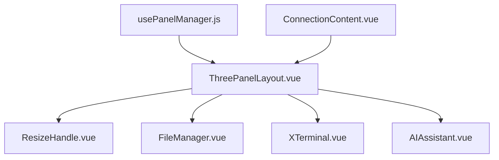
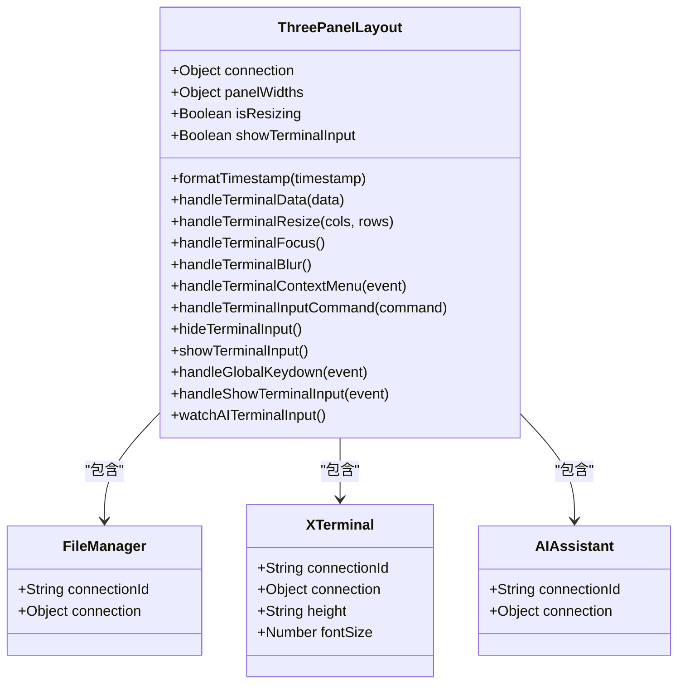
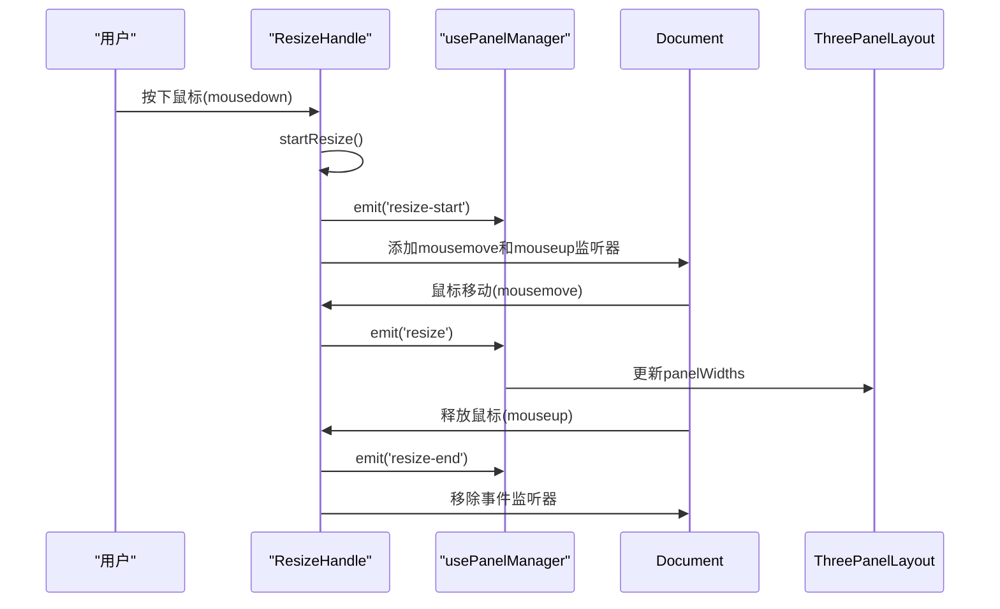
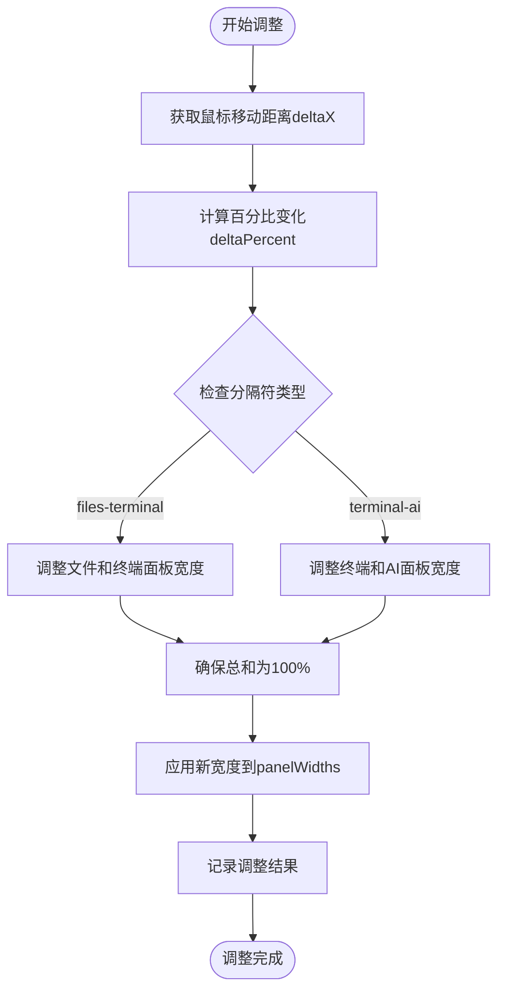
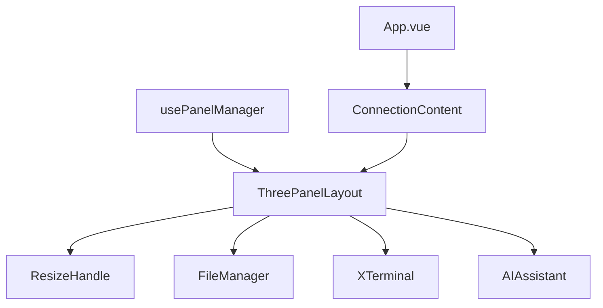

# 布局组件

<cite>
**Referenced Files in This Document**   
- [ThreePanelLayout.vue](file://src/components/layout/ThreePanelLayout.vue)
- [ResizeHandle.vue](file://src/components/ui/ResizeHandle.vue)
- [usePanelManager.js](file://src/composables/usePanelManager.js)
- [ConnectionContent.vue](file://src/components/tabs/ConnectionContent.vue)
- [FileManager.vue](file://src/modules/file-manager/components/FileManager.vue)
- [XTerminal.vue](file://src/modules/terminal/components/XTerminal.vue)
- [AIAssistant.vue](file://src/modules/ai-assistant/components/AIAssistant.vue)
</cite>

## 目录
1. [简介](#简介)
2. [项目结构](#项目结构)
3. [核心组件](#核心组件)
4. [架构概述](#架构概述)
5. [详细组件分析](#详细组件分析)
6. [依赖分析](#依赖分析)
7. [性能考虑](#性能考虑)
8. [故障排除指南](#故障排除指南)
9. [结论](#结论)

## 简介
ThreePanelLayout三栏布局组件是SSHCode应用的核心UI结构，实现了文件管理、终端和AI助手三个主要功能模块的集成布局。该组件通过可拖拽的ResizeHandle实现面板间的动态调整，支持响应式设计和状态同步，为用户提供灵活高效的开发环境。

## 项目结构
ThreePanelLayout布局组件位于`src/components/layout/`目录下，与UI组件、模块组件和组合式函数协同工作，形成完整的三栏布局系统。



**Diagram sources**
- [ThreePanelLayout.vue](file://src/components/layout/ThreePanelLayout.vue)
- [ResizeHandle.vue](file://src/components/ui/ResizeHandle.vue)
- [usePanelManager.js](file://src/composables/usePanelManager.js)

**Section sources**
- [ThreePanelLayout.vue](file://src/components/layout/ThreePanelLayout.vue)
- [src/components/layout](file://src/components/layout)

## 核心组件
ThreePanelLayout组件实现了三栏布局的核心功能，包括面板宽度管理、拖拽调整和组件集成。该组件通过props接收连接信息和面板宽度配置，使用emits向父组件传递各种事件。

**Section sources**
- [ThreePanelLayout.vue](file://src/components/layout/ThreePanelLayout.vue#L1-L515)

## 架构概述
ThreePanelLayout组件采用组合式架构，将文件管理、终端和AI助手三个功能模块集成在一个响应式布局中，通过事件系统与应用状态进行同步。

```mermaid
graph TB
subgraph "ThreePanelLayout"
A[文件管理面板] --> |30%| B[ResizeHandle]
B --> C[终端面板] --> |40%| D[ResizeHandle]
D --> E[AI助手面板] --> |30%|
end
F[usePanelManager] --> A
F --> C
F --> E
G[ConnectionContent] --> ThreePanelLayout
```

**Diagram sources**
- [ThreePanelLayout.vue](file://src/components/layout/ThreePanelLayout.vue#L1-L515)
- [usePanelManager.js](file://src/composables/usePanelManager.js#L2-L116)

## 详细组件分析

### ThreePanelLayout组件分析
ThreePanelLayout组件实现了三栏布局的完整功能，包括面板定义、事件处理和状态管理。

#### 组件结构


**Diagram sources**
- [ThreePanelLayout.vue](file://src/components/layout/ThreePanelLayout.vue#L1-L515)
- [FileManager.vue](file://src/modules/file-manager/components/FileManager.vue#L1-L1550)
- [XTerminal.vue](file://src/modules/terminal/components/XTerminal.vue#L1-L1622)
- [AIAssistant.vue](file://src/modules/ai-assistant/components/AIAssistant.vue#L1-L696)

**Section sources**
- [ThreePanelLayout.vue](file://src/components/layout/ThreePanelLayout.vue#L1-L515)

### ResizeHandle组件分析
ResizeHandle组件实现了面板间的可拖拽调整功能，提供视觉反馈和尺寸限制。

#### 拖拽调整流程


**Diagram sources**
- [ResizeHandle.vue](file://src/components/ui/ResizeHandle.vue#L1-L344)
- [usePanelManager.js](file://src/composables/usePanelManager.js#L2-L116)

**Section sources**
- [ResizeHandle.vue](file://src/components/ui/ResizeHandle.vue#L1-L344)

### usePanelManager组合式函数分析
usePanelManager提供了面板管理的核心逻辑，包括宽度调整、状态管理和重置功能。

#### 面板宽度调整算法


**Diagram sources**
- [usePanelManager.js](file://src/composables/usePanelManager.js#L2-L116)

**Section sources**
- [usePanelManager.js](file://src/composables/usePanelManager.js#L2-L116)

## 依赖分析
ThreePanelLayout组件依赖于多个子组件和组合式函数，形成完整的功能体系。



**Diagram sources**
- [ThreePanelLayout.vue](file://src/components/layout/ThreePanelLayout.vue)
- [usePanelManager.js](file://src/composables/usePanelManager.js)
- [ConnectionContent.vue](file://src/components/tabs/ConnectionContent.vue)
- [App.vue](file://src/App.vue)

**Section sources**
- [ThreePanelLayout.vue](file://src/components/layout/ThreePanelLayout.vue)
- [usePanelManager.js](file://src/composables/usePanelManager.js)
- [ConnectionContent.vue](file://src/components/tabs/ConnectionContent.vue)

## 性能考虑
ThreePanelLayout组件在性能方面进行了优化，包括事件监听器的合理管理、宽度计算的节流处理和组件渲染的条件控制。

**Section sources**
- [ThreePanelLayout.vue](file://src/components/layout/ThreePanelLayout.vue)
- [ResizeHandle.vue](file://src/components/ui/ResizeHandle.vue)
- [usePanelManager.js](file://src/composables/usePanelManager.js)

## 故障排除指南
当ThreePanelLayout组件出现显示或交互问题时，可以检查以下方面：

**Section sources**
- [ThreePanelLayout.vue](file://src/components/layout/ThreePanelLayout.vue)
- [ResizeHandle.vue](file://src/components/ui/ResizeHandle.vue)
- [usePanelManager.js](file://src/composables/usePanelManager.js)

## 结论
ThreePanelLayout三栏布局组件通过合理的架构设计和组件协作，实现了灵活的面板布局和交互功能。该组件与ResizeHandle和usePanelManager等组件协同工作，为用户提供高效的开发环境。