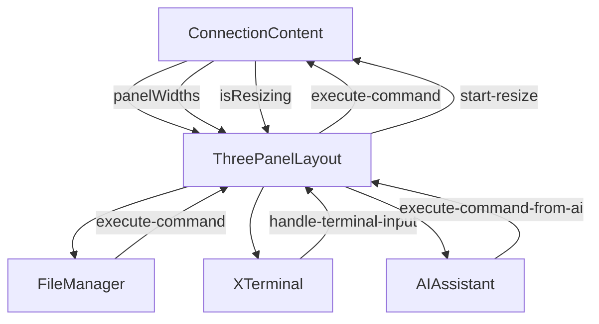
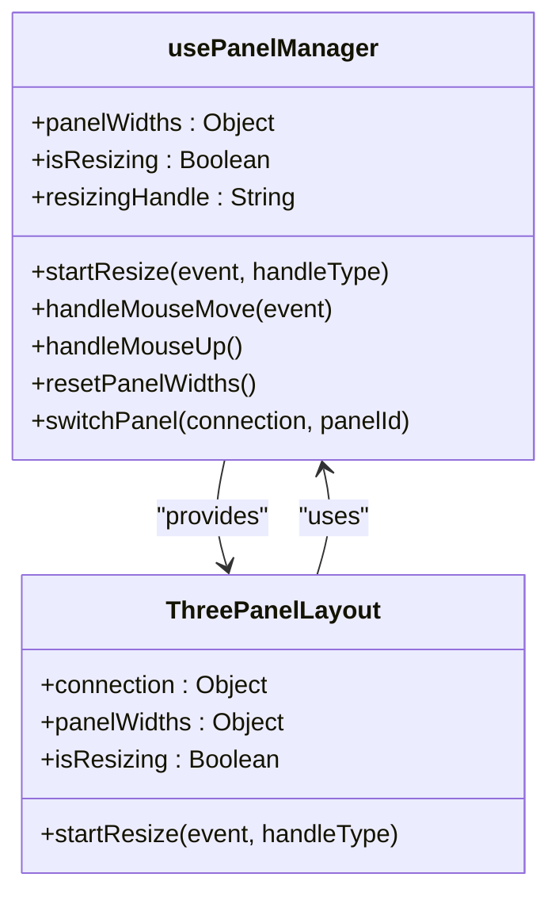
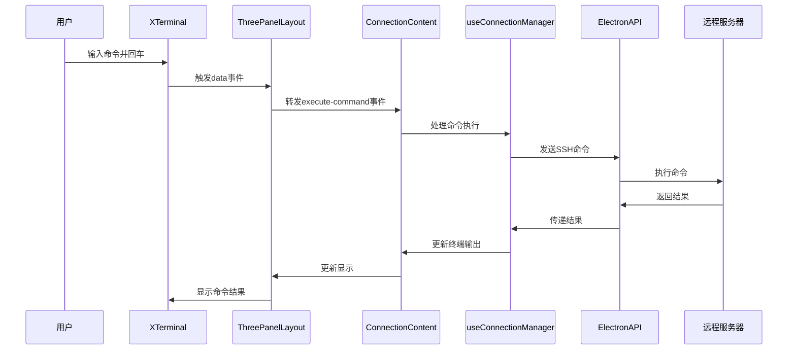

# 内容容器

<cite>
**本文档中引用的文件**  
- [ConnectionContent.vue](file://src/components/tabs/ConnectionContent.vue)
- [ThreePanelLayout.vue](file://src/components/layout/ThreePanelLayout.vue)
- [ConnectingState.vue](file://src/components/connection/ConnectingState.vue)
- [ConnectionFailedState.vue](file://src/components/connection/ConnectionFailedState.vue)
- [DisconnectedState.vue](file://src/components/connection/DisconnectedState.vue)
- [usePanelManager.js](file://src/composables/usePanelManager.js)
- [XTerminal.vue](file://src/modules/terminal/components/XTerminal.vue)
- [AIAssistant.vue](file://src/modules/ai-assistant/components/AIAssistant.vue)
- [FileManager.vue](file://src/modules/file-manager/components/FileManager.vue)
- [useConnectionManager.ts](file://src/composables/useConnectionManager.ts)
</cite>

## 目录
1. [内容容器](#内容容器)
2. [连接状态管理](#连接状态管理)
3. [三栏布局协作机制](#三栏布局协作机制)
4. [可拖拽布局管理](#可拖拽布局管理)
5. [事件绑定与传递机制](#事件绑定与传递机制)
6. [自定义内容渲染扩展](#自定义内容渲染扩展)

## 内容容器

`ConnectionContent` 组件是整个应用的核心内容展示区域，负责根据当前激活的标签页ID动态渲染对应的会话内容。该组件通过`v-for`循环遍历所有连接，并使用`v-show`指令根据`activeTabId`属性精确控制哪个连接的内容面板处于可见状态，实现了多标签页之间的高效切换。

组件通过`connections`属性接收所有活动连接的数组，并根据每个连接的`status`状态属性决定渲染哪个子组件。当连接状态为"connected"时，渲染`ThreePanelLayout`三栏布局；当状态为"connecting"、"failed"或"disconnected"时，则分别渲染对应的连接状态组件。这种基于状态的条件渲染机制确保了用户界面始终与连接的实际状态保持同步。

**Section sources**
- [ConnectionContent.vue](file://src/components/tabs/ConnectionContent.vue#L1-L144)

## 连接状态管理

`ConnectionContent` 组件通过条件渲染机制，为不同的连接状态提供了专门的用户界面，确保用户能够清晰地了解当前连接的状况。

### 连接中状态
当连接状态为"connecting"时，组件渲染`ConnectingState`子组件。该组件展示了一个动态的连接动画，包括旋转的加载指示器和分步连接进度条，向用户直观地展示连接过程的三个阶段：解析主机地址、身份验证和建立SSH连接。用户可以通过"取消连接"按钮中断连接过程，该操作会触发`cancel-connection`事件，由父组件处理连接取消逻辑。

### 连接失败状态
当连接状态为"failed"时，组件渲染`ConnectionFailedState`子组件。该组件以醒目的方式显示连接失败信息，包括错误消息和两个操作按钮："重试连接"和"编辑配置"。点击"重试连接"会触发`reconnect-connection`事件，尝试重新建立连接；点击"编辑配置"则会触发`open-session-modal`事件，打开会话配置对话框供用户修改连接参数。

### 已断开连接状态
当连接状态为"disconnected"时，组件渲染`DisconnectedState`子组件。该组件显示连接已安全断开的信息，并提供"重新连接"按钮。点击该按钮会触发`reconnect-connection`事件，启动重新连接流程。这种设计确保了用户在连接意外断开后能够快速恢复工作。

**Section sources**
- [ConnectingState.vue](file://src/components/connection/ConnectingState.vue#L1-L187)
- [ConnectionFailedState.vue](file://src/components/connection/ConnectionFailedState.vue#L1-L97)
- [DisconnectedState.vue](file://src/components/connection/DisconnectedState.vue#L1-L67)

## 三栏布局协作机制

`ConnectionContent` 组件与`ThreePanelLayout`组件通过属性传递和事件发射机制实现了紧密的协作，共同构建了终端、文件管理器和AI助手的三栏布局。

### 属性传递
`ConnectionContent` 组件将`connection`、`panelWidths`和`isResizing`等关键状态作为属性传递给`ThreePanelLayout`组件。其中，`connection`属性包含了当前连接的所有信息，`panelWidths`属性定义了三个面板的宽度比例，`isResizing`属性指示当前是否处于拖拽调整大小的状态。这种属性传递机制确保了子组件能够访问到必要的上下文信息。

### 事件传递
`ThreePanelLayout`组件通过`$emit`方法将各种用户交互事件传递回`ConnectionContent`组件。这些事件包括命令执行、终端内容复制、终端上下文菜单显示等。`ConnectionContent`组件通过`@`符号监听这些事件，并将它们进一步传递给更高级别的组件进行处理。例如，当用户在终端中输入命令时，`handle-terminal-input`事件会被触发，最终由`useConnectionManager`组合式函数处理命令的执行。

### 组件集成
`ThreePanelLayout`组件内部集成了三个核心功能模块：`FileManager`、`XTerminal`和`AIAssistant`。每个模块都通过事件与布局组件进行通信，形成了一个完整的事件传递链。例如，当用户在文件管理器中双击一个文件时，会触发`execute-command`事件，该事件通过`ThreePanelLayout`传递到`ConnectionContent`，最终由连接管理器执行相应的命令。

**Diagram sources**
- [ConnectionContent.vue](file://src/components/tabs/ConnectionContent.vue#L1-L144)
- [ThreePanelLayout.vue](file://src/components/layout/ThreePanelLayout.vue#L1-L514)

**Section sources**
- [ThreePanelLayout.vue](file://src/components/layout/ThreePanelLayout.vue#L1-L514)
- [XTerminal.vue](file://src/modules/terminal/components/XTerminal.vue#L1-L799)
- [AIAssistant.vue](file://src/modules/ai-assistant/components/AIAssistant.vue#L1-L695)
- [FileManager.vue](file://src/modules/file-manager/components/FileManager.vue#L1-L799)

## 可拖拽布局管理

三栏布局的可拖拽调整功能通过`usePanelManager`组合式函数实现，该函数提供了完整的面板宽度管理和拖拽调整逻辑。

### 状态管理
`usePanelManager`函数使用`reactive`创建了`panelWidths`响应式对象，用于存储三个面板的宽度比例。初始状态下，文件管理器、终端和AI助手的宽度比例为3:4:3。`isResizing`布尔值用于跟踪当前是否处于拖拽调整状态，确保在调整过程中禁用其他交互。

### 拖拽逻辑
当用户在分隔符上按下鼠标时，`startResize`方法被调用。该方法记录鼠标初始位置和当前面板宽度，并添加全局的`mousemove`和`mouseup`事件监听器。在鼠标移动过程中，`handleMouseMove`方法根据鼠标移动的距离计算宽度变化量，并相应地调整相邻面板的宽度。为了保持总宽度为100%，第三个面板的宽度会自动调整以补偿前两个面板的变化。

### 边界控制
在调整面板宽度时，系统实施了严格的边界控制。每个面板的最小宽度为10%，最大宽度为60%，防止用户将某个面板调整得过大或过小。当拖拽操作结束时，`handleMouseUp`方法会移除全局事件监听器，恢复光标样式，并记录最终的面板宽度配置。

**Diagram sources**
- [usePanelManager.js](file://src/composables/usePanelManager.js#L2-L116)
- [ThreePanelLayout.vue](file://src/components/layout/ThreePanelLayout.vue#L1-L514)

**Section sources**
- [usePanelManager.js](file://src/composables/usePanelManager.js#L2-L116)

## 事件绑定与传递机制

`ConnectionContent`组件通过事件绑定机制，建立了内容容器与终端输入、命令执行、上下文菜单等用户交互的完整通信链路。

### 终端事件处理
组件通过`v-on`指令将终端相关的事件绑定到自身的事件发射器上。例如，`@handle-terminal-input`事件监听终端输入，`@handle-terminal-keydown`事件监听键盘按键，`@handle-terminal-context-menu`事件监听右键菜单触发。这些事件最终都会被传递到应用的顶层组件，由相应的业务逻辑处理器进行处理。

### 命令执行流程
当用户在终端中输入命令并按下回车键时，`XTerminal`组件会触发`data`事件，该事件通过`ThreePanelLayout`传递到`ConnectionContent`，最终由`useConnectionManager`中的`addTerminalOutput`方法处理。该方法将命令添加到终端输出历史记录中，并通过Electron API发送到远程服务器执行。

### 上下文菜单集成
组件通过`@handle-terminal-context-menu`事件与上下文菜单系统集成。当用户在终端中右键点击时，该事件会被触发，携带鼠标位置和选中的文本信息。父组件接收到该事件后，会显示一个包含"复制"、"添加到AI助手"等选项的上下文菜单，为用户提供便捷的操作入口。

**Diagram sources**
- [ConnectionContent.vue](file://src/components/tabs/ConnectionContent.vue#L1-L144)
- [XTerminal.vue](file://src/modules/terminal/components/XTerminal.vue#L1-L799)
- [useConnectionManager.ts](file://src/composables/useConnectionManager.ts#L1-L539)

**Section sources**
- [ConnectionContent.vue](file://src/components/tabs/ConnectionContent.vue#L1-L144)
- [XTerminal.vue](file://src/modules/terminal/components/XTerminal.vue#L1-L799)

## 自定义内容渲染扩展

`ConnectionContent`组件的设计具有良好的扩展性，允许开发者通过多种方式自定义内容渲染。

### 状态组件扩展
通过在`ConnectionContent`组件中添加新的`v-else-if`条件分支，可以轻松集成新的连接状态组件。例如，可以添加一个`ConnectingViaProxyState`组件来处理通过代理服务器连接的特殊状态，或者添加一个`MaintenanceState`组件来处理服务器维护期间的连接状态。

### 事件监听扩展
组件的`emits`选项定义了所有可能触发的事件。通过添加新的事件类型，可以扩展组件的功能。例如，可以添加`@handle-file-drag-drop`事件来支持文件拖拽上传功能，或者添加`@handle-terminal-zoom`事件来支持终端缩放功能。

### 布局定制
虽然默认使用三栏布局，但可以通过条件渲染机制在特定情况下使用不同的布局。例如，当连接到资源受限的设备时，可以渲染一个简化的单栏布局，只显示终端内容；当连接到高性能服务器时，可以渲染一个四栏布局，增加一个专门的监控面板。

### 主题支持
组件通过SCSS样式表支持主题定制。开发者可以通过修改变量文件中的颜色、字体和间距变量，轻松实现不同的视觉风格。此外，组件的结构设计允许通过CSS类名进行深度定制，满足特定的UI需求。

**Section sources**
- [ConnectionContent.vue](file://src/components/tabs/ConnectionContent.vue#L1-L144)
- [ThreePanelLayout.vue](file://src/components/layout/ThreePanelLayout.vue#L1-L514)