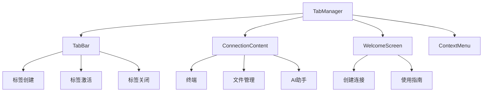
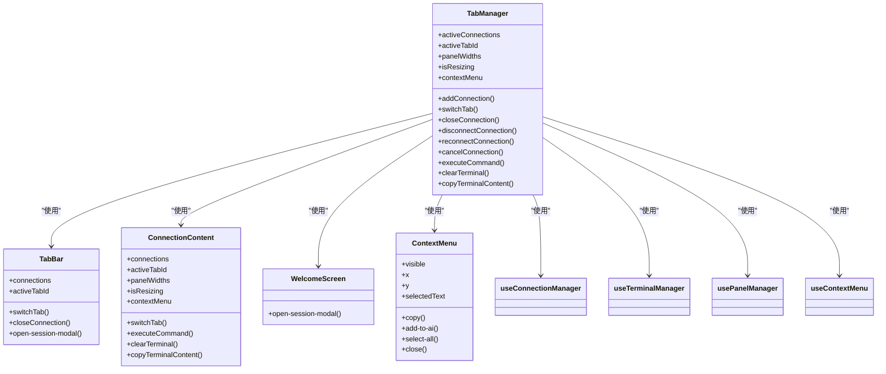
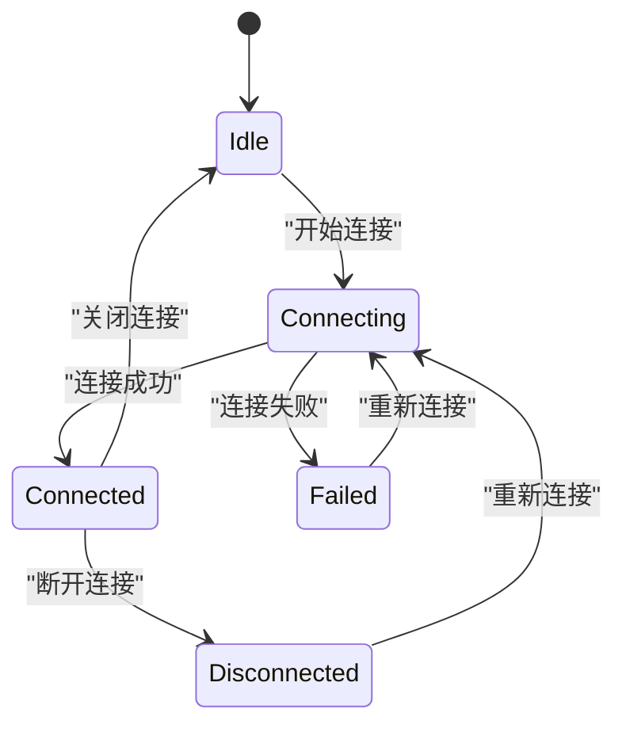
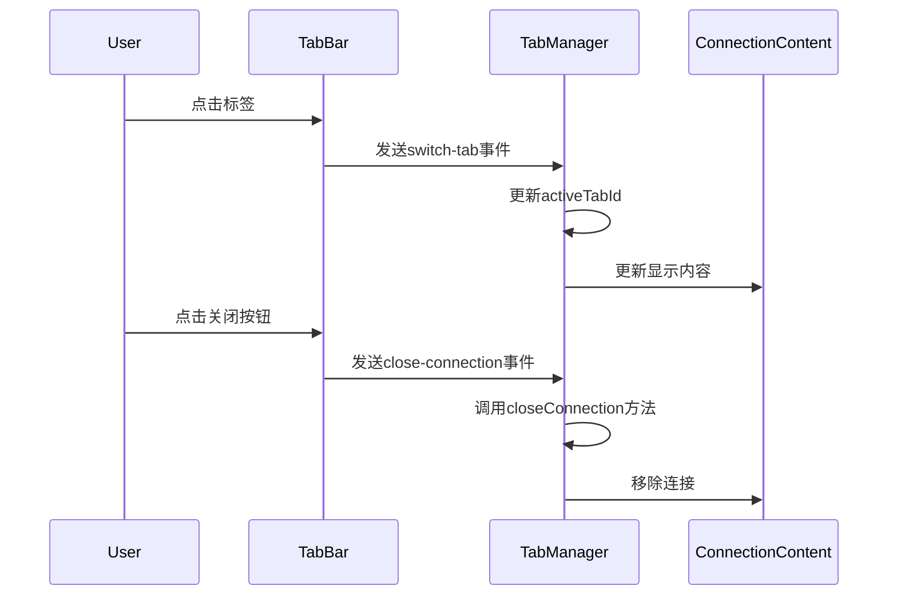
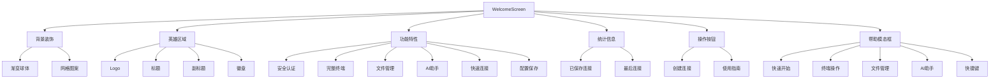

# 标签与会话管理

<cite>
**本文档引用的文件**  
- [TabManager.vue](file://src/components/TabManager.vue)
- [ConnectionContent.vue](file://src/components/tabs/ConnectionContent.vue)
- [TabBar.vue](file://src/components/tabs/TabBar.vue)
- [WelcomeScreen.vue](file://src/components/tabs/WelcomeScreen.vue)
- [useConnectionManager.ts](file://src/composables/useConnectionManager.ts)
- [useTerminalManager.ts](file://src/modules/terminal/composables/useTerminalManager.ts)
- [usePanelManager.js](file://src/composables/usePanelManager.js)
- [useContextMenu.js](file://src/composables/useContextMenu.js)
- [terminal.js](file://src/modules/terminal/stores/terminal.js)
</cite>

## 目录
1. [简介](#简介)
2. [项目结构](#项目结构)
3. [核心组件](#核心组件)
4. [架构概述](#架构概述)
5. [详细组件分析](#详细组件分析)
6. [依赖分析](#依赖分析)
7. [性能考虑](#性能考虑)
8. [故障排除指南](#故障排除指南)
9. [结论](#结论)

## 简介
本文档深入解析TabManager组件如何实现多标签页的会话管理，包括标签的创建、激活、关闭及持久化机制。说明其与ConnectionContent组件的协作方式，如何根据当前连接类型动态加载终端、文件管理或AI助手模块。描述TabBar的视觉呈现与用户交互逻辑，以及WelcomeScreen在无活动连接时的引导作用。文档化所有相关props（如activeTab）、events（如tab-close、tab-switch）和状态管理策略。提供标签拖拽排序、会话恢复等高级功能的实现细节与使用示例。

## 项目结构
本项目采用模块化设计，主要分为components、composables、modules等目录。components目录包含UI组件，composables目录包含可复用的组合式函数，modules目录包含功能模块如AI助手、文件管理、终端等。

**Section sources**
- [TabManager.vue](file://src/components/TabManager.vue#L1-L364)
- [ConnectionContent.vue](file://src/components/tabs/ConnectionContent.vue#L1-L145)
- [TabBar.vue](file://src/components/tabs/TabBar.vue#L1-L263)
- [WelcomeScreen.vue](file://src/components/tabs/WelcomeScreen.vue#L1-L1091)

## 核心组件
核心组件包括TabManager、ConnectionContent、TabBar和WelcomeScreen。TabManager负责管理所有标签页和会话，ConnectionContent负责显示当前激活标签的内容，TabBar负责显示标签栏，WelcomeScreen负责在无活动连接时显示欢迎界面。

**Section sources**
- [TabManager.vue](file://src/components/TabManager.vue#L1-L364)
- [ConnectionContent.vue](file://src/components/tabs/ConnectionContent.vue#L1-L145)
- [TabBar.vue](file://src/components/tabs/TabBar.vue#L1-L263)
- [WelcomeScreen.vue](file://src/components/tabs/WelcomeScreen.vue#L1-L1091)

## 架构概述
系统采用Vue 3组合式API和Pinia状态管理。TabManager作为根组件，通过useConnectionManager管理所有连接状态。ConnectionContent根据当前连接状态动态加载不同组件。TabBar提供标签页的视觉呈现和用户交互。WelcomeScreen在无活动连接时提供引导。

**Diagram sources**
- [TabManager.vue](file://src/components/TabManager.vue#L1-L364)
- [ConnectionContent.vue](file://src/components/tabs/ConnectionContent.vue#L1-L145)
- [TabBar.vue](file://src/components/tabs/TabBar.vue#L1-L263)
- [WelcomeScreen.vue](file://src/components/tabs/WelcomeScreen.vue#L1-L1091)

## 详细组件分析

### TabManager分析
TabManager是整个标签系统的核心，负责协调TabBar、ConnectionContent和WelcomeScreen。它通过useConnectionManager管理所有连接的生命周期。

#### 组件关系图

**Diagram sources**
- [TabManager.vue](file://src/components/TabManager.vue#L1-L364)

**Section sources**
- [TabManager.vue](file://src/components/TabManager.vue#L1-L364)

### ConnectionContent分析
ConnectionContent根据当前连接状态动态加载不同组件。当连接成功时，加载ThreePanelLayout；当连接中时，加载ConnectingState；当连接失败时，加载ConnectionFailedState；当已断开连接时，加载DisconnectedState。

#### 状态转换流程

**Diagram sources**
- [ConnectionContent.vue](file://src/components/tabs/ConnectionContent.vue#L1-L145)

**Section sources**
- [ConnectionContent.vue](file://src/components/tabs/ConnectionContent.vue#L1-L145)

### TabBar分析
TabBar负责显示标签栏，每个标签显示连接名称、状态和关闭按钮。用户可以通过点击标签切换当前激活的标签，通过点击关闭按钮关闭连接。

#### 用户交互流程

**Diagram sources**
- [TabBar.vue](file://src/components/tabs/TabBar.vue#L1-L263)

**Section sources**
- [TabBar.vue](file://src/components/tabs/TabBar.vue#L1-L263)

### WelcomeScreen分析
WelcomeScreen在无活动连接时显示欢迎界面，提供创建连接和查看使用指南的功能。

#### 功能特性

**Diagram sources**
- [WelcomeScreen.vue](file://src/components/tabs/WelcomeScreen.vue#L1-L1091)

**Section sources**
- [WelcomeScreen.vue](file://src/components/tabs/WelcomeScreen.vue#L1-L1091)

## 依赖分析
系统依赖多个组合式函数和模块来实现完整功能。useConnectionManager负责管理连接生命周期，useTerminalManager负责终端操作，usePanelManager负责面板管理，useContextMenu负责右键菜单。

```mermaid
graph TD
A[TabManager] --> B[useConnectionManager]
A --> C[useTerminalManager]
A --> D[usePanelManager]
A --> E[useContextMenu]
B --> B1[addConnection]
B --> B2[switchTab]
B --> B3[closeConnection]
B --> B4[disconnectConnection]
B --> B5[reconnectConnection]
B --> B6[cancelConnection]
C --> C1[executeCommand]
C --> C2[clearTerminal]
C --> C3[copyTerminalContent]
C --> C4[handleTerminalKeydown]
C --> C5[handleTerminalInput]
C --> C6[handleTerminalFocus]
C --> C7[handleTerminalBlur]
C --> C8[handleAutocompleteSelect]
C --> C9[handleAutocompleteHide]
C --> C10[setAutocompleteRef]
D --> D1[panelWidths]
D --> D2[isResizing]
D --> D3[startResize]
D --> D4[handleMouseMove]
D --> D5[handleMouseUp]
D --> D6[resetPanelWidths]
E --> E1[contextMenu]
E --> E2[handleTerminalContextMenu]
E --> E3[handleTerminalMouseUp]
E --> E4[handleTerminalSelectStart]
E --> E5[hideContextMenu]
E --> E6[updateContextMenuPosition]
E --> E7[handleContextMenuCopy]
E --> E8[handleContextMenuAddToAI]
E --> E9[handleContextMenuSelectAll]
```

**Diagram sources**
- [TabManager.vue](file://src/components/TabManager.vue#L1-L364)
- [useConnectionManager.ts](file://src/composables/useConnectionManager.ts#L1-L540)
- [useTerminalManager.ts](file://src/modules/terminal/composables/useTerminalManager.ts#L1-L100)
- [usePanelManager.js](file://src/composables/usePanelManager.js#L1-L118)
- [useContextMenu.js](file://src/composables/useContextMenu.js#L1-L153)

**Section sources**
- [TabManager.vue](file://src/components/TabManager.vue#L1-L364)
- [useConnectionManager.ts](file://src/composables/useConnectionManager.ts#L1-L540)
- [useTerminalManager.ts](file://src/modules/terminal/composables/useTerminalManager.ts#L1-L100)
- [usePanelManager.js](file://src/composables/usePanelManager.js#L1-L118)
- [useContextMenu.js](file://src/composables/useContextMenu.js#L1-L153)

## 性能考虑
系统通过多种方式优化性能，包括使用Pinia状态管理避免不必要的重新渲染，使用虚拟滚动避免大量DOM元素，使用连接池保持SSH连接等。

## 故障排除指南
常见问题包括连接失败、终端无响应、文件管理无法加载等。解决方法包括检查网络连接、重启应用、清除缓存等。

**Section sources**
- [TabManager.vue](file://src/components/TabManager.vue#L1-L364)
- [ConnectionContent.vue](file://src/components/tabs/ConnectionContent.vue#L1-L145)
- [TabBar.vue](file://src/components/tabs/TabBar.vue#L1-L263)
- [WelcomeScreen.vue](file://src/components/tabs/WelcomeScreen.vue#L1-L1091)

## 结论
本文档详细解析了TabManager组件的实现机制，包括标签的创建、激活、关闭及持久化，与ConnectionContent组件的协作方式，TabBar的视觉呈现与用户交互逻辑，以及WelcomeScreen的引导作用。通过使用组合式API和Pinia状态管理，实现了高效、可维护的多标签页会话管理系统。