# 标签管理

<cite>
**本文档引用文件**   
- [TabManager.vue](file://src/components/TabManager.vue)
- [useConnectionManager.ts](file://src/composables/useConnectionManager.ts)
- [TabBar.vue](file://src/components/tabs/TabBar.vue)
- [ConnectionStatusBar.vue](file://src/components/connection/ConnectionStatusBar.vue)
- [ConnectingState.vue](file://src/components/connection/ConnectingState.vue)
- [ConnectionFailedState.vue](file://src/components/connection/ConnectionFailedState.vue)
- [DisconnectedState.vue](file://src/components/connection/DisconnectedState.vue)
- [ConnectionContent.vue](file://src/components/tabs/ConnectionContent.vue)
- [useSSHConnectionPool.js](file://src/composables/useSSHConnectionPool.js)
- [index.ts](file://src/types/index.ts)
- [terminal.ts](file://src/types/terminal.ts)
- [WelcomeScreen.vue](file://src/components/tabs/WelcomeScreen.vue)
</cite>

## 目录
1. [标签管理组件架构](#标签管理组件架构)
2. [连接管理组合式函数实现](#连接管理组合式函数实现)
3. [标签栏视觉呈现机制](#标签栏视觉呈现机制)
4. [高级交互功能实现](#高级交互功能实现)
5. [标签状态持久化方案](#标签状态持久化方案)
6. [父子组件通信机制](#父子组件通信机制)
7. [多标签并发状态同步](#多标签并发状态同步)
8. [性能优化策略](#性能优化策略)

## 标签管理组件架构

标签管理功能由`TabManager.vue`组件作为核心容器，通过组合式函数`useConnectionManager`统一管理所有标签页的生命周期。该组件采用分层架构设计，将标签栏、内容区域和右键菜单分离为独立组件，通过事件驱动机制进行通信。

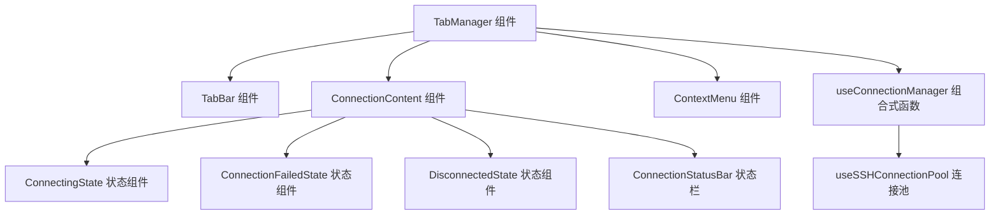

**图表来源**
- [TabManager.vue](file://src/components/TabManager.vue#L1-L363)
- [ConnectionContent.vue](file://src/components/tabs/ConnectionContent.vue#L1-L144)

## 连接管理组合式函数实现

`useConnectionManager`组合式函数是标签管理的核心逻辑单元，负责处理标签的创建、激活、切换和关闭等操作。该函数通过响应式引用管理连接状态，提供完整的连接生命周期控制。

### 标签创建与连接建立

当用户创建新连接时，`addConnection`方法被调用，创建一个包含完整连接信息的响应式对象，并将其添加到`activeConnections`数组中。随后调用`establishConnection`方法启动SSH连接过程。

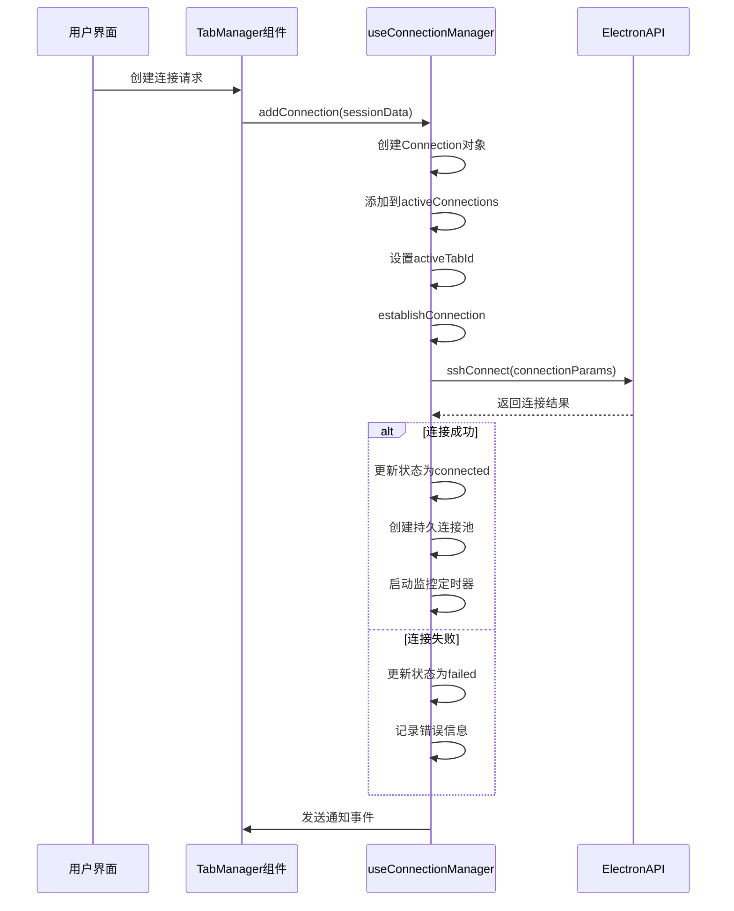

**图表来源**
- [useConnectionManager.ts](file://src/composables/useConnectionManager.ts#L10-L538)
- [TabManager.vue](file://src/components/TabManager.vue#L1-L363)

### 标签切换与激活

`switchTab`方法负责处理标签切换逻辑，更新`activeTabId`的值以激活指定标签页。该方法同时更新连接的最后活动时间，用于会话管理和超时控制。

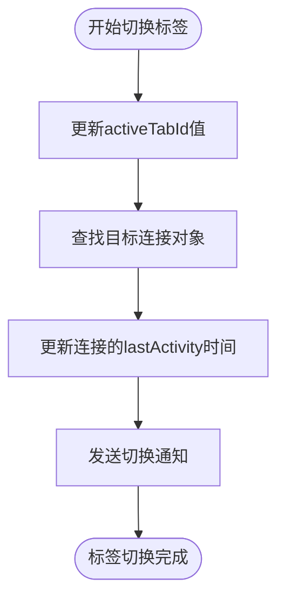

**图表来源**
- [useConnectionManager.ts](file://src/composables/useConnectionManager.ts#L394-L404)

### 标签关闭与资源清理

`closeConnection`方法实现了完整的标签关闭流程，包括断开连接、清理资源和更新UI状态。该方法确保在关闭标签前正确释放所有相关资源。

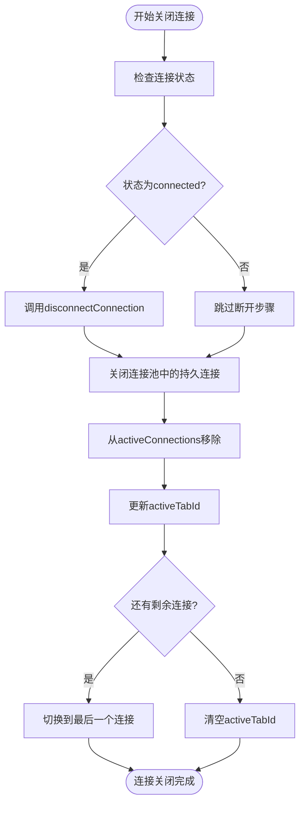

**图表来源**
- [useConnectionManager.ts](file://src/composables/useConnectionManager.ts#L455-L498)

## 标签栏视觉呈现机制

`TabBar.vue`组件负责标签栏的视觉呈现，通过动态渲染连接状态图标和交互元素，为用户提供直观的状态反馈。

### 连接状态图标动态渲染

标签栏使用`getConnectionIcon`方法根据连接状态动态显示相应的图标，通过CSS类绑定实现状态样式的动态切换。

```mermaid
classDiagram
class TabBar {
+connections : Array
+activeTabId : String
-getConnectionIcon(connection) : String
+switchTab(connectionId)
+closeConnection(connectionId)
}
class Connection {
+id : String
+name : String
+status : String
+host : String
+username : String
}
TabBar --> Connection : "显示"
note right of TabBar
连接状态映射：
connecting → ⏳
connected → 🟢
failed → ❌
disconnected → 🔌
end note
```

**图表来源**
- [TabBar.vue](file://src/components/tabs/TabBar.vue#L1-L262)

### 状态指示器样式

标签状态通过`.tab-status`元素的CSS类绑定实现动态样式，不同状态对应不同的背景颜色和动画效果。

```mermaid
stateDiagram-v2
[*] --> connecting
connecting --> connected : 连接成功
connecting --> failed : 连接失败
connected --> disconnected : 手动断开
connected --> failed : 连接丢失
disconnected --> connecting : 重新连接
failed --> connecting : 重试连接
state connecting {
style : background : #f59e0b; animation : pulse 1.5s infinite
}
state connected {
style : background : #10b981
}
state failed {
style : background : #ef4444
}
state disconnected {
style : background : #6b7280
}
```

**图表来源**
- [TabBar.vue](file://src/components/tabs/TabBar.vue#L1-L262)
- [ConnectionStatusBar.vue](file://src/components/connection/ConnectionStatusBar.vue#L1-L250)

## 高级交互功能实现

### 拖拽排序功能

虽然当前代码中未直接实现拖拽排序功能，但系统架构为该功能的实现提供了基础。通过监听鼠标事件和调整`activeConnections`数组的顺序，可以实现标签的拖拽排序。

### 双击关闭功能

双击关闭功能可通过在`TabBar.vue`的标签项上添加双击事件监听器实现。当用户双击标签时，触发`closeConnection`事件。

### 右键菜单功能

右键菜单功能由`ContextMenu.vue`组件实现，通过`useContextMenu`组合式函数管理菜单状态和位置。当用户在终端区域右键点击时，显示包含复制、添加到AI等选项的上下文菜单。

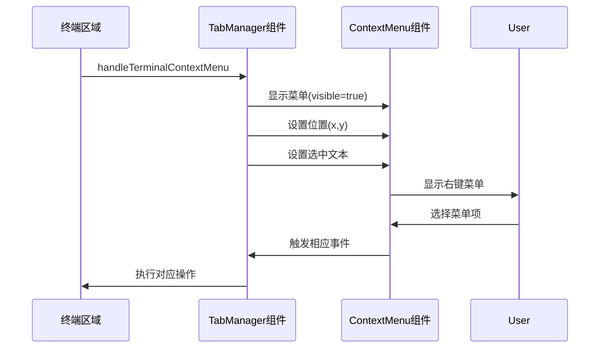

**图表来源**
- [TabManager.vue](file://src/components/TabManager.vue#L1-L363)
- [ContextMenu.vue](file://src/components/ContextMenu.vue#L1-L100)

## 标签状态持久化方案

### 会话恢复机制

系统通过ElectronAPI的`getSessions`方法获取最近的会话列表，在`WelcomeScreen.vue`组件中显示。虽然当前实现主要在欢迎界面展示，但该机制可扩展用于重启后自动恢复会话。

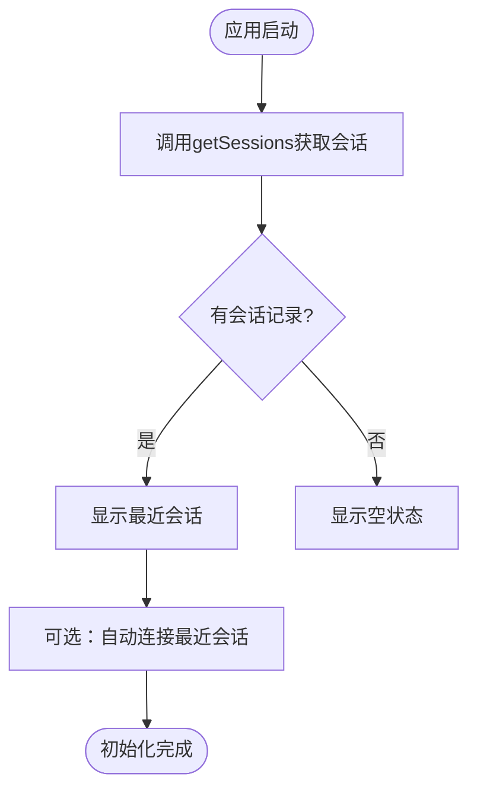

**图表来源**
- [WelcomeScreen.vue](file://src/components/tabs/WelcomeScreen.vue#L1-L799)

### 持久连接池

`useSSHConnectionPool`组合式函数实现了持久连接池机制，通过Map数据结构维护活动连接，支持批量命令执行和连接健康检查。

```mermaid
classDiagram
class useSSHConnectionPool {
+connectionPool : Map
+commandQueue : Map
+executingCommands : Set
+createPersistentConnection()
+executeBatchCommand()
+checkConnectionHealth()
+closePersistentConnection()
+getConnectionStatus()
+startCleanupTimer()
}
class PoolEntry {
+id : String
+connectionParams : Object
+status : String
+lastUsed : Number
+commandHistory : Array
+errorCount : Number
+lastError : String
+isExecuting : Boolean
+commandBuffer : Array
}
useSSHConnectionPool --> PoolEntry : "创建"
note right of useSSHConnectionPool
连接池功能：
- 持久化SSH连接
- 批量执行系统监控命令
- 连接健康检查
- 定期清理超时连接
end note
```

**图表来源**
- [useSSHConnectionPool.js](file://src/composables/useSSHConnectionPool.js#L1-L259)

## 父子组件通信机制

### emit事件通信

组件间通过`emit`事件进行通信，`TabManager.vue`作为父组件接收子组件事件并调用相应方法。

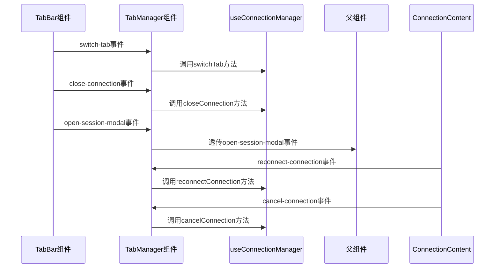

**图表来源**
- [TabManager.vue](file://src/components/TabManager.vue#L1-L363)
- [TabBar.vue](file://src/components/tabs/TabBar.vue#L1-L262)

### 事件处理流程

关键事件的处理流程如下：

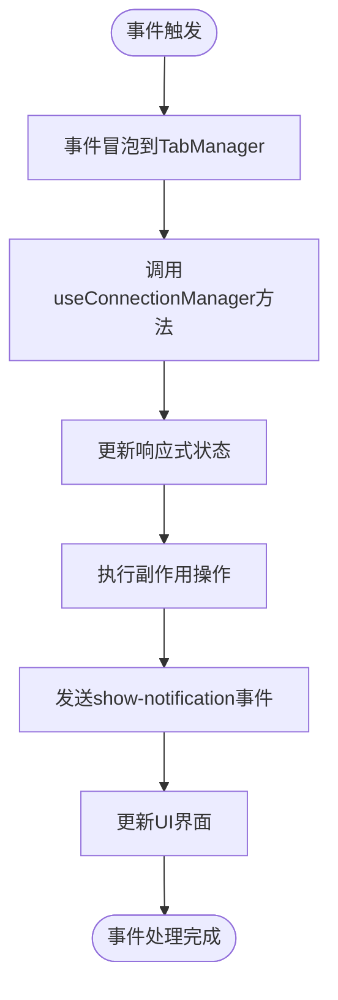

**图表来源**
- [TabManager.vue](file://src/components/TabManager.vue#L1-L363)

## 多标签并发状态同步

### 状态同步机制

系统通过响应式引用和计算属性实现多标签状态的自动同步。`activeConnections`和`activeTabId`作为响应式引用，当其值发生变化时，所有依赖这些状态的组件会自动更新。

### 并发操作处理

对于并发操作，系统采用串行化处理策略，通过Promise链确保操作的原子性。例如，在关闭连接时，先断开SSH连接，再关闭连接池，最后从连接列表中移除。

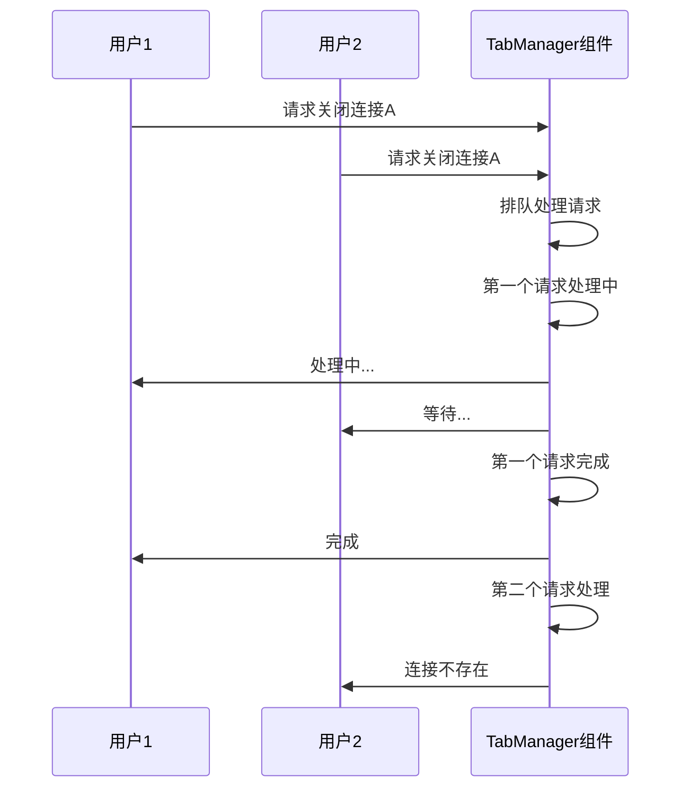

**图表来源**
- [useConnectionManager.ts](file://src/composables/useConnectionManager.ts#L10-L538)

## 性能优化策略

### 连接监控优化

系统采用分层监控策略，对不同状态的连接采用不同的监控频率：

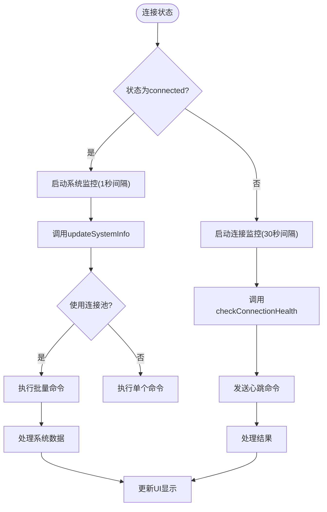

**图表来源**
- [useConnectionManager.ts](file://src/composables/useConnectionManager.ts#L10-L538)

### 输出历史限制

为防止内存泄漏，系统对终端输出历史记录进行限制，当输出行数超过1000行时，保留最近的500行。

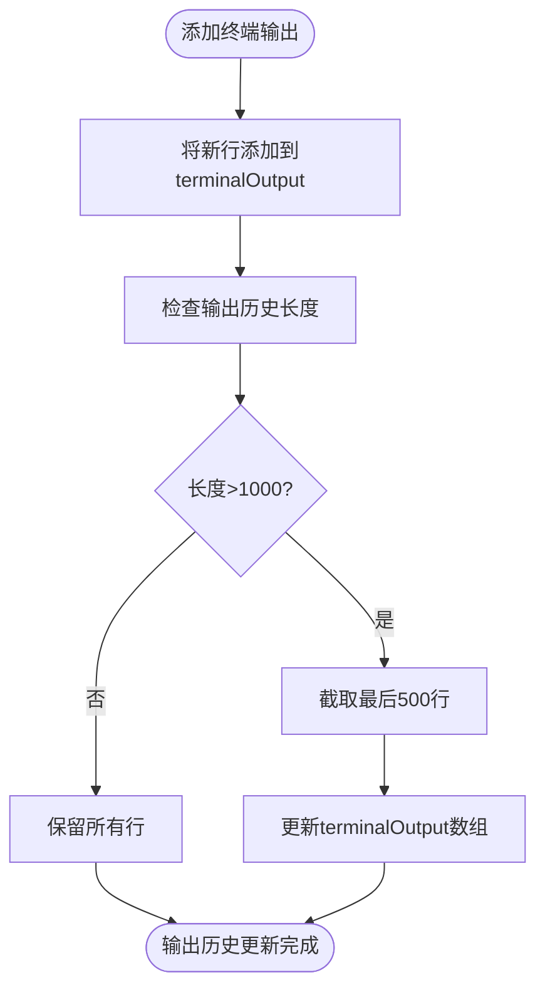

**图表来源**
- [useConnectionManager.ts](file://src/composables/useConnectionManager.ts#L445-L450)

### 虚拟滚动与懒加载

虽然当前代码中未直接实现虚拟滚动或懒加载，但系统架构为这些性能优化策略的实现提供了基础。通过分页加载连接列表和按需渲染标签内容，可以有效提升大量标签时的性能表现。

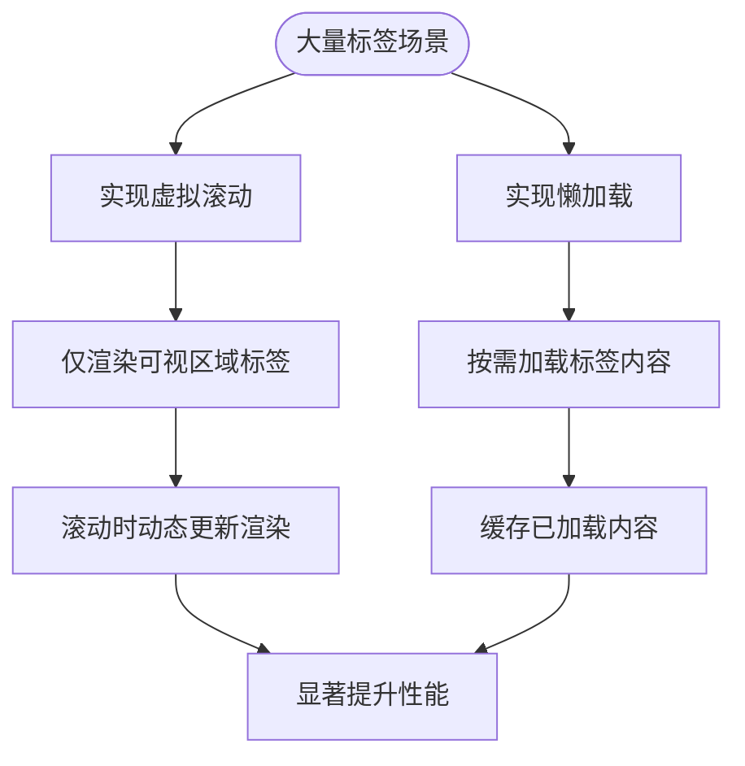

**图表来源**
- [TabManager.vue](file://src/components/TabManager.vue#L1-L363)