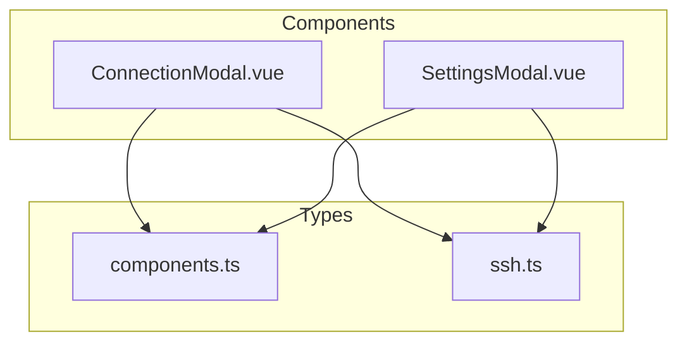
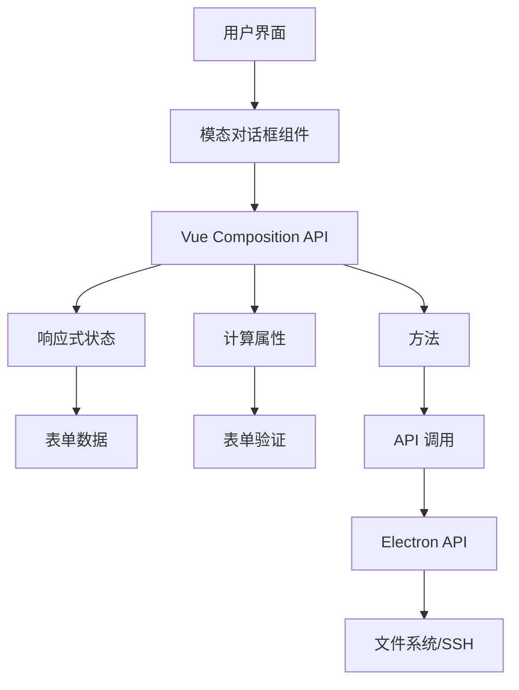
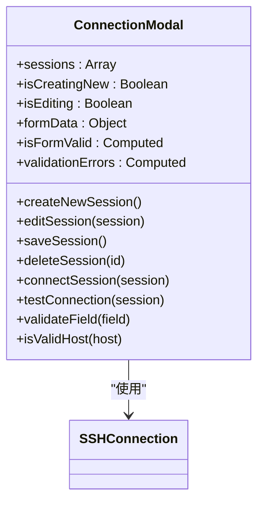
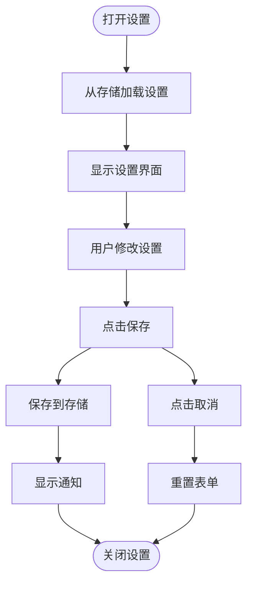
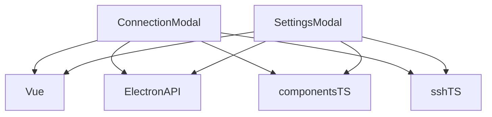

# 模态对话框

<cite>
**本文档引用的文件**   
- [ConnectionModal.vue](file://src/components/ConnectionModal.vue)
- [SettingsModal.vue](file://src/components/SettingsModal.vue)
- [components.ts](file://src/types/components.ts)
- [ssh.ts](file://src/types/ssh.ts)
</cite>

## 目录
1. [简介](#简介)
2. [项目结构](#项目结构)
3. [核心组件](#核心组件)
4. [架构概述](#架构概述)
5. [详细组件分析](#详细组件分析)
6. [依赖分析](#依赖分析)
7. [性能考虑](#性能考虑)
8. [故障排除指南](#故障排除指南)
9. [结论](#结论)
10. [附录](#附录)（如有必要）

## 简介
本文档全面文档化 `ConnectionModal` 和 `SettingsModal` 两个模态对话框的结构与行为。详细说明 `ConnectionModal` 的表单字段（主机、端口、认证方式等）、数据验证逻辑、SSH连接配置的序列化与反序列化流程，以及 `onSave` 和 `onCancel` 回调的触发条件。解释 `SettingsModal` 的配置项组织方式与持久化机制。基于 `components.ts` 中的类型定义，列出所有 props 接口（如 `ConnectionModalProps`）、事件输出及插槽用法。提供对话框打开/关闭动画、焦点管理、键盘快捷键等用户体验细节的实现方案。

## 项目结构
项目结构清晰地组织了组件、组合式函数、模块、类型定义和工具函数。`ConnectionModal` 和 `SettingsModal` 位于 `src/components` 目录下，分别负责 SSH 连接管理和应用程序设置。类型定义在 `src/types` 目录中，特别是 `components.ts` 和 `ssh.ts` 文件定义了关键的数据结构。



**Diagram sources**
- [ConnectionModal.vue](file://src/components/ConnectionModal.vue)
- [SettingsModal.vue](file://src/components/SettingsModal.vue)
- [components.ts](file://src/types/components.ts)
- [ssh.ts](file://src/types/ssh.ts)

**Section sources**
- [ConnectionModal.vue](file://src/components/ConnectionModal.vue)
- [SettingsModal.vue](file://src/components/SettingsModal.vue)
- [components.ts](file://src/types/components.ts)
- [ssh.ts](file://src/types/ssh.ts)

## 核心组件
`ConnectionModal` 和 `SettingsModal` 是应用程序的核心用户界面组件，分别处理 SSH 连接配置和全局应用程序设置。它们通过 `teleport` 渲染到 `body` 元素上，确保模态框在页面堆叠顺序中处于顶层。

**Section sources**
- [ConnectionModal.vue](file://src/components/ConnectionModal.vue)
- [SettingsModal.vue](file://src/components/SettingsModal.vue)

## 架构概述
两个模态对话框都采用了基于 Vue 3 Composition API 的现代架构。它们使用响应式状态管理（`ref` 和 `reactive`）来处理用户输入和内部状态。数据验证通过计算属性和方法实现。与后端的通信通过 `window.electronAPI` 接口进行，实现了前后端的解耦。



**Diagram sources**
- [ConnectionModal.vue](file://src/components/ConnectionModal.vue)
- [SettingsModal.vue](file://src/components/SettingsModal.vue)

## 详细组件分析

### ConnectionModal 分析
`ConnectionModal` 组件管理 SSH 连接的创建、编辑、测试和连接。它有两种主要视图：连接列表视图和表单视图。

#### 表单字段与数据验证
`ConnectionModal` 的表单包含以下字段：
- **连接名称**：必填，长度至少为 2 个字符。
- **主机地址**：必填，支持 IPv4、域名和 `localhost`。
- **端口**：可选，默认为 22，范围在 1-65535 之间。
- **用户名**：必填。
- **描述**：可选。
- **认证方式**：可选择“密码认证”或“密钥认证”。
  - **密码认证**：需要输入密码。
  - **密钥认证**：需要指定私钥文件路径，并自动读取和验证密钥内容。

数据验证通过 `isFormValid` 计算属性和 `validateField` 方法实现。验证错误信息通过 `validationErrors` 计算属性收集并显示在表单顶部。



**Diagram sources**
- [ConnectionModal.vue](file://src/components/ConnectionModal.vue#L200-L800)
- [ssh.ts](file://src/types/ssh.ts#L8-L23)

#### SSH 连接配置的序列化与反序列化
当用户编辑现有连接时，`editSession` 方法将 `session` 对象的属性复制到 `formData` 中，完成反序列化。当用户保存连接时，`saveSession` 方法从 `formData` 创建一个 `sessionData` 对象，完成序列化。该对象包含所有必要的 SSH 连接信息，并通过 `window.electronAPI.saveSession` 保存到持久化存储中。

#### onSave 和 onCancel 回调
`ConnectionModal` 使用 `emits` 定义了 `close`、`show-notification` 和 `session-connected` 事件。`onSave` 回调通过 `saveSession` 方法触发，当表单验证通过时，它会保存连接配置并关闭模态框。`onCancel` 回调通过 `cancelForm` 或 `closeModal` 方法触发，重置表单数据并关闭模态框。

**Section sources**
- [ConnectionModal.vue](file://src/components/ConnectionModal.vue)

### SettingsModal 分析
`SettingsModal` 组件提供了一个多标签页界面来管理应用程序的各种设置。

#### 配置项组织方式
设置被组织在四个标签页中：
- **AI聊天**：配置 AI 聊天功能的提供商、API 密钥、模型等。
- **AI补全**：配置代码补全功能的提供商和行为。
- **终端**：配置终端的外观、行为、快捷键和超时设置。
- **常规**：配置界面主题、语言、连接和安全设置。

每个标签页都有清晰的分组，如“聊天配置”、“聊天行为”等，使用户能够轻松找到相关设置。

#### 持久化机制
`SettingsModal` 使用一个 `settings` 响应式对象来存储所有设置。`defaultSettings` 定义了所有设置的默认值。当用户打开设置模态框时，会从持久化存储中加载当前设置（代码中未显示加载逻辑，但 `settings` 对象的初始值来自 `defaultSettings`）。用户点击“保存设置”按钮时，`saveSettings` 方法（代码片段中未完全显示）会将 `settings` 对象保存到持久化存储中。



**Diagram sources**
- [SettingsModal.vue](file://src/components/SettingsModal.vue#L500-L1000)

**Section sources**
- [SettingsModal.vue](file://src/components/SettingsModal.vue)

### Props 接口、事件输出及插槽用法
基于 `components.ts` 文件的类型定义：

#### ConnectionModalProps
```typescript
export interface ConnectionModalProps {
  visible: boolean; // 控制模态框的显示/隐藏
  connection?: SSHConnection | null; // 可选的初始连接配置，用于编辑
  onSave: (connection: SSHConnection) => void; // 保存连接时的回调
  onCancel: () => void; // 取消操作时的回调
}
```

#### 事件输出
- **ConnectionModal**:
  - `close`: 当用户点击关闭按钮或遮罩层时触发。
  - `show-notification`: 用于显示通知消息（如成功、错误）。
  - `session-connected`: 当用户选择连接一个会话时触发，携带会话数据。
- **SettingsModal**:
  - `close`: 当用户关闭设置模态框时触发。
  - `show-notification`: 用于显示通知消息。

#### 插槽用法
提供的代码中，`ConnectionModal` 和 `SettingsModal` 均未使用插槽（slots），其内容在组件内部完全定义。

**Section sources**
- [components.ts](file://src/types/components.ts)
- [ConnectionModal.vue](file://src/components/ConnectionModal.vue)
- [SettingsModal.vue](file://src/components/SettingsModal.vue)

### 用户体验细节
#### 打开/关闭动画
两个模态对话框都使用 Vue 的 `<transition>` 组件实现动画。`name="modal"` 定义了动画的 CSS 类名。进入和离开时，对话框会有一个淡入淡出（`opacity`）和轻微缩放（`transform: scale(0.9)`）的效果，持续时间为 0.3 秒。

#### 焦点管理
- 当模态框打开时，焦点默认在关闭按钮上。
- 在 `ConnectionModal` 的表单中，用户可以通过 Tab 键在输入框之间移动焦点。
- 点击模态框的遮罩层（`modal-overlay`）会触发关闭事件，但点击内容区域（`modal-content`）会阻止事件冒泡，防止意外关闭。

#### 键盘快捷键
- **ESC 键**：在两个模态框中，按下 ESC 键会触发 `close` 事件，关闭模态框（通过 `@click="$emit('close')"` 在遮罩层上实现）。
- **Enter 键**：在 `ConnectionModal` 的表单中，按下 Enter 键会触发表单的 `submit` 事件，等同于点击“创建连接”或“保存修改”按钮。

**Section sources**
- [ConnectionModal.vue](file://src/components/ConnectionModal.vue)
- [SettingsModal.vue](file://src/components/SettingsModal.vue)

## 依赖分析
`ConnectionModal` 和 `SettingsModal` 主要依赖于：
- **Vue 3**：提供 Composition API 和响应式系统。
- **Electron API**：通过 `window.electronAPI` 对象与 Electron 主进程通信，实现文件读取、SSH 连接和会话管理。
- **类型定义**：依赖 `src/types/components.ts` 和 `src/types/ssh.ts` 中的接口来保证类型安全。



**Diagram sources**
- [ConnectionModal.vue](file://src/components/ConnectionModal.vue)
- [SettingsModal.vue](file://src/components/SettingsModal.vue)
- [components.ts](file://src/types/components.ts)
- [ssh.ts](file://src/types/ssh.ts)

**Section sources**
- [ConnectionModal.vue](file://src/components/ConnectionModal.vue)
- [SettingsModal.vue](file://src/components/SettingsModal.vue)
- [components.ts](file://src/types/components.ts)
- [ssh.ts](file://src/types/ssh.ts)

## 性能考虑
- **响应式优化**：使用 `ref` 和 `reactive` 精确控制响应式数据的粒度。
- **计算属性**：`isFormValid` 和 `validationErrors` 使用计算属性，避免在每次渲染时重复计算。
- **事件监听**：使用 `watch` 监听 `props.isOpen` 和 `formData.keyPath`，确保只在必要时执行操作。
- **内存管理**：在 `onUnmounted` 钩子中清除定时器，防止内存泄漏。

## 故障排除指南
- **连接测试失败**：检查主机地址、端口、用户名和认证信息是否正确。确保网络连接正常。
- **密钥文件无法读取**：检查文件路径是否正确，文件是否存在，以及是否有读取权限。
- **设置无法保存**：检查持久化存储是否正常工作，确保 `saveSettings` 方法被正确调用。
- **模态框不显示**：检查 `visible` 或 `isOpen` prop 是否正确传递为 `true`。

**Section sources**
- [ConnectionModal.vue](file://src/components/ConnectionModal.vue)
- [SettingsModal.vue](file://src/components/SettingsModal.vue)

## 结论
`ConnectionModal` 和 `SettingsModal` 是功能完整、用户体验良好的模态对话框组件。它们通过清晰的结构、严格的验证和流畅的动画，为用户提供了一个直观的界面来管理 SSH 连接和应用程序设置。其基于 Composition API 的设计使其易于维护和扩展。