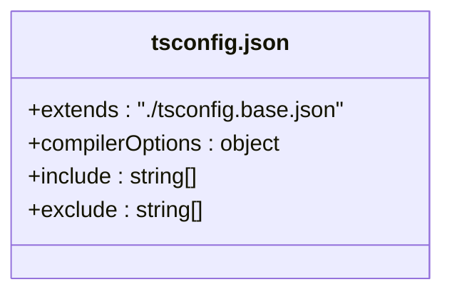
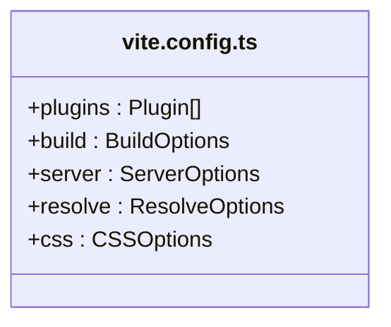
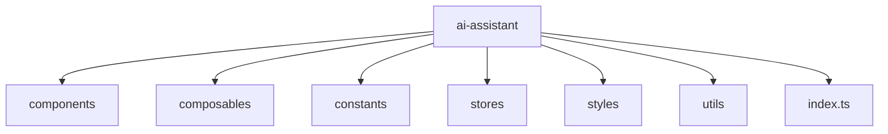
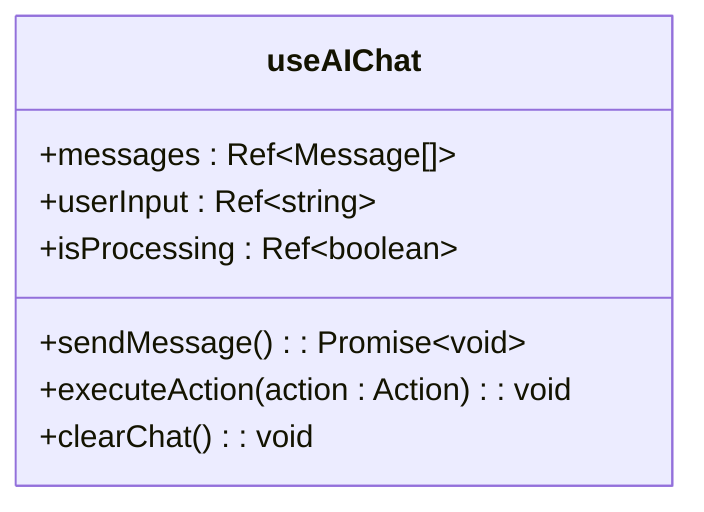
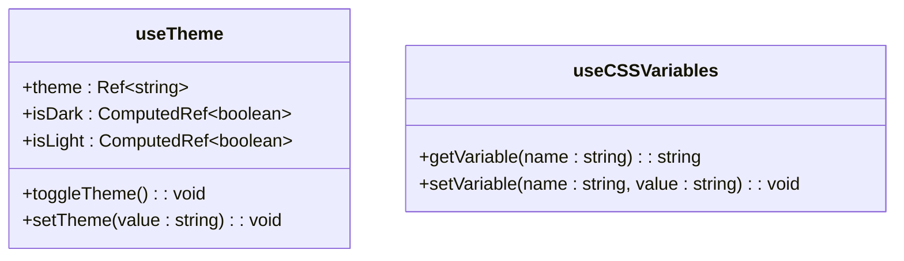
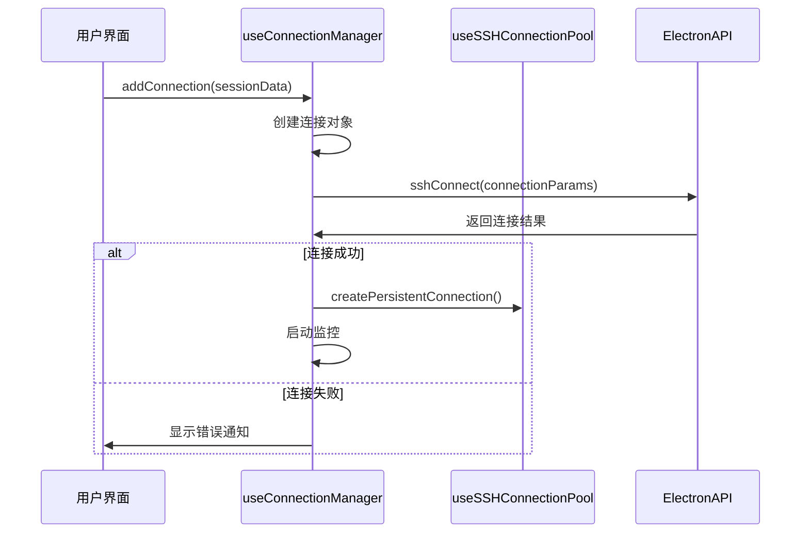
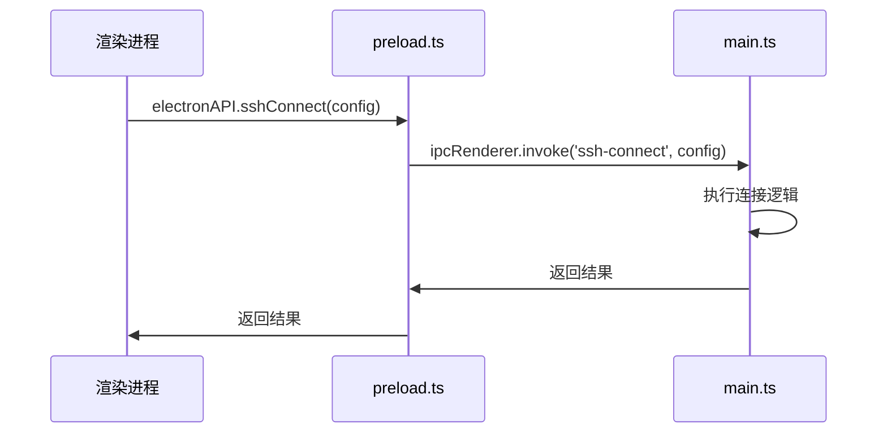

# 开发指南

<cite>
**本文档中引用的文件**  
- [tsconfig.json](file://tsconfig.json)
- [vite.config.ts](file://vite.config.ts)
- [.prettierrc](file://.prettierrc)
- [eslint.config.js](file://eslint.config.js)
- [src/modules/ai-assistant/index.ts](file://src/modules/ai-assistant/index.ts)
- [src/hooks/useTheme.ts](file://src/hooks/useTheme.ts)
- [src/hooks/useComponentStyles.ts](file://src/hooks/useComponentStyles.ts)
- [src/composables/useConnectionManager.ts](file://src/composables/useConnectionManager.ts)
- [src/modules/ai-assistant/components/AIAssistant.vue](file://src/modules/ai-assistant/components/AIAssistant.vue)
- [src/modules/ai-assistant/composables/useAIChat.ts](file://src/modules/ai-assistant/composables/useAIChat.ts)
- [main.ts](file://main.ts)
- [preload.ts](file://preload.ts)
- [src/types/index.ts](file://src/types/index.ts)
- [src/types/terminal.ts](file://src/types/terminal.ts)
</cite>

## 目录
1. [环境搭建](#环境搭建)
2. [代码规范](#代码规范)
3. [模块开发](#模块开发)
4. [调试技巧](#调试技巧)
5. [测试建议](#测试建议)

## 环境搭建

本项目基于 Electron + Vue 3 + TypeScript 技术栈构建，使用 Vite 作为构建工具。开发者需要配置以下工具和依赖以确保开发环境的一致性。

### TypeScript 配置

项目使用 `tsconfig.json` 作为 TypeScript 配置文件，继承自 `tsconfig.base.json`。主要配置包括：

- **模块解析**：`moduleResolution: "bundler"`，支持现代打包器
- **路径映射**：通过 `paths` 配置了 `@/*` 到 `src/*` 的别名，便于模块导入
- **类型定义**：包含 `node` 和 `electron` 类型，支持 Electron 主进程开发
- **包含文件**：明确指定 `src` 目录下的 `.ts`、`.tsx`、`.vue` 文件以及 `main.ts` 和 `preload.ts`

该配置确保了类型检查的准确性，同时支持 Vue 单文件组件和 Electron API 的类型推断。



**图源**
- [tsconfig.json](file://tsconfig.json)

**本节来源**
- [tsconfig.json](file://tsconfig.json)

### Vite 构建配置

`vite.config.ts` 文件定义了 Vite 的构建行为，关键配置如下：

- **插件**：使用 `@vitejs/plugin-vue` 支持 Vue 3
- **构建输出**：输出目录为 `dist`，资源目录为 `assets`
- **代码分割**：通过 `manualChunks` 将 `vue` 单独打包，优化加载性能
- **开发服务器**：端口为 `3000`，启动时自动打开浏览器
- **路径别名**：`@` 指向 `src` 目录
- **SCSS 预处理**：全局引入 `@/styles/variables.scss`，确保所有组件可访问全局变量

此配置优化了开发体验和生产构建性能。



**图源**
- [vite.config.ts](file://vite.config.ts)

**本节来源**
- [vite.config.ts](file://vite.config.ts)

### ESLint 和 Prettier 配置

项目使用 ESLint 进行代码质量检查，Prettier 进行代码格式化，两者通过 `eslint-plugin-prettier` 集成。

#### ESLint 配置

`eslint.config.js` 采用模块化配置，包含多个规则集：

- **TypeScript 文件**：启用 `@typescript-eslint/eslint-plugin` 的推荐规则，对 `no-unused-vars` 关闭，`no-explicit-any` 仅警告
- **Vue 文件**：使用 `eslint-plugin-vue` 的推荐规则，对 `multi-word-component-names` 等规则关闭
- **Prettier 集成**：作为最后的规则集，确保格式化不与 ESLint 冲突

#### Prettier 配置

`.prettierrc` 定义了代码格式化标准：

- **分号**：`semi: true`
- **引号**：`singleQuote: true`
- **行宽**：`printWidth: 100`
- **缩进**：`tabWidth: 2`
- **行尾**：`endOfLine: "lf"`

这些配置确保了团队代码风格的统一。

```mermaid
classDiagram
class eslint.config.js {
+typescriptConfig : object
+vueConfig : object
+prettierConfig : object
+ignores : string[]
}
class .prettierrc {
+semi : boolean
+singleQuote : boolean
+printWidth : number
+tabWidth : number
+endOfLine : string
}
```

**图源**
- [eslint.config.js](file://eslint.config.js)
- [.prettierrc](file://.prettierrc)

**本节来源**
- [eslint.config.js](file://eslint.config.js)
- [.prettierrc](file://.prettierrc)

## 代码规范

遵循项目配置的 ESLint 和 Prettier 规则是代码贡献的基本要求。此外，还需注意以下约定：

- **路径导入**：始终使用 `@/*` 别名导入 `src` 目录下的模块
- **类型定义**：复杂类型应定义在 `src/types` 目录下，并通过 `index.ts` 导出
- **组件命名**：Vue 组件采用 PascalCase 命名，如 `AIAssistant.vue`
- **组合式函数**：`src/composables` 目录下的函数以 `use` 开头，如 `useConnectionManager.ts`
- **自定义 Hook**：`src/hooks` 目录下的函数也以 `use` 开头，如 `useTheme.ts`

## 模块开发

新功能模块应遵循 `modules/ai-assistant` 的结构进行组织，以保证项目的一致性和可维护性。

### 模块结构

参考 `modules/ai-assistant` 目录，一个功能模块应包含以下子目录：

- **components**：存放该模块的 Vue 组件
- **composables**：存放该模块专用的组合式函数
- **constants**：存放常量定义
- **stores**：存放 Pinia 状态存储（如果使用）
- **styles**：存放 SCSS 样式文件
- **utils**：存放工具函数
- **index.ts**：模块的入口文件，统一导出所有公共 API



**图源**
- [src/modules/ai-assistant/index.ts](file://src/modules/ai-assistant/index.ts)

### 组件、组合式函数和状态存储

#### 组件

组件应遵循 Vue 3 的 Composition API 和 `<script setup>` 语法。例如，`AIAssistant.vue` 使用 `setup` 函数返回状态和方法，并通过 `provide` 提供上下文。

#### 组合式函数

组合式函数用于封装可复用的逻辑。例如，`useAIChat.ts` 封装了与 AI 服务交互的完整逻辑，包括消息发送、接收和状态管理。



**图源**
- [src/modules/ai-assistant/composables/useAIChat.ts](file://src/modules/ai-assistant/composables/useAIChat.ts)

#### 状态存储

虽然 `ai-assistant` 模块的状态主要在 `useAIChat` 中管理，但复杂状态可使用 Pinia 存储。`useAIStore` 应从 `stores/ai.js` 导入。

**本节来源**
- [src/modules/ai-assistant/index.ts](file://src/modules/ai-assistant/index.ts)
- [src/modules/ai-assistant/components/AIAssistant.vue](file://src/modules/ai-assistant/components/AIAssistant.vue)
- [src/modules/ai-assistant/composables/useAIChat.ts](file://src/modules/ai-assistant/composables/useAIChat.ts)

### 样式组织

样式文件应存放在模块的 `styles` 目录下。`AIAssistant.scss` 定义了组件的特定样式，而 `index.ts` 可以导出样式类名或 CSS 变量。

### 逻辑复用

#### 自定义 Hook

- **useTheme**：管理应用主题，通过操作 `document.documentElement` 的类名来切换主题。
- **useCSSVariables**：提供获取和设置 CSS 变量的工具函数。



**图源**
- [src/hooks/useTheme.ts](file://src/hooks/useTheme.ts)

#### 组合式函数

- **useConnectionManager**：管理 SSH 连接的整个生命周期，包括添加、连接、断开和关闭连接。它使用 `useSSHConnectionPool` 来优化连接性能。



**图源**
- [src/composables/useConnectionManager.ts](file://src/composables/useConnectionManager.ts)

**本节来源**
- [src/hooks/useTheme.ts](file://src/hooks/useTheme.ts)
- [src/hooks/useComponentStyles.ts](file://src/hooks/useComponentStyles.ts)
- [src/composables/useConnectionManager.ts](file://src/composables/useConnectionManager.ts)

## 调试技巧

### 主进程日志

主进程（`main.ts`）的日志输出到 Electron 应用的控制台。在开发模式下，可通过 `console.log` 输出调试信息。例如，`ssh-connect` 处理程序会打印详细的连接配置和状态。

**本节来源**
- [main.ts](file://main.ts)

### 渲染进程 DevTools

渲染进程（Vue 应用）的调试可通过 DevTools 进行。在开发模式下，`createWindow` 函数会自动调用 `mainWindow.webContents.openDevTools()` 打开开发者工具。

**本节来源**
- [main.ts](file://main.ts)

### IPC 消息监听

主进程和渲染进程通过 IPC（进程间通信）进行通信。调试 IPC 消息的关键是：

- **主进程**：使用 `ipcMain.handle` 注册处理程序，并在函数内添加 `console.log`。
- **渲染进程**：通过 `window.electronAPI` 调用 IPC 方法，可在 `preload.ts` 中监听事件。

例如，`preload.ts` 使用 `contextBridge.exposeInMainWorld` 将 IPC 方法暴露给渲染进程。



**图源**
- [preload.ts](file://preload.ts)
- [main.ts](file://main.ts)

**本节来源**
- [preload.ts](file://preload.ts)
- [main.ts](file://main.ts)

## 测试建议

尽管项目结构中未显示测试文件，但建议为关键模块编写单元测试和集成测试。

- **单元测试**：使用 Vitest 测试组合式函数（如 `useAIChat`）和工具函数（如 `formatters.ts`）。
- **组件测试**：使用 Vue Test Utils 测试 Vue 组件的渲染和交互。
- **集成测试**：使用 Playwright 或 Cypress 测试用户工作流，如创建连接、执行命令等。

测试文件应与源文件同目录或放在 `tests` 目录下，并遵循 `*.test.ts` 或 `*.spec.ts` 的命名约定。