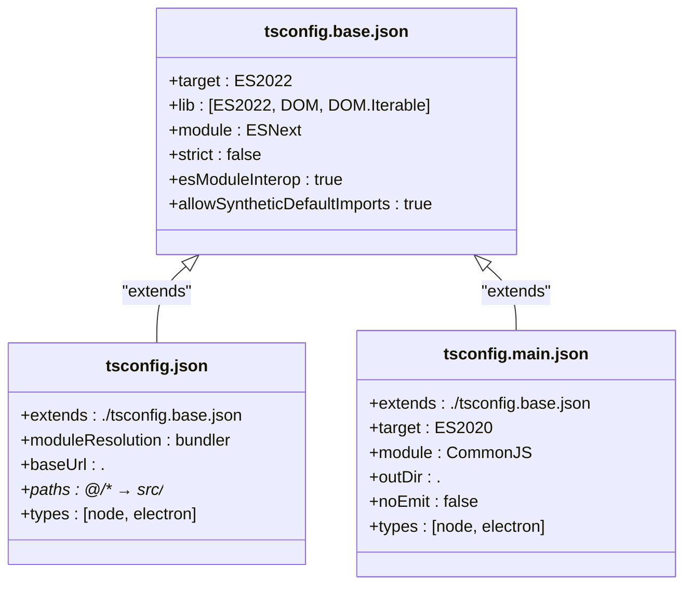
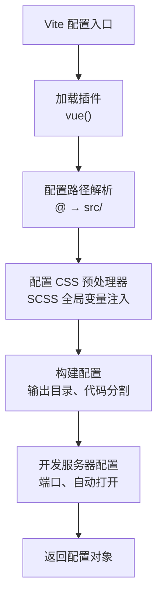
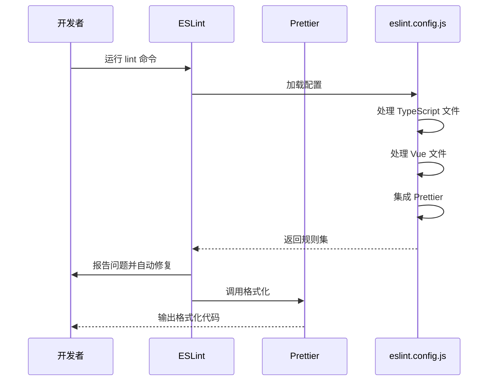

# 开发环境配置

<cite>
**Referenced Files in This Document**   
- [tsconfig.json](file://tsconfig.json)
- [tsconfig.base.json](file://tsconfig.base.json)
- [tsconfig.main.json](file://tsconfig.main.json)
- [vite.config.ts](file://vite.config.ts)
- [.prettierrc](file://.prettierrc)
- [eslint.config.js](file://eslint.config.js)
- [src/styles/variables.scss](file://src/styles/variables.scss)
- [package.json](file://package.json)
- [main.ts](file://main.ts)
</cite>

## 目录
1. [TypeScript 配置](#typescript-配置)
2. [Vite 构建配置](#vite-构建配置)
3. [ESLint 和 Prettier 集成](#eslint-和-prettier-集成)
4. [环境变量与开发服务器](#环境变量与开发服务器)
5. [常见配置问题排查](#常见配置问题排查)

## TypeScript 配置

本项目采用模块化的 TypeScript 配置体系，通过继承机制实现配置复用和环境隔离。核心配置文件包括 `tsconfig.json`（渲染进程）、`tsconfig.main.json`（主进程）和共享的 `tsconfig.base.json`。



**Diagram sources**
- [tsconfig.json](file://tsconfig.json#L1-L40)
- [tsconfig.base.json](file://tsconfig.base.json#L1-L19)
- [tsconfig.main.json](file://tsconfig.main.json#L1-L27)

**Section sources**
- [tsconfig.json](file://tsconfig.json#L1-L40)
- [tsconfig.base.json](file://tsconfig.base.json#L1-L19)

### 路径别名配置

项目通过 `tsconfig.json` 中的 `paths` 选项配置了路径别名，实现了从 `@/*` 到 `src/*` 的映射，简化了模块导入路径：

```json
{
  "compilerOptions": {
    "baseUrl": ".",
    "paths": {
      "@/*": ["src/*"],
      "@/components/*": ["src/components/*"],
      "@/composables/*": ["src/composables/*"],
      "@/stores/*": ["src/stores/*"],
      "@/utils/*": ["src/utils/*"],
      "@/hooks/*": ["src/hooks/*"],
      "@/constants/*": ["src/constants/*"]
    }
  }
}
```

这种配置允许开发者使用简洁的导入语句，如 `import { useConnectionManager } from '@/composables/useConnectionManager'`，而不是冗长的相对路径。路径别名在编译时由 TypeScript 解析器处理，并在构建时由 Vite 正确解析。

**Section sources**
- [tsconfig.json](file://tsconfig.json#L10-L24)

### 模块解析设置

项目采用现代的模块解析策略，关键配置包括：

- **moduleResolution: "bundler"**：启用捆绑器模式，支持现代打包工具的特性
- **allowImportingTsExtensions: true**：允许直接导入 `.ts` 文件扩展名
- **resolveJsonModule: true**：支持直接导入 JSON 模块
- **isolatedModules: true**：确保每个文件可独立编译，兼容转译工具

这些设置确保了项目与 Vite 构建工具的兼容性，同时支持现代 JavaScript 和 TypeScript 特性。

**Section sources**
- [tsconfig.json](file://tsconfig.json#L5-L9)

## Vite 构建配置

`vite.config.ts` 文件定义了项目的构建和开发服务器配置，采用模块化方式集成 Vue 插件和自定义构建选项。



**Diagram sources**
- [vite.config.ts](file://vite.config.ts#L1-L41)

**Section sources**
- [vite.config.ts](file://vite.config.ts#L1-L41)

### SCSS 全局变量注入

项目通过 Vite 的 CSS 预处理器选项实现了 SCSS 全局变量注入，避免了在每个组件中重复导入变量文件：

```typescript
css: {
  preprocessorOptions: {
    scss: {
      additionalData: `@use "@/styles/variables.scss" as *;`
    }
  }
}
```

此配置确保所有 SCSS 文件在编译前自动注入 `variables.scss` 中定义的设计令牌和变量，实现了设计系统的一致性。开发者可以在任何 SCSS 样式块中直接使用 `$primary`、`$spacing-md` 等变量，而无需显式导入。

**Section sources**
- [vite.config.ts](file://vite.config.ts#L33-L38)
- [src/styles/variables.scss](file://src/styles/variables.scss#L1-L265)

### 构建输出配置

构建配置优化了输出结构和性能，关键设置包括：

- **outDir: 'dist'**：指定构建输出目录
- **assetsDir: 'assets'**：指定静态资源子目录
- **manualChunks**：手动代码分割，将 Vue 等大型依赖打包到独立的 `vendor` 块
- **chunkSizeWarningLimit: 1000**：设置代码块大小警告阈值为 1MB

这些配置确保了生产构建的性能优化，通过代码分割减少初始加载时间，并通过合理的警告阈值监控包大小。

**Section sources**
- [vite.config.ts](file://vite.config.ts#L10-L23)

## ESLint 和 Prettier 集成

项目采用 ESLint 和 Prettier 的深度集成，通过 `eslint.config.js` 实现统一的代码风格和质量检查。



**Diagram sources**
- [eslint.config.js](file://eslint.config.js#L1-L146)
- [.prettierrc](file://.prettierrc#L1-L11)

**Section sources**
- [eslint.config.js](file://eslint.config.js#L1-L146)
- [.prettierrc](file://.prettierrc#L1-L11)

### ESLint 配置策略

ESLint 配置采用模块化数组结构，为不同类型的文件应用不同的规则集：

1. **TypeScript 文件**：使用 `@typescript-eslint/parser` 和推荐规则，针对项目需求进行定制
2. **Vue 文件**：使用 `eslint-plugin-vue` 的推荐配置，禁用不适用的规则如 `vue/multi-word-component-names`
3. **主进程文件**：为 `main.ts` 和 `preload.ts` 提供特定的全局变量和规则
4. **Vite 配置文件**：单独配置 `vite.config.ts` 的检查规则

配置中特别处理了 Electron 环境的全局变量（如 `__dirname`、`require`），并整合了 Prettier 以避免格式化冲突。

**Section sources**
- [eslint.config.js](file://eslint.config.js#L1-L146)

### Prettier 格式化规则

`.prettierrc` 文件定义了项目的代码格式化标准：

```json
{
  "semi": true,
  "trailingComma": "none",
  "singleQuote": true,
  "printWidth": 100,
  "tabWidth": 2,
  "useTabs": false,
  "bracketSpacing": true,
  "arrowParens": "avoid",
  "endOfLine": "lf"
}
```

这些规则确保了代码风格的一致性：
- 使用单引号而非双引号
- 行宽限制为 100 字符
- 禁用尾随逗号
- 避免箭头函数参数的括号（单参数时）
- 使用 LF 换行符

**Section sources**
- [.prettierrc](file://.prettierrc#L1-L11)

## 环境变量与开发服务器

项目通过 `package.json` 中的脚本和 Vite 配置定义了开发和构建工作流。

### 开发服务器启动

开发服务器通过以下命令启动：

```bash
npm run debug
```

此命令使用 `concurrently` 并行运行 Vite 开发服务器和 Electron 应用，关键配置包括：

- **端口**: 3000
- **自动打开**: `open: true`，启动后自动打开应用窗口
- **开发模式检测**: 通过 `--dev` 参数区分开发和生产环境

在 `main.ts` 中，应用根据 `--dev` 参数决定加载 Vite 开发服务器还是本地构建文件：

```typescript
if (isDev) {
  mainWindow.loadURL('http://localhost:3000');
  mainWindow.webContents.openDevTools();
} else {
  mainWindow.loadFile(indexPath);
}
```

**Section sources**
- [vite.config.ts](file://vite.config.ts#L18-L22)
- [main.ts](file://main.ts#L40-L50)
- [package.json](file://package.json#L6-L7)

### 构建和发布脚本

`package.json` 定义了完整的构建和发布工作流：

```json
"scripts": {
  "start": "npm run build-main && npm run build && electron .",
  "debug": "concurrently \"vite\" \"npm run build-main && wait-on http://localhost:3000 && electron . --dev --remote-debugging-port=9222\"",
  "build": "vite build",
  "build-main": "tsc -p tsconfig.main.json",
  "build-electron": "npm run build-main && npm run build && electron-builder",
  "dist": "npm run build-electron"
}
```

构建流程分为两个独立的 TypeScript 编译步骤：
1. `build-main`: 使用 `tsconfig.main.json` 编译主进程代码
2. `build`: 使用 Vite 构建渲染进程代码

这种分离确保了主进程和渲染进程使用不同的编译目标和模块系统。

**Section sources**
- [package.json](file://package.json#L6-L17)

## 常见配置问题排查

### 路径解析错误

当出现 `Cannot find module '@/components/...'` 错误时，可能原因和解决方案包括：

1. **检查 tsconfig.json 配置**：确保 `baseUrl` 和 `paths` 正确配置
2. **验证 Vite 别名**：确认 `vite.config.ts` 中的 `resolve.alias` 包含 `'@': resolve(__dirname, 'src')`
3. **重启开发服务器**：Vite 的别名配置需要重启服务器才能生效
4. **检查文件存在性**：确认目标文件确实存在于指定路径

### 类型检查失败

当 TypeScript 报告类型错误时，应检查：

1. **文件包含范围**：确保文件在 `tsconfig.json` 的 `include` 数组中
2. **模块解析**：检查是否正确导入了类型定义
3. **第三方类型**：确认 `@types/` 包已正确安装

### ESLint/Prettier 冲突

当 ESLint 和 Prettier 规则冲突时，应：

1. **检查配置顺序**：确保 Prettier 配置在 ESLint 规则之后应用
2. **使用 eslint-config-prettier**：禁用与 Prettier 冲突的 ESLint 规则
3. **统一配置**：确保 `.prettierrc` 和 ESLint 中的格式化规则一致

**Section sources**
- [tsconfig.json](file://tsconfig.json#L25-L39)
- [vite.config.ts](file://vite.config.ts#L28-L31)
- [eslint.config.js](file://eslint.config.js#L135-L145)