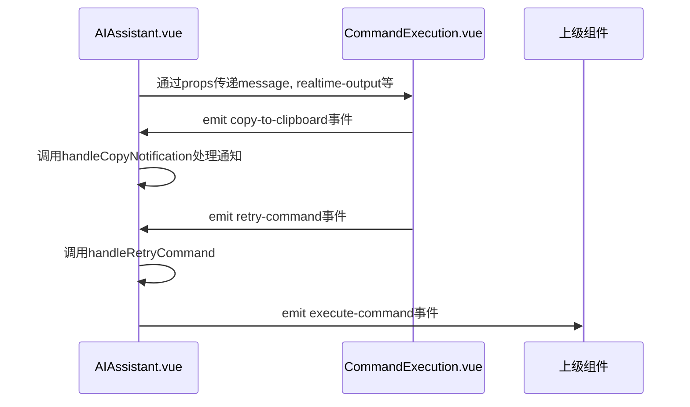
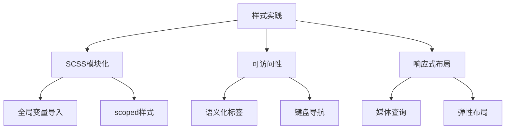

# UI组件组织

<cite>
**本文档引用的文件**  
- [AIAssistant.vue](file://src/modules/ai-assistant/components/AIAssistant.vue)
- [CommandExecution.vue](file://src/modules/ai-assistant/components/ai/CommandExecution.vue)
- [ConnectionModal.vue](file://src/components/ConnectionModal.vue)
- [FileManager.vue](file://src/modules/file-manager/components/FileManager.vue)
- [AIAssistant.scss](file://src/modules/ai-assistant/styles/AIAssistant.scss)
</cite>

## 目录
1. [组件分层与职责划分](#组件分层与职责划分)
2. [AIAssistant与CommandExecution通信机制](#aiassistant与commandexecution通信机制)
3. [通用UI模式实现规范](#通用ui模式实现规范)
4. [样式与响应式实践](#样式与响应式实践)

## 组件分层与职责划分

在本系统中，UI组件遵循清晰的分层原则，确保容器组件与展示组件职责分离。容器组件（如`AIAssistant.vue`）负责业务逻辑调度、状态管理与数据流控制，而展示组件（如`CommandExecution.vue`）专注于视觉呈现与用户交互反馈。

容器组件通过`props`向下传递数据与配置，通过`emits`向上派发事件，形成单向数据流。同时，利用Vue的`provide/inject`机制，将复杂的上下文状态（如`aiChatContext`）注入到深层子组件中，避免了繁琐的逐层传递。展示组件则保持高度内聚，仅依赖输入属性进行渲染，不直接访问外部状态，提升了组件的可测试性与复用性。

这种分层架构使得逻辑与视图解耦，便于独立开发与维护，同时也为功能扩展提供了清晰的边界。

**Section sources**
- [AIAssistant.vue](file://src/modules/ai-assistant/components/AIAssistant.vue#L1-L100)

## AIAssistant与CommandExecution通信机制

`AIAssistant.vue`作为核心容器组件，与`CommandExecution.vue`这一展示组件通过多种机制实现高效通信。

### 插槽（Slot）与条件渲染
`AIAssistant.vue`并未直接使用插槽，而是通过`v-show`指令和`isToolMessage`计算属性，根据消息类型动态决定是否渲染`CommandExecution`组件。当消息类型为`tool-start`、`tool-complete`或`tool-error`时，`CommandExecution`组件被激活，实现了内容的动态插入。

### Props数据传递
`AIAssistant.vue`通过`props`向`CommandExecution.vue`传递关键数据：
- `message`: 包含命令元数据（如`command`、`toolCallId`）的消息对象。
- `collapsed-by-default`: 控制执行面板默认折叠状态。
- `realtime-output` 和 `show-realtime-output`: 用于传递和控制实时输出的显示。

### 事件（Event）通信
`CommandExecution.vue`通过`emits`向`AIAssistant.vue`反馈用户操作：
- `copy-to-clipboard`: 当用户点击“复制”按钮时触发，`AIAssistant.vue`的`handleCopyNotification`方法接收该事件并调用`show-notification`。
- `retry-command`: 当用户点击“重试”按钮时触发，`AIAssistant.vue`的`handleRetryCommand`方法接收该事件，并通过`execute-command`事件将其转发给更上层的组件（如`TabManager`），实现命令的重新执行。

**Diagram sources**
- [AIAssistant.vue](file://src/modules/ai-assistant/components/AIAssistant.vue#L454-L496)
- [CommandExecution.vue](file://src/modules/ai-assistant/components/ai/CommandExecution.vue#L200-L236)

**Section sources**
- [AIAssistant.vue](file://src/modules/ai-assistant/components/AIAssistant.vue#L454-L496)
- [CommandExecution.vue](file://src/modules/ai-assistant/components/ai/CommandExecution.vue#L200-L236)

## 通用UI模式实现规范

系统中的通用UI模式，如表单、列表和对话框，均遵循一致的实现规范，确保用户体验的统一性。

### 表单模式：连接模态框 (ConnectionModal.vue)
`ConnectionModal.vue`是表单模式的典范。它采用分步式设计，区分“连接列表”和“新建/编辑表单”两种视图。表单包含：
- **字段验证**：通过`validationErrors`计算属性和`validateField`方法实现即时与提交时的双重验证。
- **认证方式切换**：使用`v-if`根据`authType`动态渲染密码输入框或密钥路径输入框。
- **异步操作反馈**：在“测试连接”等操作中，使用`isTestingConnection`状态控制按钮禁用与加载状态，提供清晰的用户反馈。

### 列表模式：文件管理器 (FileManager.vue)
`FileManager.vue`实现了复杂的列表交互模式：
- **数据展示**：将文件分为`directories`和`regularFiles`两个计算属性，分别渲染。
- **交互操作**：支持点击选择、双击打开、右键上下文菜单（`contextMenu`）以及拖拽上传。
- **批量操作**：通过`selectedFiles`集合管理选中项，状态栏显示选中数量，并提供“下载选中”、“删除选中”等批量操作按钮。

### 对话框模式
系统广泛使用模态框（Modal）进行关键操作确认或信息输入。例如，`ConnectionModal.vue`和`FileManager.vue`中的新建/重命名对话框均通过`teleport`渲染到`body`，并使用`v-if`和`@click.stop`控制显示与点击穿透，确保了良好的用户体验。

**Section sources**
- [ConnectionModal.vue](file://src/components/ConnectionModal.vue#L209-L250)
- [FileManager.vue](file://src/modules/file-manager/components/FileManager.vue#L952-L1015)

## 样式与响应式实践

### 样式隔离与SCSS模块化
所有组件均采用`<style scoped>`以实现样式隔离，防止全局污染。同时，项目通过`@import '@/styles/variables.scss'`引入全局SCSS变量（如颜色、间距、边框半径），确保设计系统的一致性。例如，`AIAssistant.vue`和`CommandExecution.vue`都引用了这些变量，保证了颜色和尺寸的统一。

### 可访问性支持
组件在设计时考虑了可访问性：
- 使用语义化的HTML标签和`aria`属性（如`role`）。
- 为图标按钮提供`title`属性作为工具提示。
- 确保键盘导航的可用性，如`textarea`的`@keydown.enter`事件处理。

### 响应式布局
系统采用响应式设计，适配不同屏幕尺寸。例如，`CommandExecution.vue`的SCSS样式中包含`@media (max-width: 768px)`查询，当屏幕宽度小于768px时，会调整`execution-header`的布局为垂直排列，并减小内边距，确保在移动设备上依然有良好的可读性和操作性。

**Diagram sources**
- [AIAssistant.scss](file://src/modules/ai-assistant/styles/AIAssistant.scss#L0-L1216)
- [CommandExecution.vue](file://src/modules/ai-assistant/components/ai/CommandExecution.vue#L800-L1062)

**Section sources**
- [AIAssistant.scss](file://src/modules/ai-assistant/styles/AIAssistant.scss#L0-L1216)
- [CommandExecution.vue](file://src/modules/ai-assistant/components/ai/CommandExecution.vue#L800-L1062)