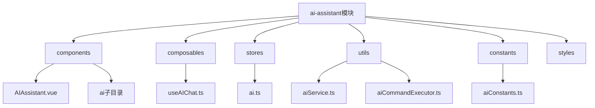
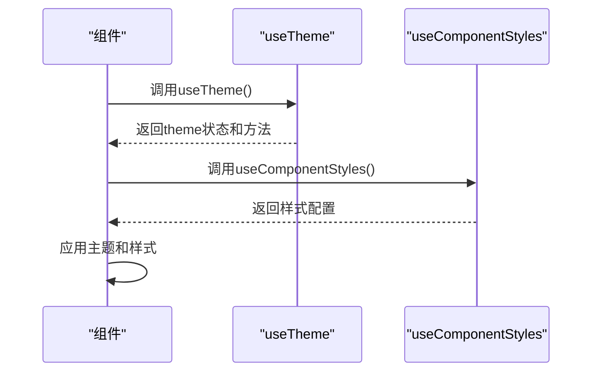

# 模块开发模式

<cite>
**本文档引用文件**  
- [index.ts](file://src/modules/ai-assistant/index.ts)
- [AIAssistant.vue](file://src/modules/ai-assistant/components/AIAssistant.vue)
- [useAIChat.ts](file://src/modules/ai-assistant/composables/useAIChat.ts)
- [ai.ts](file://src/modules/ai-assistant/stores/ai.ts)
- [aiService.ts](file://src/modules/ai-assistant/utils/aiService.ts)
- [useTheme.ts](file://src/hooks/useTheme.ts)
- [useComponentStyles.ts](file://src/hooks/useComponentStyles.ts)
- [aiConstants.ts](file://src/modules/ai-assistant/constants/aiConstants.ts)
</cite>

## 目录

1. [模块目录结构](#模块目录结构)
2. [组合式函数定义](#组合式函数定义)
3. [状态存储管理](#状态存储管理)
4. [UI组件组织](#ui组件组织)
5. [自定义Hook复用机制](#自定义hook复用机制)
6. [模块间依赖管理](#模块间依赖管理)

## 模块目录结构

AI助手模块采用功能驱动的目录组织方式，核心子目录包括components、composables、stores、utils等，遵循高内聚低耦合原则。

**目录来源**  
- [index.ts](file://src/modules/ai-assistant/index.ts)
- 项目结构信息

## 组合式函数定义

组合式函数`useAIChat.ts`封装了AI聊天的核心业务逻辑，通过Vue 3的Composition API实现功能解耦。该函数接收props和emit参数，返回包含消息管理、发送处理、事件监听等完整状态和方法的对象。

组合式函数采用单一职责原则，专注于AI交互流程控制，包括消息发送、响应处理、命令执行等核心功能。通过`onEvent`和`offEvent`实现事件系统集成，确保组件间通信的松耦合。

**代码来源**  
- [useAIChat.ts](file://src/modules/ai-assistant/composables/useAIChat.ts#L1-L619)

## 状态存储管理

使用Pinia创建`ai.ts`状态存储，集中管理AI助手的全局状态。存储包含工具调用状态、配置状态、终端输入状态等核心数据，并提供相应的操作方法。

状态存储设计遵循以下原则：
- 单一状态树：所有AI相关状态集中管理
- 状态不可变性：通过action方法修改状态
- 计算属性优化：使用computed属性派生复杂状态
- 模块化设计：每个功能模块拥有独立store

存储暴露`startToolCall`、`completeToolCall`、`errorToolCall`等方法，实现工具调用的全生命周期管理。

**代码来源**  
- [ai.ts](file://src/modules/ai-assistant/stores/ai.js#L1-L273)

## UI组件组织

`AIAssistant.vue`作为主UI组件，采用现代化的界面设计，包含顶部栏、聊天区域、输入区域等主要部分。组件通过setup函数使用组合式API，注入`useAIChat`提供的状态和方法。

组件设计特点：
- 响应式布局：适配不同屏幕尺寸
- 动画效果：消息发送、加载指示器等过渡动画
- 可访问性：键盘导航支持
- 错误处理：完善的异常捕获和用户提示

组件通过provide/inject模式向子组件传递上下文，确保数据流的清晰性和可维护性。

**代码来源**  
- [AIAssistant.vue](file://src/modules/ai-assistant/components/AIAssistant.vue#L1-L696)

## 自定义Hook复用机制

自定义Hook如`useTheme.ts`和`useComponentStyles.ts`提供跨模块的UI功能复用。`useTheme`管理主题切换，通过CSS变量实现动态主题；`useComponentStyles`基于CSS变量生成组件样式。

调用规范：
1. 在组件setup函数中导入Hook
2. 调用Hook获取所需状态和方法
3. 将返回值绑定到模板或逻辑中

**代码来源**  
- [useTheme.ts](file://src/hooks/useTheme.ts#L1-L48)
- [useComponentStyles.ts](file://src/hooks/useComponentStyles.ts#L1-L382)

## 模块间依赖管理

模块通过`index.ts`文件进行统一导出，实现清晰的依赖接口。依赖管理最佳实践包括：

1. **显式依赖声明**：在index.ts中明确导出所需组件、函数和状态
2. **避免循环依赖**：通过依赖注入和事件系统解耦模块
3. **版本兼容性**：保持API接口的向后兼容
4. **按需加载**：支持tree-shaking优化

模块间通信采用事件驱动架构，通过全局事件系统解耦组件依赖，确保模块的独立性和可测试性。

**代码来源**  
- [index.ts](file://src/modules/ai-assistant/index.ts#L1-L27)
- [aiService.ts](file://src/modules/ai-assistant/utils/aiService.ts#L1-L721)
- [aiConstants.ts](file://src/modules/ai-assistant/constants/aiConstants.ts#L1-L245)