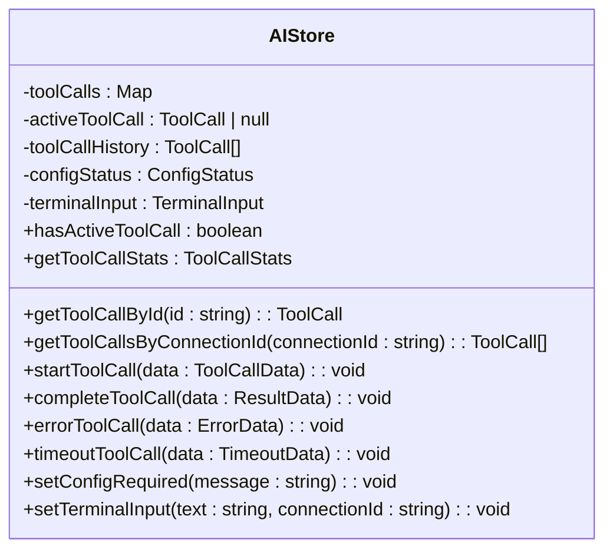
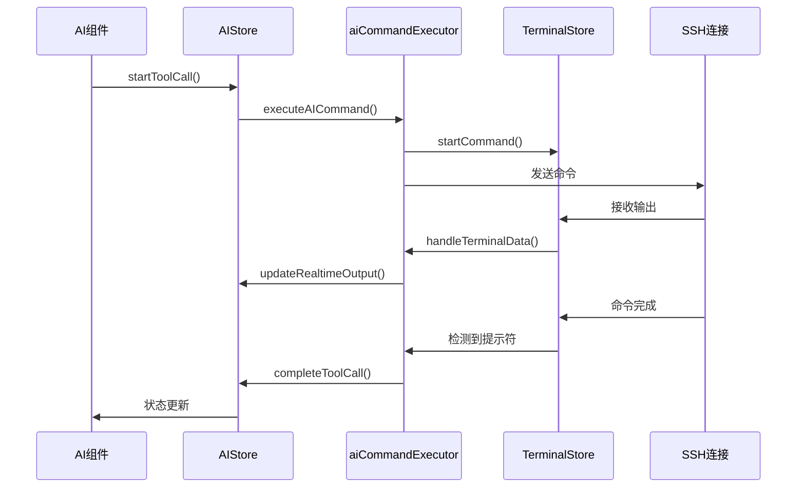

# 状态管理

<cite>
**本文档引用的文件**
- [ai.ts](file://src/modules/ai-assistant/stores/ai.ts)
- [terminal.js](file://src/modules/terminal/stores/terminal.js)
- [index.ts](file://src/stores/index.ts)
- [AIAssistant.vue](file://src/modules/ai-assistant/components/AIAssistant.vue)
- [XTerminal.vue](file://src/modules/terminal/components/XTerminal.vue)
- [aiCommandExecutor.ts](file://src/modules/ai-assistant/utils/aiCommandExecutor.ts)
- [simpleCommandExecutor.ts](file://src/modules/terminal/utils/simpleCommandExecutor.ts)
- [ai.ts](file://src/types/ai.ts)
</cite>

## 目录
1. [AIStore状态定义与组织](#aistore状态定义与组织)
2. [模块化Store设计与统一管理](#模块化store设计与统一管理)
3. [状态分片策略与模块对比](#状态分片策略与模块对比)
4. [类型安全的Store定义](#类型安全的store定义)
5. [异步操作处理](#异步操作处理)
6. [状态持久化与调试技巧](#状态持久化与调试技巧)

## AIStore状态定义与组织

AI助手模块的Pinia状态管理通过`src/modules/ai-assistant/stores/ai.ts`文件中的`useAIStore`定义，采用组合式API风格组织state、actions和getters。

AIStore的核心状态(state)使用`ref`进行响应式声明，主要包括：
- `toolCalls`: 使用`Map<string, ToolCall>`存储当前所有工具调用的状态
- `activeToolCall`: 记录当前正在执行的工具调用
- `toolCallHistory`: 存储已完成的工具调用历史记录
- `configStatus`: 管理AI服务的配置状态
- `terminalInput`: 控制终端输入框的显示状态和内容

计算属性(getters)使用`computed`定义，提供对状态的派生访问：
- `hasActiveToolCall`: 判断是否存在活跃的工具调用
- `getToolCallById`: 通过ID获取特定工具调用
- `getToolCallsByConnectionId`: 获取特定连接的所有工具调用
- `getToolCallStats`: 计算工具调用的统计信息，包括成功率、平均执行时间等

Actions方法提供了完整的状态变更接口，分为工具调用、配置管理和终端输入三类：
- 工具调用相关：`startToolCall`, `completeToolCall`, `errorToolCall`, `timeoutToolCall`
- 配置相关：`setConfigRequired`, `setConfigured`
- 终端输入相关：`setTerminalInput`, `showTerminalInput`, `hideTerminalInput`

AIStore通过`return`语句将所有状态、计算属性和actions暴露给组件使用，实现了清晰的API边界。

**Section sources**
- [ai.ts](file://src/modules/ai-assistant/stores/ai.ts#L18-L271)

## 模块化Store设计与统一管理

项目采用模块化的Pinia store设计，每个功能模块拥有独立的状态管理文件。终端模块和AI助手模块分别在`src/modules/terminal/stores/terminal.js`和`src/modules/ai-assistant/stores/ai.ts`中定义各自的store。

模块化设计的优势在于：
- **关注点分离**: 每个模块只管理自身相关的状态，避免状态耦合
- **可维护性**: 状态逻辑集中在模块内部，便于修改和测试
- **可复用性**: 模块store可以在不同组件间共享使用

所有模块store通过`src/stores/index.ts`文件统一注册和管理，该文件作为store的入口点，采用以下方式导出：
- 命名导出：`export { useAIStore }`和`export { useTerminalStore }`
- 默认导出：将所有store组合成一个对象进行导出

这种统一管理方式使得组件可以方便地从单一入口导入所需的状态管理器，而无需关心store的具体实现路径。同时，它也为未来的store扩展提供了清晰的结构。

**Section sources**
- [index.ts](file://src/stores/index.ts#L1-L16)
- [terminal.js](file://src/modules/terminal/stores/terminal.js#L8-L215)
- [ai.ts](file://src/modules/ai-assistant/stores/ai.ts#L18-L271)

## 状态分片策略与模块对比

项目采用状态分片策略，将不同功能领域的状态分离到独立的store模块中。AI助手模块和终端模块的状态结构体现了不同的设计原则。

AI助手模块(`ai.ts`)的状态结构侧重于**任务执行和状态跟踪**：
- 以`toolCalls`为核心，管理AI生成命令的执行生命周期
- 包含配置状态`configStatus`，确保AI功能的可用性检查
- 提供`terminalInput`状态，实现与终端的交互控制
- 强调工具调用的统计和重试机制

**Diagram sources**
- [ai.ts](file://src/modules/ai-assistant/stores/ai.ts#L18-L271)

终端模块(`terminal.js`)的状态结构侧重于**连接管理和命令执行**：
- 以`connections`为核心，管理多个SSH连接的状态
- 使用`activeCommands`和`commandHistory`跟踪命令执行
- 通过`terminals`存储终端实例的引用
- 提供详细的连接统计信息

两种状态结构的差异反映了各自模块的职责：AI助手关注于智能命令的生成和执行流程管理，而终端关注于底层连接和命令执行的细节控制。这种分片策略确保了状态管理的清晰边界和高内聚性。

**Section sources**
- [ai.ts](file://src/modules/ai-assistant/stores/ai.ts#L18-L271)
- [terminal.js](file://src/modules/terminal/stores/terminal.js#L8-L215)

## 类型安全的Store定义

项目通过TypeScript实现了类型安全的Pinia store定义。在`ai.ts`中，首先在`src/types/ai.ts`中定义了所有相关的接口类型，然后在store中导入和使用这些类型。

关键类型定义包括：
- `ToolCall`: 定义工具调用的基本结构，包含ID、命令、状态等属性
- `ConfigStatus`: 定义配置状态，包含是否已配置和消息文本
- `TerminalInput`: 定义终端输入状态，包含文本内容、连接ID和可见性

在store定义中，这些类型被用于：
- 状态变量的类型注解：`const toolCalls = ref(new Map<string, ToolCall>())`
- actions参数的类型定义：`startToolCall(toolCallData: { id: string; command: string; connectionId: string })`
- 计算属性的返回类型：`getToolCallStats`返回`ToolCallStats`类型

类型安全的store定义带来了以下优势：
- 编辑器提供完整的类型推断和自动补全
- 编译时检查类型错误，避免运行时异常
- 代码可读性增强，接口契约清晰明确

**Section sources**
- [ai.ts](file://src/modules/ai-assistant/stores/ai.ts#L18-L271)
- [ai.ts](file://src/types/ai.ts#L119-L153)

## 异步操作处理

AIStore通过与外部服务的协作来处理异步操作。当需要执行命令时，组件调用store的`startToolCall`方法，然后通过`aiCommandExecutor.ts`与终端模块进行交互。

异步操作的完整流程如下：
1. AI助手组件调用`executeAICommand`发起命令执行
2. `aiCommandExecutor`创建命令并更新AIStore状态
3. 命令通过SSH发送到远程服务器
4. 终端接收到输出数据，触发`TERMINAL_OUTPUT`事件
5. `aiCommandExecutor`监听到输出，更新AIStore的实时输出
6. 当检测到命令提示符时，认为命令执行完成
7. 更新AIStore状态为完成或错误状态

**Diagram sources**
- [ai.ts](file://src/modules/ai-assistant/stores/ai.ts#L18-L271)
- [aiCommandExecutor.ts](file://src/modules/ai-assistant/utils/aiCommandExecutor.ts#L4-L126)
- [simpleCommandExecutor.ts](file://src/modules/terminal/utils/simpleCommandExecutor.ts#L4-L476)

这种设计将异步操作的状态管理集中在store中，组件只需关注状态变化而无需处理复杂的异步逻辑。

**Section sources**
- [ai.ts](file://src/modules/ai-assistant/stores/ai.ts#L18-L271)
- [aiCommandExecutor.ts](file://src/modules/ai-assistant/utils/aiCommandExecutor.ts#L4-L126)
- [simpleCommandExecutor.ts](file://src/modules/terminal/utils/simpleCommandExecutor.ts#L4-L476)

## 状态持久化与调试技巧

本项目中的状态管理设计考虑了调试的便利性。AIStore在状态变更时通过`console.log`输出详细的调试信息，便于追踪状态变化。

调试技巧包括：
- **状态快照**: 通过store的getter方法可以获取当前状态的完整快照
- **事件监听**: 使用事件系统监听关键状态变化，如命令开始、完成和错误
- **统计信息**: `getToolCallStats`提供执行成功率、平均时间等关键指标
- **历史记录**: `toolCallHistory`保存所有执行过的命令，便于问题复现

虽然当前实现中没有显式的状态持久化机制，但可以通过以下方式实现：
- 使用Pinia插件将关键状态保存到localStorage
- 对于工具调用历史，可以定期保存到IndexedDB
- 配置状态可以与用户设置同步存储

状态管理的调试可以通过Vue DevTools进行，它提供了store状态的实时查看和时间旅行调试功能。结合代码中的详细日志输出，可以快速定位状态管理相关的问题。

**Section sources**
- [ai.ts](file://src/modules/ai-assistant/stores/ai.ts#L18-L271)
- [aiCommandExecutor.ts](file://src/modules/ai-assistant/utils/aiCommandExecutor.ts#L4-L126)
- [simpleCommandExecutor.ts](file://src/modules/terminal/utils/simpleCommandExecutor.ts#L4-L476)