# 组合式函数开发

<cite>
**Referenced Files in This Document**   
- [useAIChat.ts](file://src/modules/ai-assistant/composables/useAIChat.ts)
- [useConnectionManager.ts](file://src/composables/useConnectionManager.ts)
- [useTerminalManager.ts](file://src/modules/terminal/composables/useTerminalManager.ts)
- [ai.ts](file://src/modules/ai-assistant/stores/ai.ts)
- [index.ts](file://src/types/index.ts)
- [events.ts](file://src/types/events.ts)
</cite>

## 目录
1. [引言](#引言)
2. [useAIChat组合式函数详解](#useaichat组合式函数详解)
3. [响应式状态管理](#响应式状态管理)
4. [事件监听机制](#事件监听机制)
5. [生命周期处理](#生命周期处理)
6. [公共API暴露](#公共api暴露)
7. [错误处理与资源清理](#错误处理与资源清理)
8. [组件ID生成](#组件id生成)
9. [不同类型组合式函数设计差异](#不同类型组合式函数设计差异)
10. [组合式函数调用与集成](#组合式函数调用与集成)
11. [最佳实践总结](#最佳实践总结)

## 引言

组合式函数（Composable Functions）是Vue 3组合式API的核心概念，它提供了一种优雅的方式来封装和重用有状态逻辑。本文档以`useAIChat.ts`为例，深入解析如何基于Vue 3组合式API设计和实现业务逻辑封装。我们将详细探讨参数定义、响应式状态管理、事件监听机制、生命周期处理等关键方面，并通过与`useConnectionManager`和`useTerminalManager`的对比，展示不同类型组合式函数的设计差异。

## useAIChat组合式函数详解

`useAIChat`组合式函数是AI助手模块的核心，负责管理AI聊天界面的所有业务逻辑。该函数接收`props`和`emit`作为参数，遵循Vue组件的通信模式，实现了完整的输入输出控制。

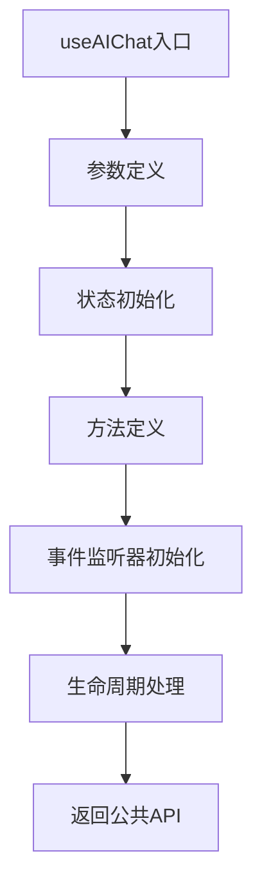

**Section sources**
- [useAIChat.ts](file://src/modules/ai-assistant/composables/useAIChat.ts#L24-L615)

## 响应式状态管理

`useAIChat`函数使用Vue 3的响应式API来管理各种状态，确保UI能够自动更新。

### 状态定义

函数使用`ref`创建了多个响应式变量来跟踪聊天状态：

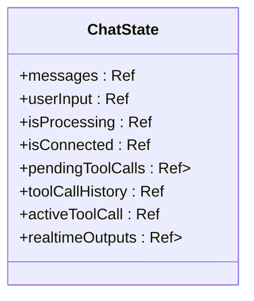

**Diagram sources**
- [useAIChat.ts](file://src/modules/ai-assistant/composables/useAIChat.ts#L26-L56)

### 消息管理

`addMessage`方法负责添加新消息到聊天记录中，同时包含防重复机制：

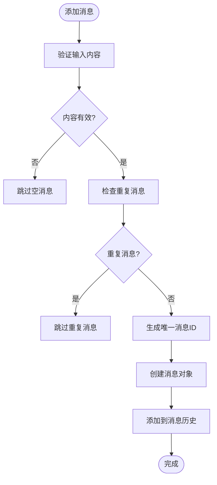

**Diagram sources**
- [useAIChat.ts](file://src/modules/ai-assistant/composables/useAIChat.ts#L188-L219)

**Section sources**
- [useAIChat.ts](file://src/modules/ai-assistant/composables/useAIChat.ts#L188-L219)

## 事件监听机制

`useAIChat`通过`onEvent`函数实现事件驱动的架构，监听来自系统其他部分的事件。

### 事件监听器初始化

`initializeEventListeners`方法注册了多个事件监听器：

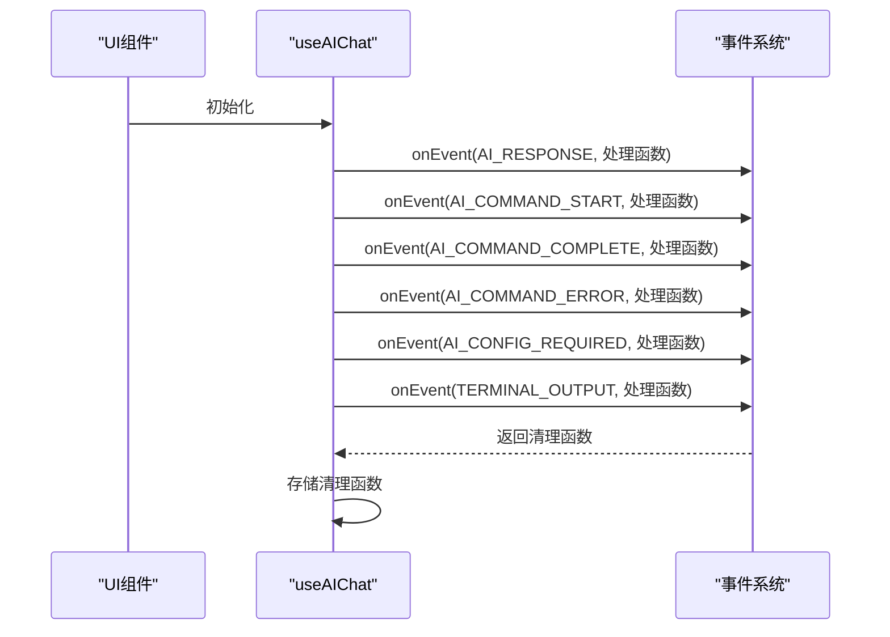

**Diagram sources**
- [useAIChat.ts](file://src/modules/ai-assistant/composables/useAIChat.ts#L100-L177)

### 事件处理流程

当收到命令开始事件时，`handleCommandStart`方法会更新工具调用历史：

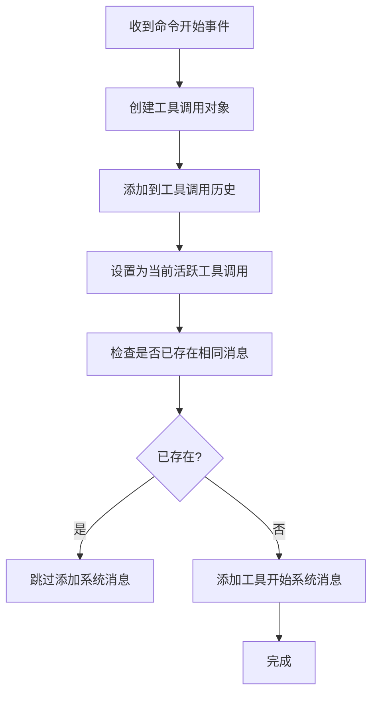

**Diagram sources**
- [useAIChat.ts](file://src/modules/ai-assistant/composables/useAIChat.ts#L363-L416)

**Section sources**
- [useAIChat.ts](file://src/modules/ai-assistant/composables/useAIChat.ts#L363-L416)

## 生命周期处理

`useAIChat`通过`onUnmounted`钩子确保组件销毁时正确清理资源。

### 资源清理

`cleanupEventListeners`方法负责清理所有注册的事件监听器：

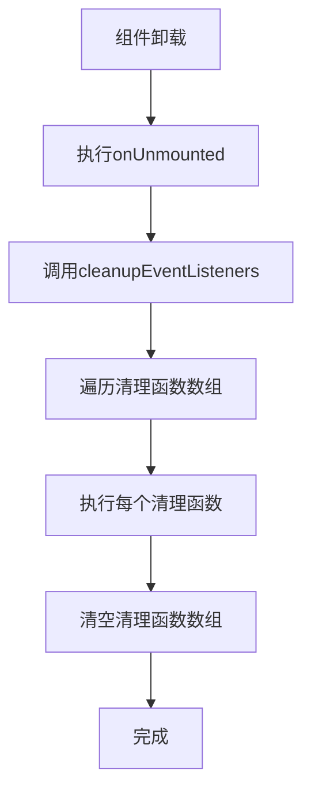

**Diagram sources**
- [useAIChat.ts](file://src/modules/ai-assistant/composables/useAIChat.ts#L578-L588)

**Section sources**
- [useAIChat.ts](file://src/modules/ai-assistant/composables/useAIChat.ts#L578-L588)

## 公共API暴露

`useAIChat`函数通过返回对象的方式暴露公共API，使调用者可以访问状态和方法。

### 返回值结构

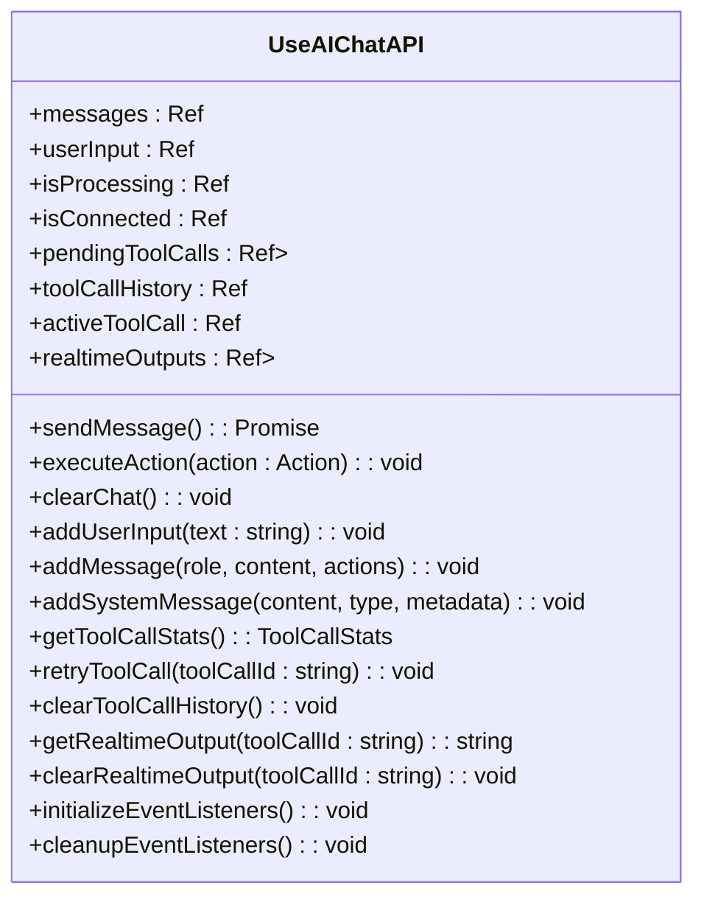

**Diagram sources**
- [useAIChat.ts](file://src/modules/ai-assistant/composables/useAIChat.ts#L590-L613)

**Section sources**
- [useAIChat.ts](file://src/modules/ai-assistant/composables/useAIChat.ts#L590-L613)

## 错误处理与资源清理

`useAIChat`在`sendMessage`方法中实现了完善的错误处理机制。

### 错误处理流程

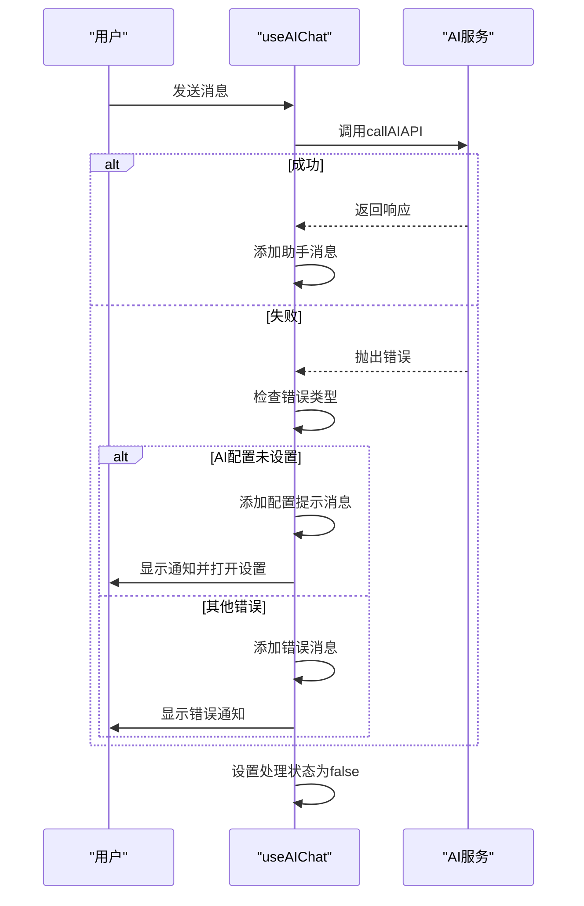

**Diagram sources**
- [useAIChat.ts](file://src/modules/ai-assistant/composables/useAIChat.ts#L221-L267)

**Section sources**
- [useAIChat.ts](file://src/modules/ai-assistant/composables/useAIChat.ts#L221-L267)

## 组件ID生成

`useAIChat`使用`generateMessageId`函数生成唯一的消息ID，确保每条消息都有唯一的标识。

### ID生成算法

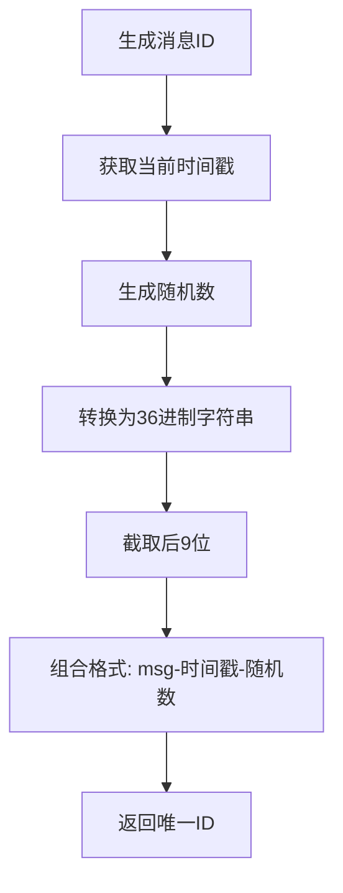

**Diagram sources**
- [useAIChat.ts](file://src/modules/ai-assistant/composables/useAIChat.ts#L74-L81)

**Section sources**
- [useAIChat.ts](file://src/modules/ai-assistant/composables/useAIChat.ts#L74-L81)

## 不同类型组合式函数设计差异

通过对比`useAIChat`、`useConnectionManager`和`useTerminalManager`，我们可以看到不同类型组合式函数的设计差异。

### 功能定位对比

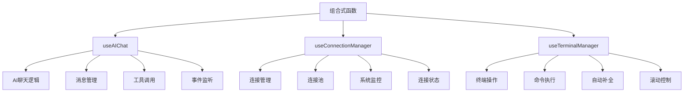

**Diagram sources**
- [useAIChat.ts](file://src/modules/ai-assistant/composables/useAIChat.ts)
- [useConnectionManager.ts](file://src/composables/useConnectionManager.ts)
- [useTerminalManager.ts](file://src/modules/terminal/composables/useTerminalManager.ts)

### 状态管理差异

| 特性 | useAIChat | useConnectionManager | useTerminalManager |
|------|---------|-------------------|------------------|
| **状态类型** | 消息、工具调用、实时输出 | 连接、计时器、系统信息 | 终端输出、自动补全 |
| **响应式API** | ref, reactive | ref, reactive | ref |
| **数据结构** | Map, Array | Map, Array | Array |
| **复杂度** | 高 | 中 | 低 |

**Diagram sources**
- [useAIChat.ts](file://src/modules/ai-assistant/composables/useAIChat.ts)
- [useConnectionManager.ts](file://src/composables/useConnectionManager.ts)
- [useTerminalManager.ts](file://src/modules/terminal/composables/useTerminalManager.ts)

### 事件处理差异

`useAIChat`使用事件系统进行跨组件通信，而`useTerminalManager`直接与父组件通信。

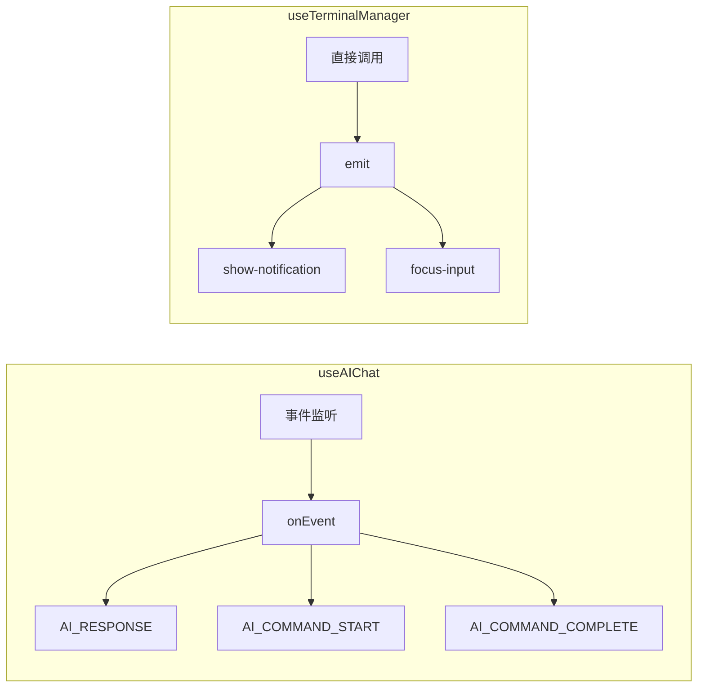

**Diagram sources**
- [useAIChat.ts](file://src/modules/ai-assistant/composables/useAIChat.ts)
- [useTerminalManager.ts](file://src/modules/terminal/composables/useTerminalManager.ts)

## 组合式函数调用与集成

### useAIChat调用示例

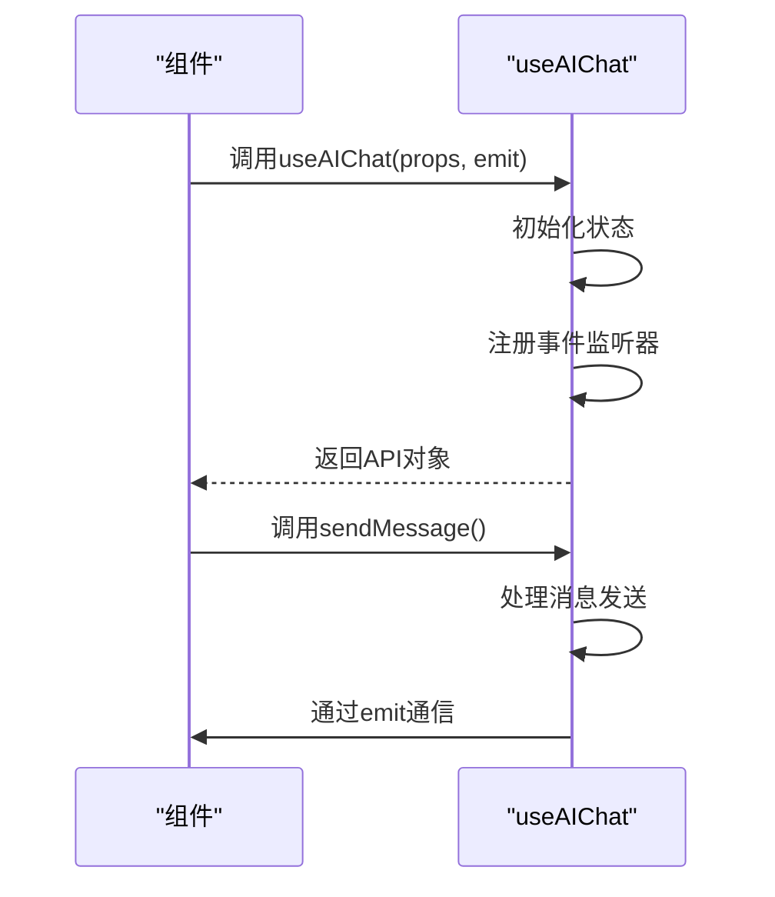

**Section sources**
- [useAIChat.ts](file://src/modules/ai-assistant/composables/useAIChat.ts)

### 集成最佳实践

1. **正确传递props和emit**：确保将组件的props和emit正确传递给组合式函数
2. **及时清理资源**：依赖Vue的生命周期钩子自动清理事件监听器
3. **合理暴露API**：只暴露必要的状态和方法，保持接口简洁
4. **错误边界处理**：在调用组合式函数的方法时添加适当的错误处理

## 最佳实践总结

1. **参数定义**：使用TypeScript接口明确定义`props`和`emit`的结构
2. **响应式管理**：根据数据特性选择合适的响应式API（ref或reactive）
3. **事件系统**：使用统一的事件系统进行跨组件通信，避免直接依赖
4. **生命周期**：在`onUnmounted`中清理所有资源，防止内存泄漏
5. **错误处理**：在异步操作中使用try-catch，并提供用户友好的错误信息
6. **资源清理**：存储所有需要清理的资源引用，确保可以完全清理
7. **ID生成**：使用时间戳和随机数组合生成唯一ID，避免冲突
8. **代码复用**：将通用逻辑抽象为独立的组合式函数，提高代码可维护性

通过遵循这些最佳实践，可以创建高效、可维护且易于集成的组合式函数，充分发挥Vue 3组合式API的优势。