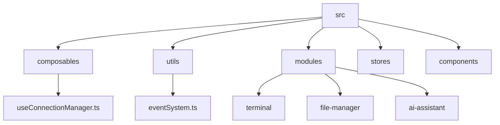
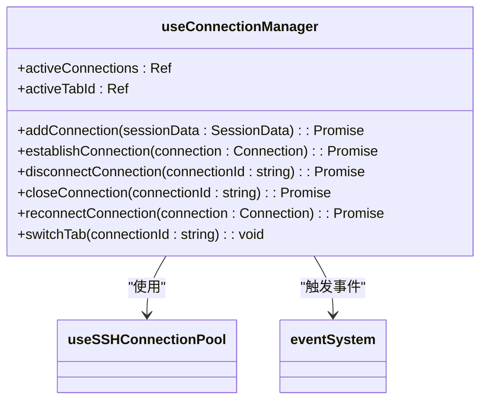
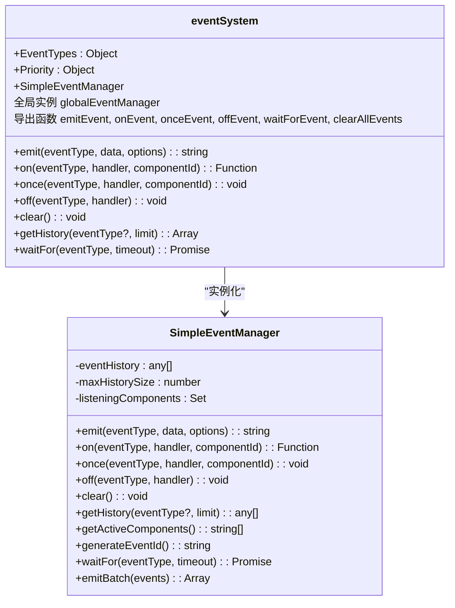
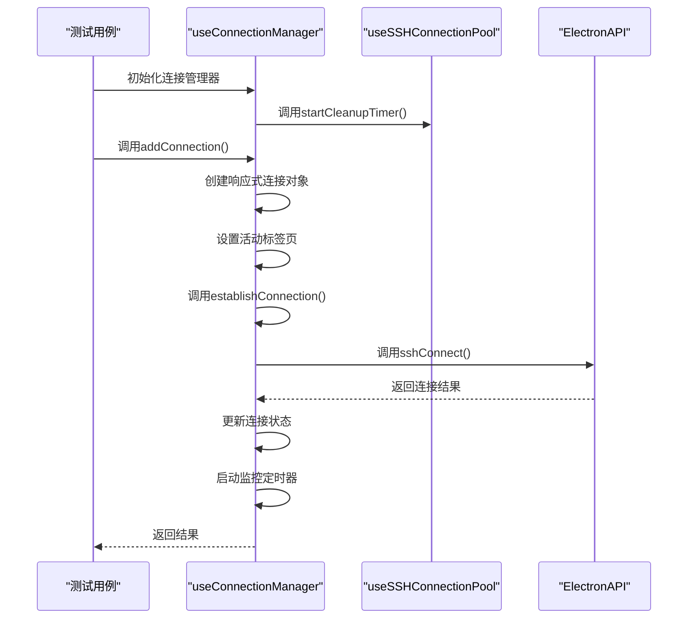
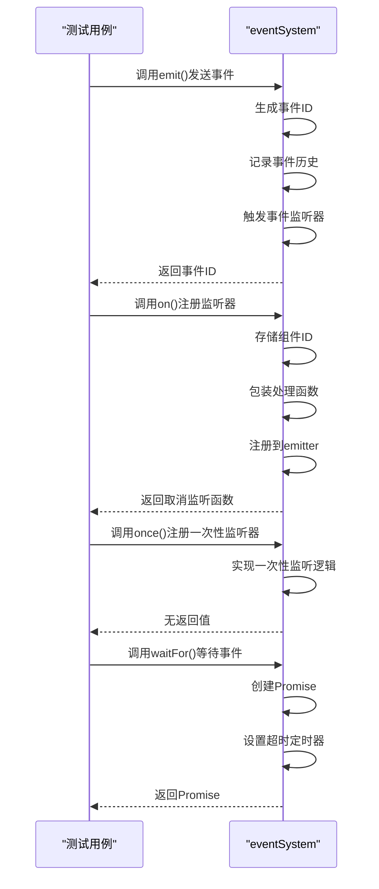
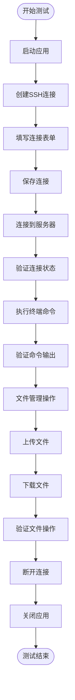
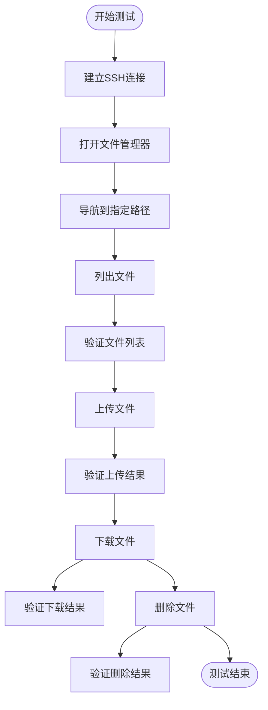
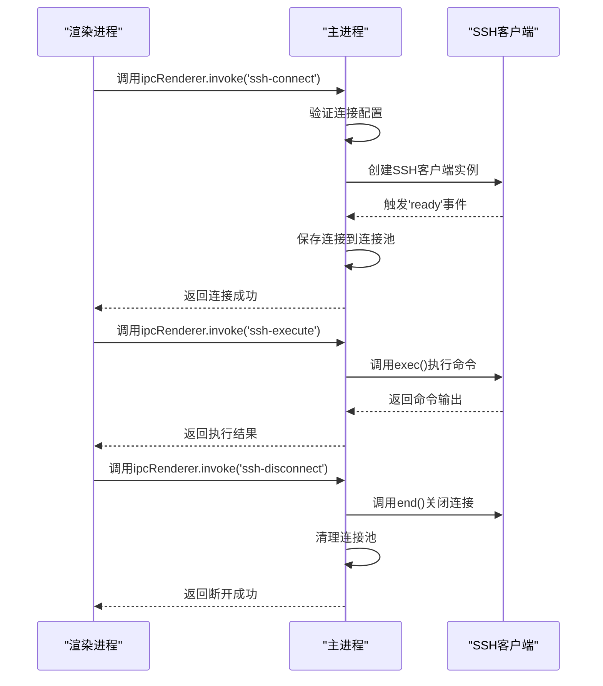
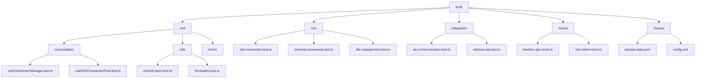
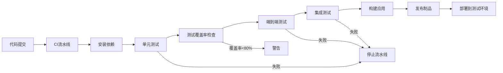

# 测试策略

<cite>
**本文档引用的文件**   
- [main.ts](file://main.ts)
- [preload.ts](file://preload.ts)
- [vite.config.ts](file://vite.config.ts)
- [useConnectionManager.ts](file://src/composables/useConnectionManager.ts)
- [eventSystem.ts](file://src/utils/eventSystem.ts)
</cite>

## 目录
1. [项目结构](#项目结构)
2. [核心组件分析](#核心组件分析)
3. [单元测试方案](#单元测试方案)
4. [端到端测试策略](#端到端测试策略)
5. [集成测试建议](#集成测试建议)
6. [测试目录结构](#测试目录结构)
7. [CI集成方案](#ci集成方案)

## 项目结构



**图示来源**
- [useConnectionManager.ts](file://src/composables/useConnectionManager.ts)
- [eventSystem.ts](file://src/utils/eventSystem.ts)

**本节来源**
- [main.ts](file://main.ts)
- [preload.ts](file://preload.ts)
- [vite.config.ts](file://vite.config.ts)

## 核心组件分析

### 连接管理器分析



**图示来源**
- [useConnectionManager.ts](file://src/composables/useConnectionManager.ts#L10-L538)

**本节来源**
- [useConnectionManager.ts](file://src/composables/useConnectionManager.ts#L10-L538)

### 事件系统分析



**图示来源**
- [eventSystem.ts](file://src/utils/eventSystem.ts#L0-L287)

**本节来源**
- [eventSystem.ts](file://src/utils/eventSystem.ts#L0-L287)

## 单元测试方案

为确保代码质量和可维护性，建议采用Vitest作为单元测试框架，针对composables和utils中的纯逻辑函数进行测试。

### useConnectionManager测试



**图示来源**
- [useConnectionManager.ts](file://src/composables/useConnectionManager.ts#L10-L538)

### eventSystem测试



**图示来源**
- [eventSystem.ts](file://src/utils/eventSystem.ts#L0-L287)

**本节来源**
- [useConnectionManager.ts](file://src/composables/useConnectionManager.ts#L10-L538)
- [eventSystem.ts](file://src/utils/eventSystem.ts#L0-L287)

## 端到端测试策略

采用Playwright进行端到端测试，覆盖核心用户工作流。

### SSH连接工作流测试



### 文件管理操作测试



**本节来源**
- [main.ts](file://main.ts)
- [preload.ts](file://preload.ts)

## 集成测试建议

### IPC通信测试



**图示来源**
- [main.ts](file://main.ts)
- [preload.ts](file://preload.ts)

### Electron API模拟测试

建议使用vitest-electron-tester等工具来模拟Electron API进行隔离测试：

1. 模拟`window.electronAPI`对象
2. 为IPC调用创建模拟实现
3. 测试连接管理器在不同响应下的行为
4. 验证错误处理逻辑

```typescript
// 测试示例结构
describe('useConnectionManager', () => {
  beforeEach(() => {
    // 模拟Electron API
    window.electronAPI = {
      sshConnect: vi.fn(),
      sshExecute: vi.fn(),
      sshDisconnect: vi.fn()
    };
  });
  
  afterEach(() => {
    // 清理模拟
    vi.clearAllMocks();
  });
  
  test('成功建立SSH连接', async () => {
    // 设置模拟返回值
    window.electronAPI.sshConnect.mockResolvedValue({ success: true });
    
    // 执行测试
    await connectionManager.addConnection(testSessionData);
    
    // 验证状态
    expect(connection.status).toBe('connected');
    expect(window.electronAPI.sshConnect).toHaveBeenCalled();
  });
});
```

**本节来源**
- [main.ts](file://main.ts)
- [preload.ts](file://preload.ts)
- [useConnectionManager.ts](file://src/composables/useConnectionManager.ts#L10-L538)

## 测试目录结构

建议采用以下测试目录结构：



**本节来源**
- [main.ts](file://main.ts)
- [preload.ts](file://preload.ts)
- [useConnectionManager.ts](file://src/composables/useConnectionManager.ts#L10-L538)
- [eventSystem.ts](file://src/utils/eventSystem.ts#L0-L287)

## CI集成方案



CI流水线应包含以下步骤：

1. **依赖安装**：安装项目依赖和测试工具
2. **单元测试**：运行Vitest测试，确保核心逻辑正确
3. **测试覆盖率**：检查测试覆盖率，建议目标为80%以上
4. **端到端测试**：运行Playwright测试，验证用户工作流
5. **集成测试**：验证IPC通信和Electron API交互
6. **构建应用**：打包Electron应用
7. **发布制品**：将构建产物上传到存储库

**本节来源**
- [vite.config.ts](file://vite.config.ts)
- [package.json](file://package.json)