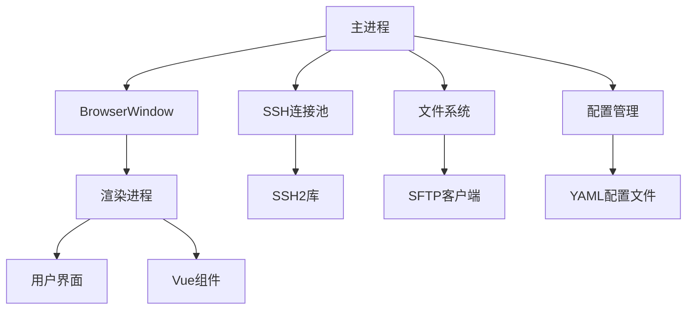
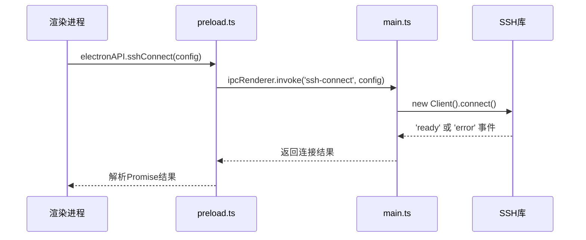
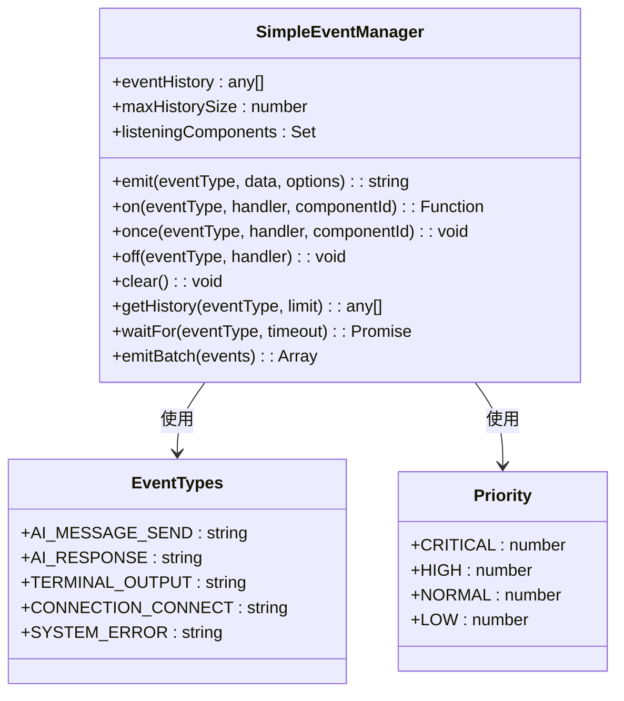
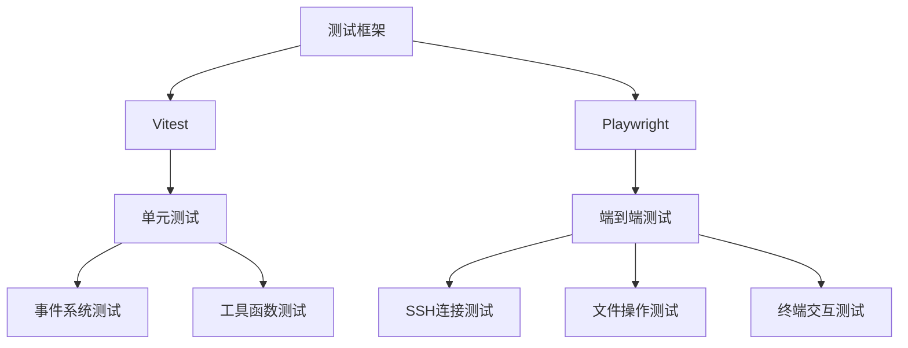

# 调试与测试

<cite>
**本文档引用的文件**  
- [main.ts](file://main.ts)
- [preload.ts](file://preload.ts)
- [eventSystem.ts](file://src/utils/eventSystem.ts)
- [config.ts](file://src/types/config.ts)
- [terminal.ts](file://src/types/terminal.ts)
- [events.ts](file://src/types/events.ts)
- [index.ts](file://src/types/index.ts)
</cite>

## 目录
1. [调试与测试](#调试与测试)
2. [主进程与渲染进程调试](#主进程与渲染进程调试)
3. [IPC通信调试](#ipc通信调试)
4. [事件系统调试](#事件系统调试)
5. [测试建议](#测试建议)

## 主进程与渲染进程调试

Electron应用的调试主要分为主进程和渲染进程两个部分。主进程负责管理应用生命周期、创建窗口和处理系统级操作，而渲染进程则负责用户界面的展示和交互。

在本项目中，`main.ts`文件是主进程的入口点，负责创建主窗口、管理SSH连接池、处理文件操作和配置管理。通过`createWindow`函数创建的`BrowserWindow`实例，设置了`preload.js`作为预加载脚本，实现了主进程与渲染进程之间的安全通信。

**图源**  
- [main.ts](file://main.ts#L1-L100)
- [preload.ts](file://preload.ts#L1-L20)

**本节来源**  
- [main.ts](file://main.ts#L1-L200)
- [preload.ts](file://preload.ts#L1-L81)

## IPC通信调试

IPC（进程间通信）是Electron应用中主进程与渲染进程通信的核心机制。本项目通过`ipcMain.handle`和`contextBridge.exposeInMainWorld`配置了完整的调试通道。

在`main.ts`中，定义了多个IPC处理器，如`ssh-connect`、`get-sessions`、`saveConfig`等，这些处理器通过Promise返回结果，便于异步调用。每个处理器都包含了详细的日志输出，使用`console.log`和`console.error`记录关键操作和错误信息，便于调试。

**图源**  
- [main.ts](file://main.ts#L200-L500)
- [preload.ts](file://preload.ts#L20-L50)

**本节来源**  
- [main.ts](file://main.ts#L200-L600)
- [preload.ts](file://preload.ts#L20-L81)

## 事件系统调试

基于`eventSystem.ts`的事件系统为应用提供了轻量级的事件通信机制。该系统使用`mitt`库实现，提供了事件的发送、监听、历史记录和优先级管理功能。

事件系统定义了多种事件类型，包括AI聊天相关、终端和SSH相关、连接管理以及系统事件。通过`emitEvent`函数发送事件，`onEvent`函数监听事件，`onceEvent`函数一次性监听事件。系统还提供了事件历史记录功能，便于调试时追溯事件流。

**图源**  
- [eventSystem.ts](file://src/utils/eventSystem.ts#L1-L288)
- [events.ts](file://src/types/events.ts#L1-L52)

**本节来源**  
- [eventSystem.ts](file://src/utils/eventSystem.ts#L1-L288)
- [events.ts](file://src/types/events.ts#L1-L52)

## 测试建议

虽然项目中未显示测试文件，但建议采用Vitest和Playwright进行单元测试和端到端测试。

对于单元测试，可以使用Vitest测试工具函数、事件系统和类型定义。例如，测试`eventSystem.ts`中的`emitEvent`和`onEvent`函数，验证事件的正确发送和接收。

对于端到端测试，可以使用Playwright模拟用户操作，测试SSH连接、文件上传下载、终端交互等核心功能。通过模拟真实的用户场景，确保应用的稳定性和可靠性。

**图源**  
- [eventSystem.ts](file://src/utils/eventSystem.ts#L1-L288)
- [main.ts](file://main.ts#L1-L200)

**本节来源**  
- [eventSystem.ts](file://src/utils/eventSystem.ts#L1-L288)
- [main.ts](file://main.ts#L1-L200)