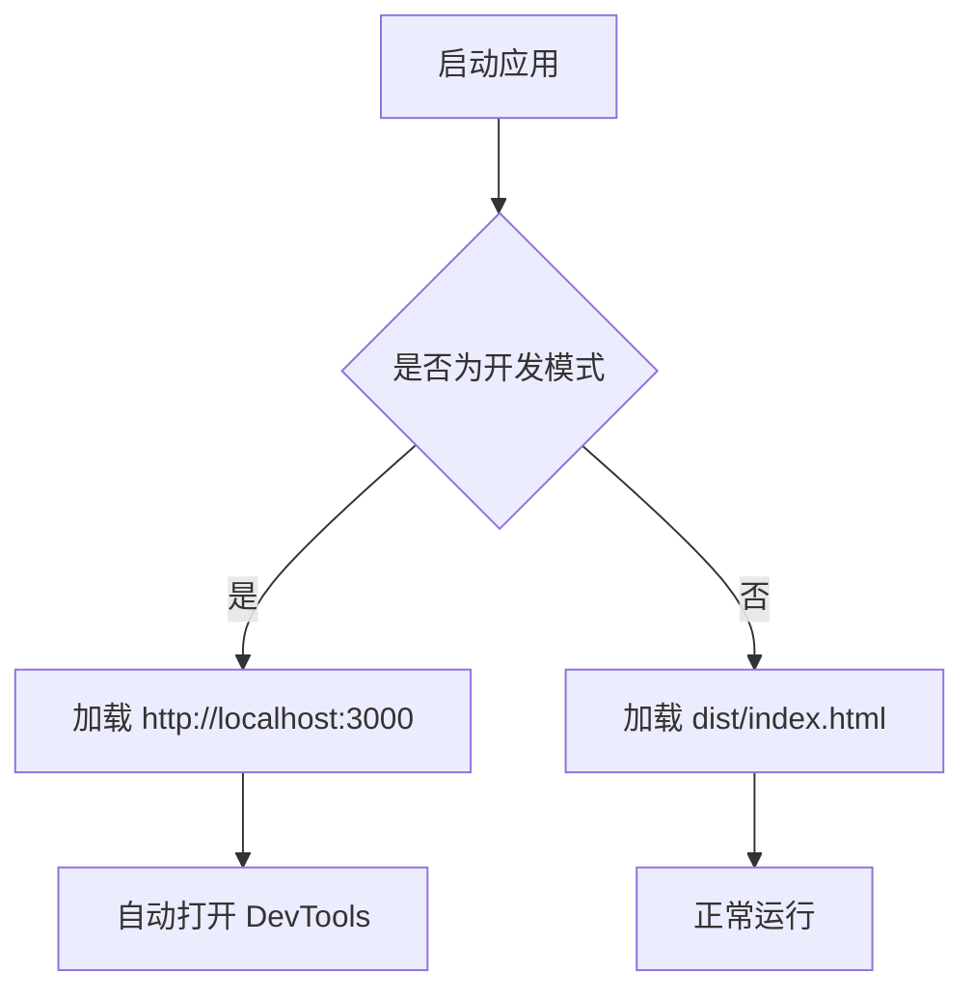
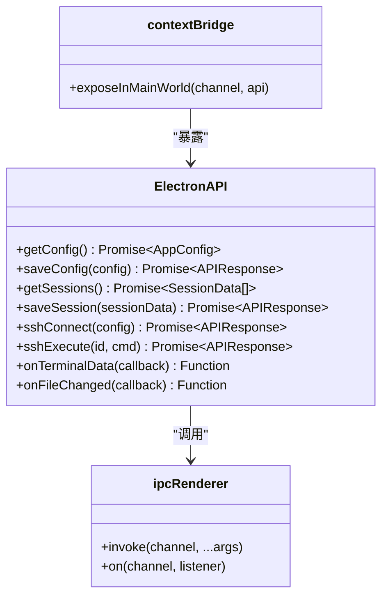
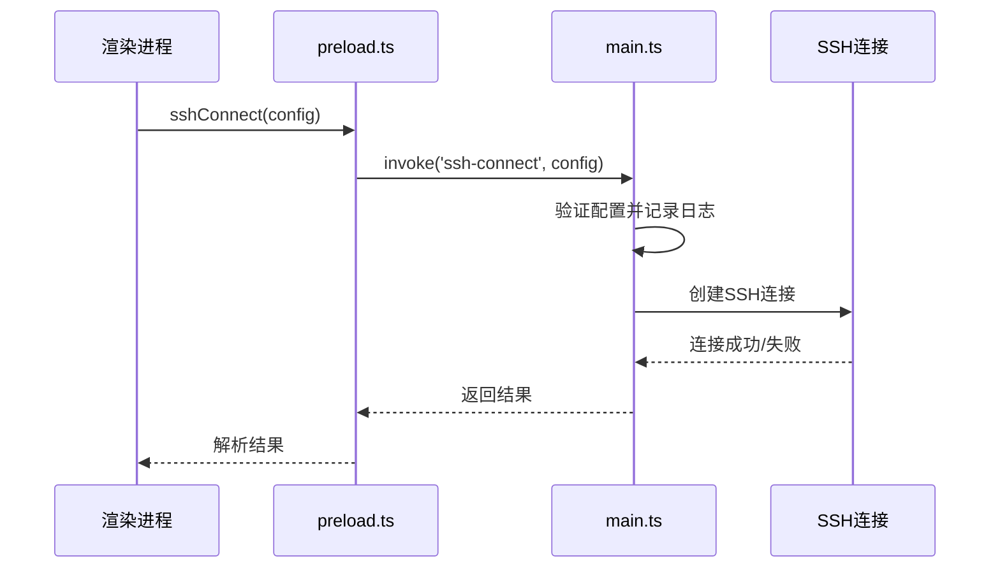
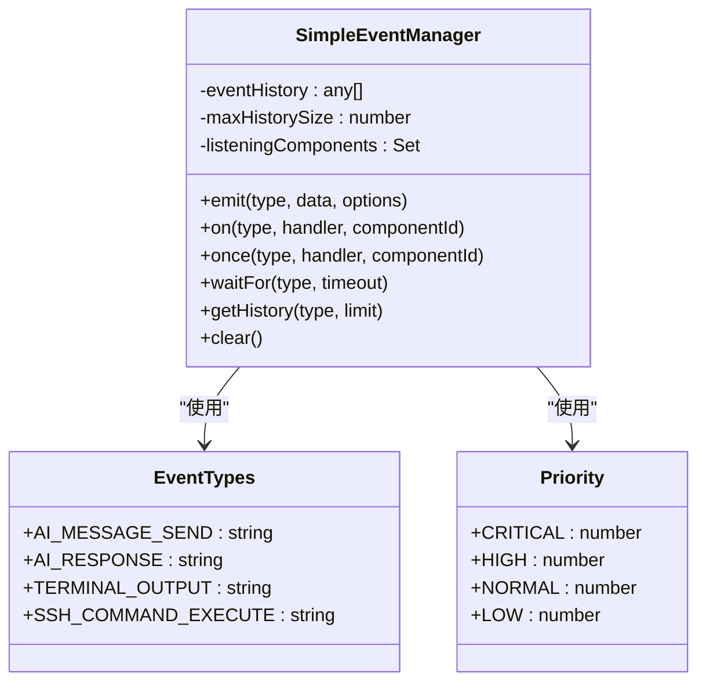

# 调试指南

<cite>
**本文档中引用的文件**  
- [main.ts](file://main.ts)
- [preload.ts](file://preload.ts)
- [eventSystem.ts](file://src/utils/eventSystem.ts)
- [config.ts](file://src/types/config.ts)
- [index.ts](file://src/types/index.ts)
- [terminal.ts](file://src/types/terminal.ts)
- [vite.config.ts](file://vite.config.ts)
- [tsconfig.main.json](file://tsconfig.main.json)
- [package.json](file://package.json)
</cite>

## 目录
1. [主进程调试](#主进程调试)
2. [预加载脚本调试](#预加载脚本调试)
3. [渲染进程调试](#渲染进程调试)
4. [IPC通信调试](#ipc通信调试)
5. [事件系统调试](#事件系统调试)
6. [常见问题排查](#常见问题排查)
7. [VS Code调试配置](#vs-code调试配置)

## 主进程调试

主进程的调试主要通过 `main.ts` 文件进行配置。在开发模式下，应用会自动加载 Vite 开发服务器并打开开发者工具。



**Diagram sources**  
- [main.ts](file://main.ts#L19-L52)

**Section sources**  
- [main.ts](file://main.ts#L1-L996)

## 预加载脚本调试

`preload.ts` 文件通过 `contextBridge.exposeInMainWorld` 安全地暴露 Electron API 给渲染进程。所有 IPC 调用都通过 `ipcRenderer.invoke` 进行。



**Diagram sources**  
- [preload.ts](file://preload.ts#L1-L81)

**Section sources**  
- [preload.ts](file://preload.ts#L1-L81)
- [index.ts](file://src/types/index.ts#L1-L105)

## 渲染进程调试

渲染进程使用 Vue 3 框架，可通过 Chrome DevTools 调试 Vue 组件和状态。Vite 配置在开发模式下自动启用热重载。


**Diagram sources**  
- [vite.config.ts](file://vite.config.ts#L1-L41)
- [main.ts](file://main.ts#L19-L52)

**Section sources**  
- [vite.config.ts](file://vite.config.ts#L1-L41)
- [App.vue](file://src/App.vue)

## IPC通信调试

IPC（进程间通信）是 Electron 应用的核心机制。主进程通过 `ipcMain.handle` 注册处理器，渲染进程通过 `ipcRenderer.invoke` 调用。



**Diagram sources**  
- [main.ts](file://main.ts#L100-L300)
- [preload.ts](file://preload.ts#L20-L30)

**Section sources**  
- [main.ts](file://main.ts#L100-L996)
- [preload.ts](file://preload.ts#L1-L81)

## 事件系统调试

`eventSystem.ts` 实现了基于 mitt 的轻量级事件系统，用于组件间的解耦通信。系统支持事件历史记录和优先级处理。



**Diagram sources**  
- [eventSystem.ts](file://src/utils/eventSystem.ts#L1-L288)

**Section sources**  
- [eventSystem.ts](file://src/utils/eventSystem.ts#L1-L288)
- [index.ts](file://src/types/index.ts#L70-L73)

## 常见问题排查

### IPC消息未响应
- 检查通道名称是否匹配
- 确认主进程已正确注册处理器
- 验证参数类型是否符合 TypeScript 定义

### 渲染进程白屏
- 检查 `main.ts` 中的 `loadURL` 或 `loadFile` 路径
- 确认 Vite 开发服务器是否正常运行
- 查看控制台是否有 JavaScript 错误

### 预加载脚本报错
- 检查 `contextBridge` 暴露的 API 是否有循环引用
- 确认类型定义文件是否正确导入
- 验证 `webPreferences` 中的 `preload` 路径

**Section sources**  
- [main.ts](file://main.ts#L19-L52)
- [preload.ts](file://preload.ts#L1-L81)
- [tsconfig.main.json](file://tsconfig.main.json#L1-L27)

## VS Code调试配置

推荐使用以下 VS Code 配置进行源码级调试：

```json
{
  "version": "0.2.0",
  "configurations": [
    {
      "name": "Debug Main Process",
      "type": "node",
      "request": "launch",
      "cwd": "${workspaceFolder}",
      "runtimeExecutable": "${workspaceFolder}/node_modules/.bin/electron",
      "runtimeArgs": [
        ".",
        "--remote-debugging-port=9222",
        "--dev"
      ],
      "windows": {
        "runtimeExecutable": "${workspaceFolder}/node_modules/.bin/electron.cmd"
      },
      "console": "integratedTerminal",
      "outFiles": [
        "${workspaceFolder}/**/*.js"
      ],
      "sourceMaps": true
    },
    {
      "name": "Debug Renderer Process",
      "type": "pwa-chrome",
      "request": "launch",
      "url": "http://localhost:3000",
      "webRoot": "${workspaceFolder}",
      "sourceMaps": true,
      "breakOnLoad": true
    }
  ]
}
```

**Section sources**  
- [package.json](file://package.json#L10-L15)
- [tsconfig.main.json](file://tsconfig.main.json#L1-L27)
- [vite.config.ts](file://vite.config.ts#L1-L41)