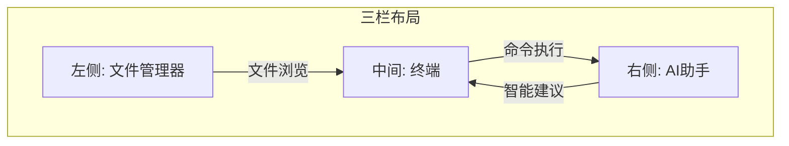

# 快速入门

<cite>
**本文档中引用的文件**
- [package.json](file://package.json)
- [vite.config.ts](file://vite.config.ts)
- [main.ts](file://main.ts)
- [src/components/ConnectionModal.vue](file://src/components/ConnectionModal.vue)
- [src/components/layout/ThreePanelLayout.vue](file://src/components/layout/ThreePanelLayout.vue)
- [src/components/TabManager.vue](file://src/components/TabManager.vue)
- [src/modules/terminal/components/XTerminal.vue](file://src/modules/terminal/components/XTerminal.vue)
- [src/modules/file-manager/components/FileManager.vue](file://src/modules/file-manager/components/FileManager.vue)
- [src/modules/ai-assistant/components/AIAssistant.vue](file://src/modules/ai-assistant/components/AIAssistant.vue)
- [src/components/Header.vue](file://src/components/Header.vue)
- [src/types/ssh.ts](file://src/types/ssh.ts)
- [src/types/components.ts](file://src/types/components.ts)
</cite>

## 目录
1. [项目结构](#项目结构)
2. [环境搭建](#环境搭建)
3. [开发与调试](#开发与调试)
4. [创建SSH连接](#创建ssh连接)
5. [界面功能详解](#界面功能详解)
6. [常见问题排查](#常见问题排查)

## 项目结构

本项目是一个基于Electron的SSH远程连接应用，采用Vue 3 + TypeScript技术栈构建。项目采用模块化设计，主要分为以下几个部分：

- **src/components**: 核心UI组件，包括连接模态框、三栏布局、标签页管理等
- **src/modules**: 功能模块，包括文件管理、终端、AI助手等
- **src/types**: 类型定义文件，包含SSH连接、配置等类型
- **main.ts**: Electron主进程入口文件
- **vite.config.ts**: Vite构建配置文件
- **package.json**: 项目依赖和脚本配置

项目采用三栏布局设计，左侧为文件管理器，中间为终端，右侧为AI助手，提供一体化的远程开发体验。

**Section sources**
- [package.json](file://package.json)
- [vite.config.ts](file://vite.config.ts)

## 环境搭建

### 克隆仓库

首先，克隆项目仓库到本地：

```bash
git clone https://github.com/your-repo/sshcode.git
cd sshcode
```

### 安装依赖

项目依赖Node.js环境和包管理工具。推荐使用Node.js 16.x或更高版本。

#### 使用pnpm安装依赖

```bash
# 全局安装pnpm
npm install -g pnpm

# 安装项目依赖
pnpm install
```

#### 使用yarn安装依赖

```bash
# 全局安装yarn
npm install -g yarn

# 安装项目依赖
yarn install
```

#### 使用npm安装依赖

```bash
# 安装项目依赖
npm install
```

安装完成后，项目依赖将包含Electron、Vue 3、TypeScript、Vite等核心库，以及ssh2、ssh2-sftp-client等SSH相关库。

**Section sources**
- [package.json](file://package.json)

## 开发与调试

### 启动Vite开发服务器

项目使用Vite作为开发服务器，提供快速的热重载体验。启动开发服务器：

```bash
# 使用npm
npm run dev

# 使用yarn
yarn dev

# 使用pnpm
pnpm dev
```

这将启动Vite开发服务器，默认监听3000端口。您可以在浏览器中访问`http://localhost:3000`查看应用。

### 调试Electron主进程

为了调试Electron主进程，项目提供了专门的调试脚本。在`package.json`中定义了`debug`脚本：

```json
"debug": "concurrently \"vite\" \"npm run build-main && wait-on http://localhost:3000 && electron . --dev --remote-debugging-port=9222\""
```

启动调试模式：

```bash
# 使用npm
npm run debug

# 使用yarn
yarn debug

# 使用pnpm
pnpm debug
```

此命令会同时启动Vite开发服务器和Electron应用，并开启远程调试端口9222。您可以通过访问`http://localhost:9222`来调试Electron主进程。

### 构建Electron应用

当您需要构建生产版本的应用时，可以使用以下命令：

```bash
# 构建主进程代码
npm run build-main

# 构建前端代码
npm run build

# 构建完整的Electron应用
npm run build-electron
```

**Section sources**
- [package.json](file://package.json)
- [vite.config.ts](file://vite.config.ts)
- [main.ts](file://main.ts)

## 创建SSH连接

### 打开连接模态框

启动应用后，点击顶部导航栏的"连接管理"按钮（🔗图标），将打开连接管理模态框。

### 填写连接信息

在连接管理模态框中，点击"新建连接"按钮，填写以下信息：

- **连接名称**: 为连接设置一个易于识别的名称
- **主机地址**: 目标服务器的IP地址或域名
- **端口**: SSH服务端口，默认为22
- **用户名**: SSH登录用户名
- **认证方式**: 选择"密码认证"或"密钥认证"
  - 密码认证：输入登录密码
  - 密钥认证：输入私钥文件路径或直接粘贴私钥内容

### 建立连接

填写完连接信息后，点击"创建连接"按钮保存配置。在连接列表中，点击对应连接的"连接"按钮（🔗图标）即可建立SSH连接。

连接成功后，应用将自动创建三个面板：
- 左侧文件管理器：显示远程服务器的文件系统
- 中间终端：提供SSH shell交互界面
- 右侧AI助手：提供智能命令建议和执行功能

**Section sources**
- [src/components/ConnectionModal.vue](file://src/components/ConnectionModal.vue)
- [src/types/ssh.ts](file://src/types/ssh.ts)
- [main.ts](file://main.ts)

## 界面功能详解

### 三栏布局

应用采用三栏布局设计，各区域功能如下：



**Diagram sources**
- [src/components/layout/ThreePanelLayout.vue](file://src/components/layout/ThreePanelLayout.vue)

#### 文件管理器

- **导航控制**: 提供后退、前进、主目录、刷新按钮
- **路径输入**: 可直接输入路径进行导航
- **文件操作**: 支持新建文件/目录、上传、下载、重命名、删除等操作
- **多选功能**: 支持Ctrl/Command键多选文件

#### 终端

- **浮动输入框**: 支持Ctrl+Shift+T快捷键显示/隐藏
- **智能补全**: 支持本地命令和AI智能补全
- **快捷键**: 
  - Ctrl+Space: 显示补全建议
  - Ctrl+↑/↓: 导航补全建议
  - F4: 切换AI补全开关

#### AI助手

- **智能对话**: 可以通过自然语言描述需求，AI将生成相应的命令
- **命令执行**: 支持一键执行AI生成的命令
- **系统监控**: 实时显示系统CPU、内存、磁盘使用情况

### 标签页管理

应用支持多标签页管理，每个SSH连接运行在独立的标签页中。通过标签栏可以：
- 切换不同连接
- 关闭连接
- 重新连接

### 状态栏

底部状态栏显示当前连接状态、系统资源使用情况等信息。

**Section sources**
- [src/components/layout/ThreePanelLayout.vue](file://src/components/layout/ThreePanelLayout.vue)
- [src/modules/terminal/components/XTerminal.vue](file://src/modules/terminal/components/XTerminal.vue)
- [src/modules/file-manager/components/FileManager.vue](file://src/modules/file-manager/components/FileManager.vue)
- [src/modules/ai-assistant/components/AIAssistant.vue](file://src/modules/ai-assistant/components/AIAssistant.vue)

## 常见问题排查

### 依赖安装失败

**问题**: 安装依赖时出现网络错误或包下载失败

**解决方案**:
1. 检查网络连接是否正常
2. 更换npm镜像源：
   ```bash
   npm config set registry https://registry.npmmirror.com
   ```
3. 使用yarn或pnpm替代npm，它们通常有更好的网络容错能力

### 端口占用

**问题**: Vite开发服务器启动时提示端口3000被占用

**解决方案**:
1. 修改`vite.config.ts`中的端口配置：
   ```typescript
   server: {
     port: 3001, // 修改为其他端口
     open: true
   }
   ```
2. 或者在启动时指定端口：
   ```bash
   vite --port 3001
   ```

### 权限错误

**问题**: SSH连接时提示"权限不足"或"认证失败"

**解决方案**:
1. 检查用户名和密码是否正确
2. 对于密钥认证，确保私钥文件权限正确（通常应为600）
3. 检查服务器SSH配置是否允许对应用户的登录
4. 确认私钥格式是否正确，支持OpenSSH、RSA等格式

### 连接超时

**问题**: SSH连接长时间无响应或提示超时

**解决方案**:
1. 检查网络连接是否正常
2. 确认服务器IP地址和端口是否正确
3. 检查防火墙设置，确保SSH端口未被阻止
4. 尝试增加连接超时时间，在`main.ts`中修改`readyTimeout`配置

### Electron启动失败

**问题**: Electron应用无法启动

**解决方案**:
1. 确保已正确安装Electron依赖
2. 检查Node.js版本是否兼容
3. 清理node_modules并重新安装依赖：
   ```bash
   rm -rf node_modules package-lock.json
   npm install
   ```

**Section sources**
- [main.ts](file://main.ts)
- [src/components/ConnectionModal.vue](file://src/components/ConnectionModal.vue)
- [vite.config.ts](file://vite.config.ts)