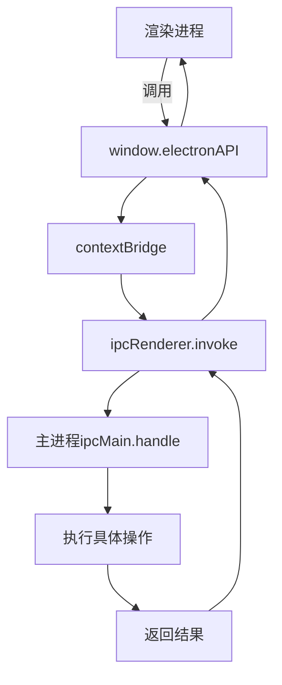
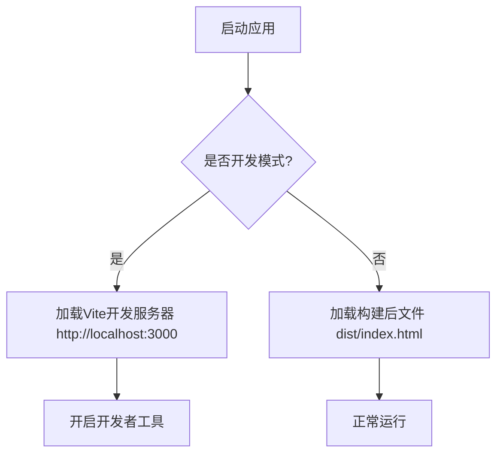
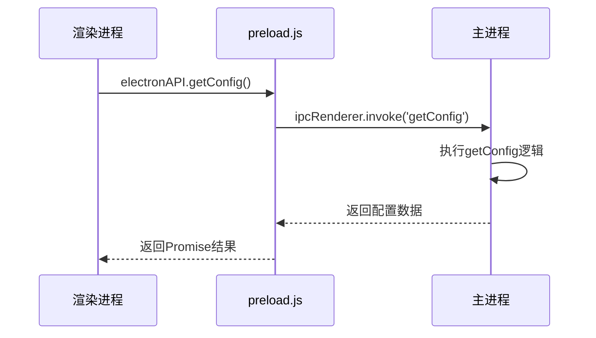
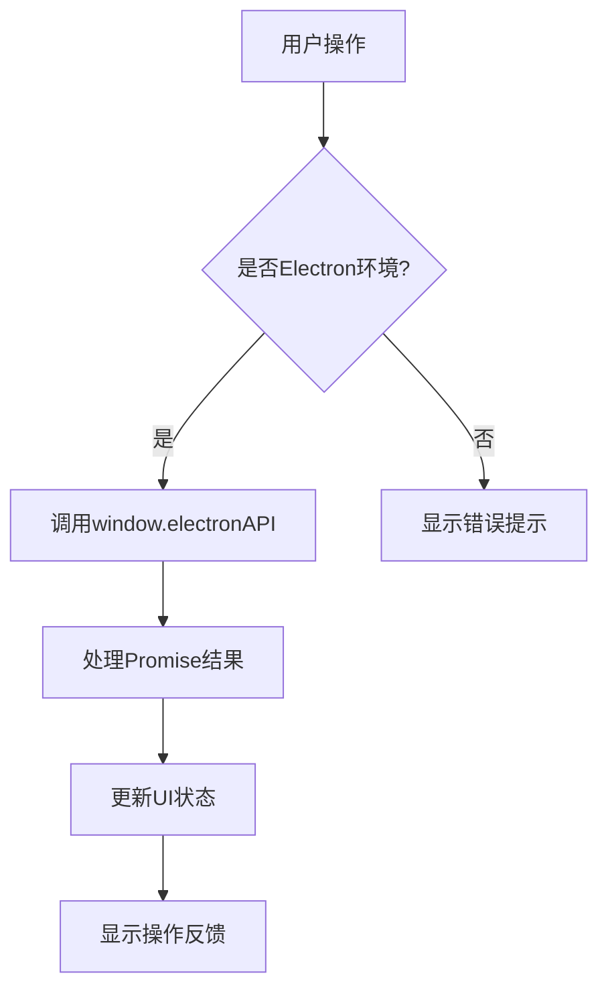

# Electron集成

<cite>
**本文档引用文件**  
- [main.ts](file://main.ts)
- [preload.ts](file://preload.ts)
- [useElectronAPI.ts](file://src/hooks/useElectronAPI.ts)
- [electron.d.ts](file://src/types/electron.d.ts)
- [config.ts](file://src/types/config.ts)
- [ssh.ts](file://src/types/ssh.ts)
- [terminal.ts](file://src/types/terminal.ts)
- [App.vue](file://src/App.vue)
</cite>

## 目录
1. [简介](#简介)
2. [主进程与渲染进程职责划分](#主进程与渲染进程职责划分)
3. [contextBridge机制与预加载脚本](#contextbridge机制与预加载脚本)
4. [BrowserWindow创建与环境加载逻辑](#browserwindow创建与环境加载逻辑)
5. [IPC通信模式详解](#ipc通信模式详解)
6. [渲染进程API调用实现](#渲染进程api调用实现)
7. [错误处理与安全实践](#错误处理与安全实践)
8. [事件监听与数据推送](#事件监听与数据推送)

## 简介
本文档详细说明sshcode应用的Electron集成架构，涵盖主进程与渲染进程的职责划分、contextBridge安全机制、IPC通信流程及错误处理最佳实践。系统通过Electron实现桌面端SSH连接管理，结合Vue前端框架提供现代化用户界面。

## 主进程与渲染进程职责划分

主进程（main.ts）负责管理应用程序生命周期、创建浏览器窗口、处理系统级操作和原生功能调用。渲染进程（Vue应用）专注于用户界面展示、用户交互处理和前端逻辑实现。两者通过安全的IPC（进程间通信）机制进行数据交换。

主进程核心职责包括：
- 应用窗口生命周期管理
- SSH连接的建立与维护
- 配置文件的读写操作
- 会话数据的持久化存储
- SFTP文件操作处理

渲染进程核心职责包括：
- 用户界面渲染与状态管理
- 表单数据收集与验证
- 用户操作事件处理
- 终端输出显示与格式化
- 与主进程的异步通信协调

**Section sources**
- [main.ts](file://main.ts#L1-L50)
- [App.vue](file://src/App.vue#L1-L50)

## contextBridge机制与预加载脚本

### contextBridge安全机制
Electron的contextBridge机制允许在预加载脚本中安全地暴露特定API给渲染进程，解决了直接访问Node.js和Electron API的安全风险。该机制在主世界（main world）和隔离世界（isolated world）之间建立安全桥梁。

### 预加载脚本实现
preload.ts文件通过contextBridge.exposeInMainWorld方法将Electron API安全暴露给渲染进程：



**Diagram sources**
- [preload.ts](file://preload.ts#L1-L81)
- [main.ts](file://main.ts#L1-L50)

暴露的API遵循统一的响应格式：
```typescript
interface APIResponse<T = unknown> {
  success: boolean;
  data?: T;
  output?: T;
  error?: string;
  message?: string;
}
```

**Section sources**
- [preload.ts](file://preload.ts#L1-L81)
- [src/types/api.ts](file://src/types/api.ts#L4-L10)

## BrowserWindow创建与环境加载逻辑

### 窗口创建配置
主进程通过createWindow函数创建BrowserWindow实例，关键配置包括：

- **尺寸约束**：最小宽度1000px，最小高度650px
- **安全设置**：禁用nodeIntegration，启用contextIsolation
- **预加载脚本**：指定preload.js路径
- **窗口样式**：使用默认标题栏样式

### 环境加载差异
系统根据运行模式选择不同的资源加载策略：



开发模式下自动打开开发者工具，便于调试；生产模式下加载打包后的静态资源，确保性能和安全性。

**Diagram sources**
- [main.ts](file://main.ts#L50-L100)

**Section sources**
- [main.ts](file://main.ts#L50-L150)

## IPC通信模式详解

### 同步请求-响应模式
主进程通过ipcMain.handle注册处理程序，渲染进程使用ipcRenderer.invoke发起异步调用：



### 核心API调用流程
#### 配置管理
- `getConfig`：读取YAML格式的配置文件
- `saveConfig`：序列化配置对象并写入文件

#### SSH连接管理
- `ssh-connect`：建立SSH连接，返回连接状态
- `ssh-execute`：在远程主机执行命令
- `ssh-disconnect`：安全断开连接并清理资源

#### 文件操作
- `get-file-list`：获取远程目录文件列表
- `uploadFile`：上传本地文件到远程服务器
- `downloadFile`：下载远程文件到本地

**Diagram sources**
- [main.ts](file://main.ts#L150-L300)
- [preload.ts](file://preload.ts#L1-L81)

**Section sources**
- [main.ts](file://main.ts#L150-L700)
- [preload.ts](file://preload.ts#L1-L81)

## 渲染进程API调用实现

### Electron环境检测
useElectronAPI.ts提供组合式函数检测当前运行环境：

```typescript
export function useElectronAPI() {
  const isElectron = ref(false);

  onMounted(() => {
    const checkElectron = () => {
      return typeof window !== 'undefined' && window.process && window.process.type;
    };
    isElectron.value = !!checkElectron();
  });

  return { isElectron };
}
```

### API使用示例


会话管理、SSH连接等核心功能均通过useElectronAPI提供的组合式函数实现。

**Diagram sources**
- [useElectronAPI.ts](file://src/hooks/useElectronAPI.ts#L1-L135)

**Section sources**
- [useElectronAPI.ts](file://src/hooks/useElectronAPI.ts#L1-L135)
- [App.vue](file://src/App.vue#L90-L150)

## 错误处理与安全实践

### 输入验证
所有API调用均包含严格的输入验证：
- SSH连接参数完整性检查
- 文件路径合法性验证
- 配置数据结构校验

### 异常捕获
采用Promise封装确保异常可捕获：
```typescript
ipcMain.handle('ssh-connect', async (event, connectionConfig) => {
  return new Promise((resolve, reject) => {
    // 连接逻辑
    conn.on('error', err => {
      // 标准化错误信息
      resolve({ success: false, error: errorMessage });
    });
  });
});
```

### 安全考虑
- 敏感信息加密存储
- 私钥文件访问权限控制
- 用户输入转义处理
- 操作确认机制（危险命令）

**Section sources**
- [main.ts](file://main.ts#L300-L700)
- [preload.ts](file://preload.ts#L1-L81)

## 事件监听与数据推送

### 主进程事件推送
主进程通过webContents.send向渲染进程推送实时事件：

- `terminal-data`：终端输出数据
- `terminal-close`：Shell会话关闭
- `terminal-error`：Shell会话错误
- `fileChanged`：文件变更通知

### 渲染进程事件监听
通过contextBridge暴露的事件监听方法：

```typescript
onTerminalData: (callback) => ipcRenderer.on('terminal-data', callback)
```

事件监听器支持动态注册和移除，确保内存安全。

**Section sources**
- [main.ts](file://main.ts#L420-L500)
- [preload.ts](file://preload.ts#L70-L81)