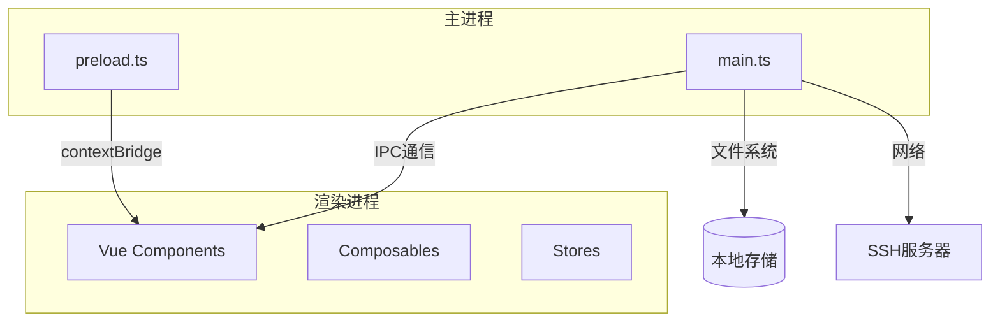
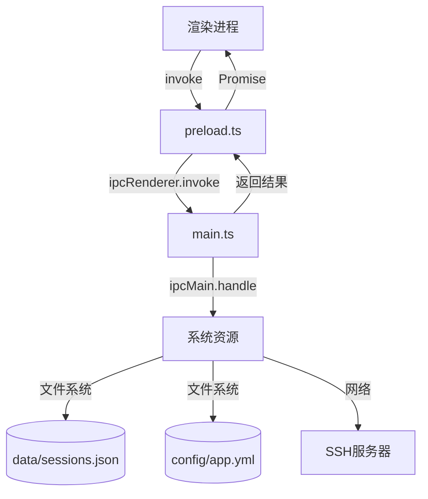
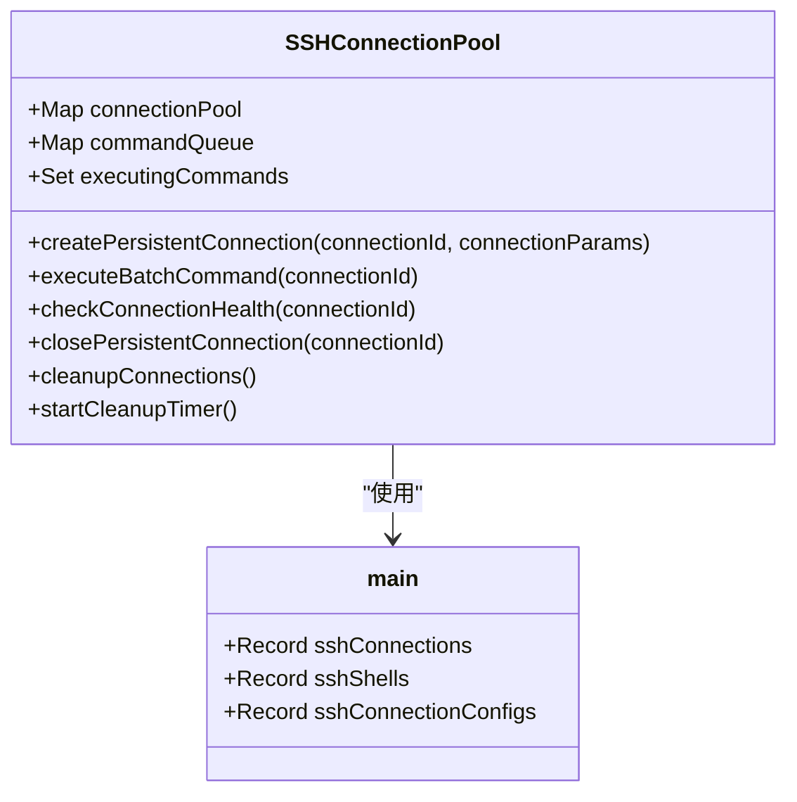

# 主进程

<cite>
**本文档引用的文件**   
- [main.ts](file://main.ts)
- [preload.ts](file://preload.ts)
- [src/types/ssh.ts](file://src/types/ssh.ts)
- [src/types/config.ts](file://src/types/config.ts)
- [src/composables/useSSHConnectionPool.js](file://src/composables/useSSHConnectionPool.js)
</cite>

## 目录
1. [简介](#简介)
2. [项目结构](#项目结构)
3. [核心组件](#核心组件)
4. [架构概述](#架构概述)
5. [详细组件分析](#详细组件分析)
6. [依赖分析](#依赖分析)
7. [性能考虑](#性能考虑)
8. [故障排除指南](#故障排除指南)
9. [结论](#结论)

## 简介
本项目是一个基于 Electron 的 SSH 客户端应用，名为 sshcode。主进程（main.ts）负责管理 Electron 应用的生命周期、创建浏览器窗口、处理 IPC 通信，并维护 SSH 连接池。应用支持 SSH 连接、SFTP 文件操作、终端会话管理以及配置管理。主进程通过 ipcMain.handle 注册多个异步处理器，用于处理来自渲染进程的请求，包括会话管理、SSH 连接控制、文件操作等。应用在开发模式下通过 Vite 开发服务器加载，在生产模式下加载构建后的静态文件。

## 项目结构
项目采用典型的 Electron + Vue 架构，分为主进程（main.ts）、预加载脚本（preload.ts）和渲染进程（Vue 组件）。主进程负责原生功能和系统交互，预加载脚本通过 contextBridge 安全地暴露 Electron API 给渲染进程，渲染进程使用 Vue 3 和 TypeScript 构建用户界面。配置和会话数据持久化存储在本地文件系统中，使用 YAML 和 JSON 格式。SSH 和 SFTP 功能通过 ssh2 和 ssh2-sftp-client 库实现。

**图示来源**
- [main.ts](file://main.ts)
- [preload.ts](file://preload.ts)

## 核心组件
主进程的核心组件包括 BrowserWindow 的创建与配置、Electron 生命周期事件处理、IPC 处理器的注册以及 SSH 连接池的管理。BrowserWindow 的配置包括窗口尺寸、最小尺寸、webPreferences 设置（如 contextIsolation 和 preload 脚本）以及图标。IPC 处理器处理配置管理、会话管理、SSH 连接控制、Shell 会话管理和文件操作。SSH 连接池（sshConnections 和 sshShells）用于管理活动的 SSH 连接和 Shell 会话。

**章节来源**
- [main.ts](file://main.ts#L1-L995)

## 架构概述
应用采用分层架构，主进程作为中间层，协调渲染进程与底层系统资源的交互。渲染进程通过预加载脚本调用主进程的 IPC 处理器，主进程执行相应的原生操作（如文件系统访问、网络连接）并将结果返回。SSH 连接通过 ssh2 库建立，SFTP 操作通过 ssh2-sftp-client 库实现。配置和会话数据持久化到本地文件系统。这种架构确保了渲染进程的安全性（通过 contextIsolation）和主进程的功能性。

**图示来源**
- [main.ts](file://main.ts)
- [preload.ts](file://preload.ts)

## 详细组件分析

### BrowserWindow 创建与配置
`createWindow` 函数负责创建和配置主窗口。窗口的初始尺寸为 1200x750 像素，最小尺寸为 1000x650 像素。`webPreferences` 设置中，`nodeIntegration` 为 false 以增强安全性，`contextIsolation` 为 true 以隔离渲染进程的上下文，`preload` 脚本指向编译后的 preload.js 文件，用于安全地暴露 Electron API。窗口图标设置为 assets/icon.png。根据是否传入 `--dev` 参数，窗口在开发模式下加载 `http://localhost:3000`，在生产模式下加载 `dist/index.html`。

**章节来源**
- [main.ts](file://main.ts#L20-L55)

### Electron 生命周期事件处理
主进程通过监听 Electron 的生命周期事件来管理应用状态。`app.whenReady()` 事件在 Electron 初始化完成后触发，此时创建主窗口。`app.on('activate')` 事件在应用被激活时触发（如 macOS 上点击 Dock 图标），如果所有窗口都已关闭，则重新创建窗口。`app.on('window-all-closed')` 事件在所有窗口关闭时触发，在非 macOS 平台上退出应用，在 macOS 上保持应用活动状态以符合系统惯例。

**章节来源**
- [main.ts](file://main.ts#L57-L73)

### IPC 主进程处理函数
`ipcMain.handle` 用于注册异步 IPC 处理器，处理来自渲染进程的请求。

#### 配置管理
`getConfig` 和 `saveConfig` 处理器管理应用配置。配置存储在 `config/app.yml` 文件中，使用 YAML 格式。`loadConfig` 函数在启动时加载配置，如果文件不存在则使用默认配置。`saveConfig` 函数将当前配置序列化为 YAML 并写入文件。配置包括 AI 设置、通用设置、终端设置和安全设置。

**章节来源**
- [main.ts](file://main.ts#L300-L378)

#### 会话管理
`get-sessions`、`save-session` 和 `delete-session` 处理器管理 SSH 会话。会话数据存储在 `data/sessions.json` 文件中，使用 JSON 格式。`get-sessions` 读取并返回所有会话，`save-session` 将会话数据保存或更新，`delete-session` 从列表中移除指定会话。

**章节来源**
- [main.ts](file://main.ts#L75-L150)

#### SSH 连接控制
`ssh-connect` 处理器建立 SSH 连接。它根据连接配置（密码或密钥认证）创建 ssh2.Client 实例，并处理 `ready` 和 `error` 事件。成功连接后，客户端实例存储在 `sshConnections` 对象中，配置存储在 `sshConnectionConfigs` 对象中。`ssh-disconnect` 处理器关闭指定连接，清理相关资源。

**章节来源**
- [main.ts](file://main.ts#L152-L224)

#### Shell 会话管理
`ssh-create-shell` 处理器为已建立的 SSH 连接创建交互式 Shell 会话。它调用 `conn.shell()` 方法创建 PTY，并将 `ClientChannel` 实例存储在 `sshShells` 对象中。处理器监听 `data`、`close` 和 `error` 事件，并通过 `mainWindow.webContents.send` 将终端数据发送到渲染进程。`ssh-shell-write`、`ssh-shell-resize` 和 `ssh-shell-close` 处理器分别用于向 Shell 写入数据、调整终端大小和关闭会话。

**章节来源**
- [main.ts](file://main.ts#L270-L420)

#### 文件操作
`get-file-list` 处理器列出远程目录内容。它使用 ssh2-sftp-client 库连接 SFTP 服务器并调用 `list()` 方法。如果路径不存在，会尝试备选路径（如 `/root` 或 `/home/username`）。`uploadFile`、`uploadDroppedFile` 和 `selectAndUploadFile` 处理器处理文件上传，使用 `put()` 方法将本地文件传输到远程服务器。`downloadFile` 和 `downloadAndOpenFile` 处理器处理文件下载，后者还会使用系统默认程序打开下载的文件。

**章节来源**
- [main.ts](file://main.ts#L422-L748)

### SSH 连接池设计与管理
主进程使用两个对象 `sshConnections` 和 `sshShells` 作为连接池，分别存储 `Client` 和 `ClientChannel` 实例。`useSSHConnectionPool.js` 组合式函数在渲染进程提供更高级的连接池管理，包括创建持久连接、批量执行命令、健康检查和自动清理。连接池通过连接 ID 索引，允许在多个组件间共享和复用连接，提高效率并减少资源消耗。

**图示来源**
- [src/composables/useSSHConnectionPool.js](file://src/composables/useSSHConnectionPool.js)
- [main.ts](file://main.ts)

## 依赖分析
主进程依赖于多个 Node.js 内置模块（如 `path`、`fs`）和第三方库（如 `electron`、`js-yaml`、`ssh2`、`ssh2-sftp-client`）。这些依赖在 `package.json` 中声明。主进程与渲染进程通过预加载脚本和 IPC 机制紧密耦合。`sshConnections` 和 `sshShells` 对象是核心状态，被多个 IPC 处理器共享。配置和会话数据的持久化依赖于文件系统。

**章节来源**
- [main.ts](file://main.ts)
- [package.json](file://package.json)

## 性能考虑
应用在性能方面的主要考虑包括连接复用、资源清理和错误处理。SSH 连接池避免了频繁建立和断开连接的开销。`useSSHConnectionPool.js` 中的 `cleanupConnections` 函数定期清理超时或错误的连接，防止资源泄漏。SFTP 操作使用流式传输，适合大文件。错误处理提供了用户友好的消息，帮助用户诊断问题。开发模式下启用 DevTools 有助于调试性能问题。

## 故障排除指南
主进程的错误处理主要集中在 SSH 连接和文件操作。常见问题包括认证失败、主机无法解析、连接超时、路径不存在和权限不足。日志记录使用 `console.log` 和 `console.error` 输出调试信息，包括连接配置、错误详情和操作结果。资源清理在 `ssh-disconnect` 和 `app.on('window-all-closed')` 中进行，确保连接和监听器被正确关闭。最佳实践包括使用 `contextIsolation` 增强安全性、对用户输入进行验证、处理异步操作的异常以及定期清理无效资源。

**章节来源**
- [main.ts](file://main.ts)

## 结论
sshcode 应用的主进程设计良好，实现了 Electron 应用的核心功能。它通过清晰的 IPC 接口将渲染进程与系统资源解耦，利用连接池管理提高了效率，并通过完善的错误处理和日志记录增强了可靠性。未来可以考虑增加连接超时管理、更精细的权限控制和配置的加密存储。