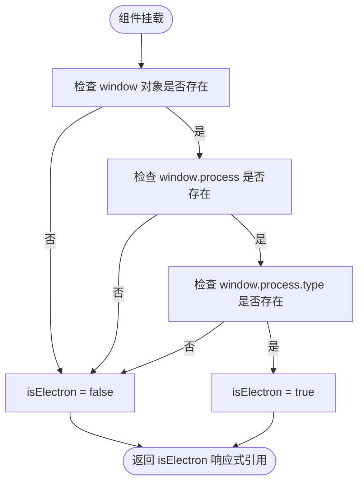
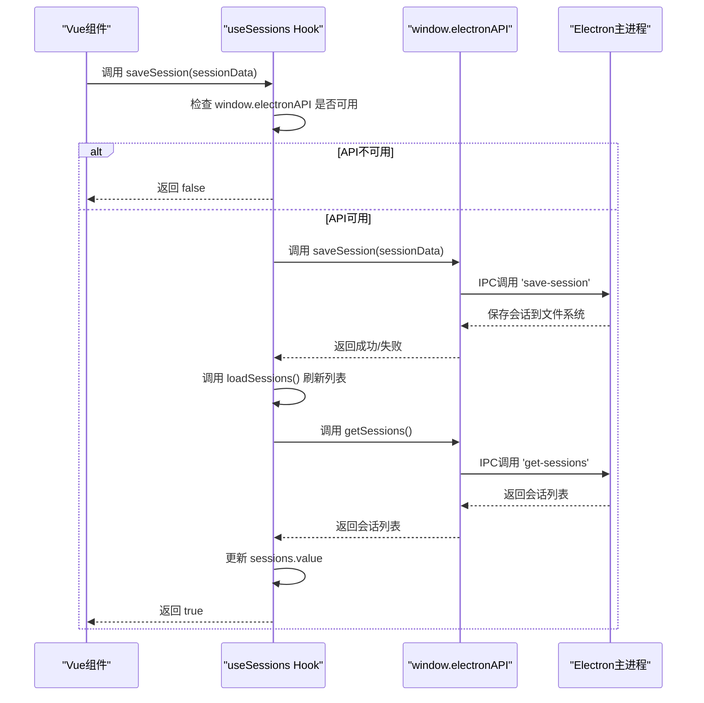
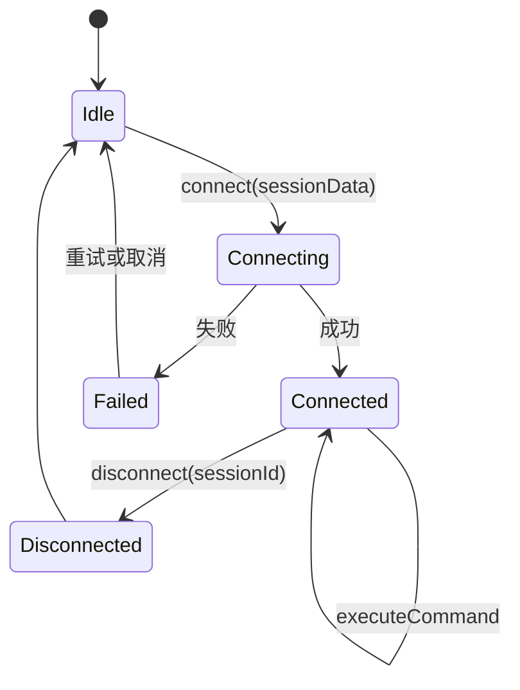
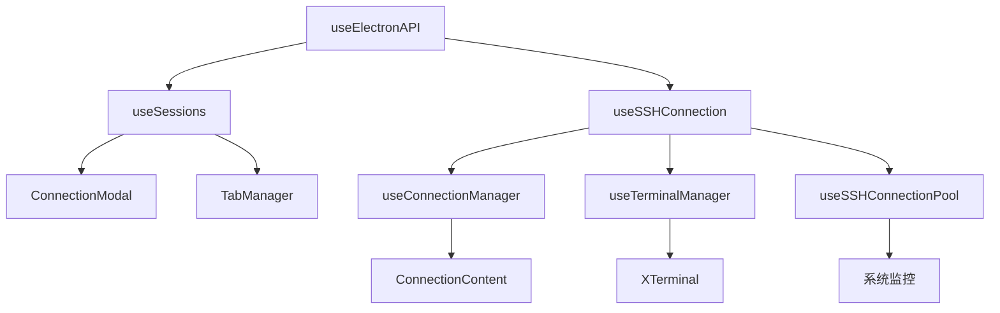

# 渲染进程集成

<cite>
**Referenced Files in This Document**   
- [useElectronAPI.ts](file://src/hooks/useElectronAPI.ts)
- [preload.ts](file://preload.ts)
- [electron.d.ts](file://src/types/electron.d.ts)
- [useConnectionManager.ts](file://src/composables/useConnectionManager.ts)
- [useTerminalManager.ts](file://src/modules/terminal/composables/useTerminalManager.ts)
- [aiService.ts](file://src/modules/ai-assistant/utils/aiService.ts)
- [useSSHConnectionPool.js](file://src/composables/useSSHConnectionPool.js)
</cite>

## 目录
1. [介绍](#介绍)
2. [核心Hook实现与用途](#核心hook实现与用途)
3. [环境检测机制](#环境检测机制)
4. [会话管理功能](#会话管理功能)
5. [SSH连接管理](#ssh连接管理)
6. [Vue组件中的消费模式](#vue组件中的消费模式)
7. [错误处理与状态同步](#错误处理与状态同步)
8. [安全使用建议](#安全使用建议)

## 介绍
`sshcode`应用的渲染进程通过一系列组合式函数（Hook）与Electron主进程进行安全通信，实现SSH连接管理、会话持久化和系统监控等核心功能。这些Hook封装了底层的IPC调用，为Vue组件提供了简洁、响应式的API接口。本文档详细说明了`useElectronAPI.ts`文件中`useElectronAPI`、`useSessions`和`useSSHConnection`三个核心Hook的实现原理与使用方法。

**Section sources**
- [useElectronAPI.ts](file://src/hooks/useElectronAPI.ts#L1-L134)

## 核心Hook实现与用途
`useElectronAPI.ts`文件导出了三个关键的组合式函数，它们是渲染进程与Electron主进程交互的桥梁。这些Hook利用Vue的响应式系统，将异步的IPC调用转换为同步的、易于使用的API。

```mermaid
classDiagram
class useElectronAPI {
+isElectron : Ref<boolean>
+useElectronAPI() : { isElectron }
}
class useSessions {
+sessions : Ref<SessionData[]>
+loading : Ref<boolean>
+loadSessions() : Promise<void>
+saveSession(sessionData) : Promise<boolean>
+deleteSession(sessionId) : Promise<boolean>
+useSessions() : { sessions, loading, loadSessions, saveSession, deleteSession }
}
class useSSHConnection {
+connections : Ref<Map<string, Connection>>
+connect(sessionData) : Promise<Connection>
+disconnect(sessionId) : Promise<boolean>
+executeCommand(sessionId, command) : Promise<APIResponse<string>>
+isConnected(sessionId) : boolean
+useSSHConnection() : { connections, connect, disconnect, executeCommand, isConnected }
}
useSessions --> useElectronAPI : "依赖"
useSSHConnection --> useElectronAPI : "依赖"
```

**Diagram sources**
- [useElectronAPI.ts](file://src/hooks/useElectronAPI.ts#L1-L134)

**Section sources**
- [useElectronAPI.ts](file://src/hooks/useElectronAPI.ts#L1-L134)

## 环境检测机制
`useElectronAPI` Hook的核心功能是检测当前应用是否在Electron环境中运行。它通过检查`window.process.type`属性来实现这一目标。



该Hook在`onMounted`生命周期钩子中执行检测逻辑。它首先检查全局`window`对象，然后检查`window.process`，最后确认`window.process.type`的存在。只有当这三个条件都满足时，`isElectron`的值才会被设置为`true`。这种分层检查确保了代码的健壮性，避免了在非Electron环境（如浏览器）中访问不存在的属性而导致的错误。

**Section sources**
- [useElectronAPI.ts](file://src/hooks/useElectronAPI.ts#L2-L18)

## 会话管理功能
`useSessions` Hook负责管理SSH连接会话的持久化操作，包括加载、保存和删除会话。它通过封装对`window.electronAPI`的IPC调用来实现与主进程的通信。

### 会话数据流


**Diagram sources**
- [useElectronAPI.ts](file://src/hooks/useElectronAPI.ts#L20-L75)
- [preload.ts](file://preload.ts#L15-L18)

### 核心方法
- **`loadSessions`**: 在组件挂载时自动调用，通过`window.electronAPI.getSessions()`从主进程获取所有已保存的会话列表，并更新`sessions`响应式引用。该方法使用`loading`引用管理加载状态，便于在UI中显示加载指示器。
- **`saveSession`**: 接收一个会话数据对象，通过`window.electronAPI.saveSession()`将其保存到主进程。保存成功后，会自动调用`loadSessions`刷新本地会话列表，确保UI状态与持久化数据同步。
- **`deleteSession`**: 根据会话ID删除指定会话，同样在操作后刷新会话列表。

所有方法都包含错误处理逻辑，捕获并记录可能的异常，确保调用方不会因IPC通信失败而崩溃。

**Section sources**
- [useElectronAPI.ts](file://src/hooks/useElectronAPI.ts#L20-L75)
- [preload.ts](file://preload.ts#L15-L18)
- [electron.d.ts](file://src/types/electron.d.ts#L19-L21)

## SSH连接管理
`useSSHConnection` Hook是管理SSH连接的核心，它封装了连接建立、命令执行和连接断开等所有与SSH相关的操作。

### 连接状态管理


**Diagram sources**
- [useElectronAPI.ts](file://src/hooks/useElectronAPI.ts#L77-L133)

### 核心方法
- **`connect`**: 接收会话配置数据，调用`window.electronAPI.sshConnect()`建立SSH连接。如果连接成功，会将连接信息存储在`connections`这个响应式Map中，键为会话ID。
- **`disconnect`**: 根据会话ID断开指定的SSH连接，并从`connections` Map中移除该连接的记录。
- **`executeCommand`**: 在指定的SSH连接上执行命令，返回命令的输出结果。这是与远程服务器交互的主要方式。
- **`isConnected`**: 一个同步方法，用于快速检查指定ID的连接是否处于活动状态，通过查询`connections` Map实现。

该Hook通过响应式的`connections` Map，使得任何使用它的Vue组件都能自动响应连接状态的变化。

**Section sources**
- [useElectronAPI.ts](file://src/hooks/useElectronAPI.ts#L77-L133)
- [preload.ts](file://preload.ts#L20-L22)
- [electron.d.ts](file://src/types/electron.d.ts#L24-L26)

## Vue组件中的消费模式
这些Hook在Vue组件中被广泛消费，为各种功能模块提供底层支持。

### 典型消费场景


**Diagram sources**
- [useElectronAPI.ts](file://src/hooks/useElectronAPI.ts#L1-L134)
- [useConnectionManager.ts](file://src/composables/useConnectionManager.ts#L1-L540)
- [useTerminalManager.ts](file://src/modules/terminal/composables/useTerminalManager.ts#L1-L270)

- **`useConnectionManager`**: 在`useConnectionManager.ts`中，`useSSHConnection`被用来建立和断开SSH连接。当用户尝试连接时，`establishConnection`方法会调用`window.electronAPI.sshConnect`，并在连接成功后更新连接状态。
- **`useTerminalManager`**: 在`useTerminalManager.ts`中，`executeCommand`方法被用来执行用户在终端输入的命令。`executeCommand`函数直接调用`window.electronAPI.sshExecute`来与远程服务器通信。
- **`aiService`**: 在AI助手模块中，`aiService.ts`通过`window.electronAPI.sshExecute`执行命令来获取系统信息（如操作系统类型），为AI提供上下文。
- **`useSSHConnectionPool`**: 连接池模块使用`window.electronAPI.sshExecute`定期执行批量命令以监控系统资源（CPU、内存、磁盘等）。

这些Hook的使用模式高度一致：首先检查`window.electronAPI`是否存在，然后调用相应的IPC方法，并妥善处理可能的异常。

**Section sources**
- [useConnectionManager.ts](file://src/composables/useConnectionManager.ts#L1-L540)
- [useTerminalManager.ts](file://src/modules/terminal/composables/useTerminalManager.ts#L1-L270)
- [aiService.ts](file://src/modules/ai-assistant/utils/aiService.ts#L1-L721)
- [useSSHConnectionPool.js](file://src/composables/useSSHConnectionPool.js#L1-L260)

## 错误处理与状态同步
这些Hook都实现了完善的错误处理和状态同步机制。

- **错误处理**: 每个异步IPC调用都被包裹在`try-catch`块中。捕获到的错误会被记录到控制台（`console.error`），并且方法会返回一个明确的失败状态（如`false`或抛出错误），让调用方可以优雅地处理失败情况。
- **状态同步**: `useSessions`在执行`saveSession`或`deleteSession`后，会立即调用`loadSessions`来刷新本地会话列表，确保内存中的状态与持久化存储保持一致。`useSSHConnection`则通过响应式的`connections` Map，使得连接状态的变化能够自动反映到所有相关的UI组件上。

**Section sources**
- [useElectronAPI.ts](file://src/hooks/useElectronAPI.ts#L20-L133)

## 安全使用建议
在Vue组件中安全使用`window.electronAPI`的关键在于始终进行存在性检查。

```typescript
// 安全的使用模式
if (window.electronAPI) {
  const result = await window.electronAPI.someMethod();
  // 处理结果
} else {
  // 处理Electron API不可用的情况，例如显示错误提示
  console.error('Electron API不可用');
}
```

在调用任何`window.electronAPI`的方法之前，必须先检查其是否存在。这可以防止应用在非Electron环境（如普通浏览器）中运行时因访问不存在的对象而崩溃。`useSessions`和`useSSHConnection`等Hook已经内置了这种检查，因此在组件中优先使用这些封装好的Hook，而不是直接调用`window.electronAPI`。

**Section sources**
- [useElectronAPI.ts](file://src/hooks/useElectronAPI.ts#L30-L31)
- [useElectronAPI.ts](file://src/hooks/useElectronAPI.ts#L85-L86)
- [useElectronAPI.ts](file://src/hooks/useElectronAPI.ts#L102-L103)