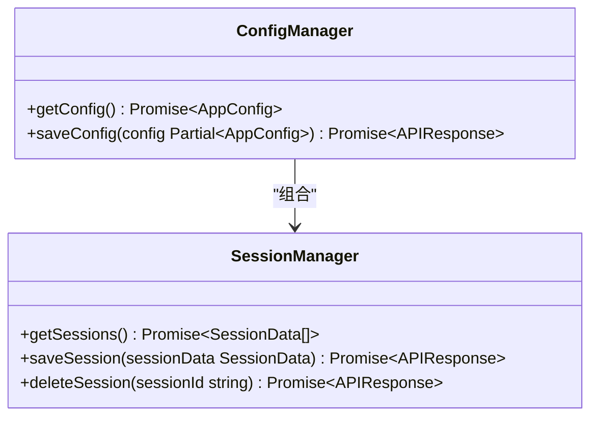
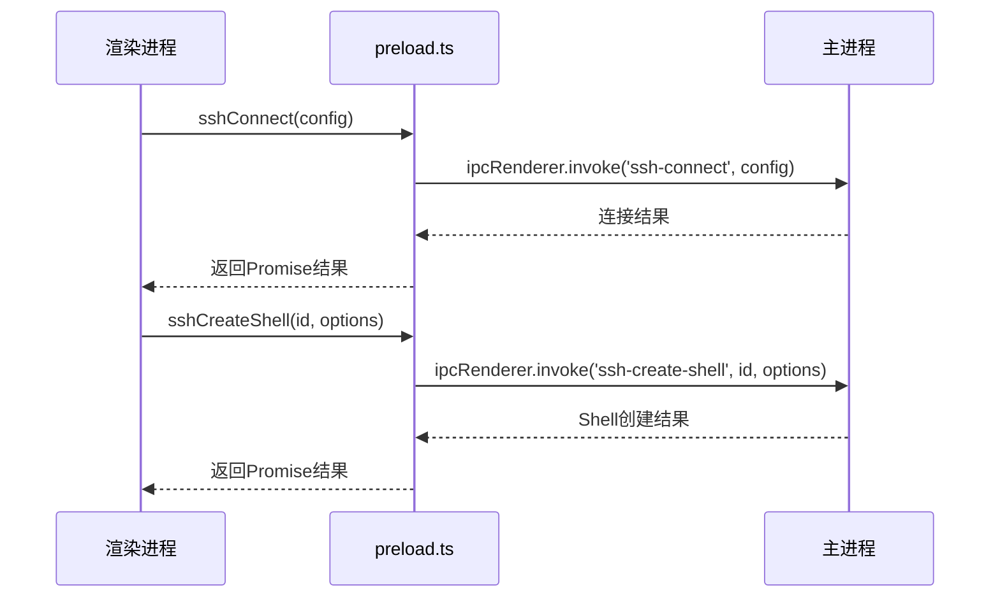
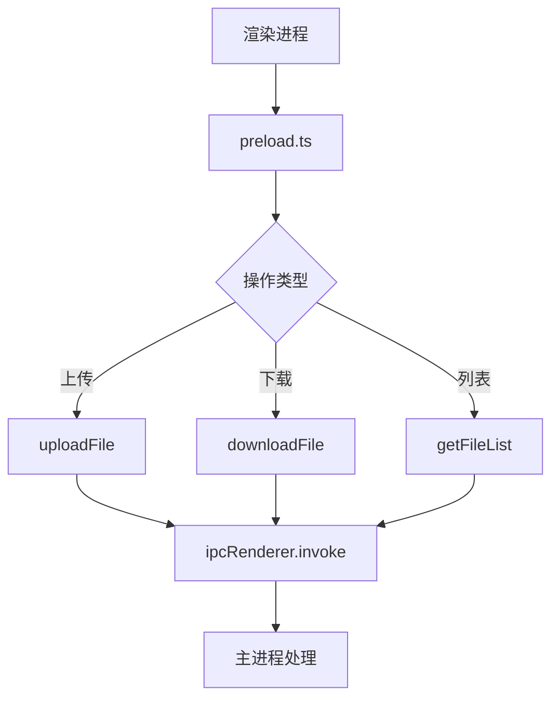
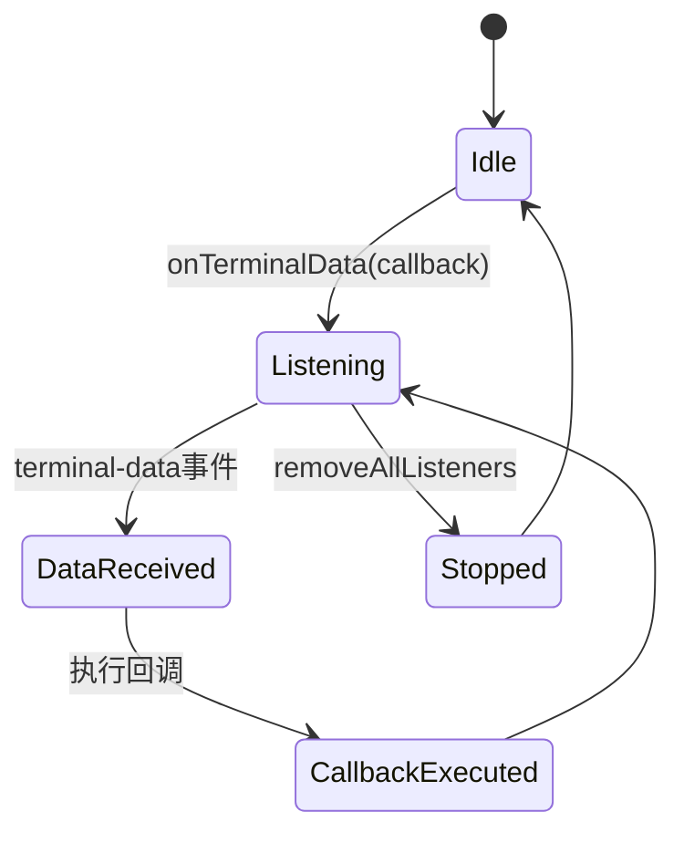
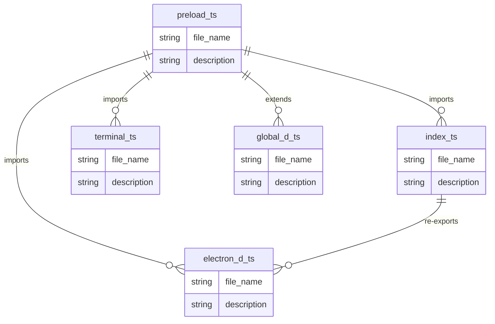

# 预加载脚本

<cite>
**Referenced Files in This Document**  
- [preload.ts](file://preload.ts)
- [src/types/electron.d.ts](file://src/types/electron.d.ts)
- [src/types/index.ts](file://src/types/index.ts)
- [src/types/terminal.ts](file://src/types/terminal.ts)
- [src/hooks/useElectronAPI.ts](file://src/hooks/useElectronAPI.ts)
- [src/types/global.d.ts](file://src/types/global.d.ts)
</cite>

## 目录
1. [简介](#简介)
2. [核心组件](#核心组件)
3. [架构概述](#架构概述)
4. [详细组件分析](#详细组件分析)
5. [依赖分析](#依赖分析)
6. [性能考虑](#性能考虑)
7. [故障排除指南](#故障排除指南)
8. [结论](#结论)

## 简介
本文件详细说明了sshcode应用中`preload.ts`预加载脚本的设计与实现。该脚本利用Electron的`contextBridge`机制，安全地将主进程的IPC接口暴露给渲染进程，实现了前后端的安全通信。文档重点阐述了`electronAPI`对象的结构设计、类型安全实现、通信模式差异以及安全最佳实践。

## 核心组件
`preload.ts`作为Electron应用的安全桥梁，通过`contextBridge.exposeInMainWorld`方法将主进程功能安全暴露给渲染进程。该脚本定义了`electronAPI`对象，包含配置管理、会话管理、SSH连接、Shell会话控制、文件操作和事件监听等核心功能模块。

**Section sources**
- [preload.ts](file://preload.ts#L1-L80)

## 架构概述
预加载脚本采用分层架构设计，通过类型系统确保前后端通信的安全性和一致性。`contextBridge`机制作为安全屏障，防止渲染进程直接访问Node.js内置模块，同时通过精确的API映射实现功能暴露。

```mermaid
graph TB
subgraph "渲染进程"
WebContent[Vue组件]
ElectronHook[useElectronAPI]
end
subgraph "预加载层"
Preload[preload.ts]
ContextBridge[contextBridge]
end
subgraph "主进程"
Main[main.ts]
IPC[IPC处理器]
end
WebContent --> ElectronHook
ElectronHook --> window.electronAPI
window.electronAPI --> Preload
Preload --> ContextBridge
ContextBridge < --> IPC
IPC --> Main
```

**Diagram sources**
- [preload.ts](file://preload.ts#L1-L80)
- [src/hooks/useElectronAPI.ts](file://src/hooks/useElectronAPI.ts#L1-L134)

## 详细组件分析

### electronAPI对象结构分析
`electronAPI`对象通过`contextBridge.exposeInMainWorld`方法暴露，包含多个功能模块，每个模块对应特定的IPC通信通道。

#### 配置管理模块


**Diagram sources**
- [preload.ts](file://preload.ts#L20-L25)
- [src/types/electron.d.ts](file://src/types/electron.d.ts#L13-L25)

#### SSH连接与Shell会话模块


**Diagram sources**
- [preload.ts](file://preload.ts#L28-L38)
- [src/types/electron.d.ts](file://src/types/electron.d.ts#L27-L38)

#### 文件操作模块


**Diagram sources**
- [preload.ts](file://preload.ts#L40-L55)
- [src/types/electron.d.ts](file://src/types/electron.d.ts#L40-L55)

#### 事件监听模块


**Diagram sources**
- [preload.ts](file://preload.ts#L65-L78)
- [src/types/electron.d.ts](file://src/types/electron.d.ts#L55-L63)

**Section sources**
- [preload.ts](file://preload.ts#L1-L80)
- [src/types/electron.d.ts](file://src/types/electron.d.ts#L13-L63)

## 依赖分析
预加载脚本依赖于多个类型定义文件，通过TypeScript的模块系统实现类型安全。



**Diagram sources**
- [preload.ts](file://preload.ts#L1-L80)
- [src/types/index.ts](file://src/types/index.ts#L1-L104)
- [src/types/terminal.ts](file://src/types/terminal.ts#L1-L63)

**Section sources**
- [preload.ts](file://preload.ts#L1-L80)
- [src/types/index.ts](file://src/types/index.ts#L1-L104)
- [src/types/terminal.ts](file://src/types/terminal.ts#L1-L63)

## 性能考虑
`preload.ts`脚本通过异步调用模式避免阻塞渲染进程UI线程。所有IPC通信均采用`ipcRenderer.invoke`的Promise模式，确保非阻塞执行。事件监听采用发布-订阅模式，实现高效的异步数据推送。

## 故障排除指南
当遇到预加载脚本相关问题时，应检查以下方面：
- 确认`contextBridge.exposeInMainWorld`正确暴露了`electronAPI`对象
- 验证类型定义文件的导入路径是否正确
- 检查IPC通道名称是否与主进程处理器匹配
- 确保事件监听器正确注册和清理

**Section sources**
- [preload.ts](file://preload.ts#L1-L80)
- [src/hooks/useElectronAPI.ts](file://src/hooks/useElectronAPI.ts#L1-L134)

## 结论
`preload.ts`预加载脚本通过精心设计的`electronAPI`接口，实现了安全、高效的主渲染进程通信。类型系统确保了API调用的正确性，`contextBridge`机制提供了必要的安全隔离。该设计模式为Electron应用的前后端通信提供了可靠范例。