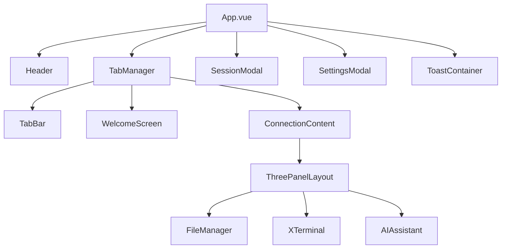
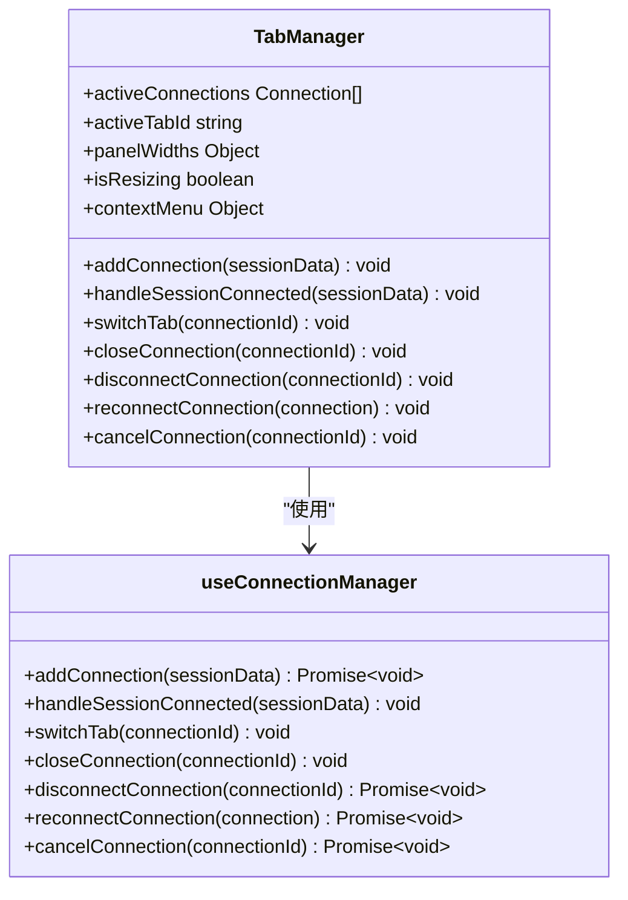
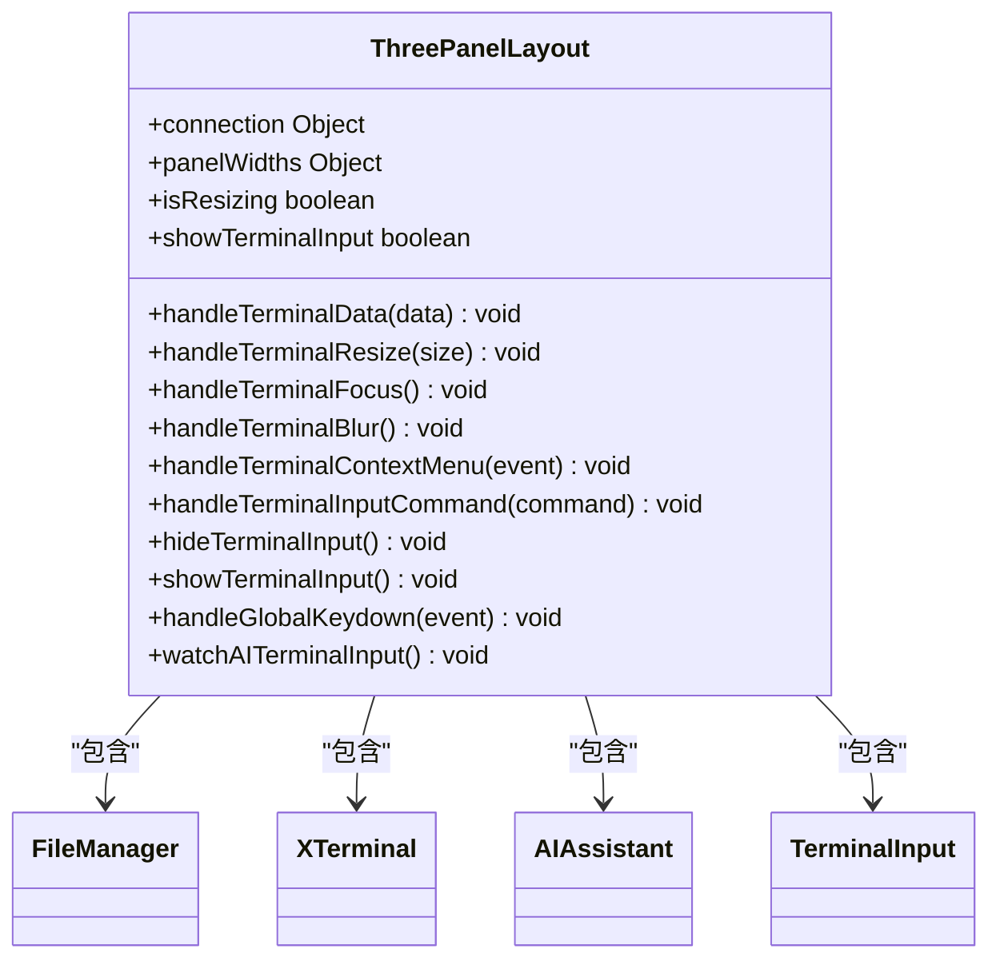
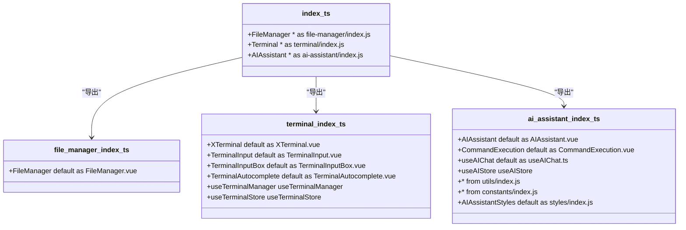
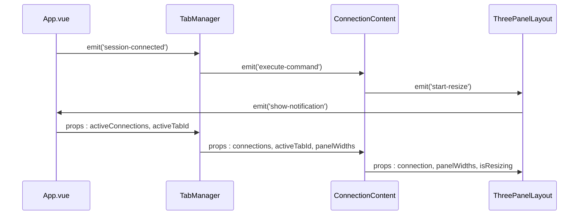
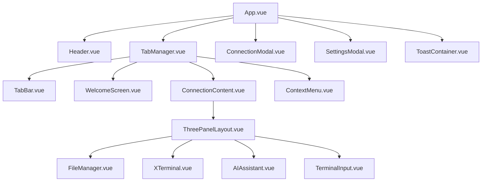

# UI架构

<cite>
**本文档引用的文件**
- [App.vue](file://src/App.vue)
- [TabManager.vue](file://src/components/TabManager.vue)
- [ThreePanelLayout.vue](file://src/components/layout/ThreePanelLayout.vue)
- [Header.vue](file://src/components/Header.vue)
- [ToastContainer.vue](file://src/components/ui/ToastContainer.vue)
- [ConnectionModal.vue](file://src/components/ConnectionModal.vue)
- [SettingsModal.vue](file://src/components/SettingsModal.vue)
- [TabBar.vue](file://src/components/tabs/TabBar.vue)
- [WelcomeScreen.vue](file://src/components/tabs/WelcomeScreen.vue)
- [ConnectionContent.vue](file://src/components/tabs/ConnectionContent.vue)
- [ContextMenu.vue](file://src/components/ContextMenu.vue)
- [index.ts](file://src/modules/index.ts)
- [file-manager/index.ts](file://src/modules/file-manager/index.ts)
- [terminal/index.ts](file://src/modules/terminal/index.ts)
- [ai-assistant/index.ts](file://src/modules/ai-assistant/index.ts)
- [useConnectionManager.ts](file://src/composables/useConnectionManager.ts)
- [usePanelManager.js](file://src/composables/usePanelManager.js)
- [useContextMenu.js](file://src/composables/useContextMenu.js)
</cite>

## 目录
1. [简介](#简介)
2. [项目结构](#项目结构)
3. [核心组件](#核心组件)
4. [架构概览](#架构概览)
5. [详细组件分析](#详细组件分析)
6. [依赖分析](#依赖分析)
7. [性能考虑](#性能考虑)
8. [故障排除指南](#故障排除指南)
9. [结论](#结论)

## 简介
sshcode应用是一个基于Vue 3的企业级SSH远程连接管理平台，提供安全可靠的远程服务器连接、高效的连接管理、智能的AI助手等功能。该应用采用模块化设计，通过组合式API实现功能解耦，支持多标签会话管理、三栏式布局和动态面板调整。UI架构以App.vue为根组件，协调Header、TabManager、Modal等顶级组件的交互，实现流畅的用户体验。

## 项目结构
sshcode应用的项目结构清晰，采用功能模块化组织方式。src目录下包含components、composables、hooks、modules、stores、styles、types、utils等子目录，分别存放组件、组合式函数、钩子、功能模块、状态管理、样式、类型定义和工具函数。components目录存放通用UI组件和布局组件，composables目录存放可复用的逻辑组合，modules目录按功能划分模块，实现按需加载和动态集成。

**本节来源**
- [App.vue](file://src/App.vue)
- [TabManager.vue](file://src/components/TabManager.vue)
- [ThreePanelLayout.vue](file://src/components/layout/ThreePanelLayout.vue)

## 核心组件
App.vue作为应用的根组件，负责协调各个顶级组件的交互。它通过响应式引用(tabManagerRef)与TabManager组件通信，处理会话连接、断开和通知事件。App.vue还管理会话模态框和设置模态框的显示状态，以及全局通知的显示和移除。通过setupElectronAPI函数初始化Electron API，为应用提供桌面端功能支持。

**本节来源**
- [App.vue](file://src/App.vue#L1-L210)

## 架构概览
sshcode应用的UI架构采用分层设计，以App.vue为根组件，协调Header、TabManager、Modal等顶级组件。TabManager组件负责多标签会话管理，包括标签的创建、切换和销毁。ThreePanelLayout组件实现三栏式布局，组织文件管理器、终端和AI助手三个功能区域。模块化加载机制通过modules/index.ts实现功能模块的按需加载和动态集成。

**图表来源**
- [App.vue](file://src/App.vue#L1-L210)
- [TabManager.vue](file://src/components/TabManager.vue#L1-L363)
- [ThreePanelLayout.vue](file://src/components/layout/ThreePanelLayout.vue#L1-L514)

## 详细组件分析
### 根组件分析
App.vue作为应用的根组件，通过模板引用(tabManagerRef)与TabManager组件建立直接联系。当收到session-connected事件时，App.vue调用TabManager的handleSessionConnected方法，实现组件间的直接通信。App.vue还通过isSessionModalOpen和isSettingsModalOpen响应式引用管理模态框的显示状态，通过toastState管理全局通知的显示。

**本节来源**
- [App.vue](file://src/App.vue#L1-L210)

### 标签管理器分析
TabManager组件是sshcode应用的核心组件之一，负责管理多个SSH会话标签。它通过useConnectionManager组合式函数管理连接状态，包括添加连接、切换标签、关闭连接等操作。TabManager通过activeConnections和activeTabId响应式引用跟踪当前活动的连接和标签，通过emit事件与父组件通信，实现会话连接、断开和通知的传递。

**图表来源**
- [TabManager.vue](file://src/components/TabManager.vue#L1-L363)
- [useConnectionManager.ts](file://src/composables/useConnectionManager.ts#L1-L539)

### 三栏布局分析
ThreePanelLayout组件实现sshcode应用的三栏式布局，包含文件管理、终端和AI助手三个功能区域。它通过panelWidths响应式对象管理各面板的宽度比例，通过isResizing状态跟踪拖拽调整过程。组件支持通过鼠标拖拽分隔符调整面板宽度，保持总宽度为100%。ThreePanelLayout通过props接收连接信息和面板宽度，通过emit事件与父组件通信，实现命令执行、终端清空、内容复制等功能。

**图表来源**
- [ThreePanelLayout.vue](file://src/components/layout/ThreePanelLayout.vue#L1-L514)
- [FileManager](file://src/modules/file-manager/components/FileManager.vue)
- [XTerminal](file://src/modules/terminal/components/XTerminal.vue)
- [AIAssistant](file://src/modules/ai-assistant/components/AIAssistant.vue)

### 模块化加载机制分析
sshcode应用通过modules/index.ts实现功能模块的按需加载和动态集成。该文件作为模块化入口，统一导出各个模块的功能。file-manager、terminal和ai-assistant三个模块分别封装文件管理、终端和AI助手功能，通过命名空间导出模块内组件、组合式函数、状态管理等。这种设计实现了功能解耦，便于模块的独立开发和维护。

**图表来源**
- [index.ts](file://src/modules/index.ts#L1-L14)
- [file-manager/index.ts](file://src/modules/file-manager/index.ts#L1-L10)
- [terminal/index.ts](file://src/modules/terminal/index.ts#L1-L19)
- [ai-assistant/index.ts](file://src/modules/ai-assistant/index.ts#L1-L26)

### 组件间通信模式分析
sshcode应用采用多种组件间通信模式，包括事件总线、props传递和状态共享。App.vue通过emit事件与子组件通信，如open-session-modal、open-settings-modal等。子组件通过props接收父组件数据，如connection、panelWidths等。应用使用Pinia进行状态管理，实现跨组件状态共享，如AI助手的终端输入状态。此外，通过组合式函数(useConnectionManager、usePanelManager等)实现逻辑复用和状态共享。

**图表来源**
- [App.vue](file://src/App.vue#L1-L210)
- [TabManager.vue](file://src/components/TabManager.vue#L1-L363)
- [ConnectionContent.vue](file://src/components/tabs/ConnectionContent.vue#L1-L144)
- [ThreePanelLayout.vue](file://src/components/layout/ThreePanelLayout.vue#L1-L514)

## 依赖分析
sshcode应用的组件依赖关系清晰，形成层次化的架构。App.vue作为根组件，直接依赖Header、TabManager、SessionModal、SettingsModal和ToastContainer组件。TabManager组件依赖TabBar、WelcomeScreen、ConnectionContent和ContextMenu组件。ConnectionContent组件依赖ThreePanelLayout组件，ThreePanelLayout组件依赖FileManager、XTerminal、AIAssistant等模块化组件。这种依赖关系确保了组件的职责分离和可维护性。

**图表来源**
- [App.vue](file://src/App.vue#L1-L210)
- [TabManager.vue](file://src/components/TabManager.vue#L1-L363)
- [ConnectionContent.vue](file://src/components/tabs/ConnectionContent.vue#L1-L144)
- [ThreePanelLayout.vue](file://src/components/layout/ThreePanelLayout.vue#L1-L514)

## 性能考虑
sshcode应用在UI架构设计中考虑了性能优化。通过组合式API实现逻辑复用，减少代码重复。使用响应式系统优化状态管理，确保UI更新的高效性。三栏布局支持动态调整，通过防抖和节流优化拖拽性能。模块化设计支持按需加载，减少初始加载时间。此外，应用使用虚拟滚动和分页技术处理大量数据，避免内存泄漏。

## 故障排除指南
当遇到UI相关问题时，可按以下步骤排查：检查App.vue的根组件是否正确初始化；验证TabManager的连接管理逻辑是否正常；确认ThreePanelLayout的布局计算是否正确；检查模块化组件的导入和导出是否匹配；验证组件间通信是否正常。对于性能问题，可检查响应式引用的使用是否合理，确认事件监听器是否正确清理，验证内存泄漏是否存在。

**本节来源**
- [App.vue](file://src/App.vue#L1-L210)
- [TabManager.vue](file://src/components/TabManager.vue#L1-L363)
- [ThreePanelLayout.vue](file://src/components/layout/ThreePanelLayout.vue#L1-L514)

## 结论
sshcode应用的UI架构设计合理，采用Vue 3的组合式API实现功能解耦和逻辑复用。以App.vue为根组件，通过清晰的依赖关系和通信模式，协调各个顶级组件的交互。TabManager组件实现多标签会话管理，ThreePanelLayout组件实现三栏式布局和动态调整。模块化设计通过modules/index.ts实现功能模块的按需加载和动态集成。整体架构具有良好的可维护性、可扩展性和性能表现。