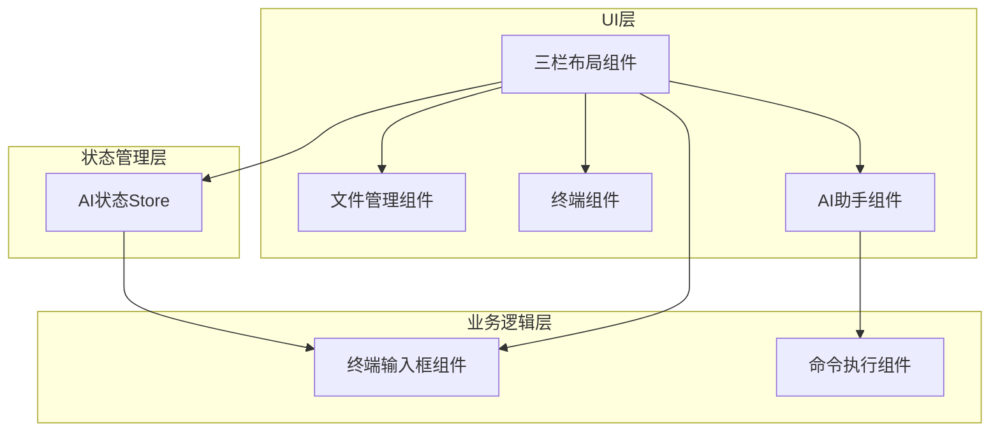
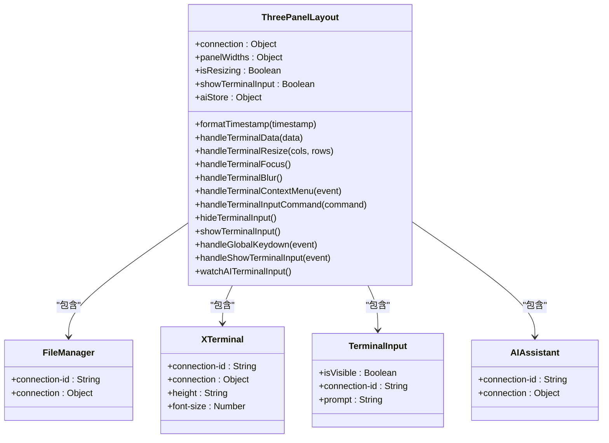
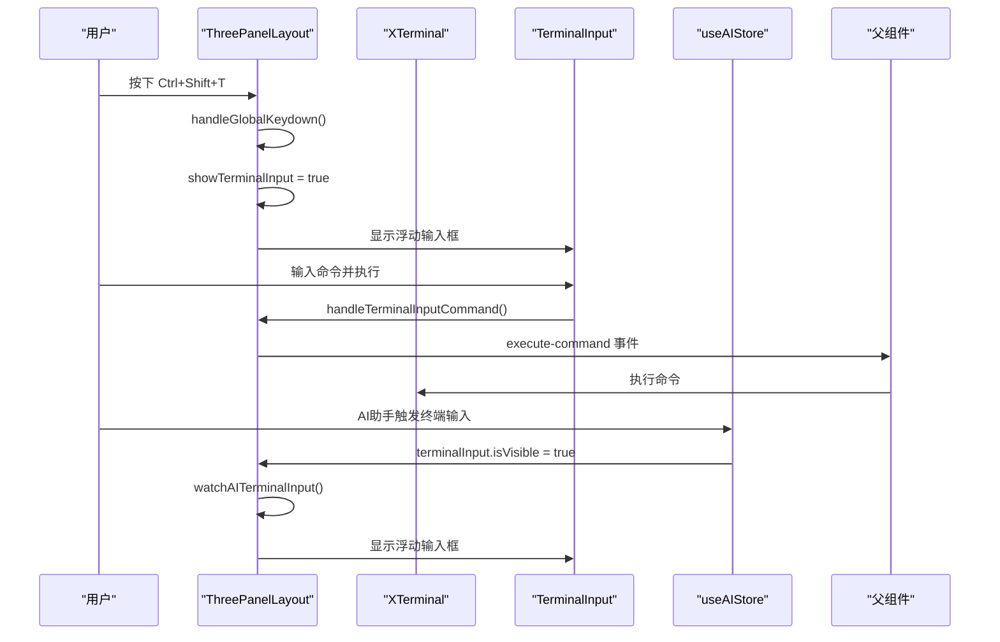
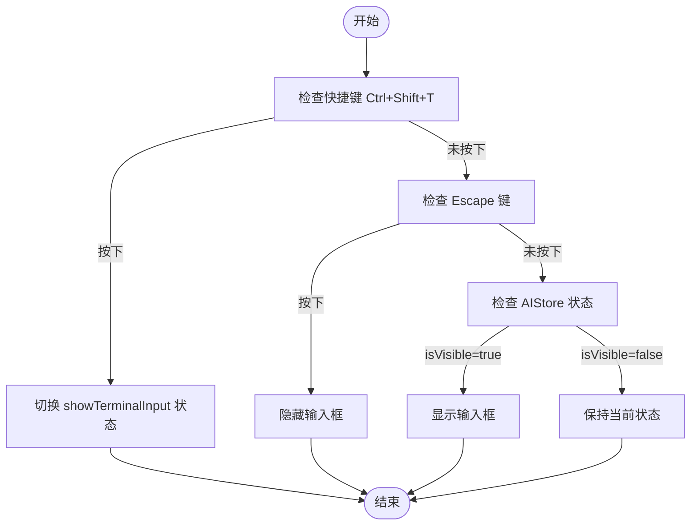
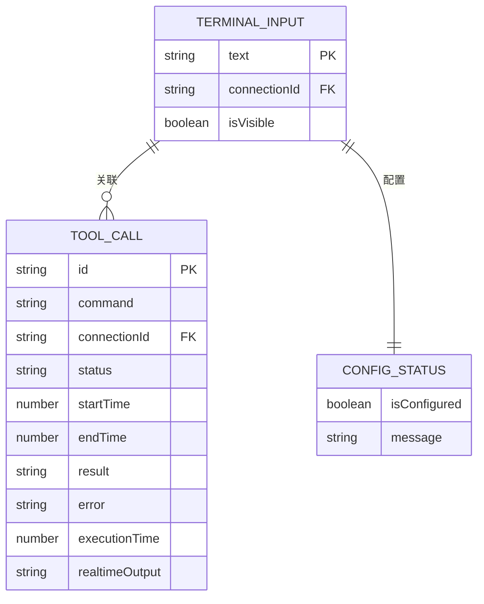
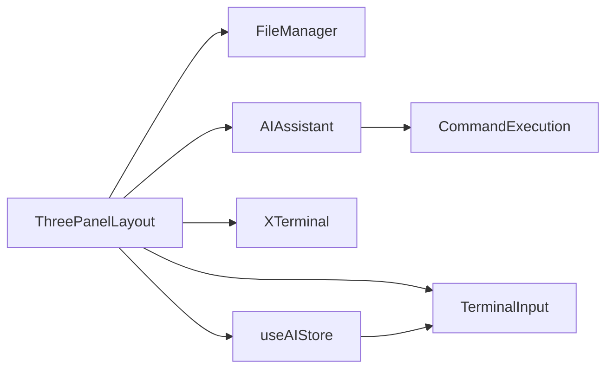

# 三栏布局组件

<cite>
**Referenced Files in This Document**   
- [ThreePanelLayout.vue](file://src/components/layout/ThreePanelLayout.vue)
- [ai.ts](file://src/modules/ai-assistant/stores/ai.ts)
- [TerminalInput.vue](file://src/modules/terminal/components/TerminalInput.vue)
- [AIAssistant.vue](file://src/modules/ai-assistant/components/AIAssistant.vue)
- [ai.ts](file://src/types/ai.ts)
</cite>

## 目录
1. [简介](#简介)
2. [项目结构](#项目结构)
3. [核心组件](#核心组件)
4. [架构概述](#架构概述)
5. [详细组件分析](#详细组件分析)
6. [依赖分析](#依赖分析)
7. [性能考虑](#性能考虑)
8. [故障排除指南](#故障排除指南)
9. [结论](#结论)

## 简介
三栏布局组件（ThreePanelLayout）是应用程序的核心布局容器，负责协调文件管理、终端和AI助手三大功能模块的展示与交互。该组件采用灵活的布局策略，通过响应式设计和动态宽度控制，为用户提供高效的工作环境。组件不仅实现了基本的UI布局功能，还集成了复杂的交互逻辑，包括面板宽度调整、终端输入框控制、AI助手联动等高级特性。

## 项目结构
三栏布局组件位于`src/components/layout/`目录下，作为应用程序的核心UI组件，它与多个功能模块进行交互。组件通过props接收外部配置，通过emits向父级传递事件，并通过Pinia store实现跨组件状态管理。这种设计模式实现了关注点分离，使布局组件专注于UI呈现，而将业务逻辑委托给专门的模块处理。

**Diagram sources**
- [ThreePanelLayout.vue](file://src/components/layout/ThreePanelLayout.vue#L1-L50)

**Section sources**
- [ThreePanelLayout.vue](file://src/components/layout/ThreePanelLayout.vue#L1-L515)

## 核心组件
三栏布局组件作为应用的主界面容器，实现了三个主要功能区域的水平排列：文件管理面板、终端面板和AI助手面板。组件通过flex布局实现响应式设计，利用内联样式动态控制各面板的宽度。组件接收连接信息和面板宽度配置作为props，并通过emits向父级传递终端操作、命令执行、通知显示等各类事件。

**Section sources**
- [ThreePanelLayout.vue](file://src/components/layout/ThreePanelLayout.vue#L25-L100)

## 架构概述
三栏布局组件采用分层架构设计，将UI呈现、状态管理和业务逻辑分离。组件通过props接收外部配置，通过emits传递事件，通过Pinia store实现跨组件状态共享。这种架构设计提高了组件的可维护性和可测试性，同时支持灵活的扩展和定制。

**Diagram sources**
- [ThreePanelLayout.vue](file://src/components/layout/ThreePanelLayout.vue#L1-L515)
- [ai.ts](file://src/modules/ai-assistant/stores/ai.ts#L1-L273)

## 详细组件分析

### 三栏布局组件分析
三栏布局组件通过flex布局实现三个功能面板的水平排列，每个面板的宽度通过内联样式动态控制。组件使用`panelWidths`对象存储各面板的宽度百分比，支持用户通过拖拽分隔符调整面板大小。组件还实现了终端输入框的显示逻辑和快捷键支持（Ctrl+Shift+T），以及与AI助手的状态联动。

#### 组件结构

**Diagram sources**
- [ThreePanelLayout.vue](file://src/components/layout/ThreePanelLayout.vue#L1-L515)

#### 事件流分析

**Diagram sources**
- [ThreePanelLayout.vue](file://src/components/layout/ThreePanelLayout.vue#L1-L515)
- [ai.ts](file://src/modules/ai-assistant/stores/ai.ts#L1-L273)

#### 终端输入框显示逻辑

**Diagram sources**
- [ThreePanelLayout.vue](file://src/components/layout/ThreePanelLayout.vue#L1-L515)
- [ai.ts](file://src/modules/ai-assistant/stores/ai.ts#L1-L273)

**Section sources**
- [ThreePanelLayout.vue](file://src/components/layout/ThreePanelLayout.vue#L1-L515)

### AI助手状态集成分析
三栏布局组件通过`useAIStore`集成AI助手状态，实现AI请求触发终端输入框的联动机制。组件在`mounted`生命周期中初始化AI store，并通过`watchAITerminalInput`方法监听store中终端输入状态的变化。当AI助手需要用户输入时，会更新store中的`terminalInput.isVisible`状态，布局组件监听到变化后自动显示浮动输入框。

#### AI状态接口定义

**Diagram sources**
- [ai.ts](file://src/types/ai.ts#L136-L140)
- [ai.ts](file://src/modules/ai-assistant/stores/ai.ts#L1-L273)

**Section sources**
- [ai.ts](file://src/modules/ai-assistant/stores/ai.ts#L1-L273)

## 依赖分析
三栏布局组件依赖于多个功能模块和状态管理store。组件通过import语句引入文件管理、AI助手、终端输入框等子组件，并通过`useAIStore`引入AI状态管理store。这种依赖关系通过模块化设计实现，确保了组件的高内聚和低耦合。

**Diagram sources**
- [ThreePanelLayout.vue](file://src/components/layout/ThreePanelLayout.vue#L1-L515)
- [ai.ts](file://src/modules/ai-assistant/stores/ai.ts#L1-L273)

**Section sources**
- [ThreePanelLayout.vue](file://src/components/layout/ThreePanelLayout.vue#L1-L515)

## 性能考虑
三栏布局组件在性能方面进行了多项优化。组件使用`view_dependencies`参数读取依赖文件，确保只加载必要的代码。在响应式设计方面，组件通过CSS媒体查询和flex布局实现不同屏幕尺寸下的自适应。对于频繁更新的状态，组件使用Pinia store进行集中管理，避免不必要的重新渲染。

## 故障排除指南
当三栏布局组件出现显示或交互问题时，可以按照以下步骤进行排查：
1. 检查`panelWidths`对象的值是否正确，确保各面板宽度百分比之和为100。
2. 验证`connection`对象是否包含必要的连接信息。
3. 检查AI store是否正确初始化，`terminalInput`状态是否正常更新。
4. 确认快捷键事件监听器是否正常工作，特别是Ctrl+Shift+T组合键。

**Section sources**
- [ThreePanelLayout.vue](file://src/components/layout/ThreePanelLayout.vue#L1-L515)
- [ai.ts](file://src/modules/ai-assistant/stores/ai.ts#L1-L273)

## 结论
三栏布局组件作为应用程序的核心布局容器，成功实现了文件管理、终端和AI助手三大功能模块的集成。组件通过灵活的布局策略、高效的事件处理和智能的状态管理，为用户提供了一个高效、直观的工作环境。未来可以进一步优化响应式设计，增加更多自定义布局选项，以满足不同用户的需求。