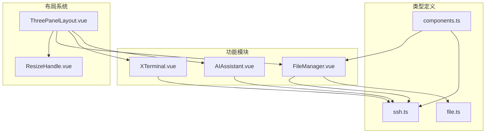
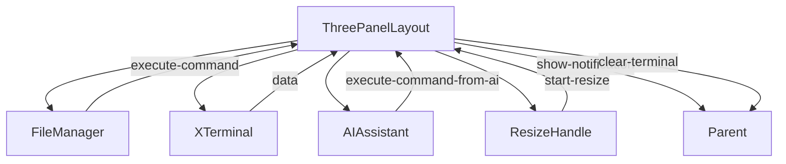
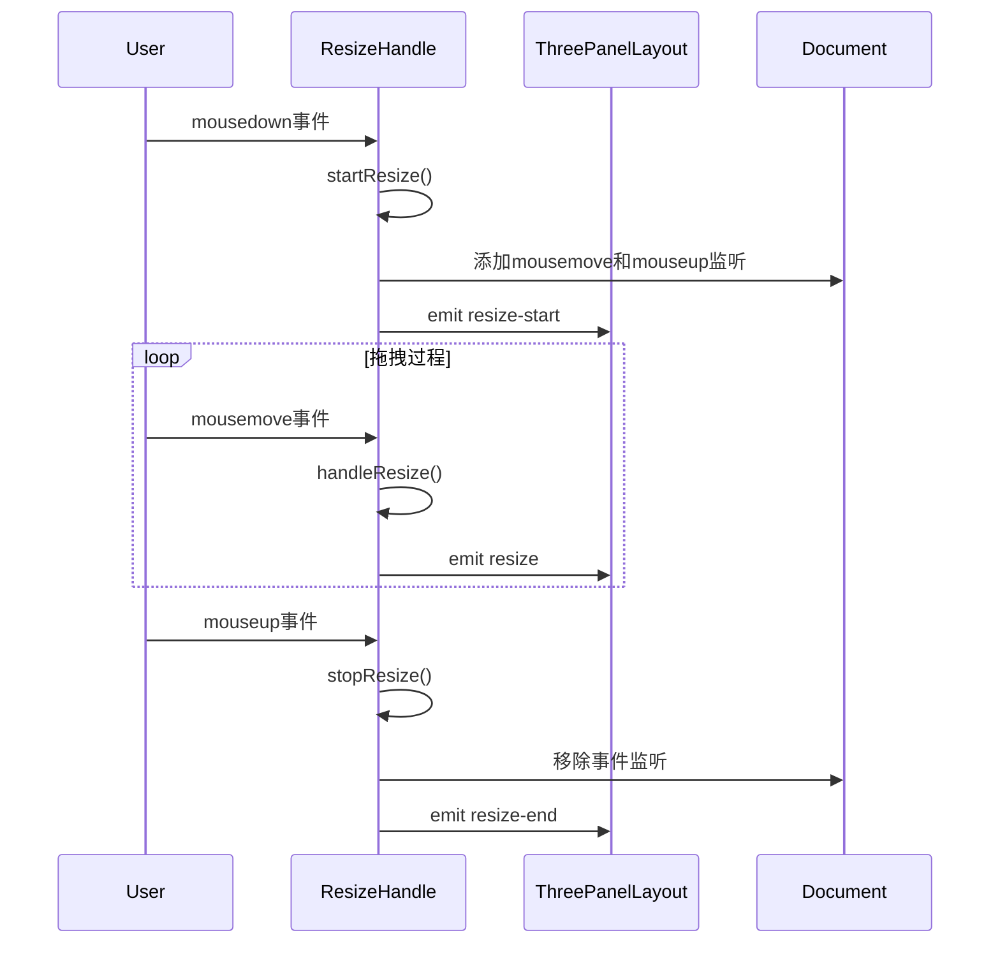
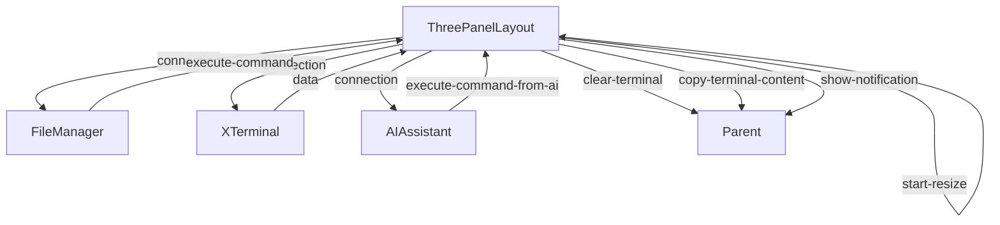
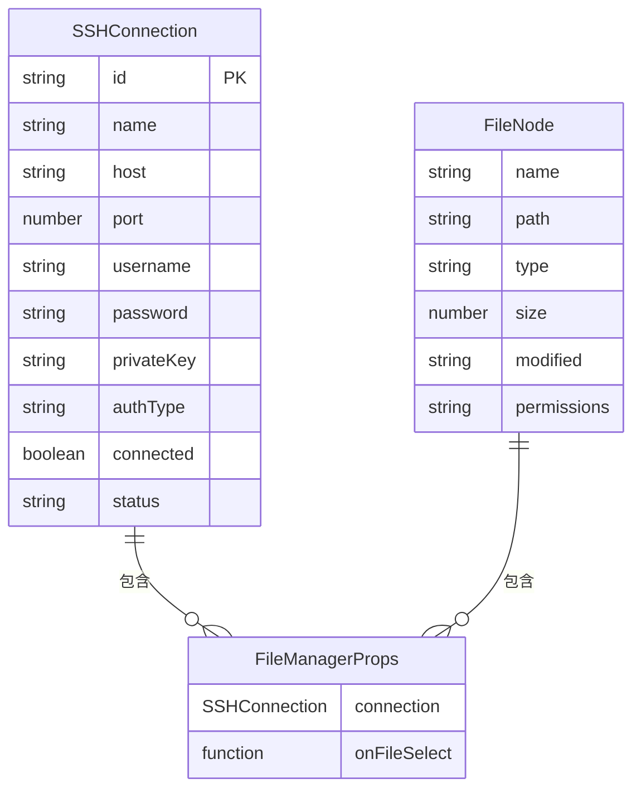

# 布局系统

<cite>
**Referenced Files in This Document**   
- [ThreePanelLayout.vue](file://src/components/layout/ThreePanelLayout.vue)
- [ResizeHandle.vue](file://src/components/ui/ResizeHandle.vue)
- [FileManager.vue](file://src/modules/file-manager/components/FileManager.vue)
- [XTerminal.vue](file://src/modules/terminal/components/XTerminal.vue)
- [AIAssistant.vue](file://src/modules/ai-assistant/components/AIAssistant.vue)
- [components.ts](file://src/types/components.ts)
- [file.ts](file://src/types/file.ts)
- [ssh.ts](file://src/types/ssh.ts)
</cite>

## Table of Contents
1. [项目结构](#项目结构)
2. [核心组件](#核心组件)
3. [架构概述](#架构概述)
4. [详细组件分析](#详细组件分析)
5. [依赖分析](#依赖分析)
6. [性能考虑](#性能考虑)
7. [故障排除指南](#故障排除指南)
8. [结论](#结论)

## 项目结构
项目采用模块化架构，核心布局组件位于`src/components/layout/ThreePanelLayout.vue`，通过组合`FileManager`、`XTerminal`和`AIAssistant`三大功能模块实现三栏式布局。UI交互组件`ResizeHandle`位于`src/components/ui/`目录下，负责面板宽度的动态调整。各功能模块分别封装在`src/modules/`目录下的独立模块中，通过类型定义文件`src/types/`统一接口规范。



**Diagram sources**
- [ThreePanelLayout.vue](file://src/components/layout/ThreePanelLayout.vue)
- [ResizeHandle.vue](file://src/components/ui/ResizeHandle.vue)
- [FileManager.vue](file://src/modules/file-manager/components/FileManager.vue)
- [XTerminal.vue](file://src/modules/terminal/components/XTerminal.vue)
- [AIAssistant.vue](file://src/modules/ai-assistant/components/AIAssistant.vue)
- [components.ts](file://src/types/components.ts)
- [file.ts](file://src/types/file.ts)
- [ssh.ts](file://src/types/ssh.ts)

**Section sources**
- [ThreePanelLayout.vue](file://src/components/layout/ThreePanelLayout.vue)
- [ResizeHandle.vue](file://src/components/ui/ResizeHandle.vue)

## 核心组件
三栏式布局系统由`ThreePanelLayout`作为容器组件，集成文件管理、终端和AI助手三大功能模块。布局通过`panelWidths`状态对象管理各面板宽度分布，`isResizing`状态协调拖拽过程中的UI反馈。`ResizeHandle`组件捕获鼠标事件实现面板宽度的动态调整，确保用户可自定义工作区布局。

**Section sources**
- [ThreePanelLayout.vue](file://src/components/layout/ThreePanelLayout.vue#L1-L515)
- [ResizeHandle.vue](file://src/components/ui/ResizeHandle.vue#L1-L344)

## 架构概述
三栏式布局采用Vue组件化架构，`ThreePanelLayout`作为父组件通过props向下传递连接信息和布局状态，通过emits向上派发事件。各功能模块通过事件总线与父组件通信，实现命令执行、通知显示等功能。布局系统通过内联样式动态控制面板宽度，利用CSS Flexbox实现响应式布局。



**Diagram sources**
- [ThreePanelLayout.vue](file://src/components/layout/ThreePanelLayout.vue#L1-L515)

## 详细组件分析

### ThreePanelLayout 分析
`ThreePanelLayout`组件实现三栏式布局的核心逻辑，通过`panelWidths`对象管理各面板宽度，初始值为`{ files: 30, terminal: 40, ai: 30 }`。组件使用内联样式`:style="{ width: panelWidths.files + '%' }"`动态设置面板宽度，确保总宽度为100%。`isResizing`状态用于控制拖拽过程中的UI反馈，当为true时添加`resizing`类名，禁用面板内容交互。

```mermaid
classDiagram
class ThreePanelLayout {
+connection : SSHConnection
+panelWidths : { files : number, terminal : number, ai : number }
+isResizing : boolean
+showTerminalInput : boolean
+aiStore : AIStore
+handleTerminalData(data)
+handleTerminalResize(size)
+handleTerminalFocus()
+handleTerminalBlur()
+handleTerminalContextMenu(event)
+handleTerminalInputCommand(command)
+hideTerminalInput()
+showTerminalInput()
+handleGlobalKeydown(event)
+watchAITerminalInput()
}
ThreePanelLayout --> FileManager : "包含"
ThreePanelLayout --> XTerminal : "包含"
ThreePanelLayout --> AIAssistant : "包含"
ThreePanelLayout --> ResizeHandle : "使用"
```

**Diagram sources**
- [ThreePanelLayout.vue](file://src/components/layout/ThreePanelLayout.vue#L1-L515)

**Section sources**
- [ThreePanelLayout.vue](file://src/components/layout/ThreePanelLayout.vue#L1-L515)

### ResizeHandle 分析
`ResizeHandle`组件实现面板宽度的动态调整功能，通过`setup`函数管理拖拽状态。组件监听`mousedown`事件启动拖拽，添加全局`mousemove`和`mouseup`事件监听器。拖拽过程中根据鼠标移动距离计算新尺寸，通过`emit`派发`resize`事件。组件支持水平和垂直两个方向的调整，通过`direction`属性控制。



**Diagram sources**
- [ResizeHandle.vue](file://src/components/ui/ResizeHandle.vue#L1-L344)

**Section sources**
- [ResizeHandle.vue](file://src/components/ui/ResizeHandle.vue#L1-L344)

### 功能模块集成
三大功能模块通过props接收连接信息，通过emits与父组件通信。`FileManager`通过`connection`属性获取SSH连接信息，通过`@execute-command`事件派发命令执行请求。`XTerminal`通过`@data`事件传递终端输入数据，通过`@resize`事件通知尺寸变化。`AIAssistant`通过`@execute-command-from-ai`事件派发AI生成的命令。



**Diagram sources**
- [ThreePanelLayout.vue](file://src/components/layout/ThreePanelLayout.vue#L1-L515)
- [FileManager.vue](file://src/modules/file-manager/components/FileManager.vue#L1-L1550)
- [XTerminal.vue](file://src/modules/terminal/components/XTerminal.vue#L1-L1622)
- [AIAssistant.vue](file://src/modules/ai-assistant/components/AIAssistant.vue#L1-L696)

**Section sources**
- [ThreePanelLayout.vue](file://src/components/layout/ThreePanelLayout.vue#L1-L515)
- [FileManager.vue](file://src/modules/file-manager/components/FileManager.vue#L1-L1550)
- [XTerminal.vue](file://src/modules/terminal/components/XTerminal.vue#L1-L1622)
- [AIAssistant.vue](file://src/modules/ai-assistant/components/AIAssistant.vue#L1-L696)

## 依赖分析
布局系统依赖`ssh.ts`中的`SSHConnection`接口定义连接信息结构，依赖`file.ts`中的`FileNode`接口定义文件节点结构。`components.ts`中的`FileManagerProps`接口统一文件管理组件的props定义。各功能模块通过类型引用确保接口一致性，避免类型错误。



**Diagram sources**
- [ssh.ts](file://src/types/ssh.ts#L8-L23)
- [file.ts](file://src/types/file.ts#L4-L12)
- [components.ts](file://src/types/components.ts#L14-L17)

**Section sources**
- [ssh.ts](file://src/types/ssh.ts#L1-L106)
- [file.ts](file://src/types/file.ts#L1-L13)
- [components.ts](file://src/types/components.ts#L1-L18)

## 性能考虑
布局系统通过`isResizing`状态优化拖拽性能，在拖拽过程中禁用面板内容交互，避免不必要的重渲染。`ResizeHandle`组件使用`ref`管理状态，避免频繁的响应式更新。终端组件通过`scrollback`属性限制历史记录数量，防止内存泄漏。AI助手通过`scrollback`限制消息数量，确保长时间使用不会影响性能。

## 故障排除指南
当面板无法调整大小时，检查`ResizeHandle`的`mousedown`事件是否正常触发。当功能模块无法通信时，检查事件名称是否匹配。当布局错乱时，检查CSS类名和内联样式的优先级。当类型错误时，检查类型定义文件中的接口是否正确引用。

**Section sources**
- [ThreePanelLayout.vue](file://src/components/layout/ThreePanelLayout.vue#L1-L515)
- [ResizeHandle.vue](file://src/components/ui/ResizeHandle.vue#L1-L344)

## 结论
三栏式布局系统通过组件化设计实现了高度可定制的工作区布局。`panelWidths`状态和`ResizeHandle`组件协同工作，提供流畅的用户体验。三大功能模块通过标准化的通信协议集成，确保系统稳定性和可维护性。类型系统保证了组件间接口的一致性，降低了开发和维护成本。