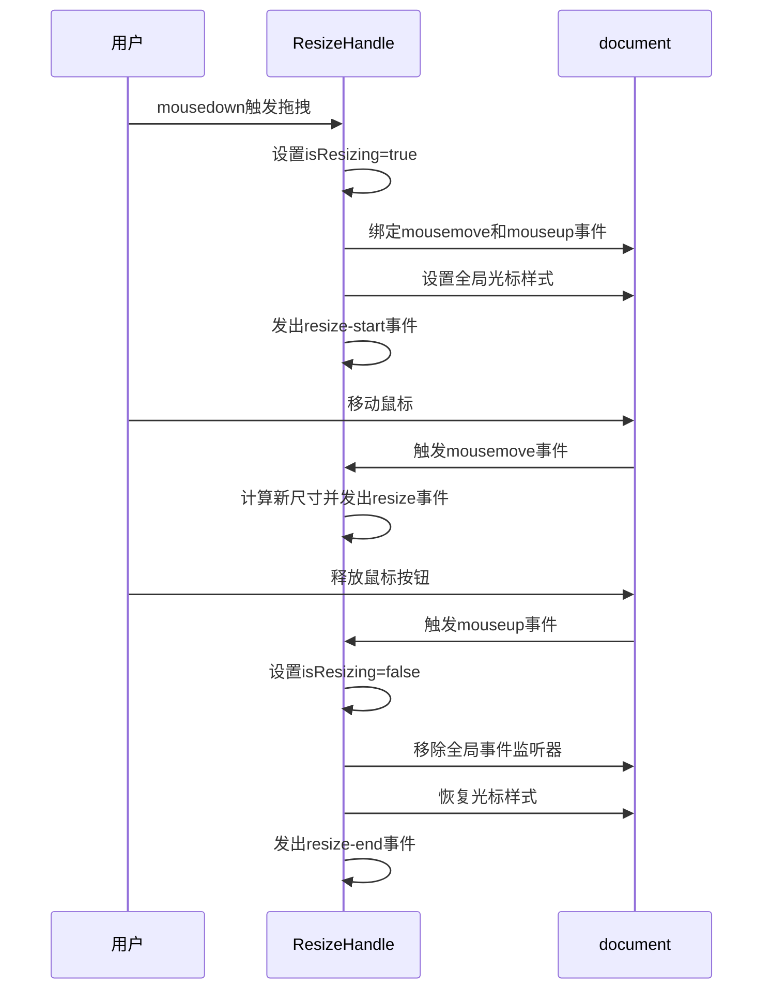
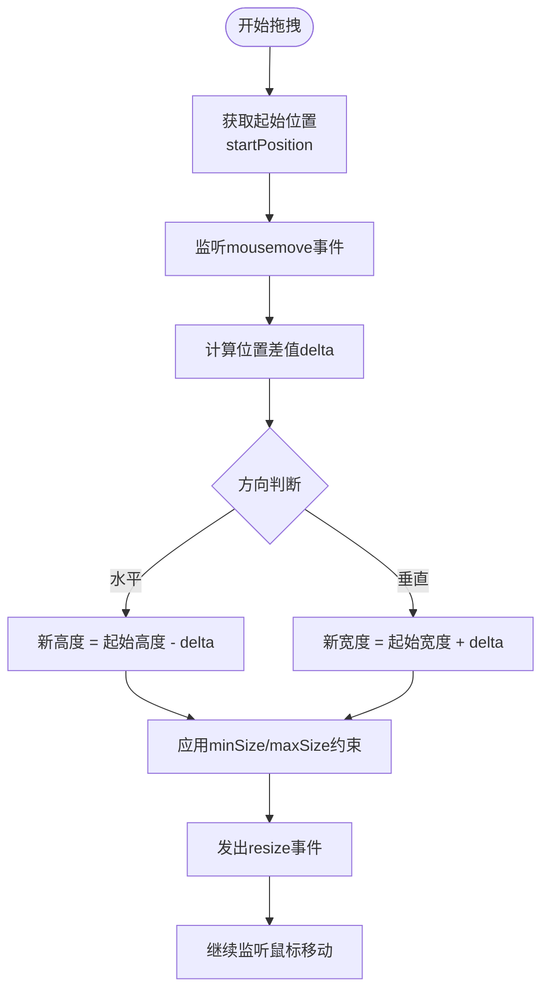
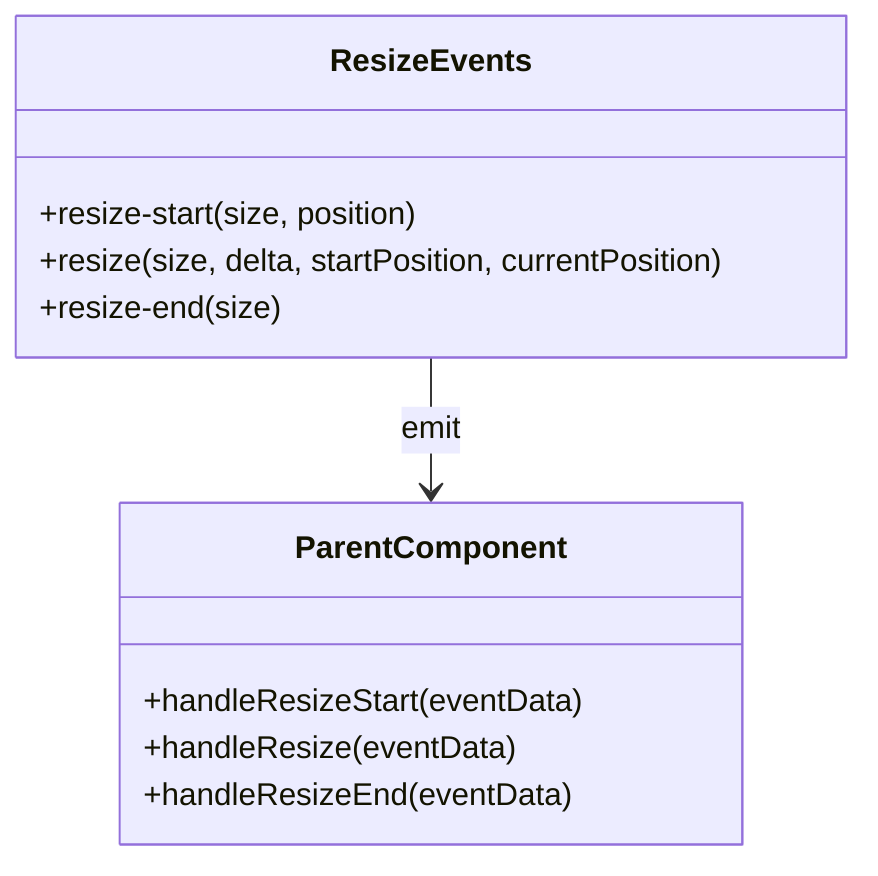
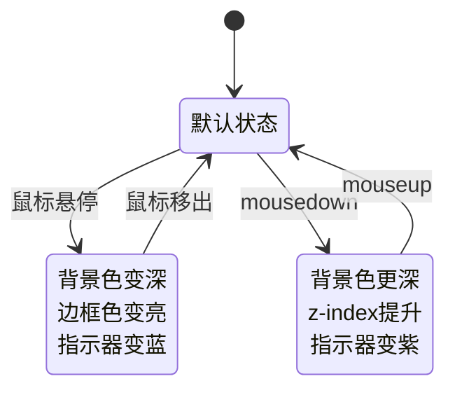
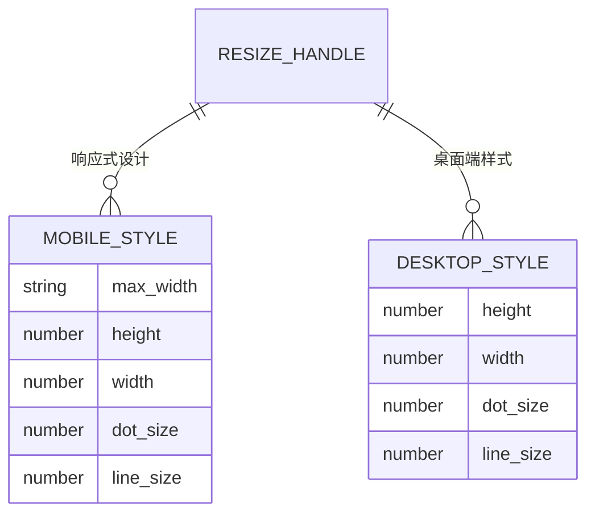
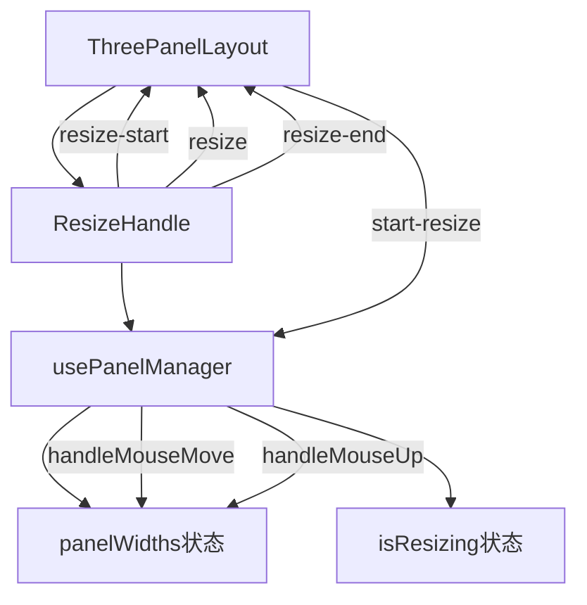

# 拖拽分隔符组件

<cite>
**本文档引用的文件**
- [ResizeHandle.vue](file://src/components/ui/ResizeHandle.vue)
- [usePanelManager.js](file://src/composables/usePanelManager.js)
- [ThreePanelLayout.vue](file://src/components/layout/ThreePanelLayout.vue)
</cite>

## 目录
1. [简介](#简介)
2. [核心功能与职责](#核心功能与职责)
3. [拖拽事件处理机制](#拖拽事件处理机制)
4. [方向控制与尺寸约束](#方向控制与尺寸约束)
5. [事件通信机制](#事件通信机制)
6. [状态管理与UI反馈](#状态管理与ui反馈)
7. [移动端适配策略](#移动端适配策略)
8. [禁用状态与无障碍访问](#禁用状态与无障碍访问)
9. [集成使用示例](#集成使用示例)

## 简介
`ResizeHandle` 是一个可复用的拖拽控制器组件，用于实现用户界面中可调整大小的分隔符功能。该组件通过监听鼠标事件实现跨元素拖拽，支持水平和垂直两种模式，并提供完整的尺寸约束、事件通知和视觉反馈机制。组件设计注重用户体验和无障碍访问，适用于多面板布局的动态调整场景。

**Section sources**
- [ResizeHandle.vue](file://src/components/ui/ResizeHandle.vue#L1-L343)

## 核心功能与职责
`ResizeHandle` 组件作为可复用的拖拽控制器，主要职责包括：
- 提供可视化拖拽手柄，响应用户交互
- 管理拖拽过程中的状态变化
- 计算并限制尺寸调整范围
- 向父级组件广播拖拽过程中的关键事件
- 维护一致的UI反馈和用户体验

组件通过简洁的API设计，实现了高度的可配置性和可复用性，可无缝集成到各种布局系统中。

**Section sources**
- [ResizeHandle.vue](file://src/components/ui/ResizeHandle.vue#L1-L343)

## 拖拽事件处理机制
组件通过标准的鼠标事件处理流程实现拖拽功能：

**Diagram sources**
- [ResizeHandle.vue](file://src/components/ui/ResizeHandle.vue#L58-L152)

**Section sources**
- [ResizeHandle.vue](file://src/components/ui/ResizeHandle.vue#L58-L152)

## 方向控制与尺寸约束
组件通过props提供灵活的配置选项，支持不同的拖拽模式和尺寸限制：

### 属性配置表
| 属性名 | 类型 | 默认值 | 描述 |
|-------|------|-------|------|
| direction | String | "horizontal" | 拖拽方向：horizontal（水平）或vertical（垂直） |
| minSize | Number | 60 | 允许的最小尺寸（像素） |
| maxSize | Number | 300 | 允许的最大尺寸（像素） |
| initialSize | Number | 100 | 初始尺寸（像素） |
| disabled | Boolean | false | 是否禁用拖拽功能 |

### 尺寸计算逻辑

**Diagram sources**
- [ResizeHandle.vue](file://src/components/ui/ResizeHandle.vue#L99-L152)

**Section sources**
- [ResizeHandle.vue](file://src/components/ui/ResizeHandle.vue#L10-L45)

## 事件通信机制
组件通过emit向父级发送三个关键事件，实现拖拽过程的状态通知：

### 事件接口定义

### 事件数据结构
- **resize-start**: `{ size: number, position: number }`
  - size: 起始尺寸
  - position: 鼠标起始位置

- **resize**: `{ size: number, delta: number, startPosition: number, currentPosition: number }`
  - size: 当前计算出的新尺寸
  - delta: 位置变化量
  - startPosition: 起始坐标
  - currentPosition: 当前坐标

- **resize-end**: `{ size: number }`
  - size: 最终确定的尺寸

**Diagram sources**
- [ResizeHandle.vue](file://src/components/ui/ResizeHandle.vue#L55-L57)

**Section sources**
- [ResizeHandle.vue](file://src/components/ui/ResizeHandle.vue#L55-L57)

## 状态管理与UI反馈
组件通过`isResizing`状态变量管理拖拽过程中的UI反馈，提供直观的用户体验：

### 状态样式变化

### 光标样式控制
- 水平拖拽：`ns-resize`（上下箭头）
- 垂直拖拽：`ew-resize`（左右箭头）
- 禁用状态：`not-allowed`（禁止符号）

组件在拖拽开始时修改`document.body.style.cursor`，确保光标样式在整个拖拽过程中保持一致，即使鼠标移出组件区域。

**Diagram sources**
- [ResizeHandle.vue](file://src/components/ui/ResizeHandle.vue#L70-L85)

**Section sources**
- [ResizeHandle.vue](file://src/components/ui/ResizeHandle.vue#L70-L85)

## 移动端适配策略
组件通过CSS媒体查询实现移动端适配，确保在触摸设备上的可用性：

### 移动端优化特性
- **增大点击区域**：在移动设备上将拖拽手柄尺寸从8px增加到12px
- **放大指示元素**：拖拽点和线条尺寸相应增大，提高触摸精度
- **保持功能一致性**：所有拖拽逻辑和事件通信在移动端保持不变

这些适配策略确保了组件在不同设备上的可用性和用户体验一致性。

**Diagram sources**
- [ResizeHandle.vue](file://src/components/ui/ResizeHandle.vue#L274-L342)

**Section sources**
- [ResizeHandle.vue](file://src/components/ui/ResizeHandle.vue#L274-L342)

## 禁用状态与无障碍访问
组件通过`disabled`属性支持禁用状态，并提供相应的视觉反馈和无障碍访问支持：

### 禁用状态样式
- 光标样式：`not-allowed`
- 透明度：降低至50%
- 背景和边框：保持原始颜色，不响应悬停效果

### 无障碍特性
- **标题提示**：通过`title`属性提供拖拽功能的文字说明
- **状态可感知**：通过视觉变化明确传达组件状态
- **键盘不可访问性**：当前版本主要面向鼠标/触摸交互，未实现键盘导航支持

禁用状态下，组件完全阻止拖拽事件的触发，确保在不需要调整布局时的界面稳定性。

**Section sources**
- [ResizeHandle.vue](file://src/components/ui/ResizeHandle.vue#L46-L54)

## 集成使用示例
`ResizeHandle`组件在实际应用中与其他模块协同工作，形成完整的布局调整系统：

在`ThreePanelLayout`组件中，`ResizeHandle`实例化为垂直分隔符，通过事件绑定与`usePanelManager`组合式函数通信，实现三面板布局的动态调整。这种设计模式体现了组件化开发的优势：关注点分离、逻辑复用和界面解耦。

**Diagram sources**
- [ThreePanelLayout.vue](file://src/components/layout/ThreePanelLayout.vue#L1-L514)
- [usePanelManager.js](file://src/composables/usePanelManager.js#L1-L117)

**Section sources**
- [ThreePanelLayout.vue](file://src/components/layout/ThreePanelLayout.vue#L1-L514)
- [usePanelManager.js](file://src/composables/usePanelManager.js#L1-L117)