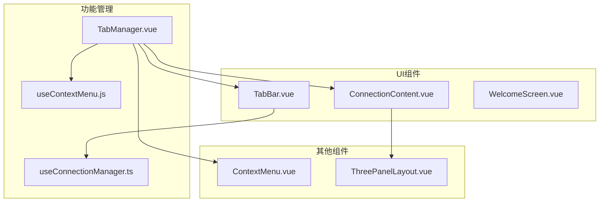
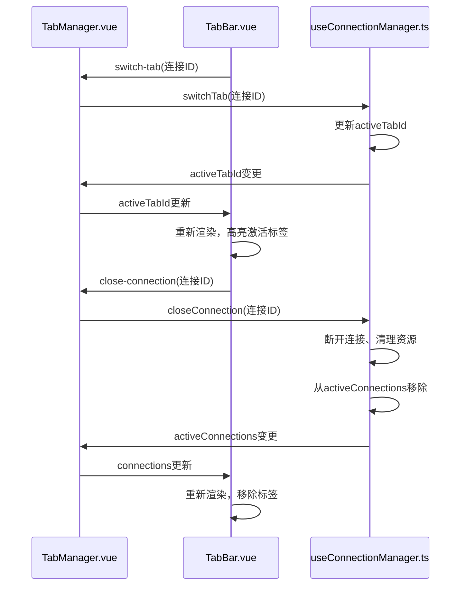
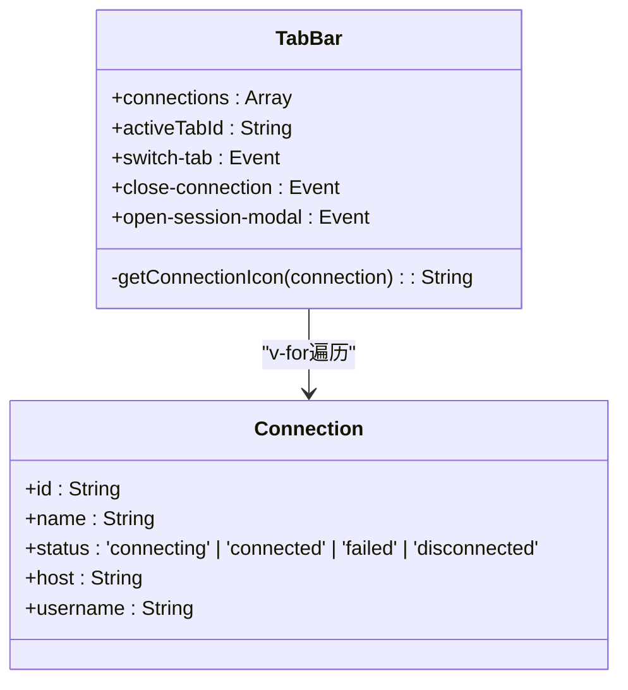
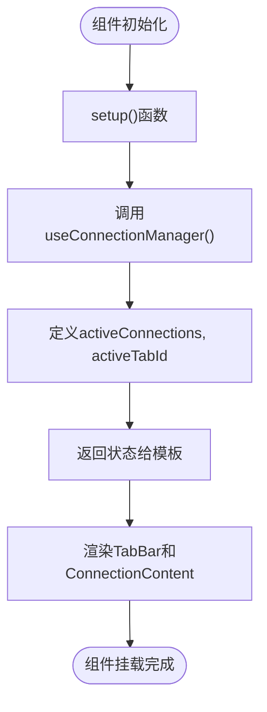
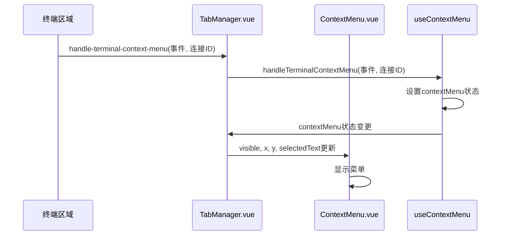
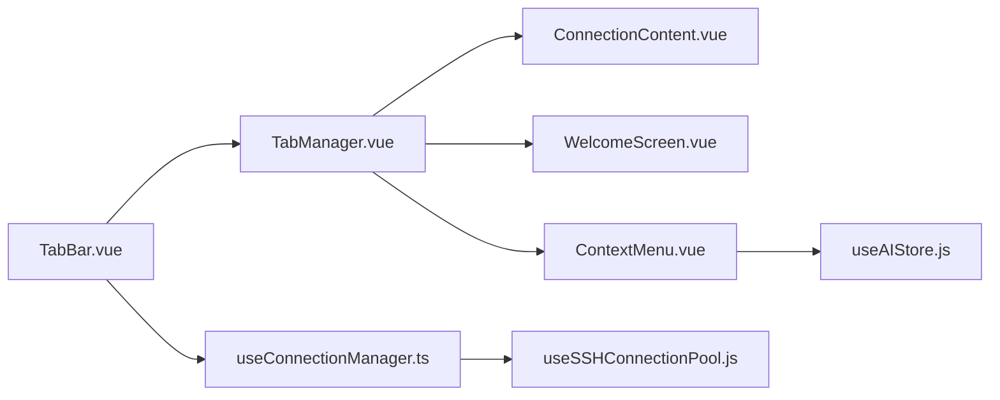

# 标签栏组件

<cite>
**本文档引用的文件**  
- [TabBar.vue](file://src/components/tabs/TabBar.vue)
- [TabManager.vue](file://src/components/TabManager.vue)
- [useConnectionManager.ts](file://src/composables/useConnectionManager.ts)
- [ContextMenu.vue](file://src/components/ContextMenu.vue)
- [useContextMenu.js](file://src/composables/useContextMenu.js)
</cite>

## 目录
1. [简介](#简介)
2. [项目结构](#项目结构)
3. [核心组件](#核心组件)
4. [架构概述](#架构概述)
5. [详细组件分析](#详细组件分析)
6. [依赖分析](#依赖分析)
7. [性能考虑](#性能考虑)
8. [故障排除指南](#故障排除指南)
9. [结论](#结论)

## 简介
本文档深入解析了SSH连接管理应用中的标签栏（TabBar）组件，重点阐述其可视化渲染机制、用户交互逻辑、状态管理及与上下文菜单的集成。该组件作为用户管理多个SSH连接的核心界面元素，实现了动态标签渲染、连接状态可视化、标签切换与关闭等关键功能。

## 项目结构
标签栏组件位于`src/components/tabs/`目录下，是整个应用UI架构的重要组成部分。它与连接管理、终端控制、文件管理等模块紧密协作，构成了完整的多面板工作区。

**图示来源**  
- [TabBar.vue](file://src/components/tabs/TabBar.vue)
- [TabManager.vue](file://src/components/TabManager.vue)
- [useConnectionManager.ts](file://src/composables/useConnectionManager.ts)

**本节来源**  
- [TabBar.vue](file://src/components/tabs/TabBar.vue)
- [TabManager.vue](file://src/components/TabManager.vue)

## 核心组件
`TabBar`组件通过`v-for`指令遍历`connections`数组，动态渲染每个连接的标签。每个标签显示连接名称、状态图标和关闭按钮。组件通过`activeTabId`属性确定当前激活的标签，并通过`$emit`触发事件与父组件通信。

**本节来源**  
- [TabBar.vue](file://src/components/tabs/TabBar.vue#L1-L262)

## 架构概述
标签栏组件采用典型的父子组件通信模式。`TabManager`作为父组件，管理所有连接状态并通过`activeConnections`和`activeTabId`属性向下传递数据。`TabBar`作为子组件，负责UI渲染并通过`$emit`发送事件，由`TabManager`捕获并调用相应的处理函数。

**图示来源**  
- [TabBar.vue](file://src/components/tabs/TabBar.vue)
- [TabManager.vue](file://src/components/TabManager.vue)
- [useConnectionManager.ts](file://src/composables/useConnectionManager.ts)

## 详细组件分析

### TabBar组件分析
`TabBar`组件是标签栏的核心实现，负责所有标签的可视化呈现和用户交互。

#### 可视化渲染机制
组件使用`v-for`指令遍历`connections`数组，为每个连接创建一个`tab-item`。标签的激活状态通过`activeTabId`与连接ID的比对来确定，并应用`active` CSS类。标签的视觉反馈包括：
- **连接中(connecting)**：黄色脉冲动画圆点
- **已连接(connected)**：绿色静态圆点
- **连接失败(failed)**：红色静态圆点
- **已断开(disconnected)**：灰色静态圆点

**图示来源**  
- [TabBar.vue](file://src/components/tabs/TabBar.vue#L1-L262)

#### 用户交互逻辑
用户交互通过事件绑定实现：
- **标签点击**：触发`switch-tab`事件，切换到指定连接
- **关闭按钮点击**：阻止事件冒泡，触发`close-connection`事件
- **新建连接按钮**：触发`open-session-modal`事件，打开连接创建对话框

**本节来源**  
- [TabBar.vue](file://src/components/tabs/TabBar.vue#L1-L262)

### TabManager组件分析
`TabManager`是标签系统的协调中心，负责管理连接状态和组件间通信。

#### 状态管理
`TabManager`通过`useConnectionManager`组合式函数管理`activeConnections`和`activeTabId`两个核心状态。`activeConnections`存储所有活动连接对象，`activeTabId`标识当前激活的连接。

**图示来源**  
- [TabManager.vue](file://src/components/TabManager.vue#L65-L110)
- [useConnectionManager.ts](file://src/composables/useConnectionManager.ts#L12-L518)

#### 事件通信机制
`TabManager`建立了一个清晰的事件通信链路：
1. 用户在`TabBar`上操作
2. `TabBar`通过`$emit`发出事件
3. `TabManager`在模板中监听并捕获事件
4. `TabManager`调用`useConnectionManager`中的相应方法
5. 方法执行业务逻辑并可能更新状态

**本节来源**  
- [TabManager.vue](file://src/components/TabManager.vue#L1-L363)

### 右键菜单集成
标签栏通过与`ContextMenu`组件的集成，提供了丰富的上下文操作。

#### 菜单触发与定位
当用户在终端区域右键点击时，`handleTerminalContextMenu`函数被调用，设置菜单的可见性、位置和选中文本。菜单位置会自动调整以避免超出视窗边界。

**图示来源**  
- [TabManager.vue](file://src/components/TabManager.vue#L105-L158)
- [useContextMenu.js](file://src/composables/useContextMenu.js#L1-L152)
- [ContextMenu.vue](file://src/components/ContextMenu.vue#L1-L210)

#### 菜单项功能
右键菜单提供以下功能：
- **复制**：将选中文本复制到剪贴板
- **添加到AI助手**：将选中文本发送给AI助手进行分析
- **全选**：选择整个终端内容

**本节来源**  
- [ContextMenu.vue](file://src/components/ContextMenu.vue#L1-L210)
- [useContextMenu.js](file://src/composables/useContextMenu.js#L1-L152)

## 依赖分析
`TabBar`组件的依赖关系清晰，主要依赖于状态管理和UI组件。

**图示来源**  
- [TabBar.vue](file://src/components/tabs/TabBar.vue)
- [TabManager.vue](file://src/components/TabManager.vue)
- [useConnectionManager.ts](file://src/composables/useConnectionManager.ts)

**本节来源**  
- [TabBar.vue](file://src/components/tabs/TabBar.vue)
- [TabManager.vue](file://src/components/TabManager.vue)

## 性能考虑
在高并发标签操作下，组件通过以下方式优化性能：
1. **响应式系统**：利用Vue的响应式系统，仅在`connections`或`activeTabId`变化时重新渲染
2. **事件委托**：避免为每个标签单独绑定大量事件监听器
3. **状态集中管理**：通过`useConnectionManager`集中管理连接状态，减少状态同步开销
4. **虚拟滚动**：`tab-list`容器支持水平滚动，可容纳大量标签而不影响性能

**本节来源**  
- [TabBar.vue](file://src/components/tabs/TabBar.vue)
- [useConnectionManager.ts](file://src/composables/useConnectionManager.ts)

## 故障排除指南
### 标签无法切换
- 检查`activeTabId`是否正确传递给`TabBar`
- 确认`switch-tab`事件是否被`TabManager`正确捕获
- 验证`useConnectionManager`中的`switchTab`方法是否执行

### 标签关闭后界面未更新
- 检查`closeConnection`方法是否正确从`activeConnections`数组中移除连接
- 确认`activeTabId`在关闭当前标签时是否正确切换到其他标签

### 右键菜单不显示
- 检查`handleTerminalContextMenu`事件是否被正确触发
- 验证`contextMenu`状态是否在`useContextMenu`中正确更新
- 确认`ContextMenu`组件的`visible`属性是否绑定正确

**本节来源**  
- [TabBar.vue](file://src/components/tabs/TabBar.vue)
- [TabManager.vue](file://src/components/TabManager.vue)
- [useConnectionManager.ts](file://src/composables/useConnectionManager.ts)
- [useContextMenu.js](file://src/composables/useContextMenu.js)

## 结论
`TabBar`组件通过简洁高效的Vue模板语法和清晰的事件通信机制，实现了功能完整的标签管理界面。其与`TabManager`和`useConnectionManager`的协作模式体现了良好的组件分层和关注点分离原则。右键菜单的集成进一步增强了用户体验，为用户提供了一套完整的上下文操作功能。