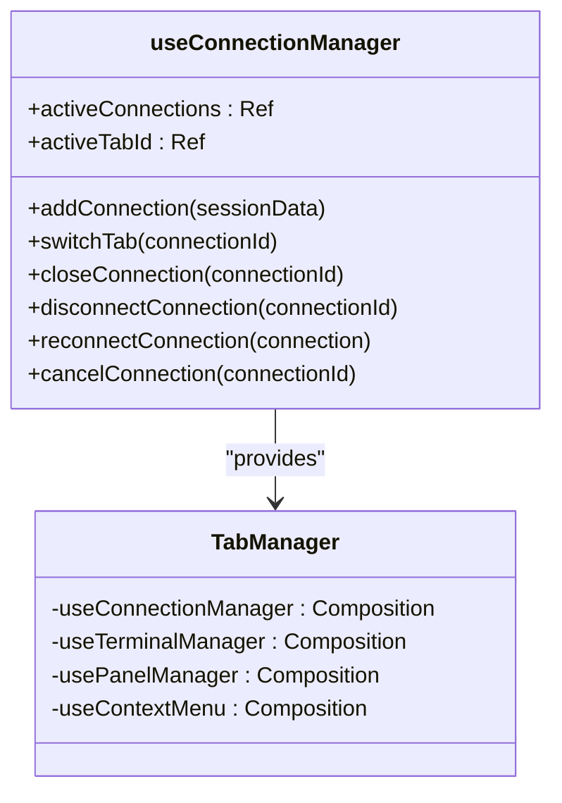
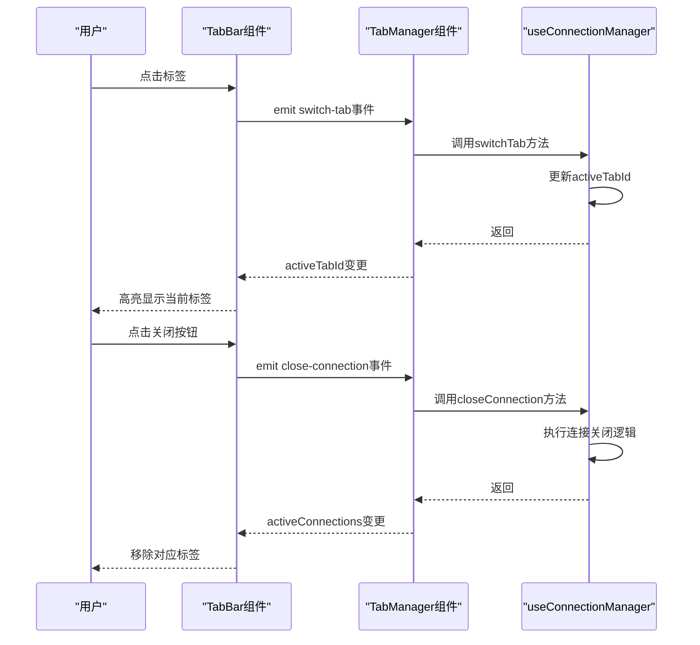
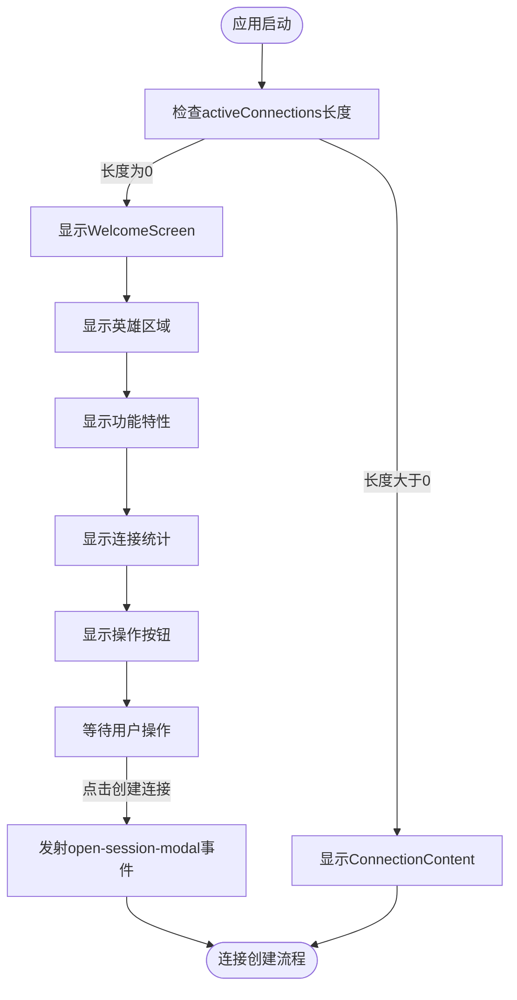
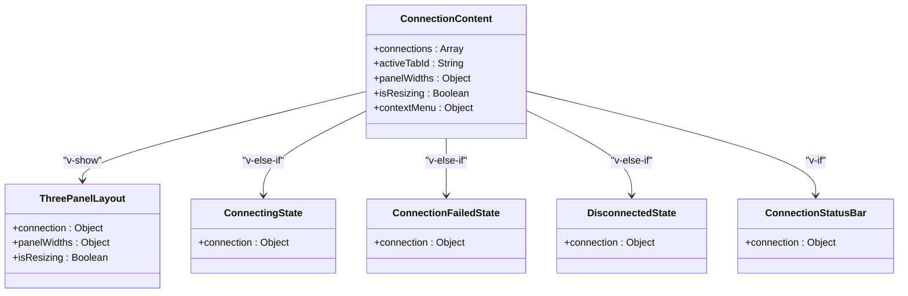
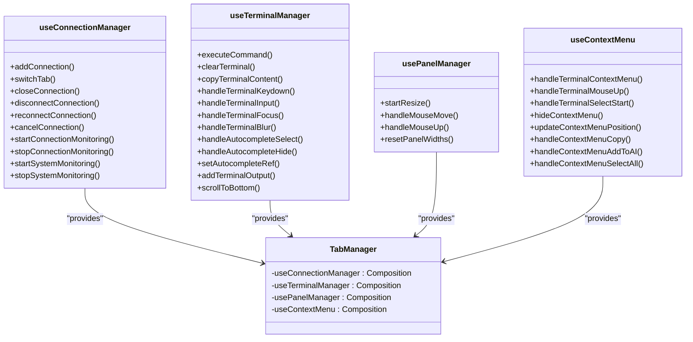
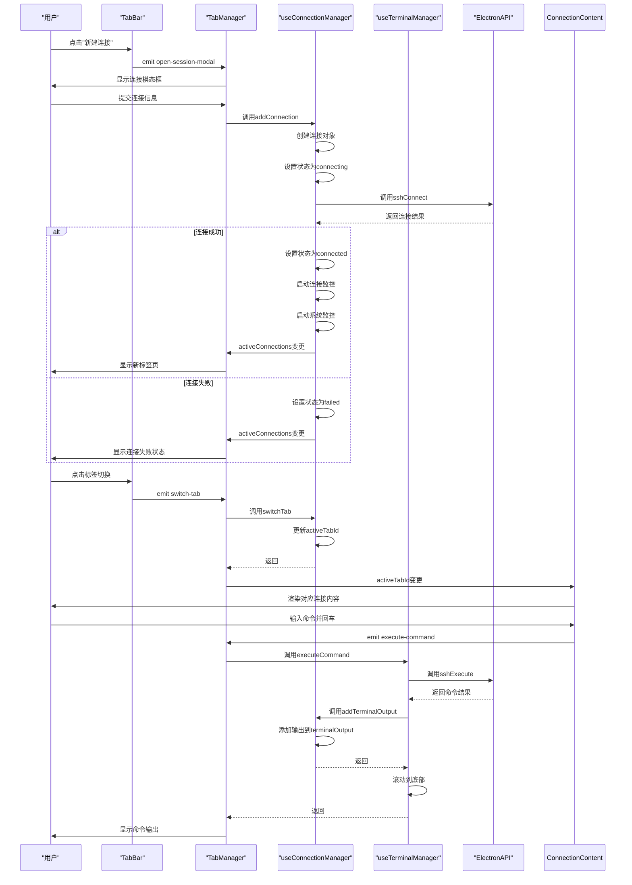
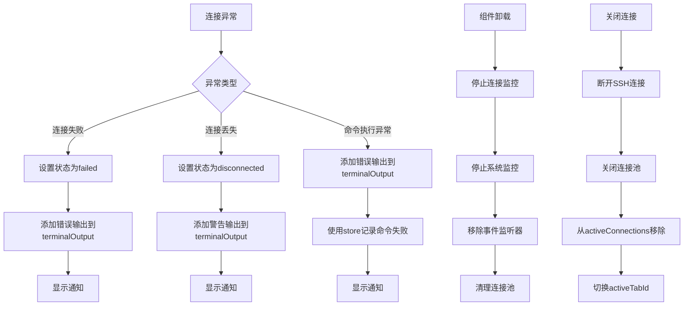

# 标签管理

<cite>
**Referenced Files in This Document**  
- [TabManager.vue](file://src/components/TabManager.vue)
- [TabBar.vue](file://src/components/tabs/TabBar.vue)
- [WelcomeScreen.vue](file://src/components/tabs/WelcomeScreen.vue)
- [ConnectionContent.vue](file://src/components/tabs/ConnectionContent.vue)
- [useConnectionManager.ts](file://src/composables/useConnectionManager.ts)
- [useTerminalManager.ts](file://src/modules/terminal/composables/useTerminalManager.ts)
</cite>

## 目录
1. [引言](#引言)
2. [核心状态管理](#核心状态管理)
3. [标签栏组件](#标签栏组件)
4. [欢迎界面](#欢迎界面)
5. [连接内容渲染](#连接内容渲染)
6. [组合式函数集成](#组合式函数集成)
7. [事件流分析](#事件流分析)
8. [异常处理与资源清理](#异常处理与资源清理)

## 引言
本文档深入解析多标签会话管理系统的核心组件TabManager，全面阐述其架构设计与实现机制。系统通过响应式状态管理实现标签页的动态渲染与切换，为用户提供高效的SSH远程连接管理体验。文档将详细说明activeConnections和activeTabId状态如何驱动整个标签系统，分析TabBar、WelcomeScreen和ConnectionContent等核心组件的交互逻辑，并揭示useConnectionManager和useTerminalManager等组合式函数如何集成核心业务逻辑。

## 核心状态管理
标签管理系统的核心在于两个响应式状态：activeConnections和activeTabId。这两个状态由useConnectionManager组合式函数提供，作为整个标签系统数据流的源头。

**activeConnections**是一个响应式数组，存储所有活动的SSH连接对象。每个连接对象包含连接ID、名称、主机、端口、用户名、认证方式、连接状态、终端输出等关键信息。该状态的变更会自动触发UI的重新渲染。

**activeTabId**是一个响应式字符串，标识当前激活的标签页ID。当用户切换标签或创建新连接时，该值会更新，从而驱动ConnectionContent组件显示对应连接的内容。

这些状态通过组合式函数被TabManager组件使用，实现了状态与UI的解耦，使得状态管理逻辑可以被多个组件复用。

**Section sources**
- [useConnectionManager.ts](file://src/composables/useConnectionManager.ts#L12-L13)
- [TabManager.vue](file://src/components/TabManager.vue#L100-L105)

## 标签栏组件
TabBar组件负责标签页的可视化展示与用户交互，是用户操作标签的主要界面。

TabBar组件接收来自TabManager的connections和activeTabId属性，通过v-for指令动态渲染标签列表。每个标签显示连接名称、状态图标和关闭按钮。状态图标使用不同的emoji表示连接状态：连接中(⏳)、已连接(🟢)、连接失败(❌)、已断开(🔌)。

用户交互通过事件发射器实现：
- 点击标签触发`switch-tab`事件，通知TabManager切换到指定标签
- 点击关闭按钮触发`close-connection`事件，通知TabManager关闭指定连接
- 点击"新建连接"按钮触发`open-session-modal`事件，打开连接创建模态框

当没有活动连接时，TabBar显示"暂无连接"的提示信息和"创建第一个连接"的按钮，引导用户创建新连接。

**Section sources**
- [TabBar.vue](file://src/components/tabs/TabBar.vue#L1-L263)
- [TabManager.vue](file://src/components/TabManager.vue#L10-L20)

## 欢迎界面
WelcomeScreen组件在无活动连接时显示，提供用户引导和功能介绍。

WelcomeScreen采用现代化的UI设计，包含以下主要区域：
- **英雄区域**：显示应用Logo、标题"SSH Remote"和标语"企业级SSH远程连接管理平台"
- **功能特性区域**：展示六个核心功能（安全认证、完整终端、文件管理、AI助手、快速连接、配置保存）
- **统计信息区域**：显示已保存连接数量和最后连接时间
- **操作按钮区域**：提供"创建连接"和"使用指南"按钮

当用户点击"创建连接"按钮时，组件发射`open-session-modal`事件，触发连接创建流程。点击"使用指南"按钮会显示帮助模态框，详细介绍应用的使用方法。

**Section sources**
- [WelcomeScreen.vue](file://src/components/tabs/WelcomeScreen.vue#L1-L799)
- [TabManager.vue](file://src/components/TabManager.vue#L25-L30)

## 连接内容渲染
ConnectionContent组件根据当前激活的标签动态渲染对应的连接内容。

该组件通过v-for指令遍历所有连接，但仅显示activeTabId匹配的连接。根据连接状态，组件会渲染不同的子组件：
- **connected状态**：渲染ThreePanelLayout（三面板布局）和ConnectionStatusBar（连接状态栏）
- **connecting状态**：渲染ConnectingState（连接中状态）
- **failed状态**：渲染ConnectionFailedState（连接失败状态）
- **disconnected状态**：渲染DisconnectedState（已断开连接状态）

这种条件渲染机制确保了用户界面始终反映当前连接的真实状态。组件通过事件发射器将用户操作（如执行命令、清空终端、复制内容等）传递给TabManager，实现了组件间的解耦。

**Section sources**
- [ConnectionContent.vue](file://src/components/tabs/ConnectionContent.vue#L1-L145)
- [TabManager.vue](file://src/components/TabManager.vue#L32-L88)

## 组合式函数集成
TabManager组件通过多个组合式函数集成核心业务逻辑，实现了功能的模块化和复用。

**useConnectionManager**是核心状态管理函数，提供连接的增删改查、状态监控、系统信息更新等功能。它维护activeConnections和activeTabId两个响应式状态，是整个标签系统数据流的源头。

**useTerminalManager**负责终端相关的业务逻辑，包括命令执行、终端输出处理、ANSI转义序列转换、滚动控制、复制功能等。它与useConnectionManager协同工作，为用户提供完整的终端体验。

**usePanelManager**管理三面板布局的宽度调整，处理鼠标事件，实现用户对文件、终端、AI面板的自定义布局。

**useContextMenu**处理右键菜单的显示与交互，支持复制、选择全部、添加到AI助手等操作。

这些组合式函数通过依赖注入的方式被TabManager使用，实现了关注点分离，提高了代码的可维护性和可测试性。

**Section sources**
- [TabManager.vue](file://src/components/TabManager.vue#L100-L140)
- [useConnectionManager.ts](file://src/composables/useConnectionManager.ts#L10-L538)
- [useTerminalManager.ts](file://src/modules/terminal/composables/useTerminalManager.ts#L3-L268)

## 事件流分析
标签系统的完整事件流从用户交互开始，经过组件间传递，最终由组合式函数处理。

以标签创建为例，事件流如下：
1. 用户在TabBar点击"新建连接"按钮
2. TabBar发射`open-session-modal`事件
3. TabManager接收事件并显示连接创建模态框
4. 用户填写连接信息并提交
5. TabManager调用useConnectionManager的addConnection方法
6. useConnectionManager创建连接对象并调用ElectronAPI建立SSH连接
7. 连接成功后，更新activeConnections状态
8. 状态变更触发UI重新渲染，显示新标签页

标签切换和命令执行的事件流遵循类似的模式，体现了清晰的单向数据流设计。

**Section sources**
- [TabManager.vue](file://src/components/TabManager.vue#L10-L88)
- [useConnectionManager.ts](file://src/composables/useConnectionManager.ts#L31-L79)
- [useTerminalManager.ts](file://src/modules/terminal/composables/useTerminalManager.ts#L10-L30)

## 异常处理与资源清理
系统在异常处理和资源清理方面有完善的策略，确保应用的稳定性和资源的有效管理。

**异常处理策略**：
- **连接失败**：捕获连接异常，设置连接状态为'failed'，在终端输出错误信息，并显示通知
- **连接丢失**：通过心跳检测发现连接丢失，设置状态为'disconnected'，通知用户
- **命令执行异常**：捕获命令执行过程中的异常，在终端显示错误信息，并记录到终端store
- **ElectronAPI不可用**：检查ElectronAPI是否存在，避免在非Electron环境中运行时出现错误

**资源清理策略**：
- **组件卸载时**：在onUnmounted钩子中停止所有连接监控和系统监控，移除事件监听器，清理连接池
- **关闭连接时**：先断开SSH连接，再关闭连接池，最后从activeConnections中移除连接对象
- **切换标签时**：更新连接的最后活动时间，用于连接超时管理
- **内存管理**：限制终端输出历史记录为1000条，超过后保留最近500条，防止内存泄漏

这些策略确保了系统在各种异常情况下都能优雅地处理，避免资源泄漏和状态不一致的问题。

**Section sources**
- [useConnectionManager.ts](file://src/composables/useConnectionManager.ts#L311-L349)
- [TabManager.vue](file://src/components/TabManager.vue#L260-L270)
- [useTerminalManager.ts](file://src/modules/terminal/composables/useTerminalManager.ts#L100-L120)