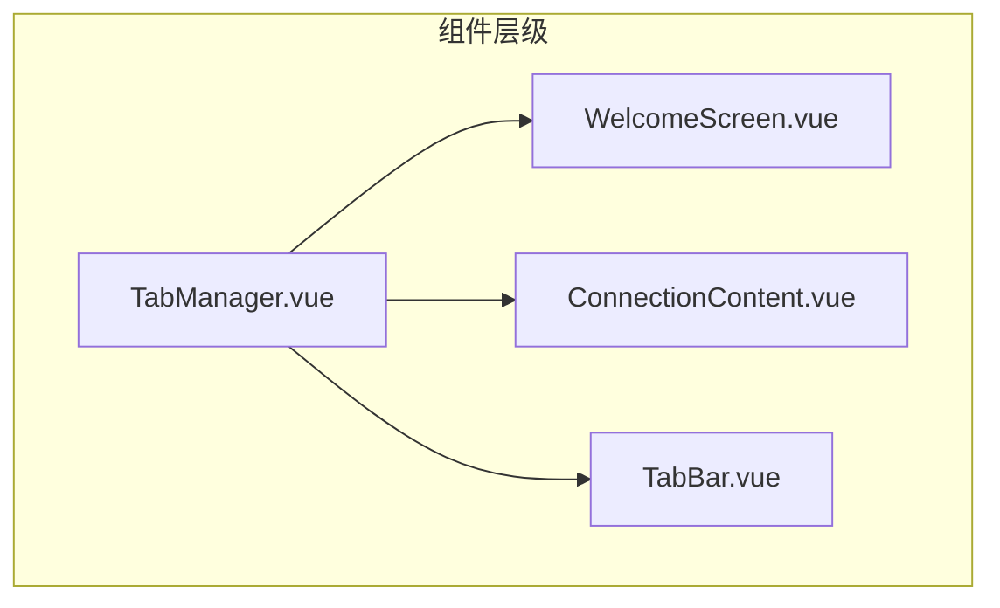
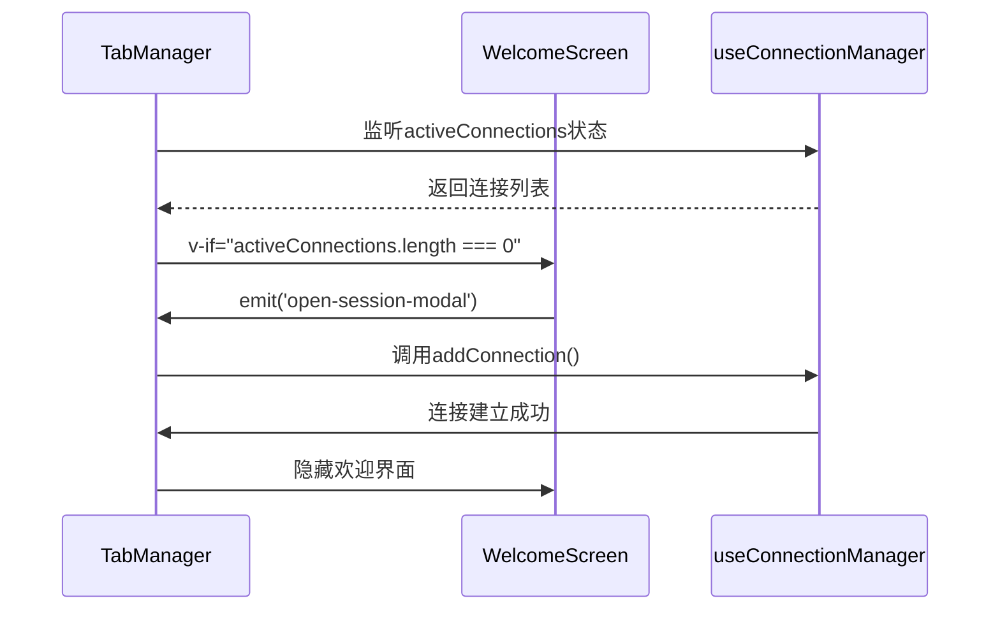
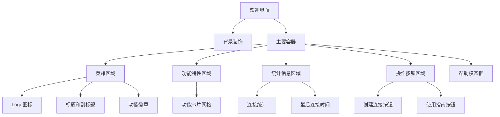
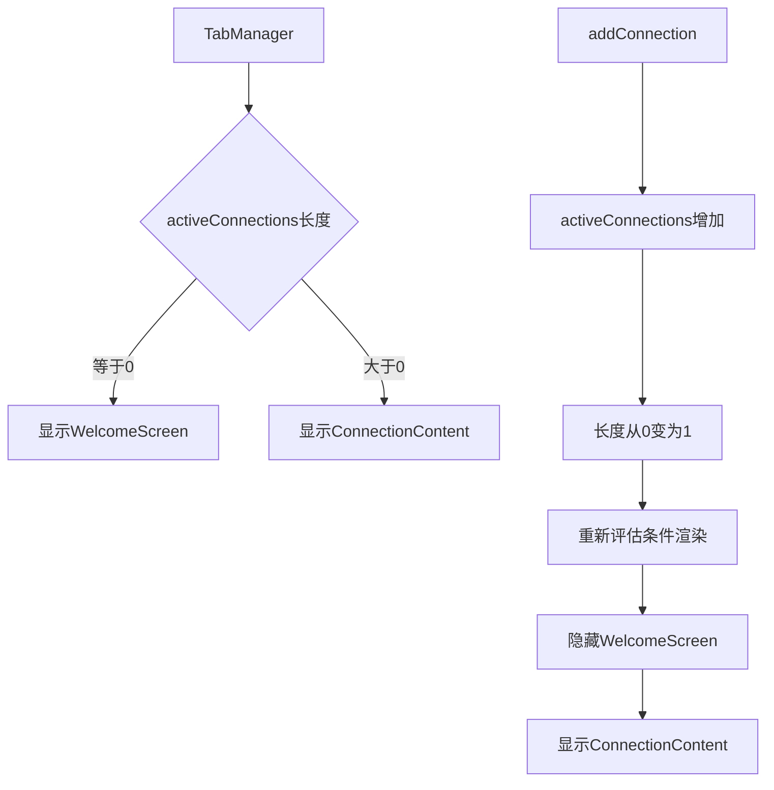
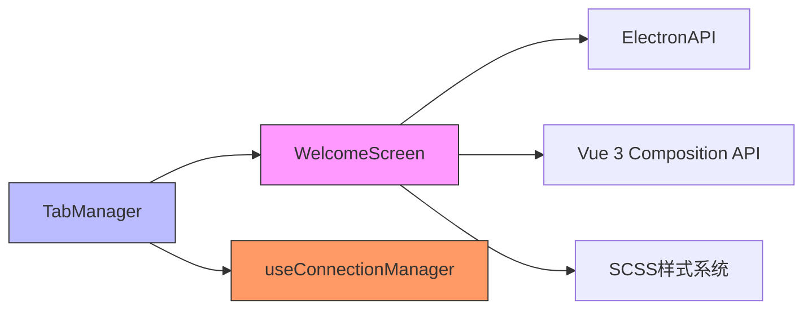

# 欢迎界面

<cite>
**本文档引用文件**  
- [WelcomeScreen.vue](file://src/components/tabs/WelcomeScreen.vue)
- [TabManager.vue](file://src/components/TabManager.vue)
- [useConnectionManager.ts](file://src/composables/useConnectionManager.ts)
</cite>

## 目录
1. [引言](#引言)
2. [项目结构](#项目结构)
3. [核心组件](#核心组件)
4. [架构概述](#架构概述)
5. [详细组件分析](#详细组件分析)
6. [依赖分析](#依赖分析)
7. [性能考虑](#性能考虑)
8. [故障排除指南](#故障排除指南)
9. [结论](#结论)

## 引言
欢迎界面是SSH远程连接管理平台的入口引导界面，当用户未建立任何活动连接时自动显示。该界面不仅提供美观的视觉体验，还承担着关键的用户体验引导功能，帮助新用户快速上手并为老用户提供便捷的连接入口。

## 项目结构
欢迎界面组件位于项目的组件层级结构中，作为标签页系统的一部分，与其他核心组件协同工作。



**图示来源**  
- [TabManager.vue](file://src/components/TabManager.vue#L1-L364)

**本节来源**  
- [TabManager.vue](file://src/components/TabManager.vue#L1-L364)

## 核心组件
`WelcomeScreen` 组件是应用的初始界面，当没有活动连接时显示。它包含多个功能区域：英雄区域展示应用品牌，功能特性区域介绍核心功能，统计信息区域显示最近连接状态，操作按钮区域提供快捷入口。

**本节来源**  
- [WelcomeScreen.vue](file://src/components/tabs/WelcomeScreen.vue#L1-L1091)

## 架构概述
欢迎界面通过条件渲染机制与全局连接状态管理系统集成，形成完整的用户体验闭环。



**图示来源**  
- [TabManager.vue](file://src/components/TabManager.vue#L1-L364)
- [WelcomeScreen.vue](file://src/components/tabs/WelcomeScreen.vue#L1-L1091)
- [useConnectionManager.ts](file://src/composables/useConnectionManager.ts#L1-L540)

## 详细组件分析

### 欢迎界面分析
`WelcomeScreen` 组件在无活动连接时作为应用的引导界面，提供直观的用户引导和快捷操作入口。

#### 界面布局结构
欢迎界面采用响应式布局，包含多个功能区域：



**图示来源**  
- [WelcomeScreen.vue](file://src/components/tabs/WelcomeScreen.vue#L1-L1091)

#### 最近连接列表展示逻辑
组件通过Electron API异步加载最近的会话数据，并根据连接状态计算最后连接时间：

```mermaid
flowchart TD
A[组件挂载] --> B[调用loadRecentSessions]
B --> C{ElectronAPI可用?}
C --> |是| D[调用getSessions()]
C --> |否| E[跳过加载]
D --> F[设置recentSessions数据]
F --> G[计算lastConnected计算属性]
G --> H{最近会话存在?}
H --> |是| I[显示统计信息区域]
H --> |否| J[隐藏统计信息区域]
```

**图示来源**  
- [WelcomeScreen.vue](file://src/components/tabs/WelcomeScreen.vue#L1-L1091)

**本节来源**  
- [WelcomeScreen.vue](file://src/components/tabs/WelcomeScreen.vue#L1-L1091)

### 全局连接状态响应机制
欢迎界面通过父组件的条件渲染机制响应全局连接状态变化。

#### 自动隐藏逻辑
当首个连接建立后，欢迎界面自动隐藏，切换到连接内容界面：



**图示来源**  
- [TabManager.vue](file://src/components/TabManager.vue#L1-L364)
- [useConnectionManager.ts](file://src/composables/useConnectionManager.ts#L1-L540)

**本节来源**  
- [TabManager.vue](file://src/components/TabManager.vue#L1-L364)

## 依赖分析
欢迎界面组件与其他核心模块存在明确的依赖关系。



**图示来源**  
- [WelcomeScreen.vue](file://src/components/tabs/WelcomeScreen.vue#L1-L1091)
- [TabManager.vue](file://src/components/TabManager.vue#L1-L364)
- [useConnectionManager.ts](file://src/composables/useConnectionManager.ts#L1-L540)

**本节来源**  
- [WelcomeScreen.vue](file://src/components/tabs/WelcomeScreen.vue#L1-L1091)
- [TabManager.vue](file://src/components/TabManager.vue#L1-L364)

## 性能考虑
欢迎界面在设计时考虑了性能优化，确保快速加载和流畅交互。

- **异步数据加载**：最近会话数据在组件挂载后异步加载，避免阻塞主界面渲染
- **条件渲染**：统计信息区域仅在有最近会话时渲染，减少DOM节点数量
- **事件委托**：使用单一事件监听器处理多个按钮的点击事件
- **内存管理**：帮助模态框在关闭时完全销毁，避免内存泄漏

## 故障排除指南
以下是欢迎界面常见问题的排查方法：

**本节来源**  
- [WelcomeScreen.vue](file://src/components/tabs/WelcomeScreen.vue#L1-L1091)
- [TabManager.vue](file://src/components/TabManager.vue#L1-L364)

## 结论
欢迎界面作为SSH远程连接管理平台的入口，不仅提供了美观的视觉设计，更重要的是实现了完整的用户体验引导闭环。通过与全局连接状态管理系统的深度集成，该组件能够智能地响应应用状态变化，在无连接时提供引导，在有连接时自动退场，确保了用户界面的简洁性和功能性平衡。其响应式设计和动效实现进一步提升了用户体验，使应用既专业又友好。