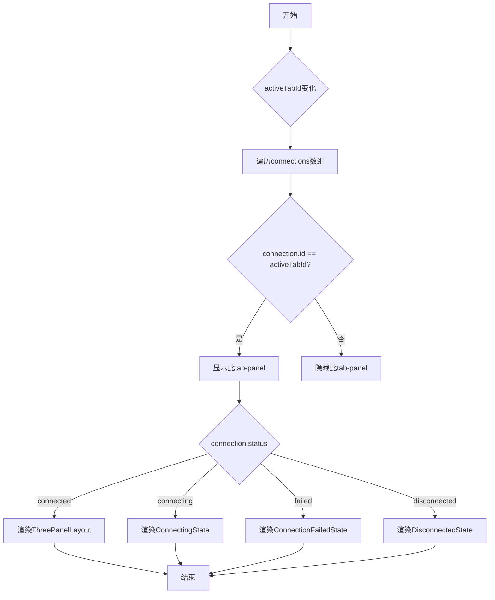
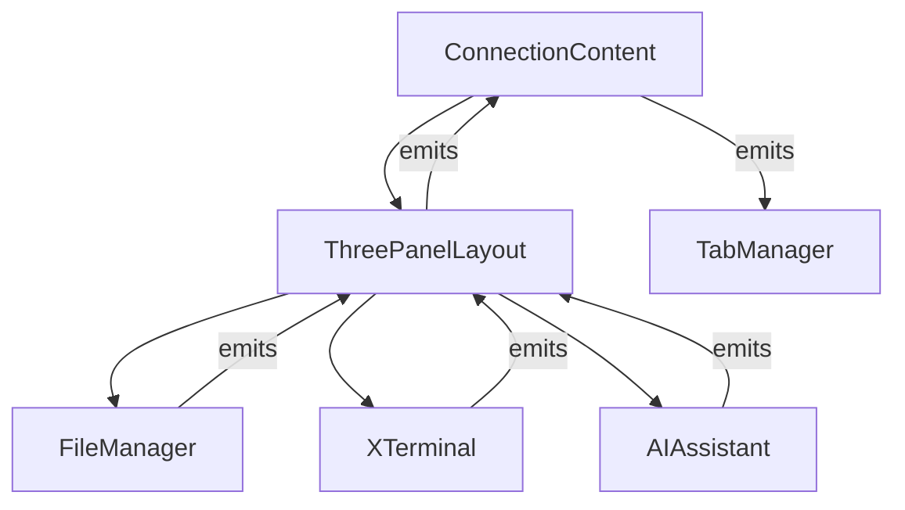

# 连接内容区域

<cite>
**本文档引用的文件**
- [ConnectionContent.vue](file://src/components/tabs/ConnectionContent.vue)
- [ThreePanelLayout.vue](file://src/components/layout/ThreePanelLayout.vue)
- [XTerminal.vue](file://src/modules/terminal/components/XTerminal.vue)
- [FileManager.vue](file://src/modules/file-manager/components/FileManager.vue)
- [AIAssistant.vue](file://src/modules/ai-assistant/components/AIAssistant.vue)
- [useConnectionManager.ts](file://src/composables/useConnectionManager.ts)
- [TabManager.vue](file://src/components/TabManager.vue)
</cite>

## 目录
1. [简介](#简介)
2. [核心职责](#核心职责)
3. [状态管理与渲染逻辑](#状态管理与渲染逻辑)
4. [懒加载与缓存机制](#懒加载与缓存机制)
5. [三面板布局集成](#三面板布局集成)
6. [子模块集成与通信](#子模块集成与通信)
7. [异常处理与降级显示](#异常处理与降级显示)
8. [事件流与状态同步](#事件流与状态同步)
9. [结论](#结论)

## 简介
`ConnectionContent` 组件是 SSHCode 应用中的核心内容容器，负责在标签页系统中动态管理和渲染与特定 SSH 连接相关的用户界面。它作为连接状态（如连接中、已连接、连接失败）的中央协调器，根据当前活动的标签页（`activeTabId`）智能地切换和展示相应的 UI 状态。该组件通过集成终端、文件管理器和 AI 助手三大功能模块，为用户提供了一个一体化的远程开发环境。其设计遵循了响应式和事件驱动的架构原则，确保了界面的流畅性和数据的一致性。

**Section sources**
- [ConnectionContent.vue](file://src/components/tabs/ConnectionContent.vue)

## 核心职责
`ConnectionContent` 组件的核心职责是作为一个智能的内容路由和状态管理器。它接收来自父组件（如 `TabManager`）的 `connections` 数组和 `activeTabId` 作为输入。通过 `v-for` 指令遍历所有连接，并利用 `v-show` 指令精确地控制哪个连接的 UI 面板是可见的。当 `activeTabId` 发生变化时，组件会立即重新计算，隐藏所有非活动的连接面板，并显示与 `activeTabId` 匹配的那个连接的面板。

其主要职责包括：
- **状态驱动渲染**：根据连接对象的 `status` 属性（`connecting`, `connected`, `failed`, `disconnected`）决定渲染哪个子组件。例如，当状态为 `connected` 时，渲染 `ThreePanelLayout`；当状态为 `connecting` 时，渲染 `ConnectingState`。
- **内容容器**：作为 `ThreePanelLayout` 的直接父容器，它为已建立的连接提供了一个结构化的布局框架。
- **事件代理**：将子组件（如 `ThreePanelLayout`）发出的底层事件（如 `execute-command`）向上冒泡到更高级别的组件（如 `TabManager`），实现了清晰的事件处理分层。

**Section sources**
- [ConnectionContent.vue](file://src/components/tabs/ConnectionContent.vue)

## 状态管理与渲染逻辑
`ConnectionContent` 的渲染逻辑完全由 `connections` 和 `activeTabId` 两个 `props` 驱动。其模板结构是一个 `div` 容器，内部通过 `v-for` 循环为每个连接创建一个 `tab-panel`。`v-show` 指令是实现标签页切换的关键，它通过比较 `connection.id` 和 `activeTabId` 来决定该面板的显示状态。

**Diagram sources**
- [ConnectionContent.vue](file://src/components/tabs/ConnectionContent.vue#L1-L144)

**Section sources**
- [ConnectionContent.vue](file://src/components/tabs/ConnectionContent.vue#L1-L144)

## 懒加载与缓存机制
`ConnectionContent` 组件本身不直接实现懒加载，而是通过其父组件 `TabManager` 和 Vue 的响应式系统间接实现了高效的资源管理。当一个标签页非活动时，其对应的 `tab-panel` 仅仅是被 `v-show` 隐藏，其内部的组件实例（如 `ThreePanelLayout`、`XTerminal`）并未被销毁。这本质上是一种**缓存机制**，避免了在频繁切换标签页时重复创建和销毁复杂组件的开销，从而提升了初始渲染和切换的性能。

真正的“懒加载”体现在组件的初始化时机上。例如，`XTerminal` 组件只有在 `ThreePanelLayout` 被渲染到 DOM 中时才会通过 `onMounted` 生命周期钩子进行初始化。这意味着，一个未连接或非活动的连接，其终端实例不会被创建，从而节省了内存和计算资源。这种按需初始化的模式就是一种典型的懒加载策略。

**Section sources**
- [ConnectionContent.vue](file://src/components/tabs/ConnectionContent.vue)
- [ThreePanelLayout.vue](file://src/components/layout/ThreePanelLayout.vue)
- [XTerminal.vue](file://src/modules/terminal/components/XTerminal.vue)

## 三面板布局集成
`ConnectionContent` 通过 `ThreePanelLayout` 组件集成了应用的三大核心功能。当连接状态为 `connected` 时，`ThreePanelLayout` 被渲染，它将界面划分为三个可调整宽度的垂直面板：文件管理、终端和 AI 助手。

`ConnectionContent` 将 `connection` 对象、`panelWidths` 和 `isResizing` 状态作为 `props` 传递给 `ThreePanelLayout`。更重要的是，它通过 `@` 语法（`v-on` 的缩写）监听 `ThreePanelLayout` 发出的大量事件，并将这些事件原封不动地通过 `$emit` 向上传递给 `TabManager`。这建立了一个清晰的“事件代理”模式，使得 `ConnectionContent` 成为了子模块与应用全局状态管理之间的桥梁。

**Diagram sources**
- [ConnectionContent.vue](file://src/components/tabs/ConnectionContent.vue#L10-L24)
- [ThreePanelLayout.vue](file://src/components/layout/ThreePanelLayout.vue)

**Section sources**
- [ConnectionContent.vue](file://src/components/tabs/ConnectionContent.vue#L10-L24)
- [ThreePanelLayout.vue](file://src/components/layout/ThreePanelLayout.vue)

## 子模块集成与通信
`ConnectionContent` 与子模块的集成主要通过 `props` 传递和事件监听（`emits`）两种机制实现。

- **Props 传递**：`ConnectionContent` 将 `connection` 对象传递给 `ThreePanelLayout`，后者再将其分别传递给 `FileManager`、`XTerminal` 和 `AIAssistant`。这使得每个子模块都能访问到当前连接的详细信息（如 `id`, `host`, `username`）。
- **事件监听与转发**：`ConnectionContent` 在模板中声明了对 `ThreePanelLayout` 所有事件的监听。例如，当用户在 `XTerminal` 中请求执行命令时，事件流为：`XTerminal` → `ThreePanelLayout` → `ConnectionContent` → `TabManager`。`ConnectionContent` 在这个链条中扮演了透明的中继角色，确保了事件能够正确地从最底层的 UI 组件传递到顶层的业务逻辑处理器。

**Section sources**
- [ConnectionContent.vue](file://src/components/tabs/ConnectionContent.vue)
- [ThreePanelLayout.vue](file://src/components/layout/ThreePanelLayout.vue)

## 异常处理与降级显示
`ConnectionContent` 组件内置了对各种连接状态的降级显示方案，确保了用户在任何情况下都能获得清晰的反馈。

- **连接中**：渲染 `ConnectingState` 组件，显示加载动画和连接进度，告知用户连接正在进行。
- **连接失败**：渲染 `ConnectionFailedState` 组件，显示错误信息，并提供“重连”和“编辑”会话的按钮，引导用户进行故障排除。
- **已断开**：渲染 `DisconnectedState` 组件，显示连接已断开的状态，并提供“重连”按钮，允许用户快速恢复连接。

这些状态组件共同构成了一个健壮的异常处理体系，将潜在的连接问题从技术细节层面提升为用户友好的交互界面，极大地提升了应用的可用性和用户体验。

**Section sources**
- [ConnectionContent.vue](file://src/components/tabs/ConnectionContent.vue#L25-L45)

## 事件流与状态同步
整个应用的事件流和状态同步依赖于 `ConnectionContent` 所处的组件层级。`TabManager` 通过 `useConnectionManager` 组合式函数管理着所有连接的全局状态（`activeConnections`, `activeTabId`）。当用户切换标签页时，`TabManager` 更新 `activeTabId`，这一变化会作为 `props` 流向 `ConnectionContent`，触发其重新渲染。

同时，用户在子模块中的操作（如在终端中输入命令）会触发事件，这些事件沿着 `子模块 → ThreePanelLayout → ConnectionContent → TabManager` 的路径向上传递。`TabManager` 接收到事件后，会调用相应的业务逻辑函数（如 `executeCommand`），这些函数可能会修改全局状态（如向 `terminalOutput` 添加新行），从而再次触发视图更新，形成一个完整的“状态变更 -> 视图更新 -> 用户交互 -> 事件 -> 状态变更”的闭环。

**Section sources**
- [TabManager.vue](file://src/components/TabManager.vue)
- [useConnectionManager.ts](file://src/composables/useConnectionManager.ts)
- [ConnectionContent.vue](file://src/components/tabs/ConnectionContent.vue)

## 结论
`ConnectionContent` 组件是 SSHCode 应用标签页系统中的关键枢纽。它通过简洁而强大的状态驱动渲染逻辑，实现了多连接内容的动态切换。其采用的缓存机制和与 `ThreePanelLayout` 的深度集成，确保了应用的高性能和功能完整性。通过清晰的 `props` 和事件通信模式，它有效地协调了终端、文件管理和 AI 助手三大模块。此外，其内置的多种状态视图为连接异常提供了优雅的降级方案。总体而言，`ConnectionContent` 的设计体现了高内聚、低耦合的原则，是构建复杂、响应式前端应用的典范。