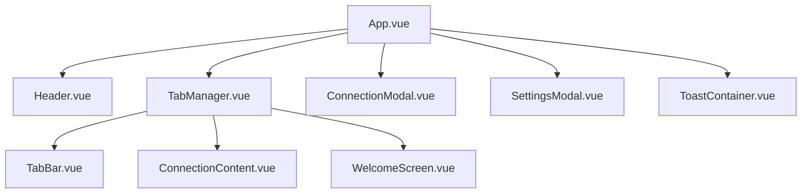
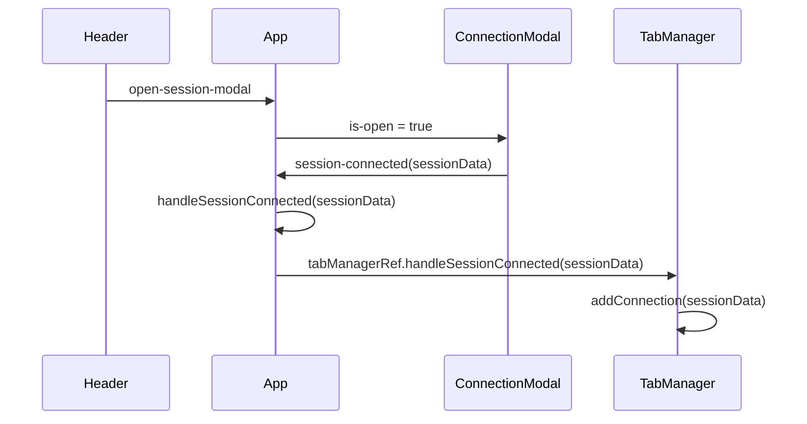
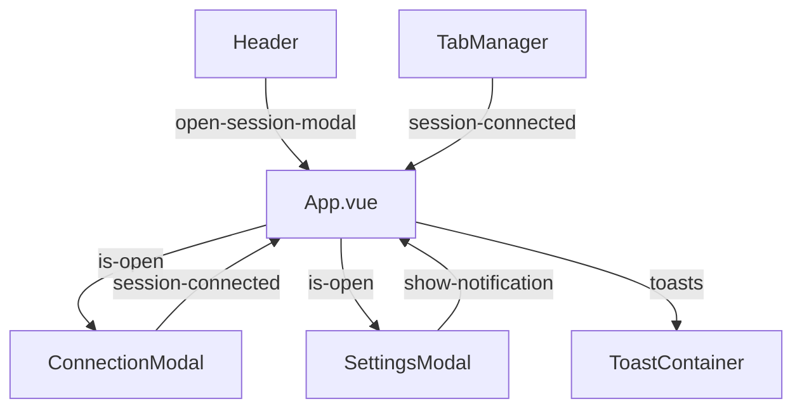
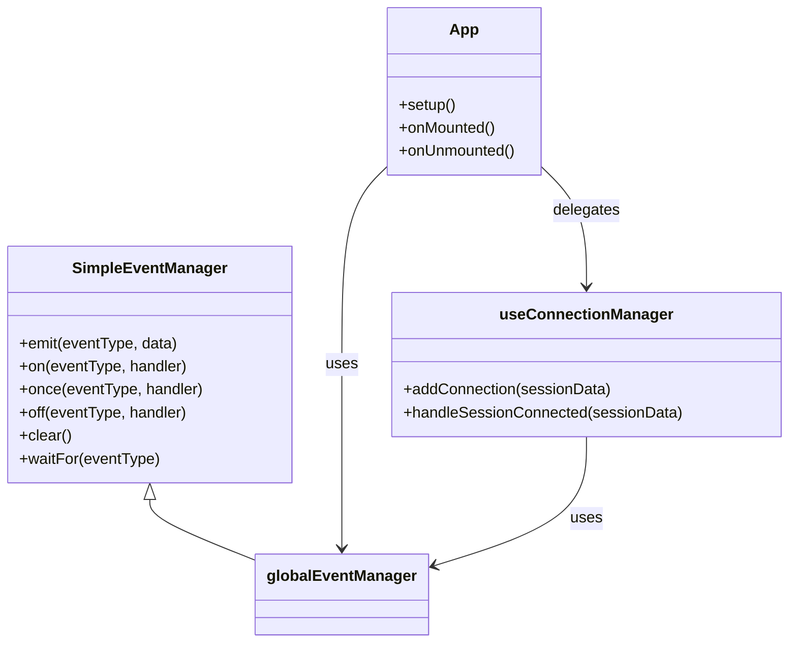
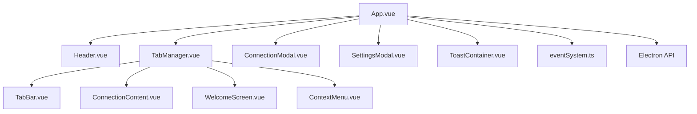

# 根组件

<cite>
**Referenced Files in This Document **   
- [App.vue](file://src/App.vue)
- [Header.vue](file://src/components/Header.vue)
- [TabManager.vue](file://src/components/TabManager.vue)
- [ConnectionModal.vue](file://src/components/ConnectionModal.vue)
- [SettingsModal.vue](file://src/components/SettingsModal.vue)
- [ToastContainer.vue](file://src/components/ui/ToastContainer.vue)
- [eventSystem.ts](file://src/utils/eventSystem.ts)
- [useConnectionManager.ts](file://src/composables/useConnectionManager.ts)
</cite>

## 目录
1. [简介](#简介)
2. [项目结构](#项目结构)
3. [核心组件](#核心组件)
4. [架构概述](#架构概述)
5. [详细组件分析](#详细组件分析)
6. [依赖分析](#依赖分析)
7. [性能考虑](#性能考虑)
8. [故障排除指南](#故障排除指南)
9. [结论](#结论)

## 简介
`App.vue` 是 sshcode 应用的根组件，作为整个应用的入口点和中央协调器。该组件负责初始化全局状态、集成核心子组件、管理跨组件通信，并通过事件总线模式协调应用的整体行为。作为 Vue 3 Composition API 的典型应用，`App.vue` 利用 `setup()` 函数集中管理应用的全局功能，包括模态框控制、通知系统、Electron API 初始化和全局键盘事件监听。它通过事件驱动的方式与 `Header`、`TabManager`、`ConnectionModal`、`SettingsModal` 和 `ToastContainer` 等子组件进行交互，构建了一个响应式和模块化的应用架构。

## 项目结构
`App.vue` 位于项目的 `src` 目录下，是整个 Vue 应用的起点。它直接引用了位于 `src/components/` 目录下的多个核心 UI 组件。项目采用功能模块化的设计，将不同功能的组件（如布局、标签页、连接管理、UI 通用组件）组织在各自的子目录中。`App.vue` 作为顶层容器，将这些分散的组件整合成一个完整的应用界面。

**Diagram sources **   
- [App.vue](file://src/App.vue)

**Section sources**
- [App.vue](file://src/App.vue)

## 核心组件
`App.vue` 的核心职责在于其 `setup()` 函数中实现的全局状态初始化和事件处理机制。它通过 `ref` 和 `reactive` 创建了用于控制模态框显示（`isSessionModalOpen`, `isSettingsModalOpen`）和通知系统（`toastState`）的响应式状态。组件通过 `onMounted` 和 `onUnmounted` 生命周期钩子，在挂载时初始化 Electron API 并注册全局键盘事件监听器，在卸载时进行清理，确保了资源的正确管理。其核心事件处理器 `handleSessionConnected` 是连接管理流程的关键，它接收来自 `ConnectionModal` 的连接成功事件，更新全局状态，并通过 `tabManagerRef` 调用 `TabManager` 的方法来启动新的连接会话。

**Section sources**
- [App.vue](file://src/App.vue#L39-L210)

## 架构概述
`App.vue` 采用了一种中心化的事件驱动架构。它作为事件的协调者，不直接处理复杂的业务逻辑，而是将任务委托给专门的子组件。例如，`Header` 组件负责触发打开模态框的事件，`ConnectionModal` 负责处理连接的创建和认证，而 `TabManager` 则负责管理所有已建立的连接会话。`App.vue` 通过监听这些子组件发出的事件（如 `session-connected`、`show-notification`），并做出相应的响应（如更新状态、调用其他组件的方法），从而实现了组件间的松耦合和高内聚。

**Diagram sources **
- [App.vue](file://src/App.vue)
- [Header.vue](file://src/components/Header.vue)
- [ConnectionModal.vue](file://src/components/ConnectionModal.vue)
- [TabManager.vue](file://src/components/TabManager.vue)

## 详细组件分析

### 子组件集成与 Props 传递
`App.vue` 通过模板中的组件标签和 `setup()` 函数中的 `components` 选项，将 `Header`、`TabManager`、`ConnectionModal`、`SettingsModal` 和 `ToastContainer` 集成到其视图中。它主要通过两种方式与子组件通信：**Props** 和 **事件**。

- **Props 传递**：`App.vue` 将自身的响应式状态（如 `isSessionModalOpen`）作为 `props` 传递给 `ConnectionModal` 和 `SettingsModal`。当 `App.vue` 中的状态改变时，子组件会自动更新其显示状态。
- **事件监听**：`App.vue` 使用 `@` 语法监听子组件发出的事件。例如，它监听 `Header` 的 `open-session-modal` 事件来打开连接模态框，监听 `TabManager` 的 `session-connected` 事件来处理新连接。

**Diagram sources **
- [App.vue](file://src/App.vue)

**Section sources**
- [App.vue](file://src/App.vue#L1-L210)

### 全局状态与事件处理机制
`App.vue` 在 `setup()` 函数中初始化了应用的全局状态和事件处理逻辑。

- **全局状态初始化**：使用 `ref` 创建了 `isSessionModalOpen` 和 `isSettingsModalOpen` 两个布尔值，用于控制模态框的显示。使用 `reactive` 创建了 `toastState` 对象，用于管理通知（Toast）的列表和 ID 生成器。
- **事件处理机制**：定义了 `handleShowNotification` 和 `handleSessionConnected` 等核心事件处理器。`handleShowNotification` 负责统一处理来自各处的通知请求，并将其格式化后添加到 `toastState` 中。`handleSessionConnected` 是连接流程的核心，它在收到连接成功的事件后，会显示成功通知，并通过 `tabManagerRef` 调用 `TabManager` 的 `handleSessionConnected` 方法，将连接数据传递给标签管理器。

**Section sources**
- [App.vue](file://src/App.vue#L39-L210)

### 生命周期钩子与 Electron API
`App.vue` 利用 Vue 的生命周期钩子来管理应用的初始化和清理工作。

- **onMounted**：在组件挂载后，调用 `setupElectronAPI` 函数。该函数检查 `window` 对象并动态加载 Electron 的 `ipcRenderer` 模块，然后将一系列 SSH 操作（如连接、执行命令、断开连接）封装到 `window.electronAPI` 对象中，供应用的其他部分调用。
- **onUnmounted**：在组件卸载前，移除通过 `document.addEventListener` 注册的全局键盘事件监听器，防止内存泄漏。
- **全局键盘事件**：`handleKeyDown` 函数实现了快捷键功能。它监听 `Ctrl/Cmd + K` 来快速打开连接管理模态框，并监听 `Escape` 键来关闭所有打开的模态框，提升了用户体验。

**Section sources**
- [App.vue](file://src/App.vue#L180-L210)

### 事件总线模式实现
`App.vue` 虽然没有直接实现事件总线，但它与 `src/utils/eventSystem.ts` 模块紧密协作，该模块提供了一个基于 `mitt` 库的轻量级事件系统。`App.vue` 通过 `installEventSystem` 函数将事件管理器安装到 Vue 应用实例上，使得所有组件都可以通过 `this.$events` 或 `provide/inject` 访问事件系统。

- **事件类型定义**：`eventSystem.ts` 中定义了 `EventTypes` 枚举，如 `AI_MESSAGE_SEND`、`TERMINAL_OUTPUT`、`CONNECTION_CONNECT` 等，为跨组件通信提供了标准化的事件名称。
- **错误处理策略**：事件系统内置了错误处理机制。当事件处理器抛出异常时，事件系统会捕获该错误，并自动发出一个 `SYSTEM_ERROR` 事件，将错误信息广播给所有监听者，实现了集中化的错误监控。
- **最佳实践**：`App.vue` 本身主要处理与 UI 状态直接相关的事件（如打开模态框），而将业务逻辑相关的事件（如 SSH 命令执行）交由专门的模块（如 `useConnectionManager`）通过事件总线来处理，保持了根组件的简洁性。

**Diagram sources **
- [eventSystem.ts](file://src/utils/eventSystem.ts)
- [App.vue](file://src/App.vue)
- [useConnectionManager.ts](file://src/composables/useConnectionManager.ts)

## 依赖分析
`App.vue` 的依赖关系清晰地体现了其作为应用入口点的角色。

- **直接依赖**：`App.vue` 直接导入并使用了 `Header`、`TabManager`、`ConnectionModal`、`SettingsModal` 和 `ToastContainer` 这五个核心组件。
- **间接依赖**：通过 `TabManager`，`App.vue` 间接依赖于 `TabBar`、`ConnectionContent`、`WelcomeScreen` 和 `ContextMenu` 等更深层次的组件。
- **工具依赖**：`App.vue` 依赖于 `src/utils/eventSystem.ts` 提供的全局事件系统，并通过 `window.electronAPI` 依赖于 Electron 的原生能力。

**Diagram sources **
- [App.vue](file://src/App.vue)

**Section sources**
- [App.vue](file://src/App.vue)

## 性能考虑
`App.vue` 作为一个轻量级的协调器，其自身对性能的影响极小。它的主要性能考量在于事件处理的效率和内存管理。

- **事件处理**：通过使用 `mitt` 事件库，确保了事件发布和订阅的高效性。
- **内存管理**：在 `onUnmounted` 钩子中正确地移除了全局事件监听器，避免了内存泄漏。同时，`ToastContainer` 组件会自动移除过期的通知，防止 `toastState` 无限增长。

## 故障排除指南
当遇到与 `App.vue` 相关的问题时，可以参考以下指南：

- **模态框无法打开**：检查 `isSessionModalOpen` 状态是否被正确更新，确认 `Header` 组件的 `@click` 事件是否正常触发。
- **连接成功但无反应**：检查 `handleSessionConnected` 函数中的 `tabManagerRef.value` 是否为 `null`，确保 `TabManager` 组件已正确渲染。
- **Electron API 不可用**：确认应用是否在 Electron 环境中运行，检查 `setupElectronAPI` 函数的执行路径。
- **键盘快捷键失效**：检查 `handleKeyDown` 函数是否被正确绑定到 `document`，并确认事件监听器在组件卸载时被正确移除。

**Section sources**
- [App.vue](file://src/App.vue)

## 结论
`App.vue` 作为 sshcode 应用的根组件，成功地扮演了应用的“大脑”角色。它通过简洁的 `setup()` 函数初始化了全局状态和事件处理，利用生命周期钩子管理了 Electron API 和全局事件监听，实现了高效的子组件集成。其采用的事件驱动和事件总线模式，确保了组件间的松耦合和应用的可维护性。通过对 `App.vue` 的深入分析，我们可以清晰地理解整个应用的启动流程、状态管理和通信机制，为后续的功能开发和问题排查提供了坚实的基础。