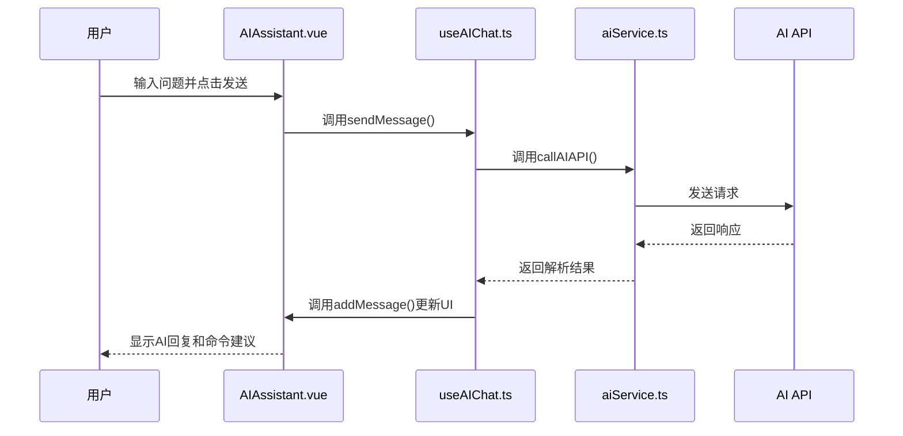
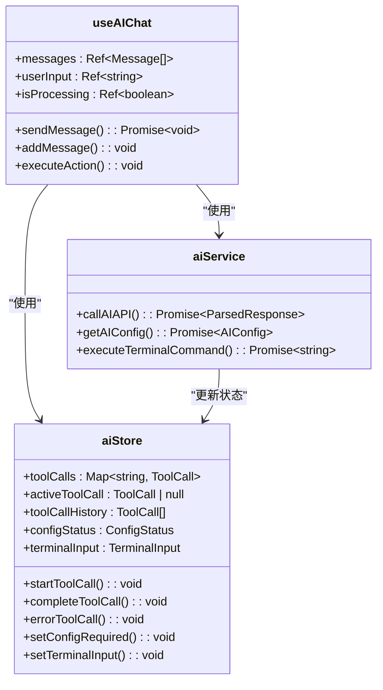
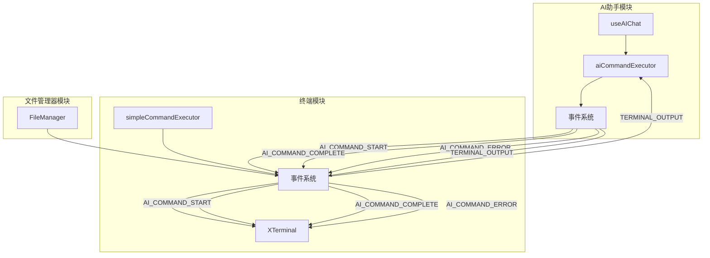

# AI助手模块集成

<cite>
**本文档引用文件**   
- [index.ts](file://src/modules/ai-assistant/index.ts)
- [AIAssistant.vue](file://src/modules/ai-assistant/components/AIAssistant.vue)
- [useAIChat.ts](file://src/modules/ai-assistant/composables/useAIChat.ts)
- [ai.ts](file://src/modules/ai-assistant/stores/ai.ts)
- [aiService.ts](file://src/modules/ai-assistant/utils/aiService.ts)
- [eventSystem.ts](file://src/utils/eventSystem.ts)
- [aiCommandExecutor.ts](file://src/modules/ai-assistant/utils/aiCommandExecutor.ts)
- [CommandExecution.vue](file://src/modules/ai-assistant/components/ai/CommandExecution.vue)
</cite>

## 目录
1. [模块导出与集成](#模块导出与集成)
2. [AI助手交互设计](#ai助手交互设计)
3. [状态管理与上下文维护](#状态管理与上下文维护)
4. [命令建议与执行流程](#命令建议与执行流程)
5. [跨模块协同机制](#跨模块协同机制)
6. [事件系统集成](#事件系统集成)

## 模块导出与集成

`src/modules/ai-assistant/index.ts` 文件作为AI助手模块的统一入口，通过模块化导出机制将核心组件、组合式函数、状态管理器、工具函数等资源集中暴露。该文件采用清晰的分类导出策略，包括默认导出AI助手主组件 `AIAssistant` 和命令执行子组件 `CommandExecution`，命名导出组合式函数 `useAIChat`，以及从子目录批量导出工具函数、常量和样式资源，实现了模块内部资源的有效组织与外部访问的便捷性。

**Section sources**
- [index.ts](file://src/modules/ai-assistant/index.ts#L1-L27)

## AI助手交互设计

`AIAssistant.vue` 组件是AI助手的用户界面核心，采用Vue 3的组合式API进行构建。其交互设计围绕聊天会话展开，包含现代化的头部信息栏、动态的聊天区域和功能丰富的输入区域。组件通过 `provide` 和 `inject` 机制将 `useAIChat` 组合式函数创建的上下文提供给子组件（如 `CommandExecution.vue`），建立了清晰的父子组件调用链路。用户输入通过 `v-model` 双向绑定到 `userInput`，发送消息时触发 `sendMessage` 方法，该方法最终调用 `useAIChat` 中的 `sendMessage` 函数，完成从UI交互到业务逻辑的完整闭环。



**Diagram sources **
- [AIAssistant.vue](file://src/modules/ai-assistant/components/AIAssistant.vue#L1-L696)
- [useAIChat.ts](file://src/modules/ai-assistant/composables/useAIChat.ts#L24-L615)

## 状态管理与上下文维护

`ai.ts` 状态管理器基于Pinia构建，是维护AI助手对话上下文的核心。它通过 `toolCalls` Map 和 `toolCallHistory` 数组来跟踪所有工具调用的状态，包括执行中的、已完成的和出错的命令。`activeToolCall` 用于标识当前正在执行的工具调用。`configStatus` 管理AI服务的配置状态，确保在未配置时引导用户进行设置。`terminalInput` 则用于控制终端输入框的显示和内容。该状态管理器替代了传统的全局事件通信，提供了更可靠、更可预测的状态管理方案，确保了对话上下文在不同组件间的准确同步。



**Diagram sources **
- [ai.ts](file://src/modules/ai-assistant/stores/ai.ts#L18-L271)
- [useAIChat.ts](file://src/modules/ai-assistant/composables/useAIChat.ts#L24-L615)

## 命令建议与执行流程

AI助手的命令建议、自然语言转Shell指令及执行反馈闭环的实现流程如下：用户输入自然语言问题后，`useAIChat` 调用 `aiService` 中的 `callAIAPI` 函数。该函数构建包含系统提示词、历史消息和当前问题的请求，发送给AI模型。AI模型的响应可能包含一个 `execute_command` 工具调用。`aiService` 捕获此调用，通过 `aiCommandExecutor` 执行实际的SSH命令，并将结果返回给AI模型进行最终分析。`aiService` 解析最终响应，提取其中的代码块作为命令建议，并通过 `useAIChat` 的 `addMessage` 方法将结果和建议按钮渲染到 `AIAssistant.vue` 的聊天界面，形成完整的闭环。

```mermaid
flowchart TD
A[用户输入: "查看磁盘使用情况"] --> B(aiService.callAIAPI)
B --> C{AI响应}
C --> |包含工具调用| D[aiService.handleToolCalls]
D --> E[aiCommandExecutor.executeAICommand]
E --> F[执行SSH命令: df -h]
F --> G[获取命令输出]
G --> H[aiService.sendAPIRequest]
H --> I{AI最终响应}
I --> |包含命令建议| J[aiService.parseAIResponse]
J --> K[useAIChat.addMessage]
K --> L[AIAssistant.vue渲染结果和建议]
C --> |直接文本回复| M[useAIChat.addMessage]
M --> L
```

**Diagram sources **
- [aiService.ts](file://src/modules/ai-assistant/utils/aiService.ts#L1-L720)
- [aiCommandExecutor.ts](file://src/modules/ai-assistant/utils/aiCommandExecutor.ts#L1-L126)

## 跨模块协同机制

AI助手模块通过轻量级事件系统与终端和文件管理器模块实现跨模块功能联动。`eventSystem.ts` 定义了如 `AI_COMMAND_START`、`AI_COMMAND_COMPLETE`、`AI_COMMAND_ERROR` 和 `TERMINAL_OUTPUT` 等事件类型。当AI助手需要执行命令时，`aiCommandExecutor` 会触发 `AI_COMMAND_START` 事件，通知UI显示执行状态。`simpleCommandExecutor` 在监听到 `TERMINAL_OUTPUT` 事件后，会将输出传递给 `aiCommandExecutor`，后者再通过事件系统将实时输出更新到AI助手界面。当命令完成或出错时，会触发相应的完成或错误事件，确保所有相关模块都能及时更新状态，实现了松耦合但高效协同的工作模式。



**Diagram sources **
- [eventSystem.ts](file://src/utils/eventSystem.ts#L11-L33)
- [aiCommandExecutor.ts](file://src/modules/ai-assistant/utils/aiCommandExecutor.ts#L1-L126)
- [simpleCommandExecutor.ts](file://src/modules/terminal/utils/simpleCommandExecutor.ts#L1-L476)

## 事件系统集成

事件系统是整个应用模块间通信的基石。`eventSystem.ts` 基于 `mitt` 库实现了一个全局的、轻量级的事件发射器。各模块通过 `onEvent` 订阅感兴趣的事件，并通过 `emitEvent` 发布事件。例如，`useAIChat` 在组件挂载时订阅 `AI_COMMAND_START` 等事件，当收到事件时，会更新本地状态并触发UI更新。`aiCommandExecutor` 在执行命令时会发布这些事件。这种发布-订阅模式解耦了事件的发布者和订阅者，使得模块可以独立开发和测试，极大地提高了代码的可维护性和可扩展性。

**Section sources**
- [eventSystem.ts](file://src/utils/eventSystem.ts#L1-L287)
- [useAIChat.ts](file://src/modules/ai-assistant/composables/useAIChat.ts#L24-L615)
- [aiCommandExecutor.ts](file://src/modules/ai-assistant/utils/aiCommandExecutor.ts#L1-L126)