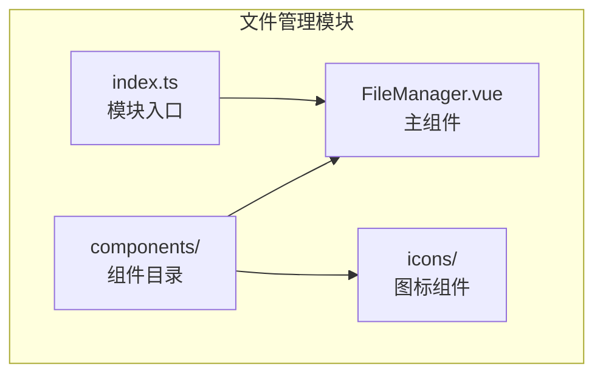
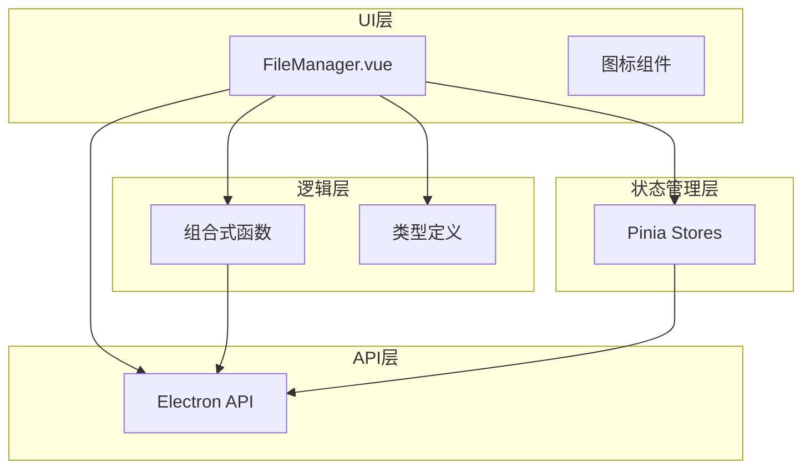
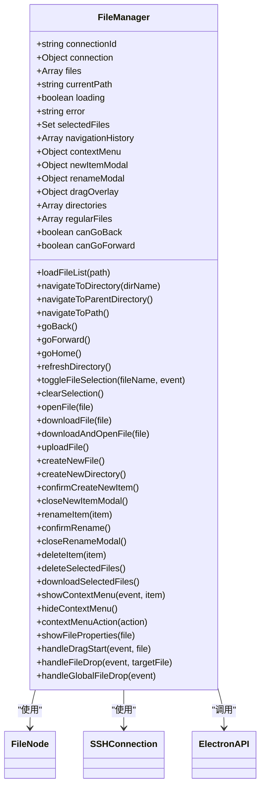
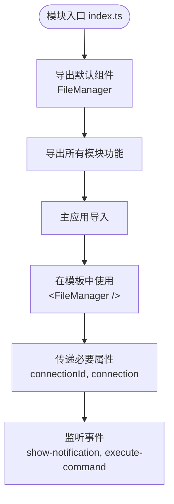
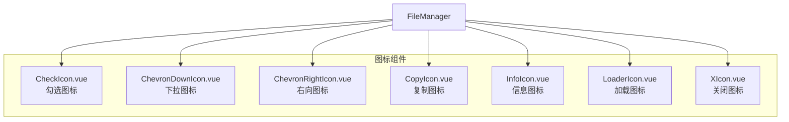
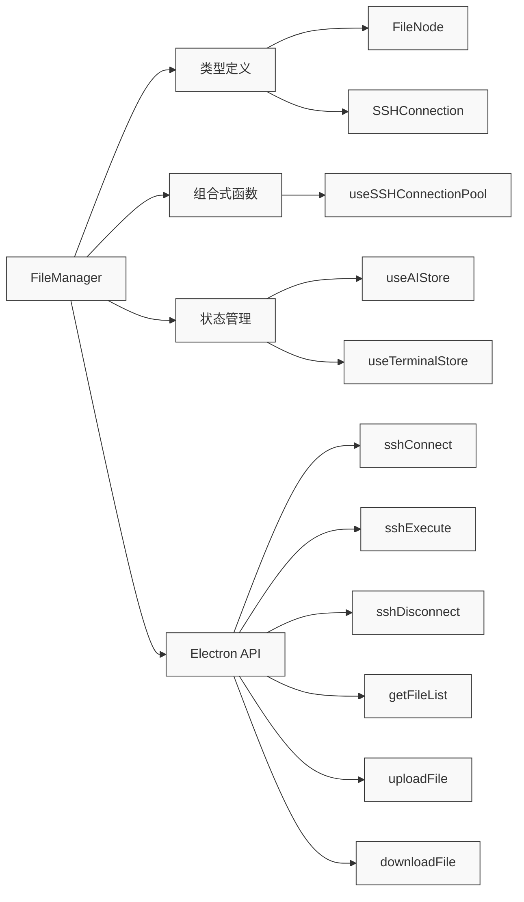

# 文件管理模块集成

<cite>
**本文档引用的文件**  
- [index.ts](file://src/modules/file-manager/index.ts)
- [FileManager.vue](file://src/modules/file-manager/components/FileManager.vue)
- [file.ts](file://src/types/file.ts)
- [ssh.ts](file://src/types/ssh.ts)
- [components.ts](file://src/types/components.ts)
- [useSSHConnectionPool.js](file://src/composables/useSSHConnectionPool.js)
- [index.ts](file://src/modules/index.ts)
- [App.vue](file://src/App.vue)
- [ai.ts](file://src/modules/ai-assistant/stores/ai.ts)
- [terminal.js](file://src/modules/terminal/stores/terminal.js)
</cite>

## 目录
1. [简介](#简介)
2. [项目结构](#项目结构)
3. [核心组件](#核心组件)
4. [架构概览](#架构概览)
5. [详细组件分析](#详细组件分析)
6. [依赖分析](#依赖分析)
7. [性能考虑](#性能考虑)
8. [故障排除指南](#故障排除指南)
9. [结论](#结论)
10. [附录](#附录)（如有必要）

## 简介
本文档详细解析了SSHCode项目中文件管理模块的集成机制。该模块提供远程文件浏览、上传、下载等功能，通过标准化的模块入口机制与主应用集成。文档重点阐述了模块的导出机制、组件结构设计、SFTP操作实现方式以及与全局状态管理的交互模式。

## 项目结构

文件管理模块采用标准的Vue模块化结构，包含组件和入口文件：

**图示来源**  
- [index.ts](file://src/modules/file-manager/index.ts#L1-L10)
- [FileManager.vue](file://src/modules/file-manager/components/FileManager.vue#L1-L50)

**本节来源**  
- [index.ts](file://src/modules/file-manager/index.ts#L1-L10)
- [project_structure](#project_structure)

## 核心组件

文件管理模块的核心是`FileManager.vue`组件，它通过`index.ts`入口文件被聚合导出。该组件接收连接ID和连接配置作为属性，实现了完整的SFTP文件操作界面，包括文件浏览、上传、下载、重命名和删除等功能。组件通过Electron API与后端进行通信，执行实际的文件系统操作。

**本节来源**  
- [index.ts](file://src/modules/file-manager/index.ts#L1-L10)
- [FileManager.vue](file://src/modules/file-manager/components/FileManager.vue#L1-L100)

## 架构概览

文件管理模块采用分层架构设计，各组件和功能通过明确的接口进行交互：

**图示来源**  
- [FileManager.vue](file://src/modules/file-manager/components/FileManager.vue#L1-L50)
- [useSSHConnectionPool.js](file://src/composables/useSSHConnectionPool.js#L2-L258)
- [file.ts](file://src/types/file.ts#L4-L12)
- [ssh.ts](file://src/types/ssh.ts#L8-L18)

## 详细组件分析

### 文件管理器组件分析

`FileManager.vue`是文件管理模块的核心UI组件，采用Vue 3的组合式API进行开发。组件通过props接收连接信息，并通过emits向父组件发送通知和命令执行请求。

#### 组件结构设计

**图示来源**  
- [FileManager.vue](file://src/modules/file-manager/components/FileManager.vue#L1-L1550)
- [file.ts](file://src/types/file.ts#L4-L12)
- [ssh.ts](file://src/types/ssh.ts#L8-L18)

#### API暴露规范
文件管理模块通过`index.ts`文件提供标准化的API导出：

**图示来源**  
- [index.ts](file://src/modules/file-manager/index.ts#L1-L10)
- [index.ts](file://src/modules/index.ts#L1-L14)
- [App.vue](file://src/App.vue#L1-L210)

### 图标组件集成

文件管理模块中的图标组件采用SVG实现，提供了一致的视觉体验：

**图示来源**  
- [CheckIcon.vue](file://src/modules/file-manager/components/icons/CheckIcon.vue#L1-L20)
- [FileManager.vue](file://src/modules/file-manager/components/FileManager.vue#L1-L1550)

**本节来源**  
- [FileManager.vue](file://src/modules/file-manager/components/FileManager.vue#L1-L1550)
- [CheckIcon.vue](file://src/modules/file-manager/components/icons/CheckIcon.vue#L1-L20)

## 依赖分析

文件管理模块依赖多个核心组件和类型定义，形成了完整的功能链：

**图示来源**  
- [FileManager.vue](file://src/modules/file-manager/components/FileManager.vue#L1-L1550)
- [file.ts](file://src/types/file.ts#L4-L12)
- [ssh.ts](file://src/types/ssh.ts#L8-L18)
- [components.ts](file://src/types/components.ts#L14-L17)
- [useSSHConnectionPool.js](file://src/composables/useSSHConnectionPool.js#L2-L258)
- [ai.ts](file://src/modules/ai-assistant/stores/ai.ts#L18-L271)
- [terminal.js](file://src/modules/terminal/stores/terminal.js#L8-L215)

**本节来源**  
- [FileManager.vue](file://src/modules/file-manager/components/FileManager.vue#L1-L1550)
- [file.ts](file://src/types/file.ts#L4-L12)
- [ssh.ts](file://src/types/ssh.ts#L8-L18)

## 性能考虑
文件管理模块在性能方面进行了多项优化，包括使用响应式数据结构管理文件列表、通过连接池管理SSH连接、以及采用虚拟滚动技术处理大型目录。组件的渲染性能通过Vue 3的响应式系统得到保障，只有在数据实际变化时才会触发重新渲染。

## 故障排除指南
当文件管理功能出现问题时，可按照以下步骤进行排查：
1. 检查Electron API是否可用
2. 验证SSH连接状态
3. 查看控制台日志中的错误信息
4. 确认文件路径是否正确
5. 检查用户权限是否足够

**本节来源**  
- [FileManager.vue](file://src/modules/file-manager/components/FileManager.vue#L1-L1550)
- [useSSHConnectionPool.js](file://src/composables/useSSHConnectionPool.js#L2-L258)

## 结论
文件管理模块通过清晰的架构设计和标准化的API暴露机制，实现了远程文件系统的完整功能。模块采用现代Vue 3技术栈，结合TypeScript类型系统，确保了代码的可维护性和类型安全。通过与Electron API的集成，模块能够执行实际的SFTP操作，为用户提供直观的文件管理界面。

## 附录

### 类型定义

| 类型 | 属性 | 类型 | 描述 |
|------|------|------|------|
| **FileNode** | name | string | 文件名 |
| | path | string | 文件路径 |
| | type | 'file' \| 'directory' | 文件类型 |
| | size | number? | 文件大小 |
| | modified | string? | 修改时间 |
| | permissions | string? | 权限信息 |
| | children | FileNode[]? | 子节点（目录） |
| **SSHConnection** | id | string | 连接ID |
| | name | string | 连接名称 |
| | host | string | 主机地址 |
| | port | number | 端口号 |
| | username | string | 用户名 |
| | password | string? | 密码 |
| | privateKey | string? | 私钥 |
| | authType | 'password' \| 'key' | 认证类型 |
| | connected | boolean | 是否已连接 |

**本节来源**  
- [file.ts](file://src/types/file.ts#L4-L12)
- [ssh.ts](file://src/types/ssh.ts#L8-L18)