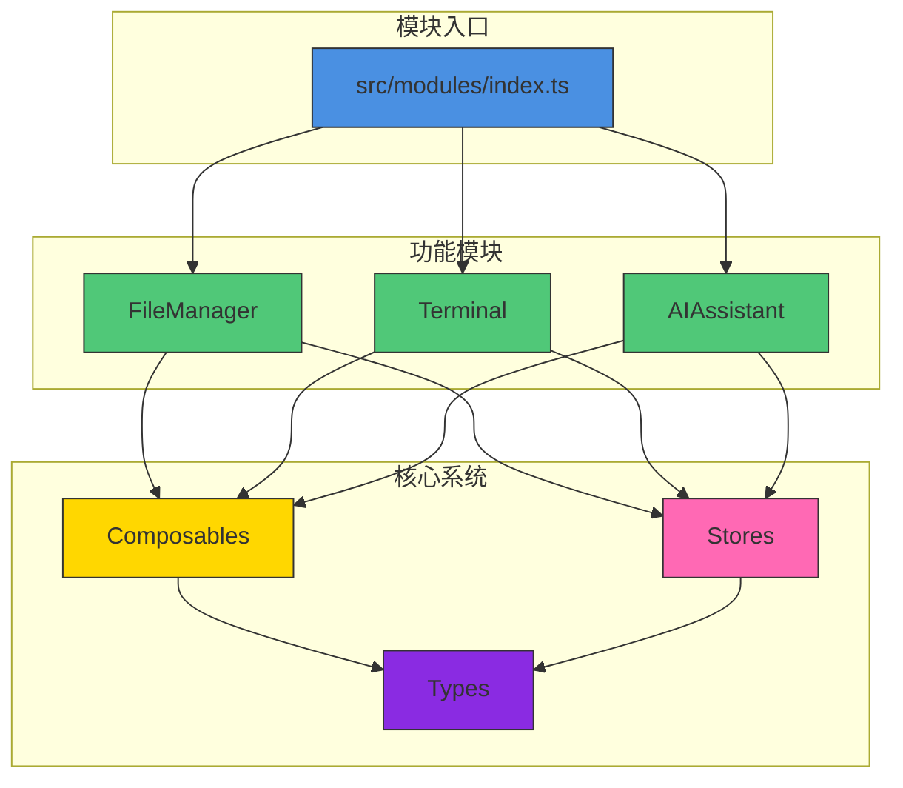
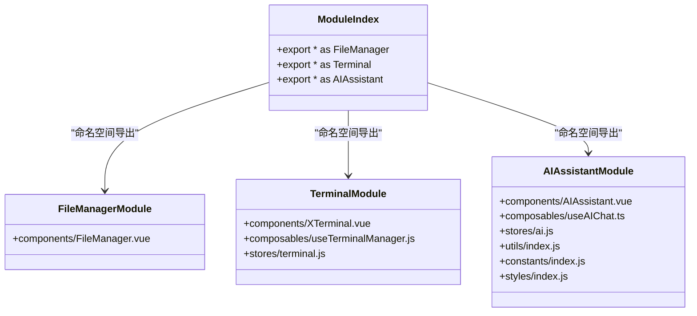
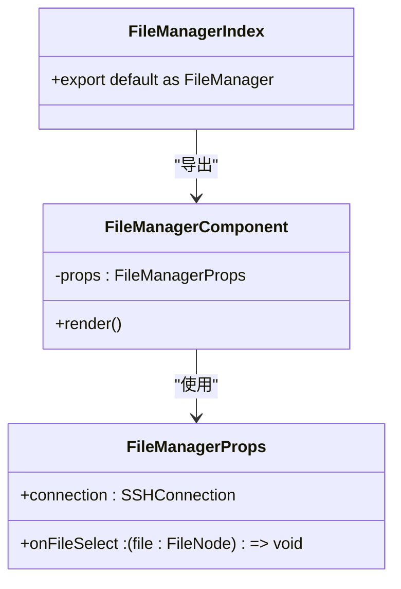
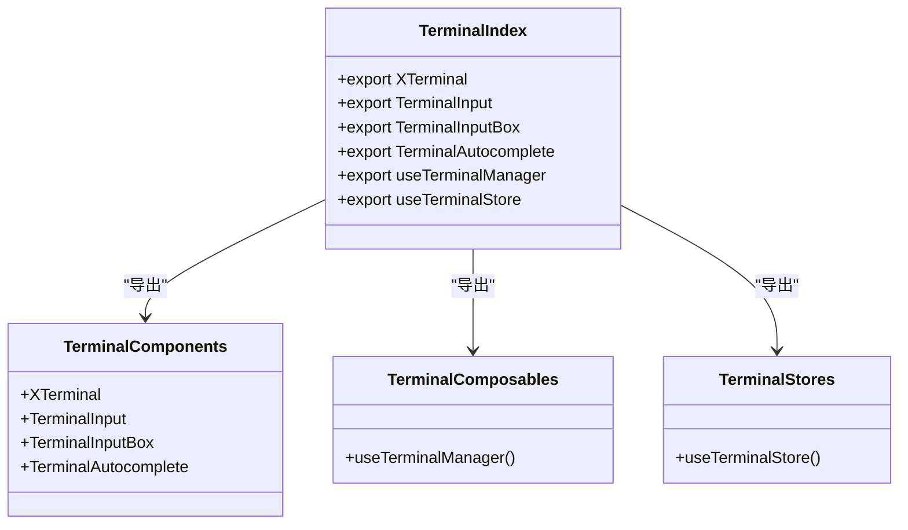
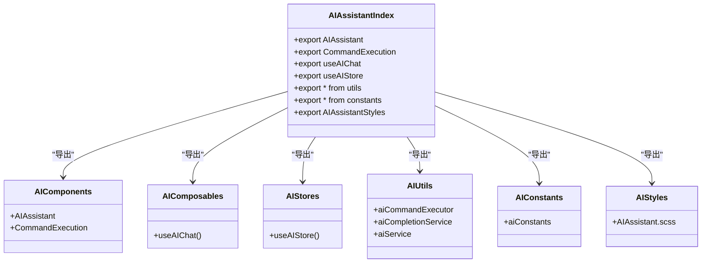
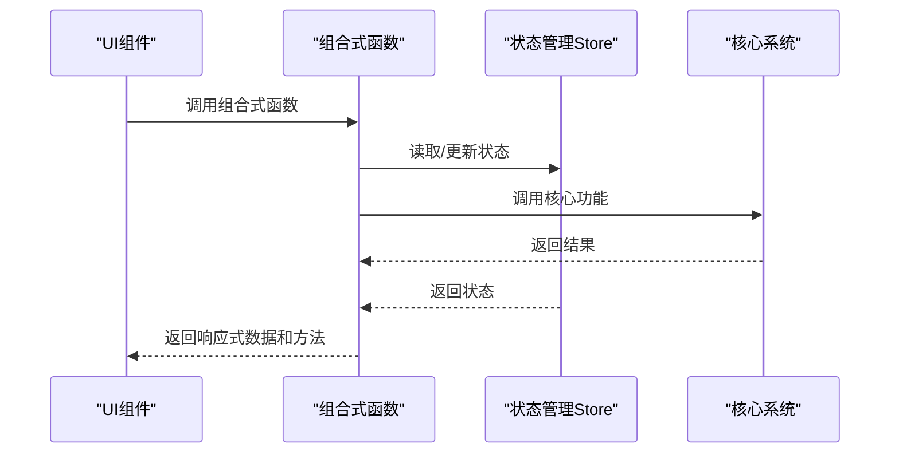
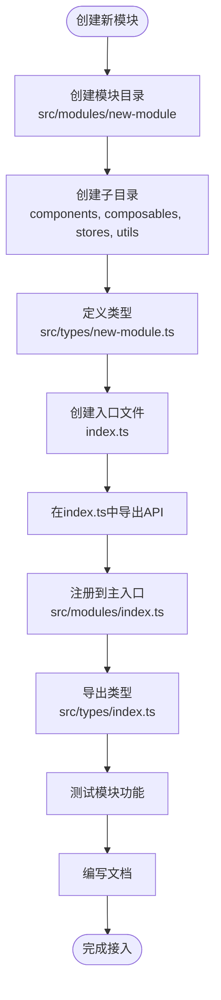

# 模块集成

<cite>
**本文档引用文件**  
- [src/modules/index.ts](file://src/modules/index.ts)
- [src/modules/file-manager/index.ts](file://src/modules/file-manager/index.ts)
- [src/modules/terminal/index.ts](file://src/modules/terminal/index.ts)
- [src/modules/ai-assistant/index.ts](file://src/modules/ai-assistant/index.ts)
- [src/stores/index.ts](file://src/stores/index.ts)
- [src/types/index.ts](file://src/types/index.ts)
- [src/composables/useConnectionManager.ts](file://src/composables/useConnectionManager.ts)
- [src/modules/terminal/composables/useTerminalManager.ts](file://src/modules/terminal/composables/useTerminalManager.ts)
- [src/modules/ai-assistant/composables/useAIChat.ts](file://src/modules/ai-assistant/composables/useAIChat.ts)
- [src/modules/terminal/stores/terminal.js](file://src/modules/terminal/stores/terminal.js)
- [src/modules/ai-assistant/stores/ai.ts](file://src/modules/ai-assistant/stores/ai.ts)
</cite>

## 目录
1. [模块化集成机制概述](#模块化集成机制概述)
2. [统一入口导出模式](#统一入口导出模式)
3. [功能模块聚合策略](#功能模块聚合策略)
4. [模块依赖管理](#模块依赖管理)
5. [新模块接入标准流程](#新模块接入标准流程)
6. [最佳实践与优化建议](#最佳实践与优化建议)

## 模块化集成机制概述

本系统采用模块化架构设计，通过`src/modules/index.ts`作为统一入口，实现了FileManager、Terminal和AIAssistant三大核心功能模块的命名空间式导出。该机制不仅提升了代码组织的清晰度，还通过tree-shaking优化了最终打包体积。各模块遵循一致的聚合导出策略，将组件、组合式函数（composables）、状态管理（stores）等资源统一暴露给外部使用。

**模块间依赖关系**通过composables和stores与核心系统进行交互，形成了松耦合的架构体系。这种设计模式使得功能模块可以独立开发、测试和维护，同时保证了系统整体的可扩展性和可维护性。

**模块集成架构图**


**图表来源**  
- [src/modules/index.ts](file://src/modules/index.ts#L1-L14)
- [src/modules/file-manager/index.ts](file://src/modules/file-manager/index.ts#L1-L10)
- [src/modules/terminal/index.ts](file://src/modules/terminal/index.ts#L1-L19)
- [src/modules/ai-assistant/index.ts](file://src/modules/ai-assistant/index.ts#L1-L26)

## 统一入口导出模式

`src/modules/index.ts`文件作为系统的模块化入口，采用命名空间方式统一导出各个功能模块。这种设计模式实现了模块的集中管理和按需引用，避免了直接导入具体实现文件带来的耦合问题。

该文件通过`export * as ModuleName`语法将三大核心模块暴露为独立的命名空间：
- **FileManager**：文件管理模块，提供远程文件浏览、上传、下载等功能
- **Terminal**：终端管理模块，提供SSH终端连接、命令执行、自动补全等功能
- **AIAssistant**：AI助手模块，提供AI聊天、命令执行建议、智能分析等功能

这种命名空间导出模式的优势在于：
1. 提供了清晰的模块边界和接口定义
2. 支持tree-shaking，未使用的模块不会被打包到最终产物中
3. 简化了导入路径，使用者无需了解模块内部结构
4. 便于模块的替换和升级，只要保持接口一致即可



**图表来源**  
- [src/modules/index.ts](file://src/modules/index.ts#L1-L14)

**章节来源**  
- [src/modules/index.ts](file://src/modules/index.ts#L1-L14)

## 功能模块聚合策略

各功能模块均采用一致的聚合导出策略，在各自的`index.ts`文件中将内部资源进行分类聚合和统一暴露。这种策略不仅提高了代码的组织性，还为模块的tree-shaking优化提供了基础。

### 文件管理模块

FileManager模块通过`src/modules/file-manager/index.ts`文件聚合导出其核心组件。该模块主要提供远程文件浏览、上传、下载等功能，目前仅导出了`FileManager`主组件。



**图表来源**  
- [src/modules/file-manager/index.ts](file://src/modules/file-manager/index.ts#L1-L10)
- [src/types/components.ts](file://src/types/components.ts#L14-L17)

### 终端管理模块

Terminal模块通过`src/modules/terminal/index.ts`文件实现了全面的资源聚合，包括组件、组合式函数和状态管理store。该模块提供了SSH终端连接、命令执行、自动补全等完整功能。



**图表来源**  
- [src/modules/terminal/index.ts](file://src/modules/terminal/index.ts#L1-L19)
- [src/modules/terminal/composables/useTerminalManager.ts](file://src/modules/terminal/composables/useTerminalManager.ts#L1-L269)
- [src/modules/terminal/stores/terminal.js](file://src/modules/terminal/stores/terminal.js#L1-L216)

### AI助手模块

AIAssistant模块通过`src/modules/ai-assistant/index.ts`文件实现了最复杂的聚合策略，涵盖了组件、组合式函数、工具函数、常量和样式等多个方面的资源导出。该模块提供了AI聊天、命令执行建议、智能分析等高级功能。



**图表来源**  
- [src/modules/ai-assistant/index.ts](file://src/modules/ai-assistant/index.ts#L1-L26)
- [src/modules/ai-assistant/composables/useAIChat.ts](file://src/modules/ai-assistant/composables/useAIChat.ts#L1-L618)
- [src/modules/ai-assistant/stores/ai.ts](file://src/modules/ai-assistant/stores/ai.ts#L1-L272)

## 模块依赖管理

系统通过composables和stores机制实现了模块与核心系统之间的松耦合交互。这种依赖管理原则确保了模块的独立性和可维护性，同时提供了必要的系统级功能支持。

### 状态管理集成

各模块的状态管理store通过`src/stores/index.ts`文件统一导出，形成了全局可用的状态管理入口。这种设计模式实现了：
1. 状态的集中管理
2. 跨模块状态共享
3. 类型安全的状态访问

```mermaid
classDiagram
class StoresIndex {
+export useAIStore
+export useTerminalStore
+export default { useAIStore, useTerminalStore }
}
class AIStore {
+toolCalls : Map
+activeToolCall : ToolCall | null
+toolCallHistory : ToolCall[]
+configStatus : ConfigStatus
+terminalInput : TerminalInput
}
class TerminalStore {
+connections : Map
+activeCommands : Map
+commandHistory : Map
+terminals : Map
}
StoresIndex --> AIStore : "导出"
StoresIndex --> TerminalStore : "导出"
```

**图表来源**  
- [src/stores/index.ts](file://src/stores/index.ts#L1-L16)
- [src/modules/ai-assistant/stores/ai.ts](file://src/modules/ai-assistant/stores/ai.ts#L1-L272)
- [src/modules/terminal/stores/terminal.js](file://src/modules/terminal/stores/terminal.js#L1-L216)

### 组合式函数交互

模块通过composables与核心系统进行功能交互，实现了逻辑复用和关注点分离。例如：
- `useTerminalManager`提供终端操作的核心逻辑
- `useAIChat`提供AI聊天的核心逻辑
- `useConnectionManager`提供连接管理的核心逻辑

这些组合式函数通过依赖注入的方式获取必要的上下文和emit函数，实现了功能的封装和复用。



**图表来源**  
- [src/modules/terminal/composables/useTerminalManager.ts](file://src/modules/terminal/composables/useTerminalManager.ts#L1-L269)
- [src/modules/ai-assistant/composables/useAIChat.ts](file://src/modules/ai-assistant/composables/useAIChat.ts#L1-L618)
- [src/composables/useConnectionManager.ts](file://src/composables/useConnectionManager.ts#L1-L539)

## 新模块接入标准流程

为确保新功能模块能够顺利集成到现有系统中，需要遵循以下标准流程和最佳实践。

### 模块创建规范

1. **目录结构**：在`src/modules/`下创建新模块目录，遵循`kebab-case`命名规范
2. **子目录划分**：根据功能划分`components`、`composables`、`stores`、`utils`等子目录
3. **类型定义**：在`src/types/`中创建对应的类型定义文件，并通过`index.ts`统一导出

### 接入步骤

1. **创建模块入口**：在模块根目录创建`index.ts`文件，按照聚合策略导出必要资源
2. **注册到主入口**：在`src/modules/index.ts`中添加新模块的命名空间导出
3. **类型集成**：在`src/types/index.ts`中导入并重新导出新模块的类型定义
4. **状态管理**：如有需要，在`src/stores/index.ts`中导出新模块的store

### 关键环节最佳实践

#### 类型定义
- 使用TypeScript接口定义组件props和状态
- 在`src/types/`中集中管理所有类型定义
- 通过`index.ts`文件统一导出相关类型

#### 状态管理
- 使用Pinia创建模块专用的store
- 定义清晰的状态、计算属性和操作方法
- 通过`src/stores/index.ts`统一导出store

#### API暴露
- 在`index.ts`中只导出必要的公共API
- 使用`export * as ModuleName`语法进行命名空间导出
- 避免直接导出内部实现细节



**图表来源**  
- [src/modules/index.ts](file://src/modules/index.ts#L1-L14)
- [src/types/index.ts](file://src/types/index.ts#L1-L104)
- [src/stores/index.ts](file://src/stores/index.ts#L1-L16)

## 最佳实践与优化建议

### 代码组织最佳实践

1. **单一职责原则**：每个文件只负责一个明确的功能
2. **命名规范**：使用清晰、一致的命名约定
3. **目录结构**：按照功能而非技术类型组织代码
4. **依赖管理**：避免循环依赖，使用依赖注入模式

### Tree-shaking优化

1. **按需导出**：只导出必要的API，避免导出内部实现
2. **命名空间导出**：使用`export * as ModuleName`语法
3. **避免默认导出**：统一使用命名导出以提高可预测性
4. **动态导入**：对大型模块使用动态导入实现懒加载

### 性能优化建议

1. **状态管理优化**：合理使用计算属性和缓存
2. **事件系统**：使用事件总线减少组件间直接依赖
3. **资源清理**：在组件销毁时清理定时器和事件监听器
4. **批量操作**：对频繁的状态更新进行批量处理

### 可维护性建议

1. **类型安全**：充分利用TypeScript的类型检查
2. **文档注释**：为公共API添加详细的JSDoc注释
3. **单元测试**：为关键逻辑编写单元测试
4. **代码审查**：建立代码审查流程确保代码质量

通过遵循上述最佳实践和优化建议，可以确保系统的可扩展性、性能和可维护性，为未来的功能迭代打下坚实的基础。

**章节来源**  
- [src/modules/index.ts](file://src/modules/index.ts#L1-L14)
- [src/types/index.ts](file://src/types/index.ts#L1-L104)
- [src/stores/index.ts](file://src/stores/index.ts#L1-L16)
- [src/composables/useConnectionManager.ts](file://src/composables/useConnectionManager.ts#L1-L539)