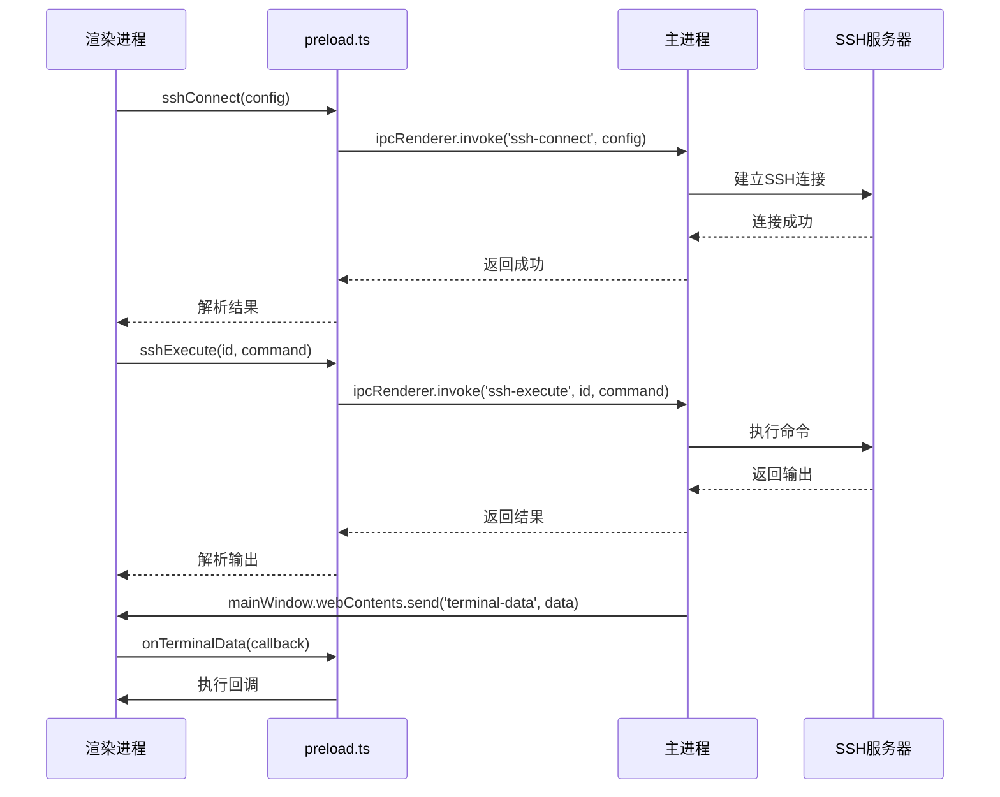
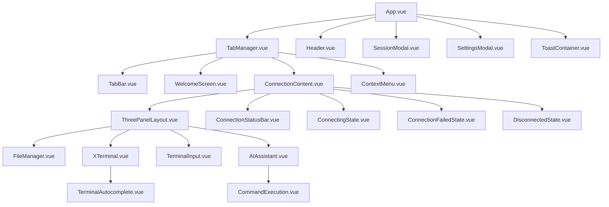

# 架构设计

<cite>
**本文档引用的文件**
- [main.ts](file://main.ts)
- [preload.ts](file://preload.ts)
- [App.vue](file://src/App.vue)
- [TabManager.vue](file://src/components/TabManager.vue)
- [ThreePanelLayout.vue](file://src/components/layout/ThreePanelLayout.vue)
- [ConnectionContent.vue](file://src/components/tabs/ConnectionContent.vue)
- [eventSystem.ts](file://src/utils/eventSystem.ts)
- [index.ts](file://src/stores/index.ts)
- [useConnectionManager.ts](file://src/composables/useConnectionManager.ts)
- [useTerminalManager.ts](file://src/modules/terminal/composables/useTerminalManager.ts)
- [ai.ts](file://src/modules/ai-assistant/stores/ai.ts)
- [terminal.js](file://src/modules/terminal/stores/terminal.js)
- [usePanelManager.js](file://src/composables/usePanelManager.js)
- [useContextMenu.js](file://src/composables/useContextMenu.js)
</cite>

## 目录
1. [项目结构](#项目结构)
2. [MVVM架构与分层设计](#mvvm架构与分层设计)
3. [Electron进程职责划分](#electron进程职责划分)
4. [IPC安全通信机制](#ipc安全通信机制)
5. [Vue 3组合式API与Pinia状态管理](#vue-3组合式api与pinia状态管理)
6. [组件层次结构](#组件层次结构)
7. [事件系统](#事件系统)
8. [模块化设计](#模块化设计)
9. [依赖注入与单向数据流](#依赖注入与单向数据流)

## 项目结构

sshcode应用采用模块化、分层的项目结构，清晰地分离了不同功能模块。项目根目录包含Electron主进程文件（main.ts）、预加载脚本（preload.ts）和Vite配置文件。src目录下组织了主要的前端代码，包括components（通用组件）、composables（组合式函数）、hooks（自定义Hook）、modules（功能模块）、stores（状态管理）、styles（样式）和types（类型定义）。

**模块化设计**体现在modules目录中，该目录包含ai-assistant、file-manager和terminal等独立功能模块，每个模块都有自己的组件、组合式函数、状态管理、样式和工具函数，支持功能的独立开发和扩展。

**分层设计**通过composables和hooks目录实现，将业务逻辑与UI组件分离。composables目录包含useConnectionManager、useTerminalManager等组合式函数，封装了连接管理、终端操作等核心业务逻辑。hooks目录则包含useElectronAPI等与Electron环境交互的Hook。

**状态管理**通过Pinia实现，stores目录下的index.ts文件统一导出所有store，包括AI助手和终端的状态管理。这种结构使得状态管理集中且易于维护。

**类型系统**通过types目录实现，index.ts文件作为类型入口，统一导出所有类型定义，包括SSH连接、AI助手、配置、文件系统、终端等，确保类型安全和代码可维护性。

**Section sources**
- [main.ts](file://main.ts#L0-L996)
- [preload.ts](file://preload.ts#L0-L81)
- [App.vue](file://src/App.vue#L0-L211)

## MVVM架构与分层设计

sshcode应用采用MVVM（Model-View-ViewModel）架构模式，结合Vue 3的组合式API和Pinia状态管理，实现了清晰的分层设计。该架构将应用分为三层：View（视图层）、ViewModel（视图模型层）和Model（模型层）。

**View层**由Vue组件构成，负责UI渲染和用户交互。App.vue作为根组件，通过模板引用（ref）管理TabManager等子组件。TabManager.vue作为标签管理组件，协调多个连接会话的显示和切换。ThreePanelLayout.vue作为三面板布局组件，组织文件管理、终端和AI助手三个功能区域。这些组件通过props接收数据，通过emits触发事件，保持了组件的纯净和可复用性。

**ViewModel层**由组合式函数（composables）和Pinia stores构成，负责连接View和Model，处理业务逻辑和状态管理。useConnectionManager.ts作为连接管理的ViewModel，封装了添加连接、切换标签、断开连接等业务逻辑。useTerminalManager.ts作为终端管理的ViewModel，处理命令执行、输出显示、自动补全等终端相关逻辑。Pinia stores（如ai.ts和terminal.js）作为状态管理器，集中管理AI助手和终端的状态，提供响应式的数据访问。

**Model层**由Electron主进程和后端服务构成，负责数据持久化和系统交互。main.ts作为Model层的核心，通过IPC（进程间通信）与渲染进程交互，处理SSH连接、文件操作、配置管理等底层操作。它使用ssh2库建立SSH连接，使用ssh2-sftp-client进行文件传输，使用fs和yaml库管理本地配置和会话数据。

这种分层设计实现了关注点分离，使得各层职责明确，代码易于维护和测试。View层专注于UI展示，ViewModel层处理业务逻辑，Model层负责数据存储和系统交互。同时，组合式API的使用使得逻辑复用更加灵活，开发者可以将相关功能组合成可复用的函数，按需在组件中使用。

**Section sources**
- [useConnectionManager.ts](file://src/composables/useConnectionManager.ts#L0-L540)
- [useTerminalManager.ts](file://src/modules/terminal/composables/useTerminalManager.ts#L0-L270)
- [ai.ts](file://src/modules/ai-assistant/stores/ai.ts#L0-L273)
- [terminal.js](file://src/modules/terminal/stores/terminal.js#L0-L217)

## Electron进程职责划分

sshcode应用基于Electron框架，采用多进程架构，明确划分了主进程和渲染进程的职责，确保了应用的安全性和性能。

**主进程（main.ts）**是应用的核心，负责创建和管理窗口、处理系统事件、与操作系统交互。它通过BrowserWindow创建应用窗口，设置webPreferences中的nodeIntegration为false、contextIsolation为true，并指定preload脚本，确保渲染进程的安全隔离。主进程还负责处理应用生命周期事件，如app.whenReady()、app.on('window-all-closed')等。

主进程的核心职责是**系统级操作**，包括：
- **SSH连接管理**：通过ssh2库建立和管理SSH连接，处理连接、执行命令、文件传输等操作。
- **文件系统访问**：通过fs模块读写本地文件，如会话数据（sessions.json）、配置文件（app.yml）、SSH密钥文件等。
- **配置管理**：加载和保存应用配置，支持YAML格式的配置文件，提供默认配置。
- **对话框管理**：通过dialog模块显示文件选择对话框，用于上传文件。

主进程通过IPC（进程间通信）暴露安全的API给渲染进程，遵循最小权限原则，只暴露必要的功能，避免直接暴露Node.js API。

**渲染进程**是基于Vue 3的前端应用，运行在Chromium浏览器环境中，负责UI渲染和用户交互。它通过Vite构建，支持热重载和快速开发。渲染进程的核心职责是**用户界面展示**，包括：
- **组件渲染**：使用Vue组件构建用户界面，如TabManager、ThreePanelLayout等。
- **用户交互**：处理用户输入，如键盘快捷键（Ctrl+K打开连接管理）、鼠标事件等。
- **状态管理**：使用Pinia管理应用状态，如连接状态、终端输出、AI助手状态等。
- **事件处理**：通过事件系统（eventSystem.ts）处理跨组件通信。

这种职责划分确保了渲染进程的安全性，即使存在XSS漏洞，也无法直接访问文件系统或执行系统命令，所有敏感操作都必须通过主进程的IPC通道进行。

**Section sources**
- [main.ts](file://main.ts#L0-L996)
- [App.vue](file://src/App.vue#L0-L211)

## IPC安全通信机制

sshcode应用通过preload.ts实现安全的IPC（进程间通信）机制，确保渲染进程与主进程之间的通信既安全又高效。该机制基于Electron的contextBridge和ipcRenderer，遵循最小权限原则，只暴露必要的API。

**preload.ts**是安全通信的核心，它在渲染进程和主进程之间创建一个安全的桥梁。通过contextBridge.exposeInMainWorld()，它将一组精心设计的API暴露给渲染进程，这些API封装了ipcRenderer.invoke()调用，隐藏了底层的IPC细节。

暴露的API分为几类：
- **配置管理**：getConfig()、saveConfig()，用于读取和保存应用配置。
- **会话管理**：getSessions()、saveSession()、deleteSession()，用于管理SSH会话。
- **SSH连接**：sshConnect()、sshExecute()、sshDisconnect()，用于建立SSH连接、执行命令和断开连接。
- **文件操作**：getFileList()、uploadFile()、uploadDroppedFile()，用于文件浏览和传输。
- **事件监听**：onFileChanged()、onTerminalData()、onTerminalClose()，用于监听主进程发送的事件。

这种设计确保了渲染进程无法直接访问Node.js API或ipcRenderer，只能通过预定义的API与主进程通信。同时，主进程的ipcMain.handle()处理器会对每个请求进行验证和错误处理，防止恶意输入。

**事件通信**采用双向模式：渲染进程通过invoke()发起请求，主进程通过handle()处理并返回结果；主进程通过send()发送事件，渲染进程通过on()监听。例如，当SSH Shell产生输出时，主进程通过mainWindow.webContents.send('terminal-data', data)发送数据，渲染进程通过onTerminalData()监听并更新UI。

这种安全的IPC机制不仅保护了应用免受潜在的安全威胁，还提供了清晰的API边界，使得前后端开发可以并行进行，提高了开发效率。

**Diagram sources**
- [preload.ts](file://preload.ts#L0-L81)
- [main.ts](file://main.ts#L0-L996)

## Vue 3组合式API与Pinia状态管理

sshcode应用充分利用Vue 3的组合式API和Pinia状态管理，实现了高效的数据驱动UI更新和逻辑复用。

**组合式API**通过composables目录中的函数实现，将相关功能组合成可复用的逻辑单元。例如，useConnectionManager.ts封装了连接管理的所有逻辑，包括addConnection()、switchTab()、disconnectConnection()等方法。这些函数返回响应式数据和方法，可以在多个组件中复用。

在组件中，setup()函数使用ref()创建响应式引用，使用reactive()创建响应式对象，使用onMounted()和onUnmounted()处理生命周期。例如，App.vue中使用ref()管理模态框的显示状态，使用onMounted()初始化Electron API。

**Pinia状态管理**通过stores目录实现，提供了集中式的状态管理。index.ts文件统一导出所有store，包括useAIStore和useTerminalStore。每个store使用defineStore()创建，包含state（状态）、getters（计算属性）和actions（方法）。

例如，ai.ts中的useAIStore管理AI助手的状态，包括toolCalls（工具调用）、activeToolCall（活跃调用）、configStatus（配置状态）等。它提供startToolCall()、completeToolCall()、errorToolCall()等方法，用于更新状态。组件通过调用useAIStore()获取store实例，访问状态和调用方法。

这种组合使得数据流清晰：组件调用store的action，action更新state，state的变化自动触发UI更新。同时，store可以监听其他store或外部事件，实现复杂的状态同步。

**数据驱动更新**体现在UI组件对状态的响应式依赖上。例如，TabManager.vue中的activeConnections是响应式引用，当useConnectionManager中的连接列表变化时，UI自动更新。ThreePanelLayout.vue中的panelWidths也是响应式对象，当用户拖拽分隔符时，宽度变化立即反映在UI上。

这种架构不仅提高了代码的可维护性，还增强了应用的性能，因为Vue的响应式系统只在必要时更新DOM，避免了不必要的重渲染。

**Section sources**
- [useConnectionManager.ts](file://src/composables/useConnectionManager.ts#L0-L540)
- [useTerminalManager.ts](file://src/modules/terminal/composables/useTerminalManager.ts#L0-L270)
- [ai.ts](file://src/modules/ai-assistant/stores/ai.ts#L0-L273)
- [terminal.js](file://src/modules/terminal/stores/terminal.js#L0-L217)
- [App.vue](file://src/App.vue#L0-L211)

## 组件层次结构

sshcode应用的组件层次结构清晰，遵循单一职责原则，每个组件负责特定的功能区域。

**App.vue**是根组件，作为应用的入口点。它包含Header、TabManager、SessionModal、SettingsModal和ToastContainer等子组件。App.vue通过setup()函数初始化Electron API，处理全局键盘事件（如Ctrl+K打开连接管理），并通过ref引用TabManager，实现跨组件通信。

**TabManager.vue**是核心组件，管理多个SSH连接会话。它包含TabBar、WelcomeScreen、ConnectionContent和ContextMenu等子组件。TabManager.vue使用useConnectionManager和useTerminalManager等组合式函数，处理连接管理、终端操作等业务逻辑。它通过emits向App.vue发送事件，如session-connected、show-notification等。

**ConnectionContent.vue**是连接内容组件，根据连接状态显示不同的内容。当连接成功时，它显示ThreePanelLayout；当连接中时，显示ConnectingState；当连接失败时，显示ConnectionFailedState。这种设计使得UI状态与连接状态保持同步。

**ThreePanelLayout.vue**是三面板布局组件，组织文件管理、终端和AI助手三个功能区域。它包含FileManager、XTerminal、TerminalInput和AIAssistant等子组件。ThreePanelLayout.vue通过props接收连接信息和面板宽度，通过emits向父组件发送事件，如execute-command、clear-terminal等。

**XTerminal.vue**是终端组件，使用xterm.js库渲染终端界面。它处理终端数据的显示、输入、聚焦等事件，并通过emits向父组件发送数据。

这种层次结构实现了关注点分离，使得每个组件职责明确，易于维护和测试。同时，通过props和emits的父子通信，以及事件系统的跨组件通信，实现了组件间的松耦合。

**Diagram sources**
- [App.vue](file://src/App.vue#L0-L211)
- [TabManager.vue](file://src/components/TabManager.vue#L0-L364)
- [ConnectionContent.vue](file://src/components/tabs/ConnectionContent.vue#L0-L145)
- [ThreePanelLayout.vue](file://src/components/layout/ThreePanelLayout.vue#L0-L515)

## 事件系统

sshcode应用通过eventSystem.ts实现轻量级事件系统，用于跨组件通信和解耦。该系统基于mitt库，提供简单高效的事件发布/订阅机制。

**事件类型**在EventTypes对象中定义，包括AI_MESSAGE_SEND、TERMINAL_OUTPUT、CONNECTION_CONNECT等，确保事件命名的统一和可维护性。Priority对象定义事件优先级，用于处理关键事件。

**SimpleEventManager类**是事件系统的核心，提供emit()、on()、once()、off()等方法。emit()用于发送事件，on()用于监听事件，once()用于一次性监听，off()用于取消监听。事件数据包含type、data、timestamp、priority等属性，便于调试和追踪。

**便捷函数**如emitEvent、onEvent、onceEvent等，简化了事件的使用。组件可以通过onEvent()监听事件，通过emitEvent()发送事件。例如，AI助手模块可以emitEvent(EventTypes.AI_MESSAGE_SEND, message)发送消息，终端模块可以onEvent(EventTypes.AI_MESSAGE_SEND, handleMessage)接收并处理。

**Vue插件**通过installEventSystem()函数安装，将事件系统挂载到Vue应用的全局属性和provide/inject系统中，使得所有组件都可以访问。

这种事件系统避免了复杂的props drilling和emits链条，使得组件间的通信更加灵活。例如，当AI助手需要在终端执行命令时，它可以发送AI_COMMAND_START事件，终端模块监听该事件并执行相应操作，而无需直接引用对方。

**Section sources**
- [eventSystem.ts](file://src/utils/eventSystem.ts#L0-L288)

## 模块化设计

sshcode应用的模块化设计体现在modules目录中，该目录包含ai-assistant、file-manager和terminal等独立功能模块。每个模块都是一个自包含的单元，拥有自己的组件、组合式函数、状态管理、样式和工具函数。

**模块结构**遵循一致的模式：components目录包含UI组件，composables目录包含业务逻辑，stores目录包含状态管理，utils目录包含工具函数，styles目录包含样式，constants目录包含常量。这种结构使得模块易于理解和维护。

**模块入口**通过index.ts文件统一导出，使用命名空间导出（如export * as AIAssistant）。这使得其他模块可以方便地导入和使用，如import { AIAssistant } from '@/modules'。

**模块间依赖**通过import语句显式声明，避免了隐式依赖。例如，ThreePanelLayout.vue导入FileManager和AIAssistant组件，明确表达了对文件管理和AI助手模块的依赖。

**模块扩展**简单，只需在modules目录下创建新模块，并在根index.ts中导出即可。这种设计支持功能的增量开发和团队协作，不同团队可以独立开发不同模块。

模块化设计不仅提高了代码的可维护性，还增强了应用的可测试性，因为每个模块可以独立测试。同时，它支持功能的按需加载，未来可以实现代码分割和懒加载，优化应用性能。

**Section sources**
- [index.ts](file://src/modules/index.ts#L0-L15)
- [ThreePanelLayout.vue](file://src/components/layout/ThreePanelLayout.vue#L0-L515)

## 依赖注入与单向数据流

sshcode应用通过依赖注入和单向数据流提升可维护性和可测试性。

**依赖注入**通过Vue的provide/inject系统实现。在main.ts或根组件中，使用provide()注入服务或配置，在子组件中使用inject()获取。例如，应用配置可以通过provide('appConfig', config)注入，任何组件都可以通过inject('appConfig')获取，避免了通过props层层传递。

**单向数据流**是Vue的核心原则，在sshcode应用中得到充分体现。数据从父组件通过props流向子组件，子组件通过emits事件向父组件传递消息。例如，TabManager.vue通过props将activeConnections传递给ConnectionContent.vue，ConnectionContent.vue通过emits向TabManager.vue发送execute-command事件。

这种数据流确保了状态的可预测性，使得应用行为易于理解和调试。状态变化只发生在明确的事件处理函数中，避免了隐式的状态修改。

**状态提升**将共享状态提升到最近的共同祖先组件中管理。例如，连接列表在TabManager.vue中管理，作为props传递给TabBar和ConnectionContent，确保数据的一致性。

**事件总线**作为补充，用于解耦的跨组件通信。当组件间没有直接的父子关系时，使用事件系统进行通信，避免了复杂的props drilling。

这种架构使得应用更加健壮，组件更加独立，易于单元测试。同时，它支持更好的开发工具集成，如Vue DevTools可以清晰地追踪状态变化和事件流。

**Section sources**
- [TabManager.vue](file://src/components/TabManager.vue#L0-L364)
- [ConnectionContent.vue](file://src/components/tabs/ConnectionContent.vue#L0-L145)
- [eventSystem.ts](file://src/utils/eventSystem.ts#L0-L288)