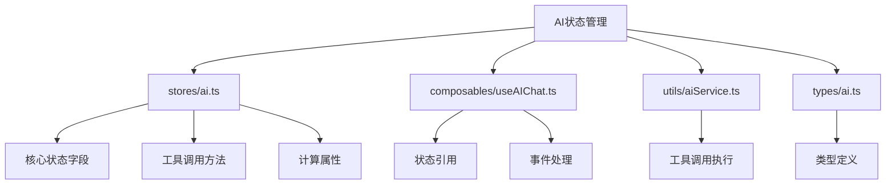
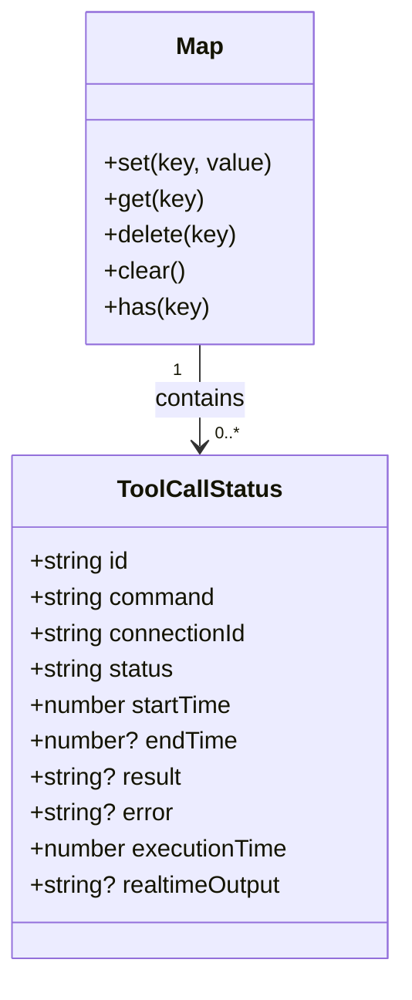
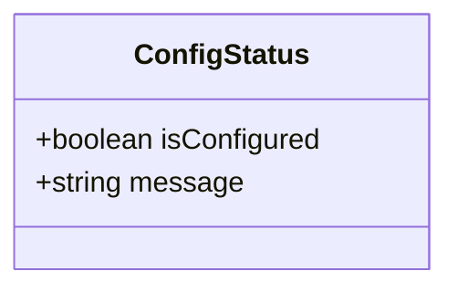
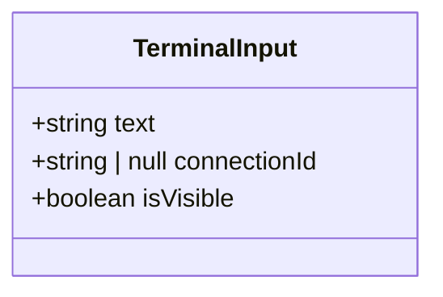
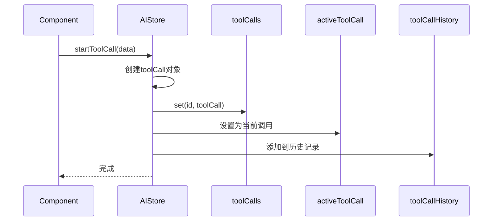
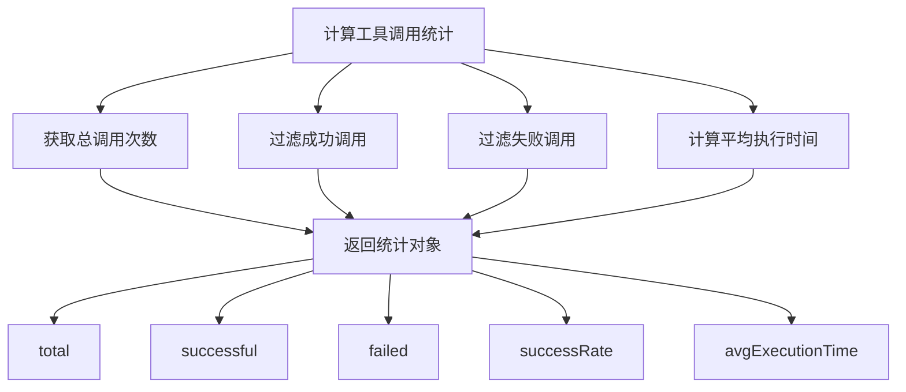

# AI助手状态管理

<cite>
**Referenced Files in This Document**  
- [ai.ts](file://src/modules/ai-assistant/stores/ai.ts)
- [ai.ts](file://src/types/ai.ts)
- [useAIChat.ts](file://src/modules/ai-assistant/composables/useAIChat.ts)
- [aiService.ts](file://src/modules/ai-assistant/utils/aiService.ts)
</cite>

## 目录
1. [项目结构](#项目结构)
2. [核心状态字段](#核心状态字段)
3. [工具调用生命周期管理](#工具调用生命周期管理)
4. [终端输入状态管理](#终端输入状态管理)
5. [计算属性与统计功能](#计算属性与统计功能)
6. [重试功能实现](#重试功能实现)
7. [状态持久化与清理策略](#状态持久化与清理策略)

## 项目结构

AI助手的状态管理主要集中在`src/modules/ai-assistant`模块中，采用Pinia作为状态管理库。核心状态存储在`stores/ai.ts`文件中，通过模块化设计实现了状态的集中管理和组件间的共享。

**Diagram sources**
- [ai.ts](file://src/modules/ai-assistant/stores/ai.ts)
- [useAIChat.ts](file://src/modules/ai-assistant/composables/useAIChat.ts)
- [aiService.ts](file://src/modules/ai-assistant/utils/aiService.ts)
- [ai.ts](file://src/types/ai.ts)

**Section sources**
- [ai.ts](file://src/modules/ai-assistant/stores/ai.ts)
- [useAIChat.ts](file://src/modules/ai-assistant/composables/useAIChat.ts)

## 核心状态字段

AI助手状态管理store定义了多个核心状态字段，用于跟踪AI助手的各种状态和数据。

### toolCalls
`toolCalls`是一个Map类型的状态，用于存储当前正在执行的工具调用。它使用工具调用ID作为键，工具调用对象作为值，便于快速查找和更新特定的工具调用状态。

**Diagram sources**
- [ai.ts](file://src/modules/ai-assistant/stores/ai.ts#L20-L20)
- [ai.ts](file://src/types/ai.ts#L118-L129)

**Section sources**
- [ai.ts](file://src/modules/ai-assistant/stores/ai.ts#L20-L20)

### activeToolCall
`activeToolCall`状态用于跟踪当前正在执行的活跃工具调用。当有工具调用开始执行时，该状态会被设置为对应的工具调用对象；当工具调用完成、失败或超时时，该状态会被重置为null。

**Section sources**
- [ai.ts](file://src/modules/ai-assistant/stores/ai.ts#L21-L21)

### configStatus
`configStatus`状态用于管理AI助手的配置状态，包含两个字段：`isConfigured`表示是否已配置，`message`存储配置相关的消息。该状态用于控制AI助手功能的可用性。

**Diagram sources**
- [ai.ts](file://src/types/ai.ts#L131-L134)

**Section sources**
- [ai.ts](file://src/modules/ai-assistant/stores/ai.ts#L23-L26)

### terminalInput
`terminalInput`状态用于管理终端输入的相关信息，包括输入的文本内容、关联的连接ID以及输入框的可见状态。该状态实现了AI助手与终端之间的交互控制。

**Diagram sources**
- [ai.ts](file://src/types/ai.ts#L136-L140)

**Section sources**
- [ai.ts](file://src/modules/ai-assistant/stores/ai.ts#L27-L31)

## 工具调用生命周期管理

AI助手提供了完整的工具调用生命周期管理方法，涵盖了从开始到结束的各个阶段。

### startToolCall
`startToolCall`方法用于启动一个新的工具调用。它接收工具调用数据作为参数，创建工具调用对象并将其添加到`toolCalls`Map中，同时更新`activeToolCall`和`toolCallHistory`。

**Diagram sources**
- [ai.ts](file://src/modules/ai-assistant/stores/ai.ts#L44-L66)
- [aiService.ts](file://src/modules/ai-assistant/utils/aiService.ts#L466-L466)

**Section sources**
- [ai.ts](file://src/modules/ai-assistant/stores/ai.ts#L44-L66)

### completeToolCall
`completeToolCall`方法用于标记工具调用成功完成。它更新工具调用的状态为'completed'，记录执行结果和执行时间，并清理活跃工具调用状态。

**Section sources**
- [ai.ts](file://src/modules/ai-assistant/stores/ai.ts#L68-L86)

### errorToolCall
`errorToolCall`方法用于处理工具调用过程中发生的错误。它将工具调用状态设置为'error'，记录错误信息，并清理活跃工具调用状态。

**Section sources**
- [ai.ts](file://src/modules/ai-assistant/stores/ai.ts#L88-L106)

### timeoutToolCall
`timeoutToolCall`方法专门处理工具调用超时的情况。它将状态设置为'timeout'，并生成相应的超时错误消息。

**Section sources**
- [ai.ts](file://src/modules/ai-assistant/stores/ai.ts#L108-L126)

## 终端输入状态管理

AI助手提供了完整的终端输入状态管理机制，通过一组方法控制终端输入的显示和内容。

### setTerminalInput
`setTerminalInput`方法用于设置终端输入的内容和关联的连接ID，同时显示输入框。

**Section sources**
- [ai.ts](file://src/modules/ai-assistant/stores/ai.ts#L160-L166)

### showTerminalInput
`showTerminalInput`方法用于显示终端输入框，通常在需要用户输入时调用。

**Section sources**
- [ai.ts](file://src/modules/ai-assistant/stores/ai.ts#L168-L170)

### hideTerminalInput
`hideTerminalInput`方法用于隐藏终端输入框，通常在输入完成后调用。

**Section sources**
- [ai.ts](file://src/modules/ai-assistant/stores/ai.ts#L172-L174)

### clearTerminalInput
`clearTerminalInput`方法用于清除终端输入的所有状态，包括文本内容、连接ID和可见性。

**Section sources**
- [ai.ts](file://src/modules/ai-assistant/stores/ai.ts#L176-L182)

## 计算属性与统计功能

AI助手状态管理提供了多个计算属性，用于动态计算和获取状态信息。

### getToolCallStats
`getToolCallStats`计算属性用于统计工具调用的整体情况，包括总调用次数、成功次数、失败次数、成功率和平均执行时间。

**Diagram sources**
- [ai.ts](file://src/modules/ai-assistant/stores/ai.ts#L185-L199)
- [ai.ts](file://src/types/ai.ts#L142-L148)

**Section sources**
- [ai.ts](file://src/modules/ai-assistant/stores/ai.ts#L185-L199)

## 重试功能实现

AI助手实现了工具调用的重试功能，允许用户重新执行失败或超时的命令。

### retryToolCall
`retryToolCall`方法根据工具调用ID查找对应的调用记录，如果找到且包含命令，则返回重试信息，让组件处理实际的重试逻辑。

**Section sources**
- [ai.ts](file://src/modules/ai-assistant/stores/ai.ts#L201-L208)
- [useAIChat.ts](file://src/modules/ai-assistant/composables/useAIChat.ts#L313-L319)

## 状态持久化与清理策略

AI助手状态管理实现了合理的状态清理策略，确保内存的有效使用和状态的正确管理。

### clearToolCalls
`clearToolCalls`方法用于清除所有当前的工具调用状态，包括清空`toolCalls`Map和重置`activeToolCall`。

**Section sources**
- [ai.ts](file://src/modules/ai-assistant/stores/ai.ts#L135-L138)
- [useAIChat.ts](file://src/modules/ai-assistant/composables/useAIChat.ts#L272-L285)

### clearToolCallHistory
`clearToolCallHistory`方法用于清空工具调用历史记录，通常在用户清空对话时调用。

**Section sources**
- [ai.ts](file://src/modules/ai-assistant/stores/ai.ts#L140-L142)
- [useAIChat.ts](file://src/modules/ai-assistant/composables/useAIChat.ts#L324-L327)