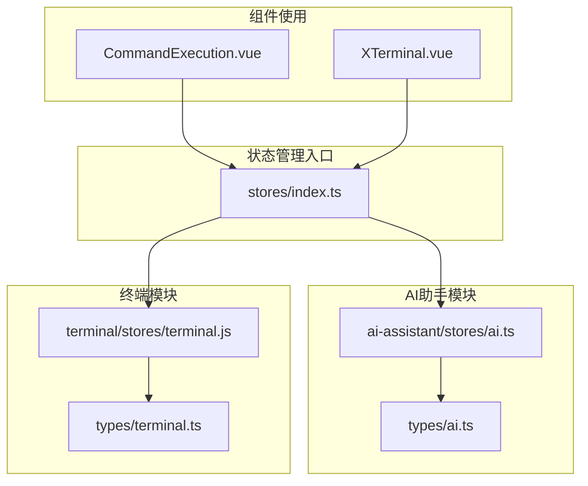
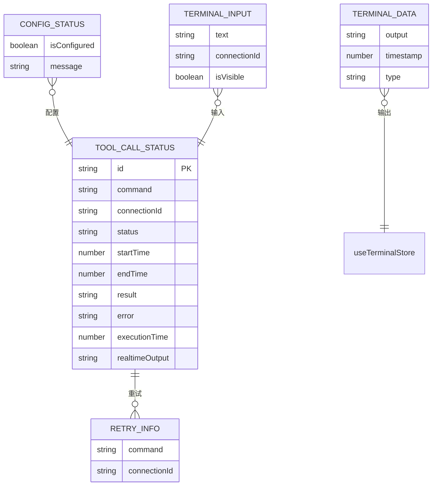
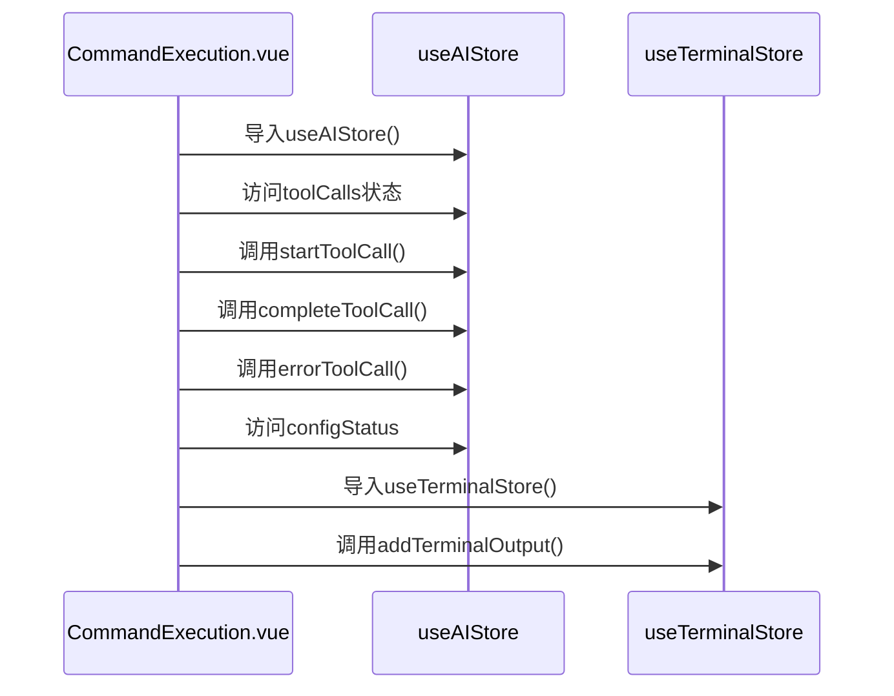
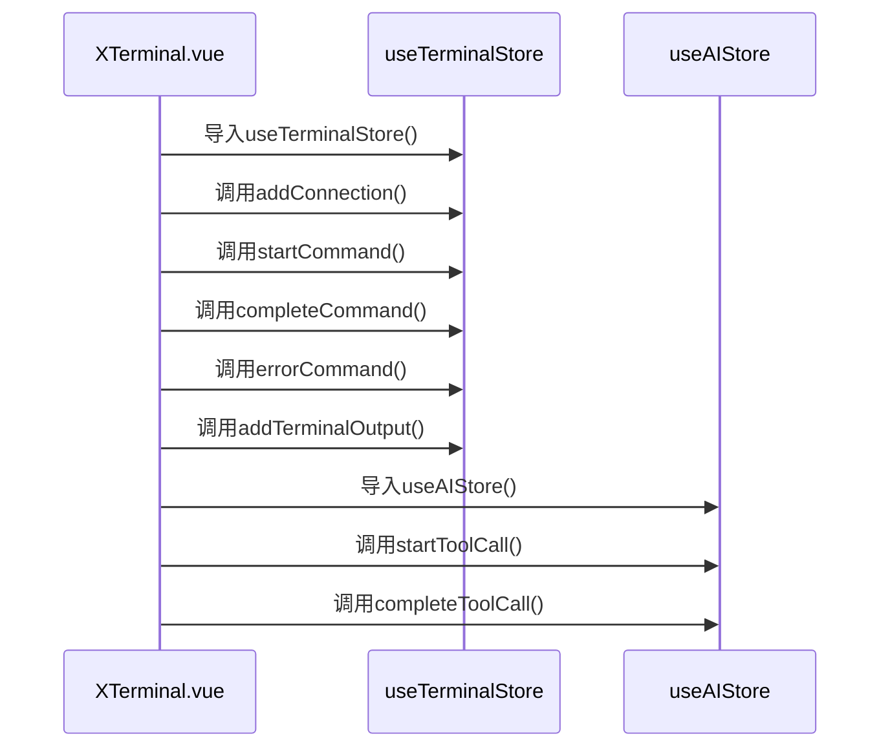
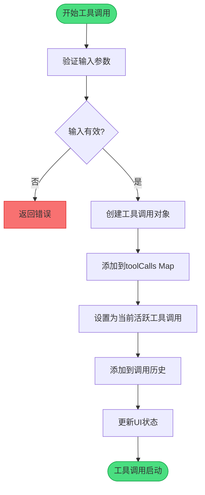
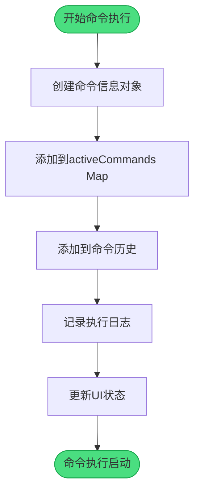

# 全局状态管理

<cite>
**Referenced Files in This Document**   
- [src/stores/index.ts](file://src/stores/index.ts)
- [src/modules/ai-assistant/stores/ai.ts](file://src/modules/ai-assistant/stores/ai.ts)
- [src/modules/terminal/stores/terminal.js](file://src/modules/terminal/stores/terminal.js)
- [src/types/ai.ts](file://src/types/ai.ts)
- [src/types/terminal.ts](file://src/types/terminal.ts)
- [src/modules/ai-assistant/components/ai/CommandExecution.vue](file://src/modules/ai-assistant/components/ai/CommandExecution.vue)
- [src/modules/terminal/components/XTerminal.vue](file://src/modules/terminal/components/XTerminal.vue)
</cite>

## 目录
1. [简介](#简介)
2. [状态管理架构](#状态管理架构)
3. [核心状态模块](#核心状态模块)
4. [模块化设计](#模块化设计)
5. [类型安全保证](#类型安全保证)
6. [组件使用实践](#组件使用实践)
7. [状态管理流程](#状态管理流程)
8. [最佳实践](#最佳实践)

## 简介
sshcode应用采用Pinia作为全局状态管理解决方案，通过模块化设计实现了AI助手和终端功能的状态管理。`src/stores/index.ts`文件作为所有store的统一入口，提供了简洁的导入机制，使得组件可以方便地访问全局状态。这种设计不仅提高了代码的可维护性，还确保了类型安全，为应用的稳定运行提供了保障。

## 状态管理架构
sshcode应用的状态管理架构采用分层模块化设计，将全局状态划分为独立的功能模块。每个模块负责管理特定功能域的状态，通过统一的入口文件进行导出，实现了状态管理的解耦和复用。



**Diagram sources**
- [src/stores/index.ts](file://src/stores/index.ts)
- [src/modules/ai-assistant/stores/ai.ts](file://src/modules/ai-assistant/stores/ai.ts)
- [src/modules/terminal/stores/terminal.js](file://src/modules/terminal/stores/terminal.js)

**Section sources**
- [src/stores/index.ts](file://src/stores/index.ts)

## 核心状态模块
### AI助手状态管理
AI助手状态管理模块（`useAIStore`）负责管理AI相关功能的全局状态，包括工具调用、配置状态和终端输入等。该模块通过Pinia的`defineStore`函数创建，提供了丰富的状态和方法。

```mermaid
classDiagram
class useAIStore {
+toolCalls : Map<string, ToolCall>
+activeToolCall : ToolCall | null
+toolCallHistory : ToolCall[]
+configStatus : ConfigStatus
+terminalInput : TerminalInput
+hasActiveToolCall : boolean
+getToolCallById(id : string) : ToolCall | undefined
+getToolCallsByConnectionId(connectionId : string) : ToolCall[]
+getToolCallStats : ToolCallStats
+startToolCall(toolCallData : {id, command, connectionId, timestamp}) : void
+completeToolCall(toolCallData : {id, result, executionTime}) : void
+errorToolCall(toolCallData : {id, error, executionTime}) : void
+timeoutToolCall(toolCallData : {id, executionTime, timeoutDuration}) : void
+removeToolCall(id : string) : void
+clearToolCalls() : void
+clearToolCallHistory() : void
+setConfigRequired(message : string) : void
+setConfigured() : void
+setTerminalInput(text : string, connectionId : string | null) : void
+showTerminalInput() : void
+hideTerminalInput() : void
+clearTerminalInput() : void
+retryToolCall(id : string) : RetryInfo | null
+getRealtimeOutput(id : string) : string
+updateRealtimeOutput(id : string, output : string) : void
}
class ToolCall {
+id : string
+command : string
+connectionId : string
+status : 'executing' | 'completed' | 'error' | 'timeout'
+startTime : number
+endTime? : number
+result? : string
+error? : string
+executionTime : number
+realtimeOutput? : string
}
class ConfigStatus {
+isConfigured : boolean
+message : string
}
class TerminalInput {
+text : string
+connectionId : string | null
+isVisible : boolean
}
class ToolCallStats {
+total : number
+successful : number
+failed : number
+successRate : number
+avgExecutionTime : number
}
class RetryInfo {
+command : string
+connectionId : string
}
useAIStore --> ToolCall : "包含"
useAIStore --> ConfigStatus : "包含"
useAIStore --> TerminalInput : "包含"
useAIStore --> ToolCallStats : "计算属性"
useAIStore --> RetryInfo : "返回类型"
```

**Diagram sources**
- [src/modules/ai-assistant/stores/ai.ts](file://src/modules/ai-assistant/stores/ai.ts)
- [src/types/ai.ts](file://src/types/ai.ts)

**Section sources**
- [src/modules/ai-assistant/stores/ai.ts](file://src/modules/ai-assistant/stores/ai.ts)

### 终端状态管理
终端状态管理模块（`useTerminalStore`）负责管理终端相关功能的全局状态，包括连接状态、命令执行和终端实例等。该模块同样通过Pinia的`defineStore`函数创建，提供了完整的终端状态管理功能。

```mermaid
classDiagram
class useTerminalStore {
+connections : Map<string, Connection>
+activeCommands : Map<string, CommandInfo>
+commandHistory : Map<string, CommandInfo[]>
+terminals : Map<string, Terminal>
+getConnections : Connection[]
+getConnectionById(id : string) : Connection | undefined
+getActiveCommands : CommandInfo[]
+getCommandHistory(connectionId : string) : CommandInfo[]
+getConnectionStats : { [id : string] : ConnectionStats }
+getActiveCommandCount : number
+addConnection(connection : Connection) : void
+removeConnection(connectionId : string) : void
+updateConnection(connectionId : string, updates : Partial<Connection>) : void
+startCommand(commandData : {commandId, command, connectionId, timestamp}) : void
+completeCommand(commandData : {commandId, result}) : void
+errorCommand(commandData : {commandId, error}) : void
+addTerminalOutput(connectionId : string, output : TerminalData) : void
+clearTerminalOutput(connectionId : string) : void
+setTerminal(connectionId : string, terminal : Terminal) : void
+removeTerminal(connectionId : string) : void
+clearAll() : void
}
class Connection {
+id : string
+status : 'connected' | 'disconnected' | 'connecting'
+host : string
+port : number
+username : string
+outputs? : TerminalData[]
}
class CommandInfo {
+id : string
+command : string
+connectionId : string
+status : 'executing' | 'completed' | 'error'
+startTime : number
+endTime? : number
+result? : string
+error? : string
+executionTime : number
}
class TerminalData {
+output : string
+timestamp : number
+type : 'input' | 'output' | 'error'
}
class ConnectionStats {
+totalCommands : number
+successfulCommands : number
+failedCommands : number
+successRate : number
+avgExecutionTime : number
+outputLines : number
}
useTerminalStore --> Connection : "包含"
useTerminalStore --> CommandInfo : "包含"
useTerminalStore --> TerminalData : "包含"
useTerminalStore --> ConnectionStats : "计算属性"
```

**Diagram sources**
- [src/modules/terminal/stores/terminal.js](file://src/modules/terminal/stores/terminal.js)
- [src/types/terminal.ts](file://src/types/terminal.ts)

**Section sources**
- [src/modules/terminal/stores/terminal.js](file://src/modules/terminal/stores/terminal.js)

## 模块化设计
### 统一入口设计
`src/stores/index.ts`文件作为所有store的统一入口，采用了模块化导出设计。这种设计模式将各个功能模块的状态管理store集中导出，为组件提供了简洁的导入路径。

```typescript
/**
 * Stores入口文件
 * 统一导出所有Pinia stores
 */

export { useAIStore } from '../modules/ai-assistant/stores/ai.js';
export { useTerminalStore } from '../modules/terminal/stores/terminal.js';

// 为了方便使用，也导出默认的stores
import { useAIStore } from '../modules/ai-assistant/stores/ai.js';
import { useTerminalStore } from '../modules/terminal/stores/terminal.js';

export default {
  useAIStore,
  useTerminalStore
};
```

**Section sources**
- [src/stores/index.ts](file://src/stores/index.ts)

### 模块化优势
模块化状态管理设计带来了以下优势：
1. **解耦性**：每个功能模块独立管理自己的状态，降低了模块间的耦合度
2. **可维护性**：状态逻辑集中在各自的模块中，便于维护和扩展
3. **复用性**：模块可以独立复用，提高了代码的复用率
4. **可测试性**：模块独立，便于进行单元测试

## 类型安全保证
### 类型定义
sshcode应用通过TypeScript的类型系统为状态管理提供了完整的类型安全保证。AI助手和终端模块都有独立的类型定义文件，确保了状态的类型安全。



**Diagram sources**
- [src/types/ai.ts](file://src/types/ai.ts)
- [src/types/terminal.ts](file://src/types/terminal.ts)

**Section sources**
- [src/types/ai.ts](file://src/types/ai.ts)
- [src/types/terminal.ts](file://src/types/terminal.ts)

### 类型推断
Pinia与TypeScript的完美集成提供了强大的类型推断能力。当使用`defineStore`创建store时，Pinia会自动推断出store的类型，包括状态、计算属性和方法的返回类型。

## 组件使用实践
### AI助手组件使用
在AI助手相关组件中，可以通过统一入口导入`useAIStore`，然后使用其提供的状态和方法。



**Diagram sources**
- [src/modules/ai-assistant/components/ai/CommandExecution.vue](file://src/modules/ai-assistant/components/ai/CommandExecution.vue)
- [src/modules/ai-assistant/stores/ai.ts](file://src/modules/ai-assistant/stores/ai.ts)
- [src/modules/terminal/stores/terminal.js](file://src/modules/terminal/stores/terminal.js)

**Section sources**
- [src/modules/ai-assistant/components/ai/CommandExecution.vue](file://src/modules/ai-assistant/components/ai/CommandExecution.vue)

### 终端组件使用
在终端相关组件中，可以通过统一入口导入`useTerminalStore`，然后使用其提供的状态和方法。



**Diagram sources**
- [src/modules/terminal/components/XTerminal.vue](file://src/modules/terminal/components/XTerminal.vue)
- [src/modules/terminal/stores/terminal.js](file://src/modules/terminal/stores/terminal.js)
- [src/modules/ai-assistant/stores/ai.ts](file://src/modules/ai-assistant/stores/ai.ts)

**Section sources**
- [src/modules/terminal/components/XTerminal.vue](file://src/modules/terminal/components/XTerminal.vue)

## 状态管理流程
### AI工具调用流程
AI工具调用的状态管理流程如下：



**Diagram sources**
- [src/modules/ai-assistant/stores/ai.ts](file://src/modules/ai-assistant/stores/ai.ts)

### 命令执行流程
终端命令执行的状态管理流程如下：



**Diagram sources**
- [src/modules/terminal/stores/terminal.js](file://src/modules/terminal/stores/terminal.js)

## 最佳实践
### 状态访问最佳实践
在组件中访问全局状态时，应遵循以下最佳实践：

1. **按需导入**：只导入需要的store，避免不必要的依赖
2. **使用解构**：使用解构语法获取需要的状态和方法
3. **避免直接修改**：通过store提供的方法修改状态，而不是直接修改状态

```typescript
// 正确的做法
import { useAIStore } from '@/stores';
const aiStore = useAIStore();
const { toolCalls, startToolCall, completeToolCall } = aiStore;

// 错误的做法
import { useAIStore } from '@/modules/ai-assistant/stores/ai';
const aiStore = useAIStore();
aiStore.toolCalls.set('id', toolCall); // 直接修改状态
```

### 状态更新最佳实践
更新全局状态时，应遵循以下最佳实践：

1. **使用事务性方法**：将相关的状态更新封装在同一个方法中
2. **保持原子性**：确保状态更新的原子性，避免中间状态
3. **处理异常**：在状态更新方法中处理可能的异常情况

### 性能优化
为了优化状态管理的性能，建议：

1. **合理使用计算属性**：将复杂的计算逻辑封装在计算属性中
2. **避免不必要的响应式**：对于不需要响应式的数据，使用普通变量
3. **及时清理资源**：在适当的时候清理不再需要的状态

**Section sources**
- [src/stores/index.ts](file://src/stores/index.ts)
- [src/modules/ai-assistant/stores/ai.ts](file://src/modules/ai-assistant/stores/ai.ts)
- [src/modules/terminal/stores/terminal.js](file://src/modules/terminal/stores/terminal.js)