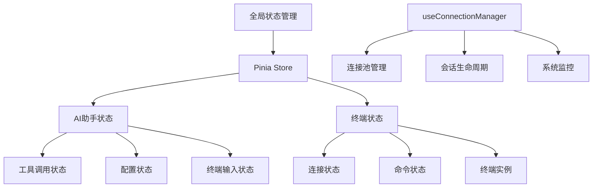
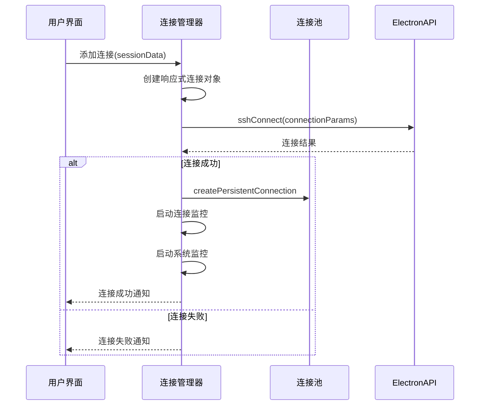
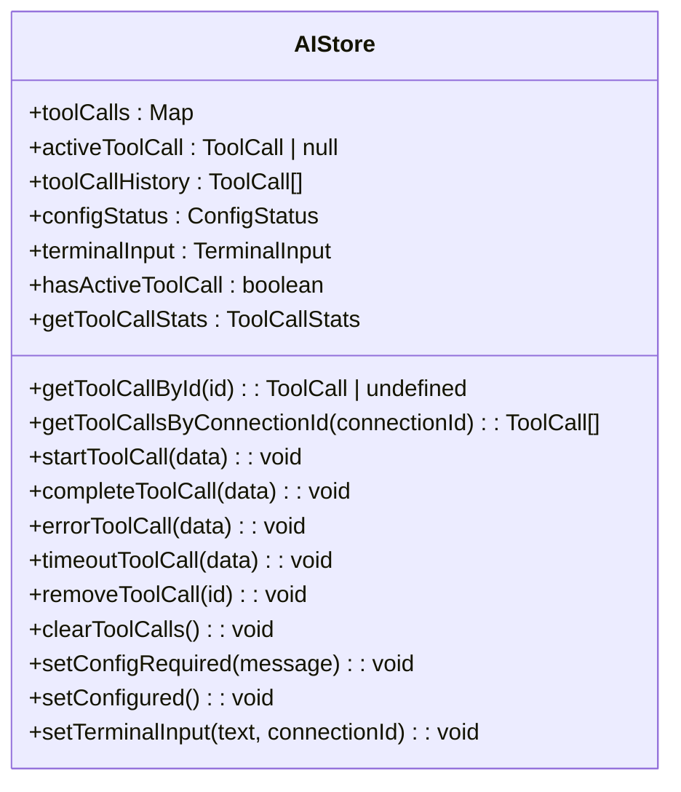
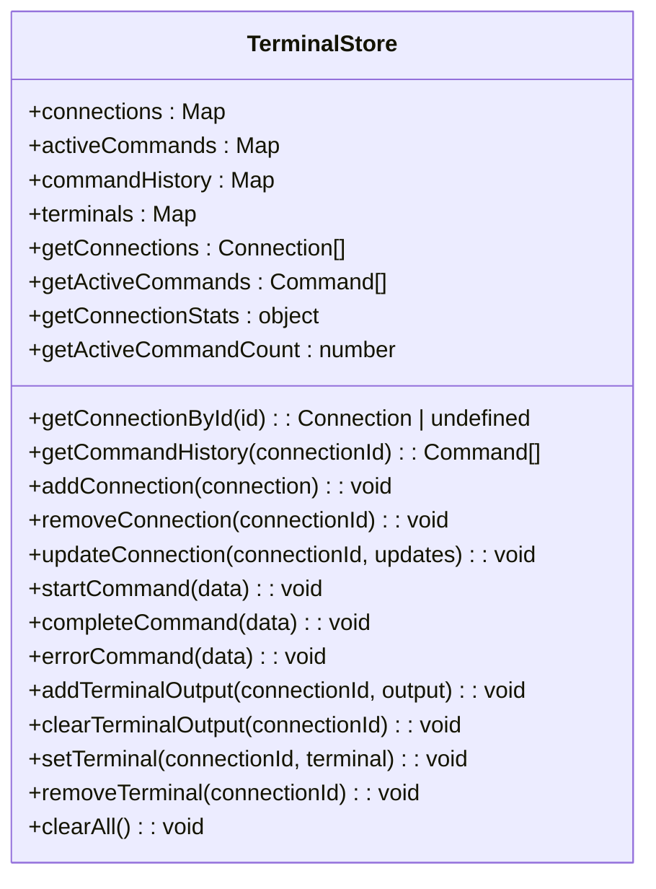
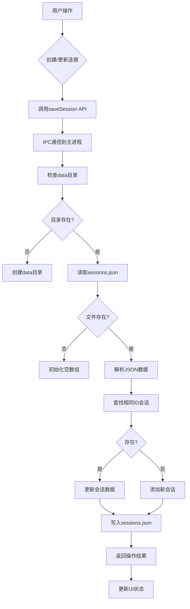

# 状态管理

<cite>
**本文档引用的文件**
- [index.ts](file://src/stores/index.ts)
- [useConnectionManager.ts](file://src/composables/useConnectionManager.ts)
- [ai.ts](file://src/modules/ai-assistant/stores/ai.ts)
- [terminal.js](file://src/modules/terminal/stores/terminal.js)
- [sessions.json](file://data/sessions.json)
- [useSSHConnectionPool.js](file://src/composables/useSSHConnectionPool.js)
</cite>

## 目录
1. [全局状态架构](#全局状态架构)
2. [连接管理器状态管理](#连接管理器状态管理)
3. [AI助手模块状态管理](#ai助手模块状态管理)
4. [终端模块状态管理](#终端模块状态管理)
5. [状态持久化机制](#状态持久化机制)
6. [状态变更与UI响应](#状态变更与ui响应)
7. [状态订阅与监听最佳实践](#状态订阅与监听最佳实践)

## 全局状态架构

sshcode应用采用Pinia作为全局状态管理解决方案，通过`src/stores/index.ts`文件统一导出所有状态模块，实现了模块化和可维护的状态管理架构。该架构将全局状态分为AI助手和终端两大核心模块，通过依赖注入的方式在应用各组件间共享状态。

**图表来源**
- [index.ts](file://src/stores/index.ts#L1-L16)
- [ai.ts](file://src/modules/ai-assistant/stores/ai.ts#L18-L271)
- [terminal.js](file://src/modules/terminal/stores/terminal.js#L8-L215)

**本节来源**
- [index.ts](file://src/stores/index.ts#L1-L16)

## 连接管理器状态管理

`useConnectionManager.ts`是sshcode应用的核心状态管理器，负责管理SSH连接池、会话状态和连接配置的完整生命周期。该模块通过组合式API封装了连接的创建、维护、监控和销毁等复杂逻辑，为上层组件提供简洁的接口。

连接管理器维护了多个响应式状态：
- `activeConnections`：当前活动的SSH连接数组
- `activeTabId`：当前激活的标签页ID
- `connectionTimers`：连接监控定时器集合
- `systemMonitorTimers`：系统监控定时器集合

连接生命周期管理包括连接建立、断开、重新连接和关闭等操作。当用户发起连接时，系统会创建包含完整连接信息的响应式对象，并通过ElectronAPI建立真实的SSH连接。连接成功后，系统会启动连接监控和系统监控，确保连接的稳定性和实时性。

**图表来源**
- [useConnectionManager.ts](file://src/composables/useConnectionManager.ts#L10-L538)
- [useSSHConnectionPool.js](file://src/composables/useSSHConnectionPool.js#L1-L259)

**本节来源**
- [useConnectionManager.ts](file://src/composables/useConnectionManager.ts#L10-L538)

## AI助手模块状态管理

AI助手模块通过`ai.ts`中的Pinia Store实现局部状态管理，替代了传统的window事件通信机制。该模块专注于管理AI相关的状态，包括工具调用、配置状态和终端输入等。

AI状态管理器的核心状态包括：
- `toolCalls`：工具调用状态映射表，存储所有正在进行的工具调用
- `activeToolCall`：当前活跃的工具调用
- `toolCallHistory`：工具调用历史记录
- `configStatus`：AI服务配置状态
- `terminalInput`：终端输入状态

该模块提供了完整的工具调用生命周期管理方法，包括`startToolCall`、`completeToolCall`、`errorToolCall`和`timeoutToolCall`等。同时，通过计算属性`getToolCallStats`提供工具调用的统计信息，帮助用户了解AI助手的使用情况。

**图表来源**
- [ai.ts](file://src/modules/ai-assistant/stores/ai.ts#L18-L271)

**本节来源**
- [ai.ts](file://src/modules/ai-assistant/stores/ai.ts#L18-L271)

## 终端模块状态管理

终端模块通过`terminal.js`中的Pinia Store实现局部状态管理，负责管理终端相关的所有状态。该模块与全局状态协同工作，为终端组件提供统一的状态管理接口。

终端状态管理器的核心状态包括：
- `connections`：连接状态映射表
- `activeCommands`：活跃命令映射表
- `commandHistory`：命令历史映射表
- `terminals`：终端实例映射表

该模块提供了完整的终端状态管理方法，包括连接管理、命令管理、输出管理和终端实例管理。通过`startCommand`、`completeCommand`和`errorCommand`等方法，实现了命令执行的完整生命周期管理。同时，通过`getConnectionStats`计算属性提供每个连接的统计信息。

**图表来源**
- [terminal.js](file://src/modules/terminal/stores/terminal.js#L8-L215)

**本节来源**
- [terminal.js](file://src/modules/terminal/stores/terminal.js#L8-L215)

## 状态持久化机制

sshcode应用通过Electron的IPC机制实现了会话数据的持久化存储。会话数据被保存在`data/sessions.json`文件中，确保用户配置在应用重启后仍然可用。

状态持久化流程如下：
1. 当用户创建或更新连接时，前端通过`window.electronAPI.saveSession`调用主进程的IPC处理器
2. 主进程的`ipcMain.handle('save-session')`处理器接收会话数据
3. 处理器检查`data`目录是否存在，如不存在则创建
4. 读取现有的`sessions.json`文件，如文件不存在则初始化为空数组
5. 在会话列表中查找是否存在相同ID的会话，如存在则更新，否则添加新会话
6. 将更新后的会话列表写入`sessions.json`文件，使用JSON格式化输出

**图表来源**
- [main.ts](file://main.ts#L39-L126)
- [sessions.json](file://data/sessions.json)

**本节来源**
- [main.ts](file://main.ts#L39-L126)

## 状态变更与UI响应

sshcode应用通过Vue的响应式系统实现了状态变更驱动UI重新渲染的机制。当状态发生变化时，依赖该状态的组件会自动重新渲染，确保UI与状态保持同步。

状态变更的响应式更新流程如下：
1. 状态管理器中的响应式数据发生变化
2. Vue的响应式系统检测到变化并触发依赖追踪
3. 所有依赖该状态的组件被标记为需要更新
4. Vue的虚拟DOM比较算法计算出最小的DOM更新
5. 实际的DOM操作被执行，UI被更新

例如，当SSH连接状态从"connecting"变为"connected"时，`activeConnections`数组中的连接对象被更新，触发所有依赖该连接状态的组件（如连接状态栏、标签页等）重新渲染。这种机制确保了UI的实时性和一致性。

**本节来源**
- [useConnectionManager.ts](file://src/composables/useConnectionManager.ts#L10-L538)
- [ai.ts](file://src/modules/ai-assistant/stores/ai.ts#L18-L271)
- [terminal.js](file://src/modules/terminal/stores/terminal.js#L8-L215)

## 状态订阅与监听最佳实践

在sshcode应用中，状态订阅和监听遵循以下最佳实践：

1. **使用Pinia Store的响应式特性**：通过`storeToRefs`或直接访问store的响应式属性，确保组件能自动响应状态变化。

2. **避免直接修改状态**：所有状态变更都应通过store定义的方法进行，确保状态变更的可追踪性和一致性。

3. **合理使用计算属性**：对于派生状态，使用计算属性而不是在组件中重复计算，提高性能和可维护性。

4. **及时清理资源**：在组件销毁时，清理定时器、事件监听器等资源，防止内存泄漏。

5. **使用类型安全**：通过TypeScript定义状态和方法的类型，确保类型安全和开发体验。

6. **模块化状态管理**：将相关状态组织在同一个store中，保持状态管理的清晰和可维护性。

这些最佳实践确保了状态管理的可靠性、性能和可维护性，为应用的稳定运行提供了保障。

**本节来源**
- [useConnectionManager.ts](file://src/composables/useConnectionManager.ts#L10-L538)
- [ai.ts](file://src/modules/ai-assistant/stores/ai.ts#L18-L271)
- [terminal.js](file://src/modules/terminal/stores/terminal.js#L8-L215)