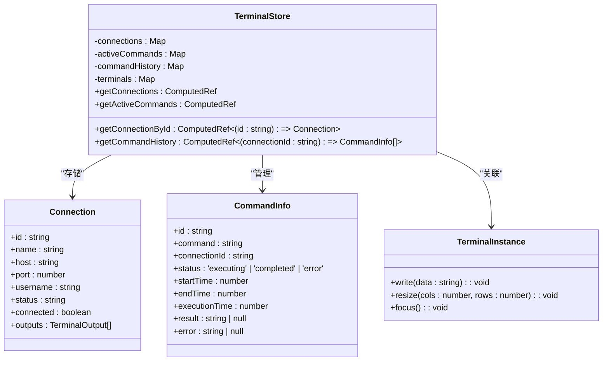
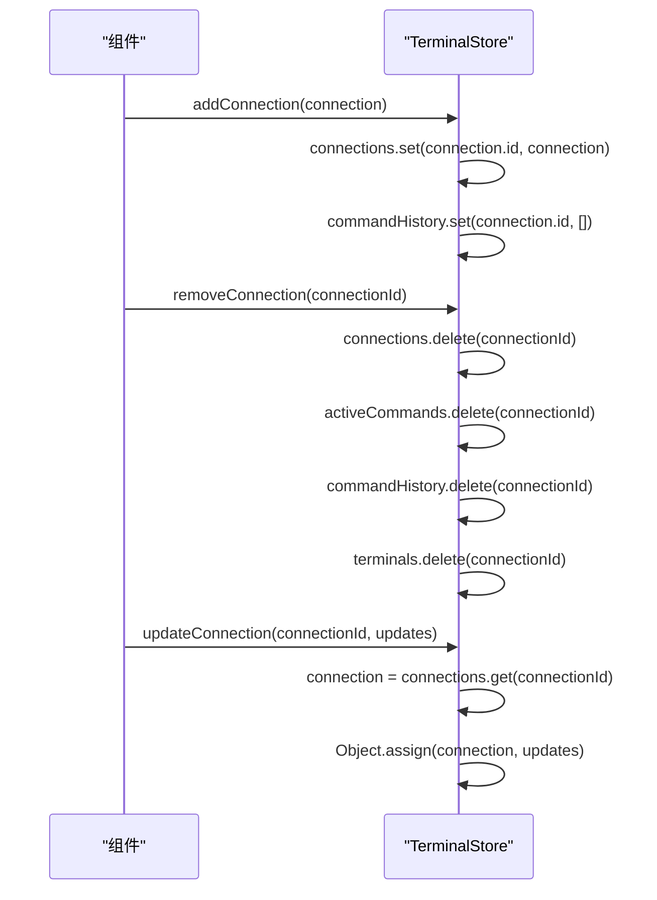
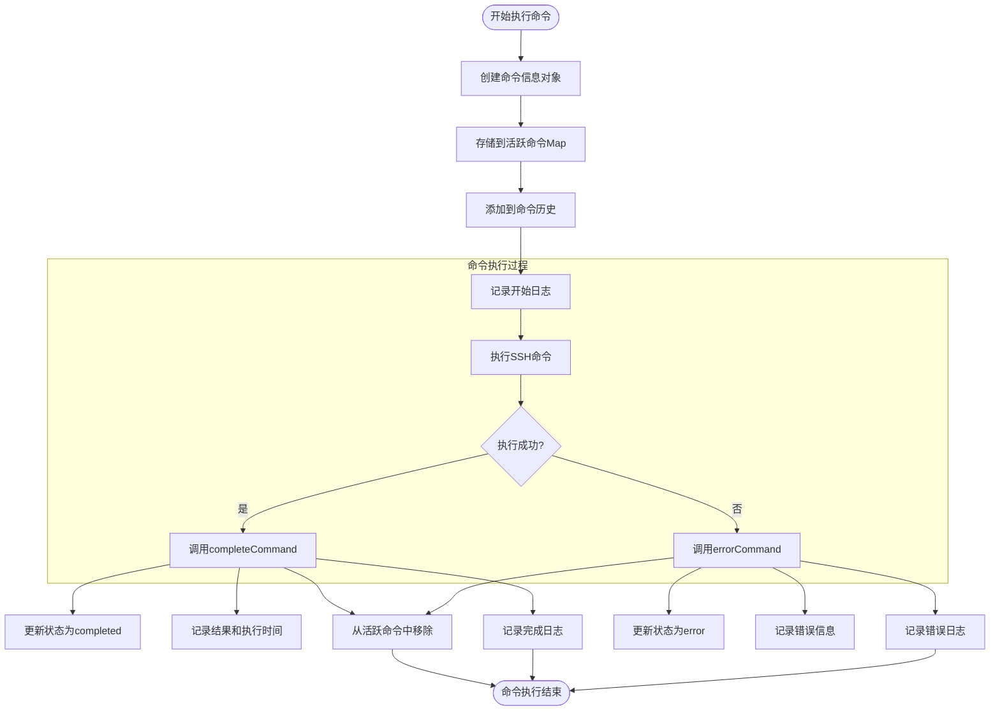
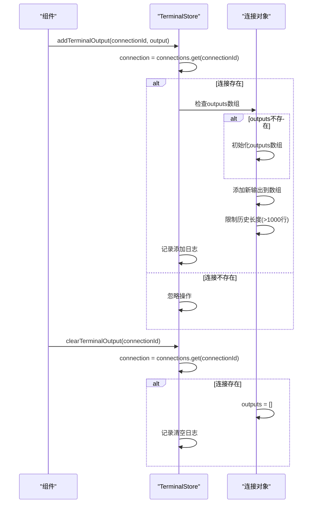
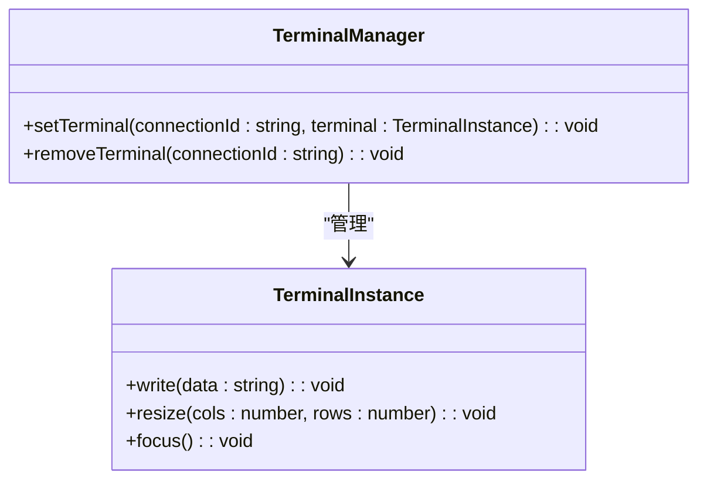
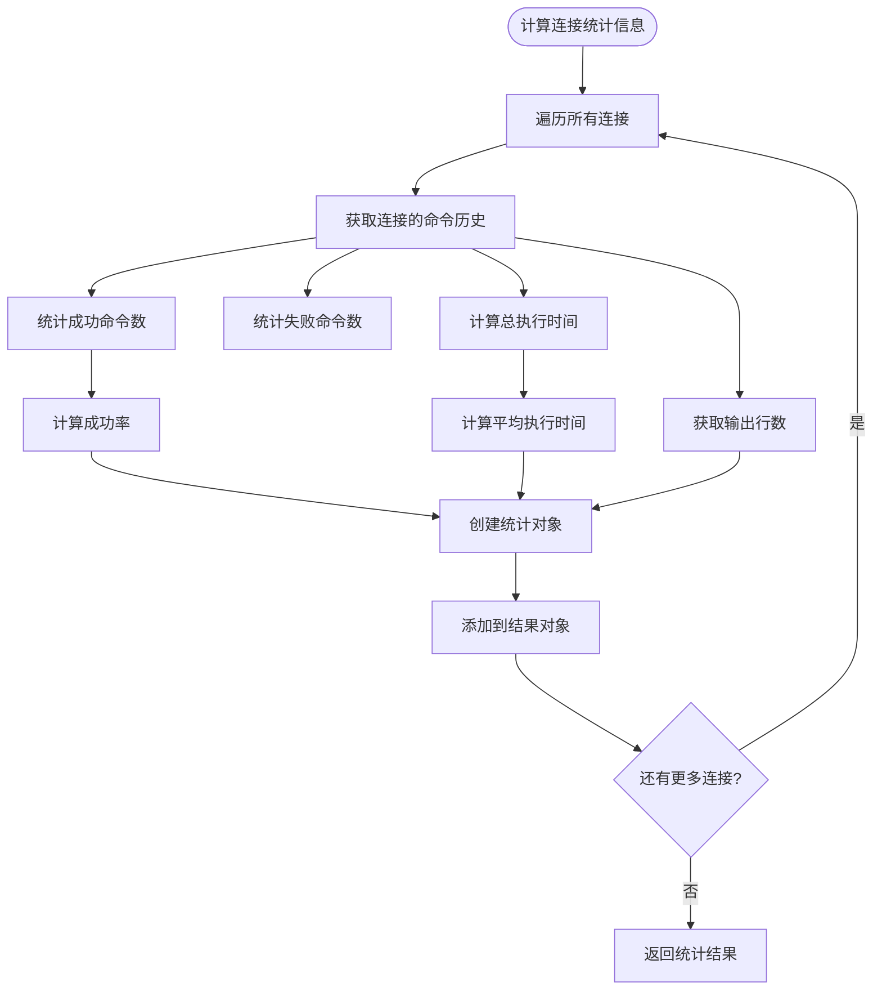
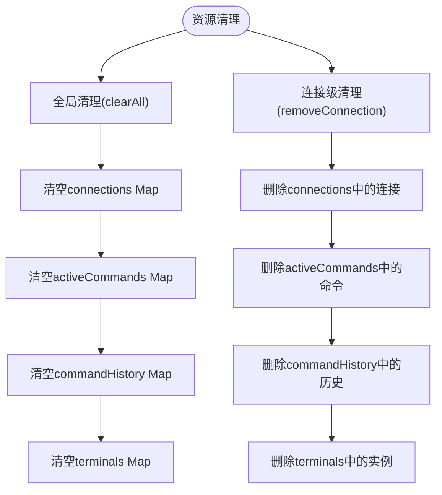
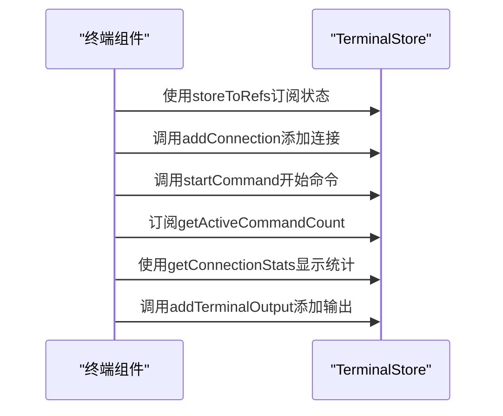

# 终端状态管理

<cite>
**本文档引用的文件**
- [terminal.js](file://src\modules\terminal\stores\terminal.js)
- [simpleCommandExecutor.ts](file://src\modules\terminal\utils\simpleCommandExecutor.ts)
- [useTerminalManager.ts](file://src\modules\terminal\composables\useTerminalManager.ts)
- [useConnectionManager.ts](file://src\composables\useConnectionManager.ts)
- [ai.ts](file://src\modules\ai-assistant\stores\ai.ts)
- [XTerminal.vue](file://src\modules\terminal\components\XTerminal.vue)
</cite>

## 目录
1. [项目结构](#项目结构)
2. [核心状态管理](#核心状态管理)
3. [连接管理](#连接管理)
4. [命令执行生命周期](#命令执行生命周期)
5. [终端输出管理](#终端输出管理)
6. [终端实例管理](#终端实例管理)
7. [统计信息计算](#统计信息计算)
8. [资源清理策略](#资源清理策略)
9. [状态消费最佳实践](#状态消费最佳实践)

## 项目结构

```mermaid
graph TB
subgraph "src"
subgraph "modules"
subgraph "terminal"
subgraph "stores"
terminal[terminal.js]
end
subgraph "utils"
simpleCommand[simpleCommandExecutor.ts]
end
subgraph "composables"
useTerminalManager[useTerminalManager.ts]
end
subgraph "components"
XTerminal[XTerminal.vue]
end
end
subgraph "ai-assistant"
subgraph "stores"
ai[ai.ts]
end
end
end
subgraph "composables"
useConnectionManager[useConnectionManager.ts]
end
subgraph "stores"
index[index.ts]
end
end
```

**图示来源**
- [terminal.js](file://src\modules\terminal\stores\terminal.js)
- [simpleCommandExecutor.ts](file://src\modules\terminal\utils\simpleCommandExecutor.ts)
- [useTerminalManager.ts](file://src\modules\terminal\composables\useTerminalManager.ts)
- [useConnectionManager.ts](file://src\composables\useConnectionManager.ts)
- [ai.ts](file://src\modules\ai-assistant\stores\ai.ts)

## 核心状态管理

终端状态管理Store使用Pinia管理终端状态，替代了传统的window事件通信机制。核心状态通过Map类型的数据结构进行管理，提供了高效的状态存储和检索能力。

### Map类型状态管理

Store中定义了四个主要的Map类型状态，用于管理不同维度的终端信息：

- **connections**: 使用Map存储连接状态，以连接ID为键，连接对象为值
- **activeCommands**: 使用Map存储活跃命令，以命令ID为键，命令信息对象为值
- **commandHistory**: 使用Map存储命令历史，以连接ID为键，命令历史数组为值
- **terminals**: 使用Map存储终端实例，以连接ID为键，终端实例对象为值

这些Map类型的状态通过Vue的ref函数进行响应式包装，确保在状态变化时能够触发视图更新。Map数据结构的选择提供了O(1)时间复杂度的查找、插入和删除操作，非常适合需要频繁访问和修改的终端状态管理场景。



**图示来源**
- [terminal.js](file://src\modules\terminal\stores\terminal.js#L8-L215)

**本节来源**
- [terminal.js](file://src\modules\terminal\stores\terminal.js#L8-L215)

## 连接管理

连接管理功能提供了对终端连接的全生命周期管理，包括连接的添加、移除和更新操作。

### 连接添加

`addConnection`方法用于添加新的终端连接。当添加连接时，系统会：
1. 将连接信息存储到connections Map中，以连接ID为键
2. 为该连接初始化一个空的命令历史数组，存储到commandHistory Map中
3. 记录操作日志，便于调试和监控

这种方法确保了每个新连接都有独立的命令历史记录，避免了不同连接之间的数据混淆。

### 连接移除

`removeConnection`方法用于移除指定的终端连接。移除操作是全面的，会同时清理与该连接相关的所有状态：
1. 从connections Map中删除连接信息
2. 从activeCommands Map中删除该连接的所有活跃命令
3. 从commandHistory Map中删除该连接的命令历史
4. 从terminals Map中删除该连接的终端实例

这种全面的清理策略确保了资源的完全释放，防止了内存泄漏。

### 连接更新

`updateConnection`方法用于更新现有连接的信息。该方法通过连接ID查找对应的连接对象，并使用Object.assign方法将更新内容合并到现有对象中。这种方式既保持了对象的引用一致性，又实现了属性的灵活更新。



**图示来源**
- [terminal.js](file://src\modules\terminal\stores\terminal.js#L50-L65)

**本节来源**
- [terminal.js](file://src\modules\terminal\stores\terminal.js#L50-L65)

## 命令执行生命周期

命令执行生命周期跟踪机制是终端状态管理的核心功能之一，它通过三个关键方法实现了对命令执行全过程的精确监控。

### 命令开始执行

`startCommand`方法标志着命令执行的开始。当调用此方法时，系统会：
1. 创建包含命令详细信息的commandInfo对象，包括命令ID、命令内容、连接ID、状态（初始为"executing"）、开始时间等
2. 将commandInfo对象存储到activeCommands Map中，以便跟踪活跃命令
3. 将commandInfo对象添加到对应连接的命令历史中
4. 记录开始执行的日志

这种方法确保了命令执行状态的实时跟踪，为后续的状态更新和统计分析提供了基础数据。

### 命令执行完成

`completeCommand`方法用于标记命令执行成功完成。当命令成功执行后，系统会：
1. 从activeCommands Map中获取对应的命令信息
2. 更新命令状态为"completed"
3. 记录结果、结束时间和执行时长
4. 从activeCommands Map中移除该命令（因为它不再活跃）
5. 记录执行完成的日志

执行时长通过结束时间减去开始时间计算得出，为性能分析提供了重要数据。

### 命令执行失败

`errorCommand`方法用于处理命令执行失败的情况。其处理流程与`completeCommand`类似，但有以下特点：
1. 更新命令状态为"error"
2. 记录错误信息
3. 同样计算并记录执行时长
4. 从activeCommands Map中移除该命令
5. 记录执行失败的日志

这种统一的处理模式确保了无论命令执行成功还是失败，都能得到完整的状态跟踪和记录。



**图示来源**
- [terminal.js](file://src\modules\terminal\stores\terminal.js#L68-L104)
- [simpleCommandExecutor.ts](file://src\modules\terminal\utils\simpleCommandExecutor.ts#L186-L211)

**本节来源**
- [terminal.js](file://src\modules\terminal\stores\terminal.js#L68-L104)

## 终端输出管理

终端输出管理功能负责处理和存储从终端接收到的所有输出数据，确保用户能够查看完整的命令执行结果。

### 输出添加

`addTerminalOutput`方法用于向指定连接添加终端输出。该方法的实现包含以下关键步骤：
1. 通过连接ID从connections Map中获取对应的连接对象
2. 确保连接对象存在outputs数组，如果不存在则初始化
3. 将新的输出数据（包含类型、内容和时间戳）添加到outputs数组中
4. 实施输出历史长度限制策略，当输出行数超过1000行时，保留最近的800行

这种长度限制策略平衡了内存使用和用户体验，既避免了无限增长的内存消耗，又保留了足够的历史记录供用户参考。

### 输出清理

`clearTerminalOutput`方法用于清空指定连接的终端输出。该方法简单直接，将连接对象的outputs数组重置为空数组，并记录相应的操作日志。这种设计确保了用户可以随时清理终端输出，获得一个干净的显示界面。



**图示来源**
- [terminal.js](file://src\modules\terminal\stores\terminal.js#L106-L125)
- [useTerminalManager.ts](file://src\modules\terminal\composables\useTerminalManager.ts#L56-L91)
- [useConnectionManager.ts](file://src\composables\useConnectionManager.ts#L242-L249)

**本节来源**
- [terminal.js](file://src\modules\terminal\stores\terminal.js#L106-L125)

## 终端实例管理

终端实例管理功能负责维护终端UI组件实例的引用，以便在需要时直接操作终端。

### 实例注册

`setTerminal`方法用于注册终端实例。当终端组件初始化完成后，会调用此方法将终端实例存储到terminals Map中，以连接ID为键。这为后续通过编程方式操作终端（如写入数据、调整大小等）提供了基础。

### 实例移除

`removeTerminal`方法用于移除终端实例。当连接断开或终端组件销毁时，会调用此方法从terminals Map中删除对应的终端实例引用。这种及时的清理确保了不会保留对已销毁组件的无效引用，防止了潜在的内存泄漏。



**图示来源**
- [terminal.js](file://src\modules\terminal\stores\terminal.js#L136-L144)

**本节来源**
- [terminal.js](file://src\modules\terminal\stores\terminal.js#L136-L144)

## 统计信息计算

统计信息计算功能通过计算属性`getConnectionStats`提供每个连接的详细统计信息，帮助用户了解连接的使用情况和性能表现。

### 统计指标

对于每个活动连接，系统计算以下统计指标：
- **totalCommands**: 总命令数，即命令历史的长度
- **successfulCommands**: 成功命令数，状态为"completed"的命令数量
- **failedCommands**: 失败命令数，状态为"error"的命令数量
- **successRate**: 成功率，成功命令数占总命令数的百分比
- **avgExecutionTime**: 平均执行时长，所有命令执行时长的平均值
- **outputLines**: 输出行数，当前连接的终端输出行数

这些统计指标通过遍历connections Map和commandHistory Map实时计算得出，确保了数据的准确性和时效性。

### 计算时机

`getConnectionStats`是一个计算属性（computed property），这意味着它具有惰性求值和缓存特性。只有当依赖的状态（connections、commandHistory等）发生变化时，统计信息才会重新计算，避免了不必要的性能开销。



**图示来源**
- [terminal.js](file://src\modules\terminal\stores\terminal.js#L147-L165)

**本节来源**
- [terminal.js](file://src\modules\terminal\stores\terminal.js#L147-L165)

## 资源清理策略

资源清理策略确保了终端状态管理的健壮性和内存效率，防止了资源泄漏和状态污染。

### 全局清理

`clearAll`方法提供了全局清理功能，用于在特定场景下（如应用重启、用户登出等）清空所有终端相关数据。该方法会：
1. 清空connections Map
2. 清空activeCommands Map
3. 清空commandHistory Map
4. 清空terminals Map

这种全面的清理确保了状态管理Store回到初始的干净状态。

### 连接级清理

在`removeConnection`方法中，系统实现了连接级别的资源清理。当移除一个连接时，不仅会删除连接本身，还会级联删除与该连接相关的所有状态数据，包括活跃命令、命令历史和终端实例。这种级联清理策略确保了单个连接的完全移除，不会留下任何孤立的状态数据。



**本节来源**
- [terminal.js](file://src\modules\terminal\stores\terminal.js#L171-L178)

## 状态消费最佳实践

在终端组件中消费这些状态的最佳实践涉及如何高效、安全地使用Store提供的API和状态。

### 状态订阅

组件应使用Pinia的storeToRefs工具将Store的状态转换为响应式引用，这样可以确保在模板中使用这些状态时能够正确触发更新，同时避免了直接修改Store状态的风险。

### 方法调用

对于Store提供的方法（如addConnection、startCommand等），组件应直接调用这些方法来触发状态变更。这些方法内部已经包含了必要的验证和日志记录，确保了操作的安全性和可追踪性。

### 计算属性使用

对于需要基于Store状态进行计算的场景，应优先使用Store提供的计算属性（如getConnectionStats、getCommandHistory等），而不是在组件中重复实现相同的计算逻辑。这不仅减少了代码重复，还确保了计算逻辑的一致性。

### 错误处理

在调用Store方法时，应考虑可能的错误情况，并提供适当的用户反馈。虽然Store本身主要负责状态管理，但组件需要处理调用失败的情况，如网络错误、权限不足等。

### 性能优化

对于频繁更新的状态，应考虑使用计算属性的缓存特性来优化性能。同时，避免在模板中进行复杂的计算，而是将这些计算移到Store的计算属性中。



**本节来源**
- [terminal.js](file://src\modules\terminal\stores\terminal.js)
- [XTerminal.vue](file://src\modules\terminal\components\XTerminal.vue)
- [simpleCommandExecutor.ts](file://src\modules\terminal\utils\simpleCommandExecutor.ts)
- [ai.ts](file://src\modules\ai-assistant\stores\ai.ts)