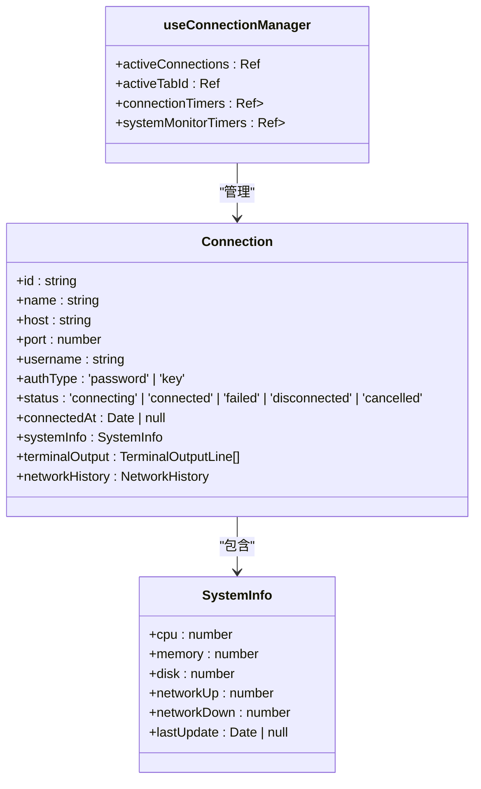
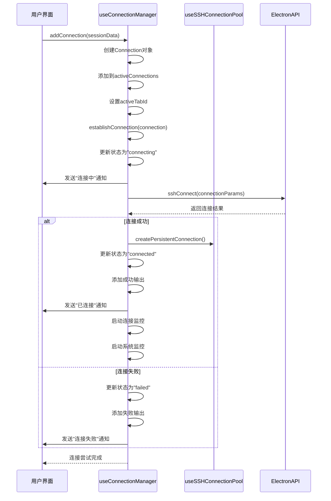
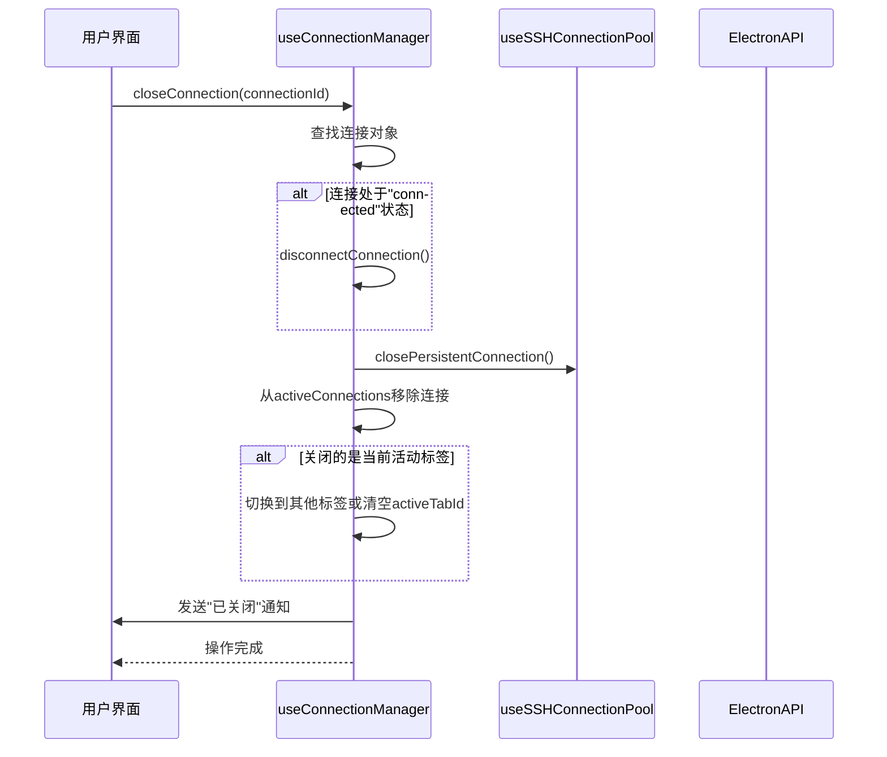
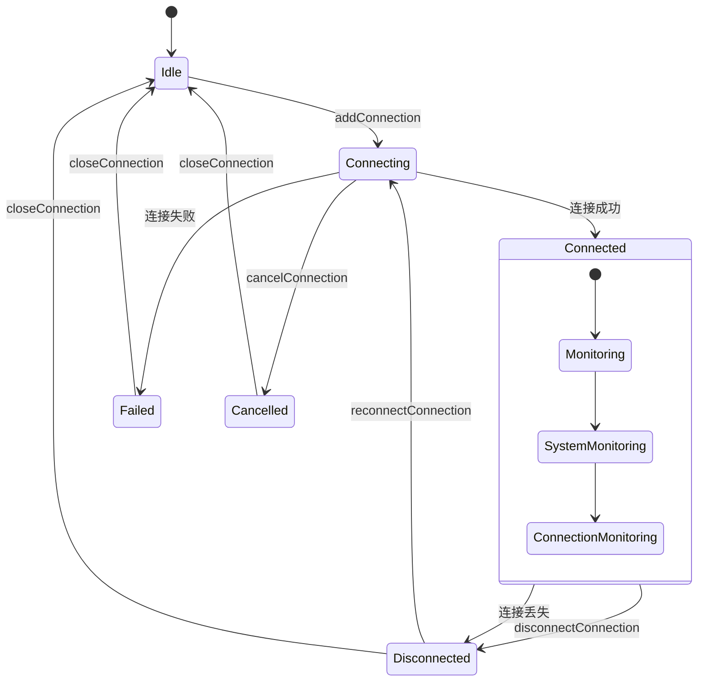

# 连接状态管理

<cite>
**Referenced Files in This Document**   
- [useConnectionManager.ts](file://src/composables/useConnectionManager.ts)
- [useSSHConnectionPool.js](file://src/composables/useSSHConnectionPool.js)
- [ssh.ts](file://src/types/ssh.ts)
- [index.ts](file://src/types/index.ts)
</cite>

## 目录
1. [连接状态管理](#连接状态管理)
2. [响应式状态设计](#响应式状态设计)
3. [连接生命周期管理](#连接生命周期管理)
4. [连接监控与系统监控](#连接监控与系统监控)
5. [事件通知与错误处理](#事件通知与错误处理)
6. [连接状态变更流程](#连接状态变更流程)

## 连接状态管理

`useConnectionManager` 是 SSH 连接应用的核心状态管理模块，负责管理所有活动连接的生命周期、状态变更和用户界面同步。该模块采用 Vue 3 的 Composition API 设计，通过响应式数据结构实现连接状态与 UI 的自动同步。

**Section sources**
- [useConnectionManager.ts](file://src/composables/useConnectionManager.ts#L10-L538)

## 响应式状态设计

连接管理器采用 Vue 3 的 `ref` 和 `reactive` API 实现响应式状态管理，确保连接状态变更能够自动驱动 UI 更新。

### 核心状态变量

连接管理器维护了两个关键的响应式状态变量：

- **activeConnections**: 使用 `ref` 包装的连接数组，存储所有活动的 SSH 连接。当连接被添加或移除时，该数组的变更会自动触发相关 UI 组件的重新渲染。
- **activeTabId**: 使用 `ref` 包装的字符串，表示当前激活的标签页 ID。当用户切换标签时，该值的变更会驱动标签栏和内容区域的更新。



**Diagram sources**
- [useConnectionManager.ts](file://src/composables/useConnectionManager.ts#L12-L13)
- [ssh.ts](file://src/types/ssh.ts#L50-L56)

### 状态驱动的 UI 更新

当 `activeTabId` 发生变化时，`switchTab` 方法会被调用，它会更新 `activeTabId` 的值并记录连接的最后活动时间。由于 `activeTabId` 是响应式的，任何监听该状态的 UI 组件（如标签栏、内容区域）都会自动更新以反映当前激活的连接。

**Section sources**
- [useConnectionManager.ts](file://src/composables/useConnectionManager.ts#L252-L258)

## 连接生命周期管理

连接管理器实现了完整的连接生命周期管理，包括添加、切换、断开和关闭连接等操作，并与 SSH 连接池进行交互。

### 连接添加与建立

连接的添加和建立过程分为两个主要步骤：

1. **addConnection**: 创建新的连接对象并将其添加到 `activeConnections` 数组中，同时设置 `activeTabId` 为新连接的 ID。
2. **establishConnection**: 执行实际的 SSH 连接过程，包括验证连接参数、调用 Electron API 建立连接、处理连接结果等。



**Diagram sources**
- [useConnectionManager.ts](file://src/composables/useConnectionManager.ts#L31-L79)
- [useConnectionManager.ts](file://src/composables/useConnectionManager.ts#L82-L211)

### 连接断开与关闭

连接的断开和关闭操作有明确的区分：

- **disconnectConnection**: 断开与远程服务器的 SSH 连接，但保留连接对象在内存中，允许用户重新连接。
- **closeConnection**: 完全关闭连接，包括断开 SSH 连接、清理连接池条目，并从 `activeConnections` 数组中移除连接对象。



**Diagram sources**
- [useConnectionManager.ts](file://src/composables/useConnectionManager.ts#L311-L349)
- [useConnectionManager.ts](file://src/composables/useConnectionManager.ts#L261-L296)

### 连接取消与重连

连接管理器还支持连接取消和重新连接操作：

- **cancelConnection**: 在连接过程中取消连接尝试，将连接状态设置为"cancelled"。
- **reconnectConnection**: 关闭现有连接并重新建立新的连接。

**Section sources**
- [useConnectionManager.ts](file://src/composables/useConnectionManager.ts#L214-L239)
- [useConnectionManager.ts](file://src/composables/useConnectionManager.ts#L299-L308)

## 连接监控与系统监控

连接管理器实现了两种监控机制：连接健康检查和系统资源监控，确保连接的稳定性和实时性。

### 连接监控

连接监控通过定时器每 30 秒检查一次连接的健康状态：

1. **startConnectionMonitoring**: 为指定连接启动监控定时器。
2. **checkConnectionHealth**: 发送心跳命令（echo "heartbeat"）来验证连接是否仍然活跃。
3. **stopConnectionMonitoring**: 当连接断开或关闭时，清除相应的定时器。

```mermaid
flowchart TD
A[启动连接监控] --> B[创建30秒定时器]
B --> C{连接状态为"connected"?}
C --> |是| D[执行健康检查]
C --> |否| E[不执行检查]
D --> F[发送心跳命令]
F --> G{命令执行成功?}
G --> |是| H[连接正常]
G --> |否| I[标记连接为"disconnected"]
I --> J[发送连接丢失通知]
H --> C
I --> C
```

**Diagram sources**
- [useConnectionManager.ts](file://src/composables/useConnectionManager.ts#L352-L386)

### 系统监控

系统监控通过每秒更新一次系统信息来提供实时的服务器资源使用情况：

1. **startSystemMonitoring**: 为指定连接启动系统监控定时器。
2. **updateSystemInfo**: 优先使用连接池批量获取系统信息，包括 CPU、内存、磁盘和网络使用率。
3. **processSystemData**: 处理从连接池获取的原始数据，计算网络速率等衍生指标。
4. **stopSystemMonitoring**: 当连接断开或关闭时，清除相应的定时器。

```mermaid
flowchart TD
A[启动系统监控] --> B[初始化网络历史记录]
B --> C[立即获取一次系统信息]
C --> D[创建1秒定时器]
D --> E{连接状态为"connected"?}
E --> |是| F[更新系统信息]
E --> |否| G[不执行更新]
F --> H[检查连接池状态]
H --> I{连接池可用?}
I --> |是| J[执行批量命令]
J --> K[解析输出数据]
K --> L[处理系统数据]
L --> M[更新连接的systemInfo]
I --> |否| N[使用默认值]
M --> E
N --> E
```

**Diagram sources**
- [useConnectionManager.ts](file://src/composables/useConnectionManager.ts#L389-L503)
- [useSSHConnectionPool.js](file://src/composables/useSSHConnectionPool.js#L88-L174)

## 事件通知与错误处理

连接管理器通过事件通知和完善的错误处理机制，确保用户能够及时了解连接状态的变化。

### 事件通知模式

连接管理器通过 `emit` 函数发送各种通知事件，包括：

- **show-notification**: 显示连接状态变化的通知，如"正在连接"、"已连接"、"连接失败"等。
- 通知类型包括 info、success、warning 和 error，以不同颜色和图标区分。

**Section sources**
- [useConnectionManager.ts](file://src/composables/useConnectionManager.ts#L10-L11)

### 错误处理策略

连接管理器实现了多层次的错误处理策略：

1. **连接过程错误**: 捕获连接过程中的异常，更新连接状态为"failed"，并显示错误信息。
2. **连接池错误**: 在创建或关闭持久连接时捕获错误，但不影响主连接流程。
3. **系统监控错误**: 在获取系统信息时捕获错误，使用默认值避免界面显示异常。
4. **连接丢失处理**: 通过健康检查发现连接丢失时，自动更新连接状态并通知用户。

**Section sources**
- [useConnectionManager.ts](file://src/composables/useConnectionManager.ts#L82-L211)
- [useConnectionManager.ts](file://src/composables/useConnectionManager.ts#L420-L452)

## 连接状态变更流程

连接管理器通过一系列方法和状态变更，实现了完整的连接状态流转。

### 状态变更流程图



**Diagram sources**
- [useConnectionManager.ts](file://src/composables/useConnectionManager.ts#L31-L349)

### 状态变更方法

连接管理器提供了以下主要方法来驱动状态变更：

- **addConnection**: 从 Idle 状态进入 Connecting 状态。
- **establishConnection**: 从 Connecting 状态进入 Connected 或 Failed 状态。
- **cancelConnection**: 从 Connecting 状态进入 Cancelled 状态。
- **disconnectConnection**: 从 Connected 状态进入 Disconnected 状态。
- **closeConnection**: 从任何状态进入 Idle 状态。
- **reconnectConnection**: 从 Disconnected 状态重新进入 Connecting 状态。

**Section sources**
- [useConnectionManager.ts](file://src/composables/useConnectionManager.ts#L31-L349)