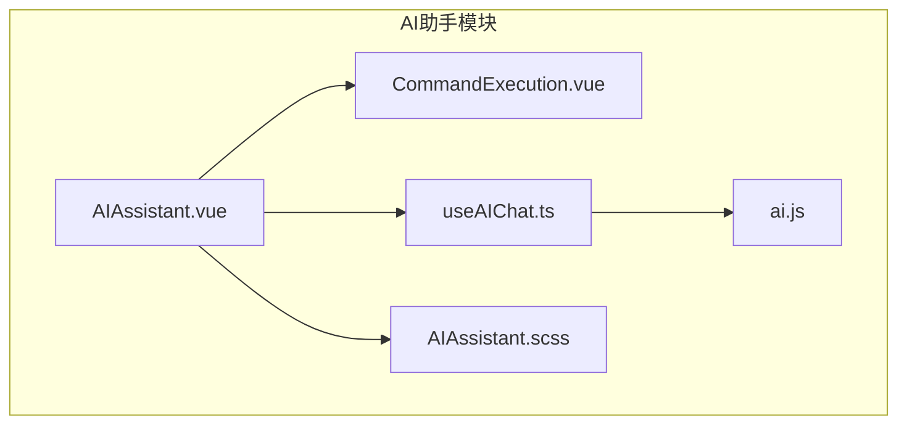
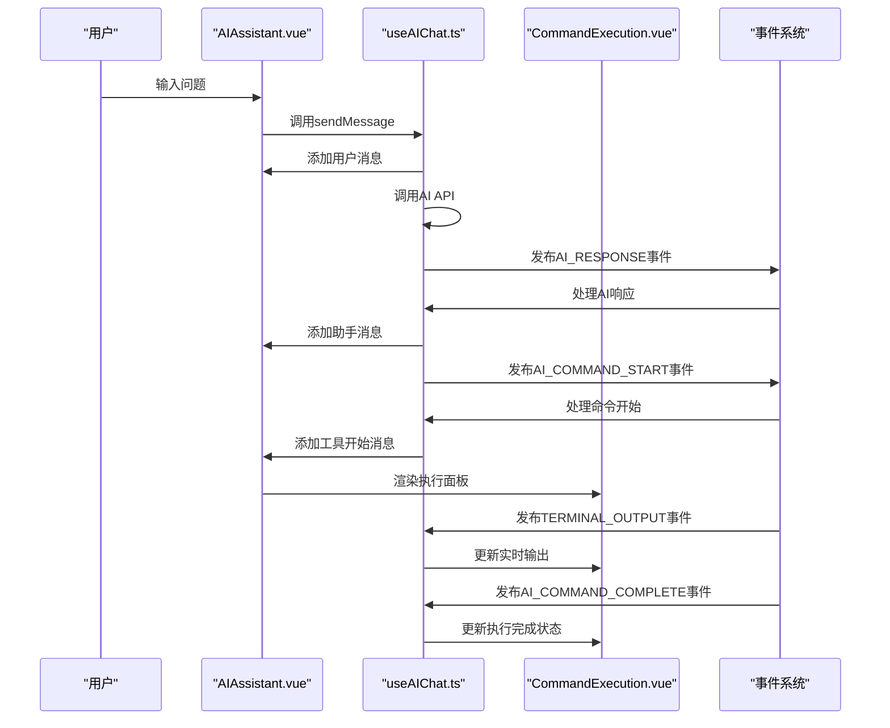
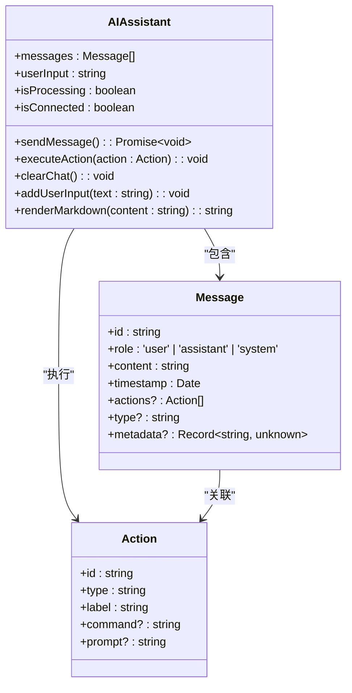
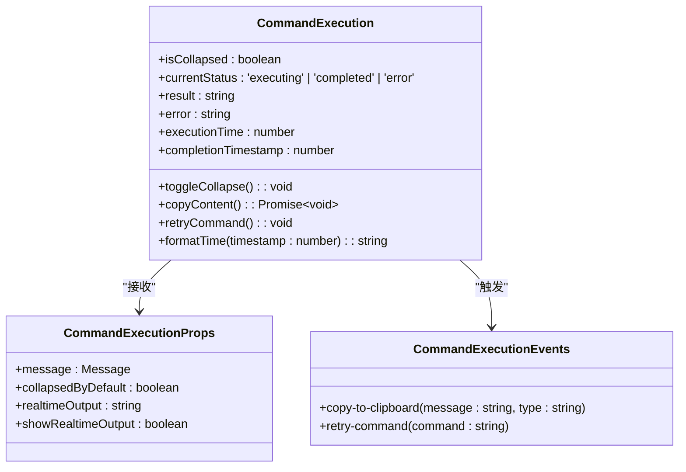
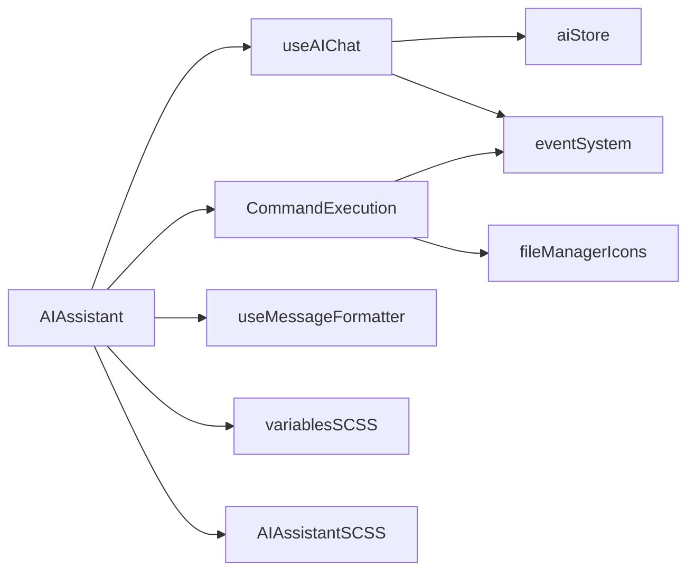

# AI交互界面

<cite>
**本文档引用的文件**
- [AIAssistant.vue](file://src/modules/ai-assistant/components/AIAssistant.vue)
- [CommandExecution.vue](file://src/modules/ai-assistant/components/ai/CommandExecution.vue)
- [useAIChat.ts](file://src/modules/ai-assistant/composables/useAIChat.ts)
- [AIAssistant.scss](file://src/modules/ai-assistant/styles/AIAssistant.scss)
- [ai.ts](file://src/types/ai.ts)
- [events.ts](file://src/types/events.ts)
- [aiConstants.ts](file://src/modules/ai-assistant/constants/aiConstants.ts)
- [useMessageFormatter.js](file://src/composables/useMessageFormatter.js)
- [ai.js](file://src/modules/ai-assistant/stores/ai.js)
</cite>

## 目录
1. [简介](#简介)
2. [项目结构](#项目结构)
3. [核心组件](#核心组件)
4. [架构概述](#架构概述)
5. [详细组件分析](#详细组件分析)
6. [依赖分析](#依赖分析)
7. [性能考虑](#性能考虑)
8. [故障排除指南](#故障排除指南)
9. [结论](#结论)

## 简介
AI交互界面是基于Vue 3的现代化AI助手组件，提供智能命令生成与执行功能。该界面通过SSH连接与远程服务器交互，利用AI技术分析用户需求并自动生成安全的系统命令。界面包含对话消息列表、用户输入区域和命令执行可视化组件，支持Markdown渲染、虚拟滚动优化和响应式布局。

## 项目结构
AI助手模块采用分层架构设计，主要包含组件、组合式函数、常量、状态管理、样式和工具等目录。核心组件AIAssistant.vue负责整体界面布局和消息管理，CommandExecution.vue专门处理命令执行的可视化展示。组合式函数useAIChat.ts提供AI聊天的核心逻辑，状态管理使用Pinia实现。

**图示来源**
- [AIAssistant.vue](file://src/modules/ai-assistant/components/AIAssistant.vue)
- [CommandExecution.vue](file://src/modules/ai-assistant/components/ai/CommandExecution.vue)
- [useAIChat.ts](file://src/modules/ai-assistant/composables/useAIChat.ts)
- [ai.js](file://src/modules/ai-assistant/stores/ai.js)
- [AIAssistant.scss](file://src/modules/ai-assistant/styles/AIAssistant.scss)

## 核心组件
AI交互界面的核心组件包括AIAssistant.vue和CommandExecution.vue。AIAssistant.vue负责管理对话流程、用户输入和消息渲染，通过props接收连接信息，通过事件机制与父组件通信。CommandExecution.vue专注于命令执行过程的可视化，展示实时输出、执行状态和错误信息。

**本节来源**
- [AIAssistant.vue](file://src/modules/ai-assistant/components/AIAssistant.vue)
- [CommandExecution.vue](file://src/modules/ai-assistant/components/ai/CommandExecution.vue)

## 架构概述
系统采用组合式API和状态管理相结合的架构。AIAssistant.vue通过provide/inject机制向子组件提供AI聊天上下文，实现跨组件状态共享。事件系统用于解耦组件间的通信，当命令执行状态变化时，通过事件总线通知相关组件更新UI。

**图示来源**
- [AIAssistant.vue](file://src/modules/ai-assistant/components/AIAssistant.vue)
- [useAIChat.ts](file://src/modules/ai-assistant/composables/useAIChat.ts)
- [CommandExecution.vue](file://src/modules/ai-assistant/components/ai/CommandExecution.vue)
- [events.ts](file://src/types/events.ts)

## 详细组件分析

### AIAssistant组件分析
AIAssistant.vue组件实现了完整的对话界面，包含欢迎屏、消息列表和输入区域。组件通过props接收connectionId和connection对象，通过emits定义show-notification、execute-command和show-settings事件与父组件通信。

#### 对话消息列表渲染
消息列表采用虚拟滚动优化，通过v-for指令遍历messages数组渲染消息。消息根据角色(role)和类型(type)进行分类显示，用户消息、助手消息和系统消息分别使用不同的样式。工具调用消息通过CommandExecution组件进行特殊渲染。

**图示来源**
- [AIAssistant.vue](file://src/modules/ai-assistant/components/AIAssistant.vue)
- [ai.ts](file://src/types/ai.ts)

#### 用户输入区域交互
用户输入区域使用textarea元素实现，支持自动高度调整和快捷键操作。当用户按下Enter键时发送消息，Shift+Enter组合键则插入换行符。输入框的最大高度限制为120px，防止过度扩展。

#### Markdown内容渲染
组件使用MarkdownIt库实现Markdown内容渲染，支持代码块、粗体、斜体等格式。代码块添加了复制按钮，点击后可将代码复制到剪贴板。渲染过程包含安全清理，防止XSS攻击。

### CommandExecution组件分析
CommandExecution.vue组件负责可视化展示AI生成命令的执行过程，提供实时反馈和交互功能。

#### 命令执行可视化
组件根据执行状态显示不同的视觉指示器：执行中显示旋转的加载图标，成功显示绿色对勾，失败显示红色叉号。执行详情面板可折叠，包含命令、执行时间、状态等信息。

**图示来源**
- [CommandExecution.vue](file://src/modules/ai-assistant/components/ai/CommandExecution.vue)
- [ai.ts](file://src/types/ai.ts)

#### 实时输出流展示
执行中的命令会显示实时输出流，输出内容通过realtimeOutput prop传入。当有新输出时，面板会自动展开以显示最新内容。输出区域支持滚动，确保用户能看到最新的执行结果。

#### 重试机制UI实现
执行失败的命令提供重试按钮，点击后触发retry-command事件，将命令发送回父组件重新执行。同时提供复制按钮，可将执行结果或错误信息复制到剪贴板。

## 依赖分析
AI助手模块依赖多个内部和外部组件。内部依赖包括文件管理器的图标组件、全局样式变量和事件系统。外部依赖包括Vue 3的组合式API、Pinia状态管理库和MarkdownIt渲染库。

**图示来源**
- [AIAssistant.vue](file://src/modules/ai-assistant/components/AIAssistant.vue)
- [useAIChat.ts](file://src/modules/ai-assistant/composables/useAIChat.ts)
- [CommandExecution.vue](file://src/modules/ai-assistant/components/ai/CommandExecution.vue)
- [ai.js](file://src/modules/ai-assistant/stores/ai.js)
- [events.ts](file://src/types/events.ts)
- [useMessageFormatter.js](file://src/composables/useMessageFormatter.js)
- [variables.scss](file://src/styles/variables.scss)
- [AIAssistant.scss](file://src/modules/ai-assistant/styles/AIAssistant.scss)

## 性能考虑
系统在多个层面进行了性能优化。消息列表采用虚拟滚动，避免渲染大量DOM节点。Markdown渲染使用缓存机制，避免重复解析。事件系统采用组件ID进行过滤，减少不必要的事件处理。实时输出采用增量更新，只更新变化的部分。

## 故障排除指南
常见问题包括AI服务未配置、命令执行超时和网络连接失败。当AI服务未配置时，系统会显示配置提示并引导用户到设置页面。命令执行超时设置为30秒，超时后会显示相应的错误信息。网络连接问题会触发重连机制，并显示连接状态指示器。

**本节来源**
- [useAIChat.ts](file://src/modules/ai-assistant/composables/useAIChat.ts)
- [aiConstants.ts](file://src/modules/ai-assistant/constants/aiConstants.ts)
- [AIAssistant.vue](file://src/modules/ai-assistant/components/AIAssistant.vue)

## 结论
AI交互界面通过现代化的UI设计和高效的架构实现了智能命令生成与执行功能。组件化设计提高了代码复用性和可维护性，事件驱动架构确保了组件间的松耦合。系统支持丰富的交互功能和良好的用户体验，为用户提供了一个强大而安全的AI助手工具。