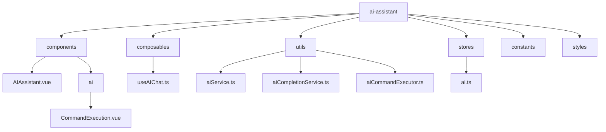
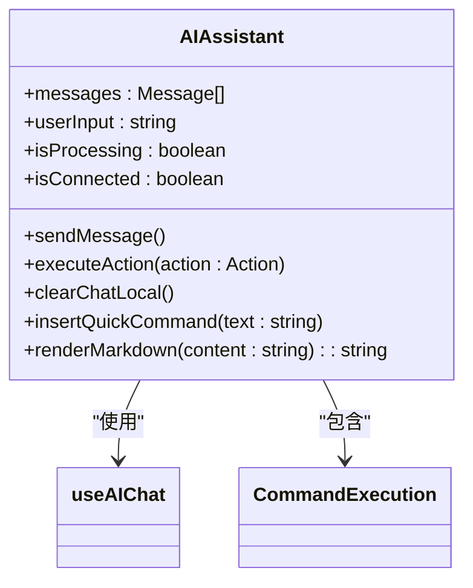
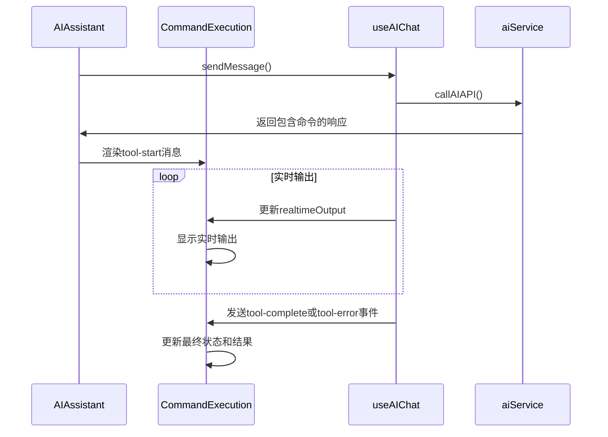
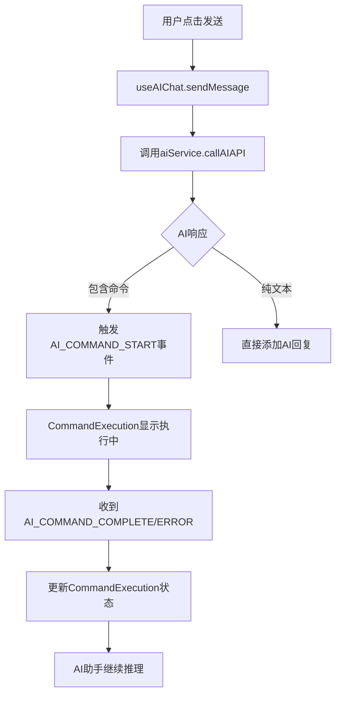
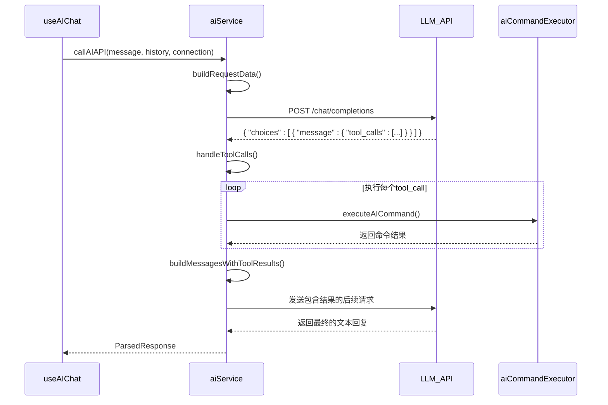

# AI助手

<cite>
**本文档引用的文件**
- [AIAssistant.vue](file://src/modules/ai-assistant/components/AIAssistant.vue)
- [CommandExecution.vue](file://src/modules/ai-assistant/components/ai/CommandExecution.vue)
- [useAIChat.ts](file://src/modules/ai-assistant/composables/useAIChat.ts)
- [aiCompletionService.ts](file://src/modules/ai-assistant/utils/aiCompletionService.ts)
- [aiCommandExecutor.ts](file://src/modules/ai-assistant/utils/aiCommandExecutor.ts)
- [aiService.ts](file://src/modules/ai-assistant/utils/aiService.ts)
- [ai.ts](file://src/modules/ai-assistant/stores/ai.ts)
- [ai.ts](file://src/types/ai.ts)
- [events.ts](file://src/types/events.ts)
- [simpleCommandExecutor.ts](file://src/modules/terminal/utils/simpleCommandExecutor.ts)
- [eventSystem.ts](file://src/utils/eventSystem.ts)
</cite>

## 目录
1. [项目结构](#项目结构)
2. [核心组件](#核心组件)
3. [对话状态管理](#对话状态管理)
4. [AI推理与命令执行](#ai推理与命令执行)
5. [上下文关联机制](#上下文关联机制)
6. [安全防护措施](#安全防护措施)
7. [性能优化建议](#性能优化建议)

## 项目结构

根据提供的项目结构，AI助手模块位于 `src/modules/ai-assistant` 目录下，其内部结构清晰地分离了组件、组合式函数、工具和状态管理。

**Diagram sources**
- [AIAssistant.vue](file://src/modules/ai-assistant/components/AIAssistant.vue)
- [CommandExecution.vue](file://src/modules/ai-assistant/components/ai/CommandExecution.vue)
- [useAIChat.ts](file://src/modules/ai-assistant/composables/useAIChat.ts)
- [aiService.ts](file://src/modules/ai-assistant/utils/aiService.ts)
- [aiCompletionService.ts](file://src/modules/ai-assistant/utils/aiCompletionService.ts)
- [aiCommandExecutor.ts](file://src/modules/ai-assistant/utils/aiCommandExecutor.ts)
- [ai.ts](file://src/modules/ai-assistant/stores/ai.ts)

## 核心组件

AI助手模块的核心由两个Vue组件构成：`AIAssistant.vue` 和 `CommandExecution.vue`。

### AIAssistant.vue 组件

`AIAssistant.vue` 是AI助手的主界面组件，负责渲染对话界面、处理用户输入和管理整体UI状态。

- **对话界面设计**：该组件采用现代化的UI设计，包含顶部状态栏、聊天区域和输入区域。顶部状态栏显示AI连接状态和当前SSH连接信息。
- **消息渲染**：通过 `v-for` 循环渲染 `messages` 数组中的每条消息。消息根据角色（用户、AI助手、系统）和类型（普通消息、工具调用）进行差异化渲染。
- **快捷操作**：提供“清空聊天记录”按钮和一组预设的快捷命令（如“查看系统信息”、“检查运行进程”），用户点击后可快速插入到输入框。
- **事件处理**：通过 `provide` 将 `useAIChat` 的状态和方法提供给子组件，实现了父子组件间的高效通信。

**Diagram sources**
- [AIAssistant.vue](file://src/modules/ai-assistant/components/AIAssistant.vue)
- [useAIChat.ts](file://src/modules/ai-assistant/composables/useAIChat.ts)
- [CommandExecution.vue](file://src/modules/ai-assistant/components/ai/CommandExecution.vue)

### CommandExecution.vue 组件

`CommandExecution.vue` 是一个专门用于展示和管理命令执行过程的子组件，它被 `AIAssistant.vue` 动态渲染。

- **执行状态展示**：该组件根据 `currentStatus` (执行中、成功、失败) 展示不同的状态图标和文本。
- **可折叠面板**：执行详情默认可折叠，当有实时输出时会自动展开，提供良好的用户体验。
- **交互功能**：支持复制命令输出、重试失败命令等操作。
- **实时输出**：通过 `realtimeOutput` prop 接收来自 `useAIChat` 的实时输出流，并在“实时输出”区域动态更新。

**Diagram sources**
- [AIAssistant.vue](file://src/modules/ai-assistant/components/AIAssistant.vue)
- [CommandExecution.vue](file://src/modules/ai-assistant/components/ai/CommandExecution.vue)
- [useAIChat.ts](file://src/modules/ai-assistant/composables/useAIChat.ts)

**Section sources**
- [AIAssistant.vue](file://src/modules/ai-assistant/components/AIAssistant.vue)
- [CommandExecution.vue](file://src/modules/ai-assistant/components/ai/CommandExecution.vue)

## 对话状态管理

`useAIChat.ts` 是一个组合式函数，它封装了AI聊天会话的所有核心逻辑和状态，是整个AI助手模块的“大脑”。

### 状态管理

该函数使用 `ref` 创建了多个响应式状态变量，用于管理聊天会话的各个方面：
- `messages`: 存储所有聊天消息的数组。
- `userInput`: 用户当前输入框中的文本。
- `isProcessing`: 标记AI是否正在处理请求，用于禁用输入框和显示加载指示器。
- `toolCallHistory`: 记录所有工具调用（命令执行）的历史，用于统计和重试。
- `realtimeOutputs`: 一个Map，用于存储每个工具调用ID对应的实时输出流。

### 核心方法

- `sendMessage()`: 这是发送消息的主方法。它会将用户输入添加到消息列表，调用 `aiService.callAIAPI` 发送请求，并处理响应或错误。
- `addMessage()` 和 `addSystemMessage()`: 用于向消息列表添加不同类型的消息，并进行去重和空值检查。
- `executeAction()`: 处理AI助手返回的操作，如执行命令或插入提示。
- `clearChat()`: 清空所有聊天记录和相关状态。

### 事件监听机制

`useAIChat` 通过 `onEvent` 函数监听来自 `aiService` 和 `aiCommandExecutor` 的多个事件，实现了松耦合的通信：
- `AI_COMMAND_START`: 当一个命令开始执行时，创建一个 `toolCall` 记录并添加一个“工具调用开始”的系统消息。
- `AI_COMMAND_COMPLETE` 和 `AI_COMMAND_ERROR`: 当命令执行完成或失败时，更新 `toolCallHistory` 和 `realtimeOutputs`，并更新或创建相应的系统消息。

**Section sources**
- [useAIChat.ts](file://src/modules/ai-assistant/composables/useAIChat.ts)

## AI推理与命令执行

AI助手的功能实现依赖于 `aiService.ts` 和 `aiCommandExecutor.ts` 两个工具模块的协同工作。

### aiService.ts 模块

该模块负责与大语言模型API进行交互，是AI推理的核心。

- **配置管理**：`getAIConfig` 函数从Electron API或本地存储中获取API密钥、基础URL和模型名称等配置。
- **系统提示词工程**：`buildSystemPrompt` 函数构建了一个详细的系统提示词，它包含了当前SSH连接的环境信息（主机、用户、工作目录等），确保AI的回复是上下文相关的。
- **API调用**：`callAIAPI` 函数是主要的入口点。它构建请求数据，发送HTTP请求，并处理响应。如果AI的响应中包含 `tool_calls`（即需要执行命令），它会进入一个循环，先执行命令，再将结果和命令输出发送给AI进行后续推理。
- **响应解析**：`parseAIResponse` 函数负责解析AI返回的文本，提取出代码块中的命令，并生成可点击的“执行”操作按钮。

**Diagram sources**
- [aiService.ts](file://src/modules/ai-assistant/utils/aiService.ts)
- [aiCommandExecutor.ts](file://src/modules/ai-assistant/utils/aiCommandExecutor.ts)

### aiCommandExecutor.ts 模块

该模块负责安全地执行AI生成的命令。

- **简化执行器**：`executeAICommand` 函数是主要的执行接口。它调用 `simpleCommandExecutor.executeCommand` 来执行命令。
- **事件驱动**：在执行过程中，它通过 `emitEvent` 发出 `AI_COMMAND_START`、`AI_COMMAND_COMPLETE` 和 `AI_COMMAND_ERROR` 事件，这些事件被 `useAIChat` 监听并用于更新UI。
- **实时输出**：`handleAITerminalData` 函数处理来自终端的实时输出数据，并将其通过事件系统广播出去。

**Section sources**
- [aiService.ts](file://src/modules/ai-assistant/utils/aiService.ts)
- [aiCommandExecutor.ts](file://src/modules/ai-assistant/utils/aiCommandExecutor.ts)

## 上下文关联机制

AI助手能够提供符合当前服务器环境的建议，这得益于其精心设计的上下文关联机制。

### SSH连接上下文注入

当 `aiService.callAIAPI` 被调用时，它会将 `props.connection` 对象作为参数传递。这个对象包含了SSH连接的详细信息，如 `host`、`username`、`currentWorkingDirectory` 等。这些信息被用于：
1.  **构建系统提示词**：`buildSystemPrompt` 函数利用这些信息生成一个高度具体的系统提示，让AI“知道”自己正在操作哪台服务器。
2.  **构建工具定义**：`buildTools` 函数在描述 `execute_command` 工具时，会明确指出执行环境，例如“在 `user@host:~/path` 上执行命令”。

### 历史与状态感知

- **对话历史**：`useAIChat` 会将完整的对话历史（过滤掉系统消息）发送给AI，使AI能够理解对话的上下文。
- **实时状态**：`getOSInfo` 函数在每次调用API前都会通过SSH执行 `uname -s` 等命令，获取最新的操作系统信息，确保提示词中的环境信息是准确的。

这种机制确保了AI的建议是动态的、准确的。例如，当用户询问“如何安装软件”时，AI会根据服务器是Ubuntu还是CentOS，分别建议 `apt install` 或 `yum install`。

**Section sources**
- [aiService.ts](file://src/modules/ai-assistant/utils/aiService.ts)
- [useAIChat.ts](file://src/modules/ai-assistant/composables/useAIChat.ts)

## 安全防护措施

为了防止恶意命令执行，系统实施了多层安全防护。

### 输入验证与清理

- **前端清理**：在 `AIAssistant.vue` 中，`renderMarkdown` 函数会对AI返回的Markdown内容进行基本的安全清理，移除 `<script>` 和 `<iframe>` 标签，防止XSS攻击。
- **后端执行**：实际的命令执行由Electron主进程通过 `sshShellWrite` API完成，前端无法直接执行任意系统命令。

### 命令执行沙箱

- **独立执行器**：`simpleCommandExecutor` 模块作为一个独立的执行单元，它通过事件系统与UI通信，而不是直接暴露执行函数。
- **超时机制**：`simpleCommandExecutor` 内置了60秒的超时机制，防止命令无限期挂起。
- **错误处理**：所有执行错误都会被捕获，并通过 `AI_COMMAND_ERROR` 事件通知UI，同时在 `aiCommandExecutor` 中抛出错误。

### AI配置引导

如果用户未配置AI服务，`getAIConfig` 函数会抛出 `AI_CONFIG_NOT_SET` 错误。`useAIChat` 捕获此错误后，会向用户显示配置引导，并触发 `AI_CONFIG_REQUIRED` 事件，确保用户无法在未配置的情况下使用AI功能。

**Section sources**
- [AIAssistant.vue](file://src/modules/ai-assistant/components/AIAssistant.vue)
- [aiService.ts](file://src/modules/ai-assistant/utils/aiService.ts)
- [aiCommandExecutor.ts](file://src/modules/ai-assistant/utils/aiCommandExecutor.ts)
- [simpleCommandExecutor.ts](file://src/modules/terminal/utils/simpleCommandExecutor.ts)

## 性能优化建议

### 响应缓存

`aiCompletionService.ts` 模块内置了缓存机制。它使用一个 `Map` 来存储 `getCommandSuggestions` 的结果，键为输入和上下文的组合。缓存有效期为5分钟，可以显著减少对AI API的重复调用。

### 请求节流

虽然当前代码中没有显式的节流逻辑，但可以通过以下方式实现：
- 在 `useAIChat.sendMessage` 中，使用 `lastMessageId` 来防止用户在短时间内重复发送相同的消息。
- 可以引入 `lodash.throttle` 或 `lodash.debounce` 库，对用户输入进行防抖处理，避免在用户快速打字时频繁触发AI补全。

### 典型使用场景

#### 故障排查
1.  用户输入：“服务器很慢，帮我看看。”
2.  AI助手调用 `execute_command` 工具，执行 `top -bn1` 和 `df -h`。
3.  获取到CPU和磁盘使用率数据后，AI分析并回复：“发现磁盘使用率已达95%，建议清理日志文件。”

#### 配置生成
1.  用户输入：“帮我生成一个Nginx反向代理配置，代理到localhost:3000。”
2.  AI助手直接返回一个格式化的Nginx配置代码块。
3.  用户点击“执行”按钮，AI助手将配置内容写入到指定文件（此功能需扩展 `execute_command` 工具以支持文件写入）。

**Section sources**
- [aiCompletionService.ts](file://src/modules/ai-assistant/utils/aiCompletionService.ts)
- [useAIChat.ts](file://src/modules/ai-assistant/composables/useAIChat.ts)