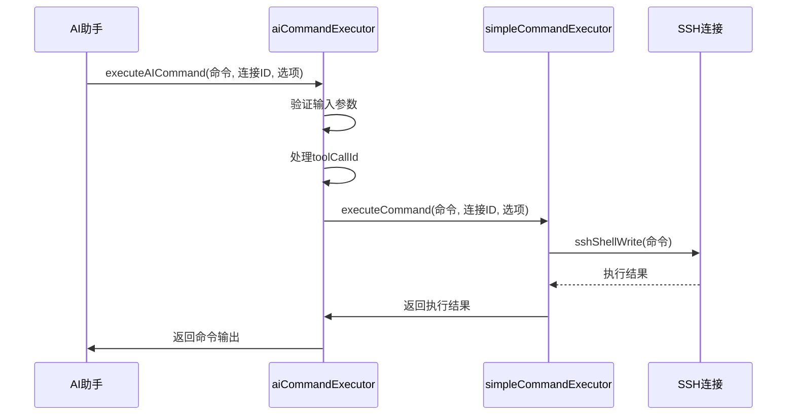
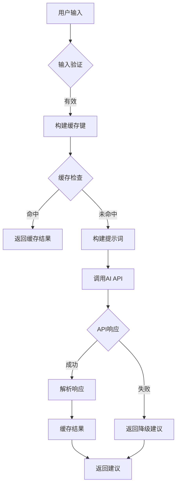
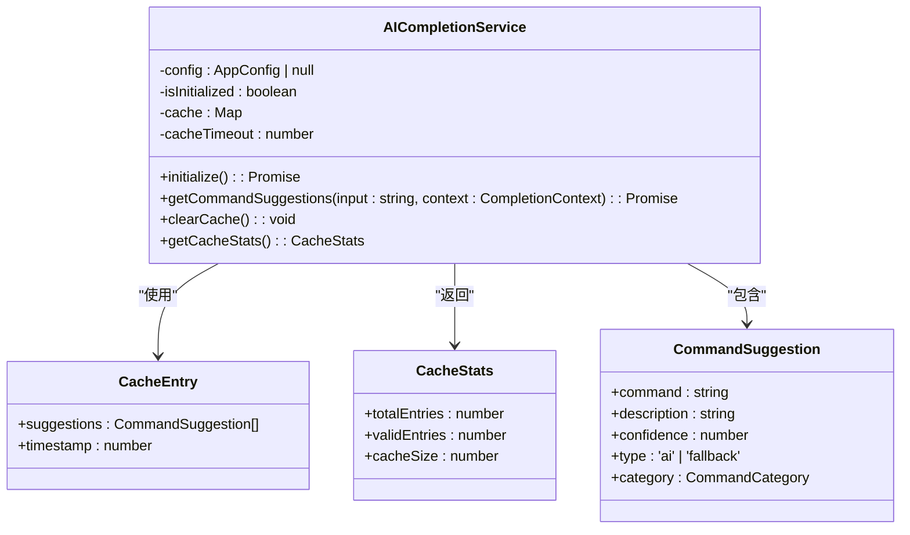
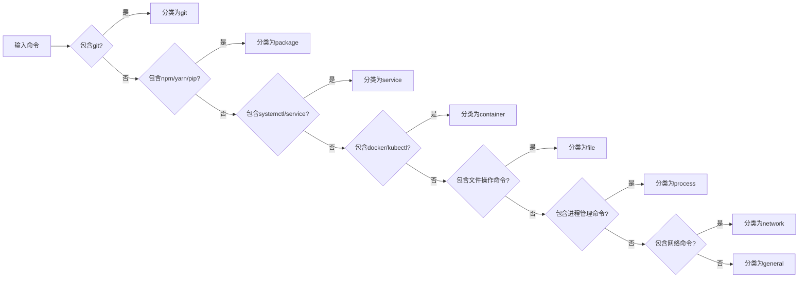
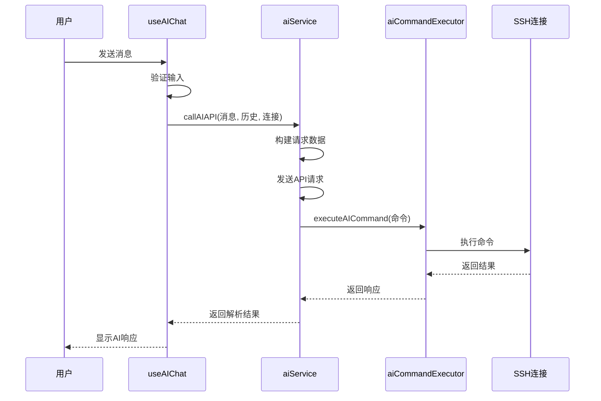
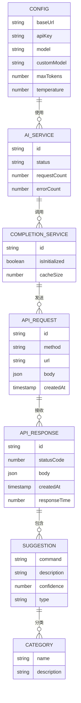

# 命令执行引擎

<cite>
**本文档引用的文件**   
- [aiCommandExecutor.ts](file://src/modules/ai-assistant/utils/aiCommandExecutor.ts)
- [aiCompletionService.ts](file://src/modules/ai-assistant/utils/aiCompletionService.ts)
- [aiService.ts](file://src/modules/ai-assistant/utils/aiService.ts)
- [useAIChat.ts](file://src/modules/ai-assistant/composables/useAIChat.ts)
- [CommandExecution.vue](file://src/modules/ai-assistant/components/ai/CommandExecution.vue)
- [ai.ts](file://src/modules/ai-assistant/stores/ai.ts)
- [simpleCommandExecutor.ts](file://src/modules/terminal/utils/simpleCommandExecutor.ts)
- [ai.ts](file://src/types/ai.ts)
</cite>

## 目录
1. [命令执行安全机制](#命令执行安全机制)
2. [AI补全服务交互流程](#ai补全服务交互流程)
3. [缓存与降级策略](#缓存与降级策略)
4. [命令建议分类算法](#命令建议分类算法)
5. [性能与错误处理](#性能与错误处理)
6. [API密钥与扩展性设计](#api密钥与扩展性设计)

## 命令执行安全机制

`aiCommandExecutor` 模块通过多层防护机制确保AI生成命令的安全执行。该模块作为AI命令执行的对外接口，封装了底层的 `simpleCommandExecutor`，实现了命令注入防护、执行上下文隔离和权限验证。

在执行命令时，`executeAICommand` 函数会首先验证输入参数，并通过 `toolCallId` 机制将AI API的调用ID传递给底层执行器，确保命令执行的上下文隔离。执行过程中，系统会记录命令的开始时间、连接ID和执行选项，所有操作均在指定的SSH连接上下文中进行，避免了跨连接的命令执行风险。

权限验证通过 `CommandOptions` 类型的 `toolCallId` 字段实现，该字段确保只有经过AI服务验证的工具调用才能执行。同时，系统通过事件系统（`eventSystem`）监控命令执行的全过程，当命令执行失败时，会触发 `AI_COMMAND_ERROR` 事件，记录错误信息并通知上层组件。

**图示来源**
- [aiCommandExecutor.ts](file://src/modules/ai-assistant/utils/aiCommandExecutor.ts#L18-L63)
- [simpleCommandExecutor.ts](file://src/modules/terminal/utils/simpleCommandExecutor.ts#L9-L458)

**本节来源**
- [aiCommandExecutor.ts](file://src/modules/ai-assistant/utils/aiCommandExecutor.ts#L18-L63)
- [simpleCommandExecutor.ts](file://src/modules/terminal/utils/simpleCommandExecutor.ts#L9-L458)

## AI补全服务交互流程

`aiCompletionService` 模块负责与大语言模型API的交互，实现了完整的请求构建、提示词工程和响应解析流程。该服务通过 `getCommandSuggestions` 方法提供AI命令建议，整个流程包括请求构建、API调用和响应处理三个核心环节。

在请求构建阶段，`buildPrompt` 函数会根据用户输入和上下文信息（如当前目录、最近执行的命令）生成优化的提示词。提示词包含明确的规则约束，如"只提供Linux/Unix命令建议"、"建议应该实用且安全"等，确保AI生成的建议符合安全要求。

API调用通过 `fetchAISuggestions` 方法实现，系统会从Electron API获取配置信息，包括API基础URL、密钥和模型名称。请求头中包含授权信息，请求体中包含系统提示、用户输入和模型参数。响应解析通过 `parseAIResponse` 函数完成，该函数能够处理JSON和文本两种格式的响应，提取出命令、描述、置信度和分类信息。

**图示来源**
- [aiCompletionService.ts](file://src/modules/ai-assistant/utils/aiCompletionService.ts#L9-L480)

**本节来源**
- [aiCompletionService.ts](file://src/modules/ai-assistant/utils/aiCompletionService.ts#L9-L480)

## 缓存与降级策略

`aiCompletionService` 实现了5分钟的缓存策略（`cacheTimeout`），通过 `Map` 数据结构存储请求结果，有效减少重复请求和API调用成本。缓存键由用户输入和上下文信息组合生成，确保相同请求能够命中缓存。

当AI服务不可用或网络异常时，系统会自动切换到降级模式，通过 `getFallbackSuggestions` 方法提供基础建议。降级策略基于输入关键词匹配，为常见操作提供预定义的命令建议。例如，当输入包含"list"或"ls"时，会返回 `ls -la`、`ls -lh` 和 `tree` 等文件列表命令。

缓存统计功能通过 `getCacheStats` 方法提供，可以获取缓存的总条目数、有效条目数和缓存大小，便于监控和性能分析。缓存清理通过 `clearCache` 方法实现，支持手动清除所有缓存数据。

**图示来源**
- [aiCompletionService.ts](file://src/modules/ai-assistant/utils/aiCompletionService.ts#L9-L480)

**本节来源**
- [aiCompletionService.ts](file://src/modules/ai-assistant/utils/aiCompletionService.ts#L9-L480)

## 命令建议分类算法

`guessCategory` 算法根据命令内容自动归类，提升用户体验和建议的相关性。该算法通过检查命令中包含的关键字来确定分类，支持 `git`、`package`、`service`、`container`、`file`、`process`、`network` 和 `general` 等多个类别。

分类逻辑采用优先级匹配策略，首先检查高优先级的命令类型。例如，包含 `git` 的命令被归类为 `git` 类别，包含 `npm`、`yarn` 或 `pip` 的命令被归类为 `package` 类别。文件操作命令（如 `ls`、`cd`、`mkdir`）被归类为 `file` 类别，进程管理命令（如 `ps`、`top`、`kill`）被归类为 `process` 类别。

该算法通过正则表达式和数组方法（`some`）实现高效匹配，确保分类的准确性和性能。分类结果用于UI展示，帮助用户快速识别建议命令的类型和用途。

**图示来源**
- [aiCompletionService.ts](file://src/modules/ai-assistant/utils/aiCompletionService.ts#L9-L480)

**本节来源**
- [aiCompletionService.ts](file://src/modules/ai-assistant/utils/aiCompletionService.ts#L9-L480)

## 性能与错误处理

系统实现了全面的性能监控和错误处理机制。`aiService` 模块中的 `callAIAPI` 函数负责调用AI API，包含请求节流、错误重试和性能监控功能。请求节流通过Promise机制实现，避免并发请求导致的性能问题。

错误处理采用分层策略，当AI配置未设置时，会触发配置引导流程；当API请求失败时，会记录错误日志并返回降级建议。性能监控通过 `getToolCallStats` 方法提供，可以统计工具调用的成功率、平均执行时间和总调用次数。

`useAIChat` 组合式函数实现了UI层面的性能优化，包括消息去重、输入验证和事件监听器管理。系统通过 `pendingToolCalls` 和 `toolCallHistory` 状态管理工具调用的生命周期，确保用户体验的流畅性。

**图示来源**
- [useAIChat.ts](file://src/modules/ai-assistant/composables/useAIChat.ts#L24-L615)
- [aiService.ts](file://src/modules/ai-assistant/utils/aiService.ts#L311-L328)

**本节来源**
- [useAIChat.ts](file://src/modules/ai-assistant/composables/useAIChat.ts#L24-L615)
- [aiService.ts](file://src/modules/ai-assistant/utils/aiService.ts#L311-L328)

## API密钥与扩展性设计

API密钥安全管理通过多层机制实现。密钥存储在Electron主进程中，通过 `window.electronAPI.getConfig()` 安全获取，避免在前端代码中硬编码。系统支持本地存储作为备用方案，当Electron API不可用时，会尝试从 `localStorage` 获取配置。

请求速率限制处理通过 `simpleCommandExecutor` 的超时机制实现，默认60秒超时防止长时间挂起的请求。系统通过 `pendingCommands` Map 跟踪待处理命令，支持连接断开时强制完成所有命令。

多模型支持通过 `model` 和 `customModel` 配置项实现扩展性设计。系统优先使用 `customModel`，其次使用 `model`，默认值为 `gpt-3.5-turbo`。这种设计允许用户配置不同的AI模型，适应不同的使用场景和需求。

**图示来源**
- [aiService.ts](file://src/modules/ai-assistant/utils/aiService.ts#L9-L480)
- [aiCompletionService.ts](file://src/modules/ai-assistant/utils/aiCompletionService.ts#L9-L480)

**本节来源**
- [aiService.ts](file://src/modules/ai-assistant/utils/aiService.ts#L9-L480)
- [aiCompletionService.ts](file://src/modules/ai-assistant/utils/aiCompletionService.ts#L9-L480)