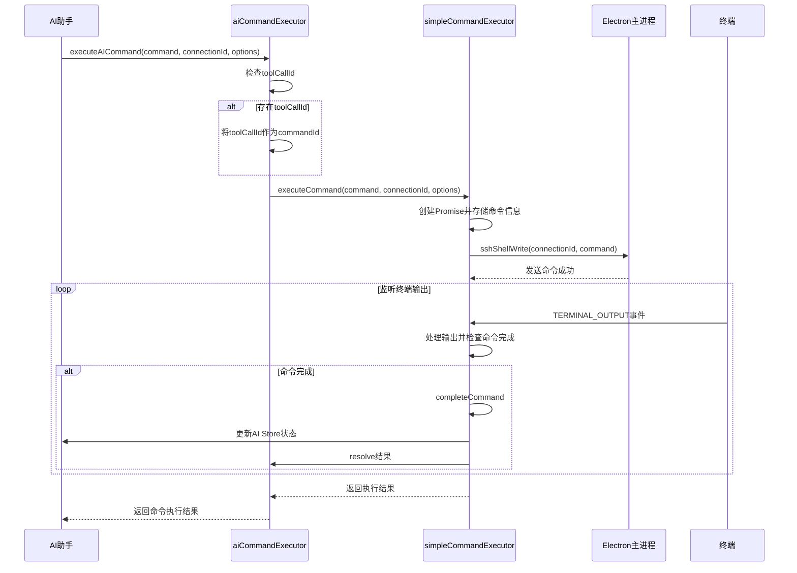
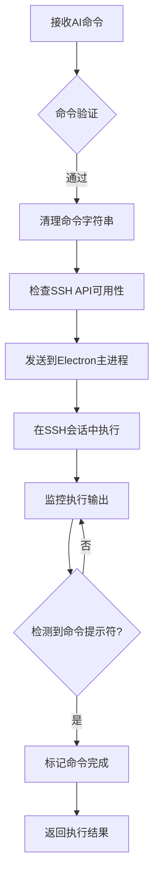
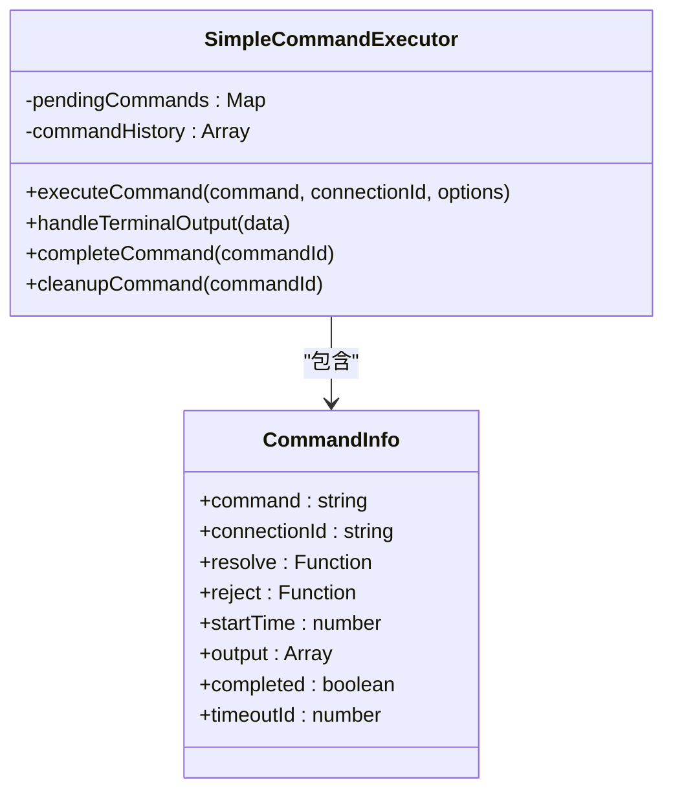
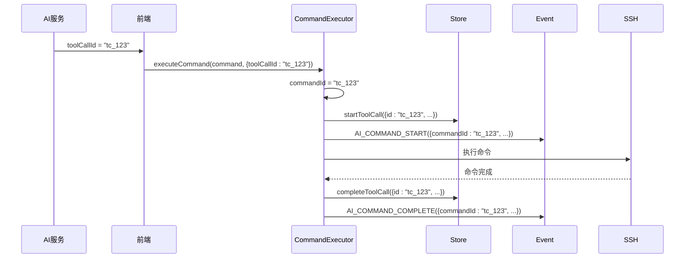
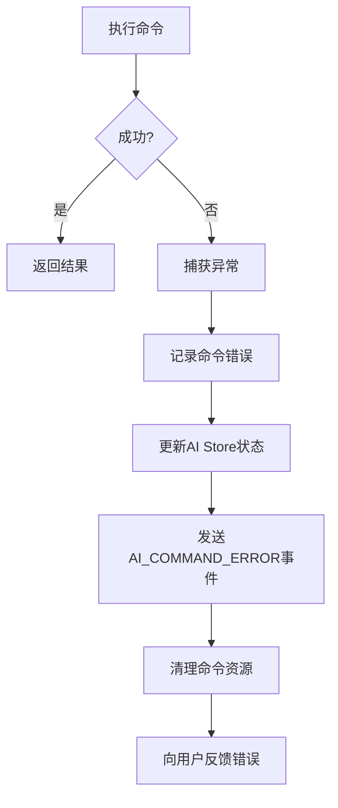
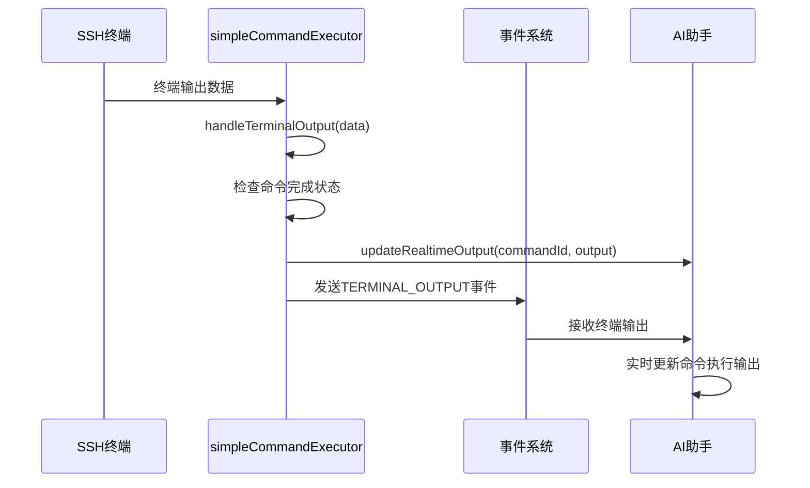
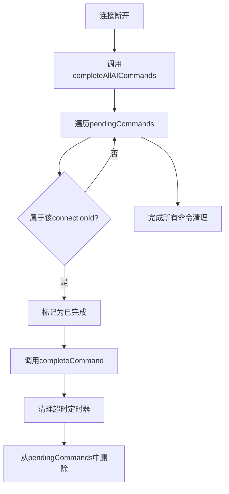
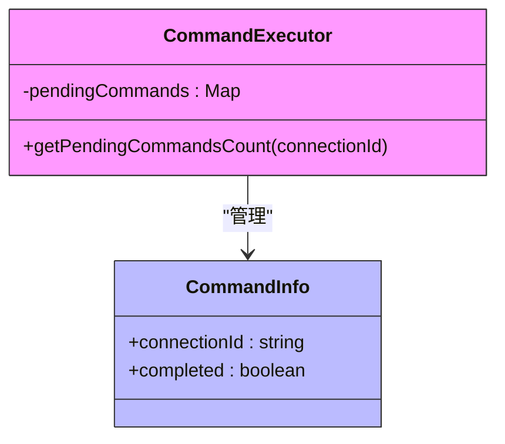
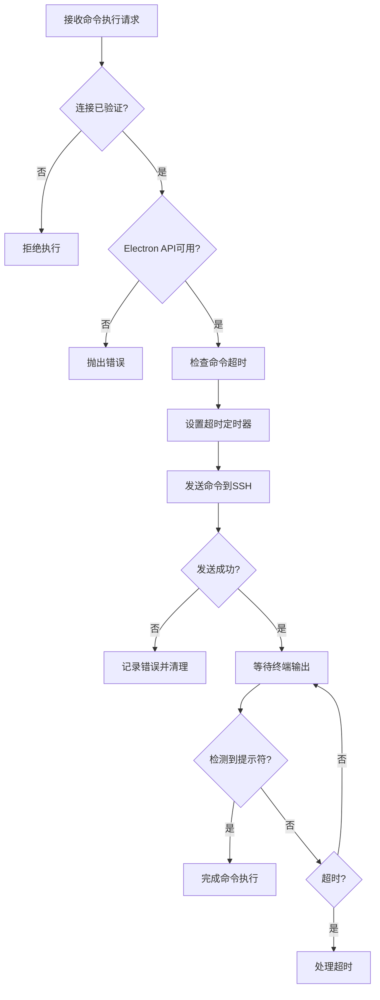

# 安全命令执行与验证

<cite>
**Referenced Files in This Document**   
- [aiCommandExecutor.ts](file://src/modules/ai-assistant/utils/aiCommandExecutor.ts)
- [simpleCommandExecutor.ts](file://src/modules/terminal/utils/simpleCommandExecutor.ts)
- [ai.ts](file://src/modules/ai-assistant/stores/ai.ts)
- [terminal.js](file://src/modules/terminal/stores/terminal.js)
- [eventSystem.ts](file://src/utils/eventSystem.ts)
- [useElectronAPI.ts](file://src/hooks/useElectronAPI.ts)
- [useSSHConnectionPool.js](file://src/composables/useSSHConnectionPool.js)
</cite>

## 目录
1. [命令执行流程](#命令执行流程)
2. [安全防护机制](#安全防护机制)
3. [执行上下文隔离](#执行上下文隔离)
4. [命令追踪与ID传递](#命令追踪与id传递)
5. [错误处理机制](#错误处理机制)
6. [终端数据处理](#终端数据处理)
7. [资源清理逻辑](#资源清理逻辑)
8. [执行队列监控](#执行队列监控)
9. [权限验证与安全沙箱](#权限验证与安全沙箱)

## 命令执行流程

AI命令执行流程从`executeAICommand`函数开始，通过`simpleCommandExecutor`在指定`connectionId`的SSH会话中执行。该流程确保了命令执行的安全性和可追踪性。

**Diagram sources**
- [aiCommandExecutor.ts](file://src/modules/ai-assistant/utils/aiCommandExecutor.ts#L18-L63)
- [simpleCommandExecutor.ts](file://src/modules/terminal/utils/simpleCommandExecutor.ts#L39-L114)

**Section sources**
- [aiCommandExecutor.ts](file://src/modules/ai-assistant/utils/aiCommandExecutor.ts#L18-L63)
- [simpleCommandExecutor.ts](file://src/modules/terminal/utils/simpleCommandExecutor.ts#L39-L114)

## 安全防护机制

系统通过多层安全机制防止命令注入攻击。`simpleCommandExecutor`在执行命令前会对输入进行清理，移除潜在的恶意字符序列。同时，系统通过`window.electronAPI.sshShellWrite`接口与Electron主进程通信，确保命令执行环境与前端渲染进程隔离。

**Diagram sources**
- [simpleCommandExecutor.ts](file://src/modules/terminal/utils/simpleCommandExecutor.ts#L39-L114)
- [useElectronAPI.ts](file://src/hooks/useElectronAPI.ts#L111-L120)

**Section sources**
- [simpleCommandExecutor.ts](file://src/modules/terminal/utils/simpleCommandExecutor.ts#L39-L114)
- [useElectronAPI.ts](file://src/hooks/useElectronAPI.ts#L111-L120)

## 执行上下文隔离

系统通过执行上下文隔离策略确保不同连接的命令不会相互干扰。每个命令执行都与特定的`connectionId`关联，`simpleCommandExecutor`使用`pendingCommands` Map来跟踪每个连接的待执行命令。

**Diagram sources**
- [simpleCommandExecutor.ts](file://src/modules/terminal/utils/simpleCommandExecutor.ts#L9-L458)

**Section sources**
- [simpleCommandExecutor.ts](file://src/modules/terminal/utils/simpleCommandExecutor.ts#L9-L458)

## 命令追踪与ID传递

系统通过`toolCallId`作为`commandId`的传递机制，确保命令追踪的完整性。当`executeAICommand`接收到`toolCallId`时，会将其作为`commandId`传递给底层执行器，实现端到端的命令追踪。

**Diagram sources**
- [aiCommandExecutor.ts](file://src/modules/ai-assistant/utils/aiCommandExecutor.ts#L18-L63)
- [ai.ts](file://src/modules/ai-assistant/stores/ai.ts#L18-L271)

**Section sources**
- [aiCommandExecutor.ts](file://src/modules/ai-assistant/utils/aiCommandExecutor.ts#L18-L63)
- [ai.ts](file://src/modules/ai-assistant/stores/ai.ts#L18-L271)

## 错误处理机制

系统实现了完善的错误处理机制，包括异常捕获、错误事件发射和用户反馈。当命令执行失败时，系统会捕获异常，发送`AI_COMMAND_ERROR`事件，并更新相关状态。

**Diagram sources**
- [aiCommandExecutor.ts](file://src/modules/ai-assistant/utils/aiCommandExecutor.ts#L18-L63)
- [simpleCommandExecutor.ts](file://src/modules/terminal/utils/simpleCommandExecutor.ts#L39-L114)
- [eventSystem.ts](file://src/utils/eventSystem.ts#L11-L33)

**Section sources**
- [aiCommandExecutor.ts](file://src/modules/ai-assistant/utils/aiCommandExecutor.ts#L18-L63)
- [simpleCommandExecutor.ts](file://src/modules/terminal/utils/simpleCommandExecutor.ts#L39-L114)
- [eventSystem.ts](file://src/utils/eventSystem.ts#L11-L33)

## 终端数据处理

`handleAITerminalData`函数实现实时输出流的转发与展示。系统通过监听`TERMINAL_OUTPUT`事件，将终端数据实时转发到AI助手界面，实现命令执行过程的实时可视化。

**Diagram sources**
- [aiCommandExecutor.ts](file://src/modules/ai-assistant/utils/aiCommandExecutor.ts#L68-L80)
- [simpleCommandExecutor.ts](file://src/modules/terminal/utils/simpleCommandExecutor.ts#L178-L208)

**Section sources**
- [aiCommandExecutor.ts](file://src/modules/ai-assistant/utils/aiCommandExecutor.ts#L68-L80)
- [simpleCommandExecutor.ts](file://src/modules/terminal/utils/simpleCommandExecutor.ts#L178-L208)

## 资源清理逻辑

当连接断开时，`completeAllAICommands`函数负责清理所有待执行的AI命令资源。该函数通过调用`simpleCommandExecutor`的`completeAllCommands`方法，确保所有挂起的命令都被正确处理。

**Diagram sources**
- [aiCommandExecutor.ts](file://src/modules/ai-assistant/utils/aiCommandExecutor.ts#L85-L90)
- [simpleCommandExecutor.ts](file://src/modules/terminal/utils/simpleCommandExecutor.ts#L428-L436)

**Section sources**
- [aiCommandExecutor.ts](file://src/modules/ai-assistant/utils/aiCommandExecutor.ts#L85-L90)
- [simpleCommandExecutor.ts](file://src/modules/terminal/utils/simpleCommandExecutor.ts#L428-L436)

## 执行队列监控

`getPendingAICommandsCount`函数提供对执行队列的监控功能，允许系统查询特定连接上待执行的AI命令数量。这对于资源管理和用户界面状态更新至关重要。

**Diagram sources**
- [aiCommandExecutor.ts](file://src/modules/ai-assistant/utils/aiCommandExecutor.ts#L95-L97)
- [simpleCommandExecutor.ts](file://src/modules/terminal/utils/simpleCommandExecutor.ts#L408-L416)

**Section sources**
- [aiCommandExecutor.ts](file://src/modules/ai-assistant/utils/aiCommandExecutor.ts#L95-L97)
- [simpleCommandExecutor.ts](file://src/modules/terminal/utils/simpleCommandExecutor.ts#L408-L416)

## 权限验证与安全沙箱

系统通过权限验证机制和安全沙箱设计防止恶意命令执行。`useSSHConnectionPool`组件管理SSH连接池，确保只有经过验证的连接才能执行命令。同时，系统在执行命令前会检查`window.electronAPI`的可用性，防止未经授权的访问。

**Diagram sources**
- [simpleCommandExecutor.ts](file://src/modules/terminal/utils/simpleCommandExecutor.ts#L39-L114)
- [useSSHConnectionPool.js](file://src/composables/useSSHConnectionPool.js#L1-L260)
- [useElectronAPI.ts](file://src/hooks/useElectronAPI.ts#L1-L134)

**Section sources**
- [simpleCommandExecutor.ts](file://src/modules/terminal/utils/simpleCommandExecutor.ts#L39-L114)
- [useSSHConnectionPool.js](file://src/composables/useSSHConnectionPool.js#L1-L260)
- [useElectronAPI.ts](file://src/hooks/useElectronAPI.ts#L1-L134)