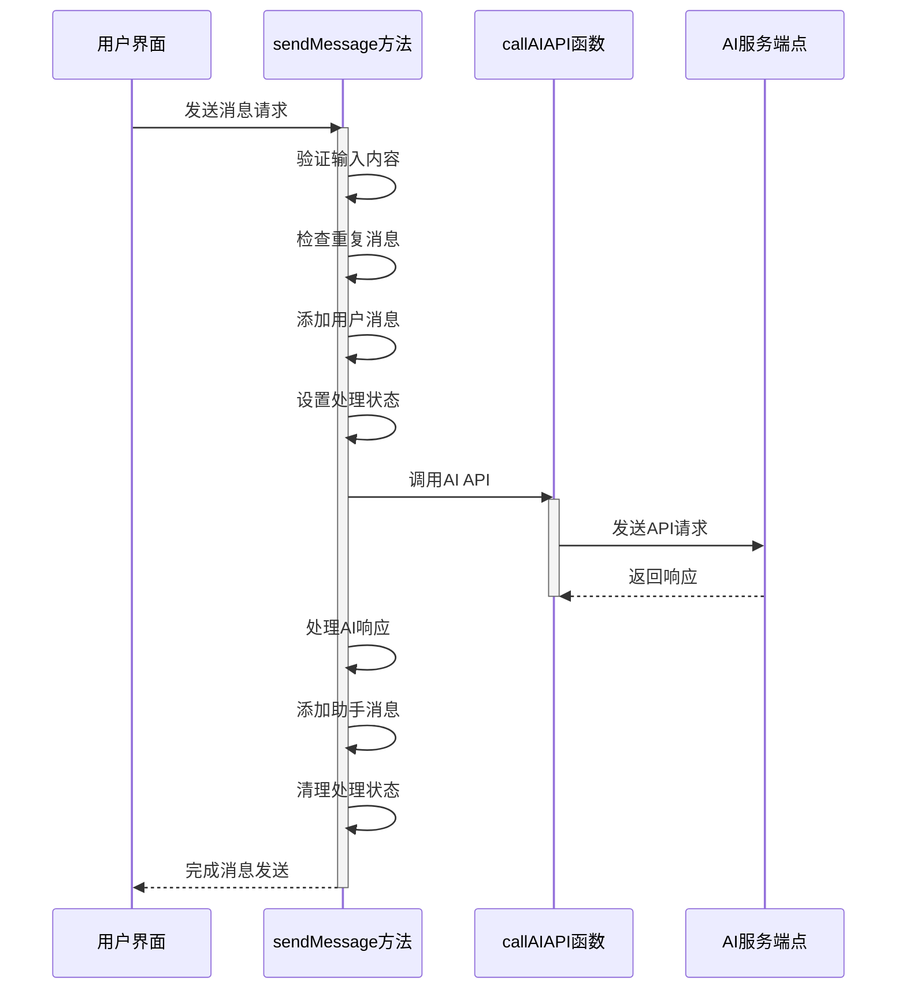
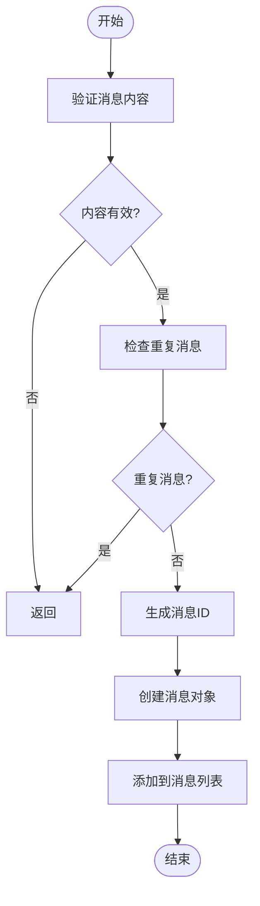
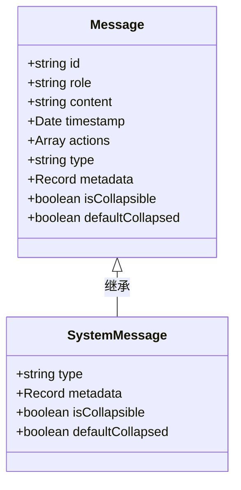
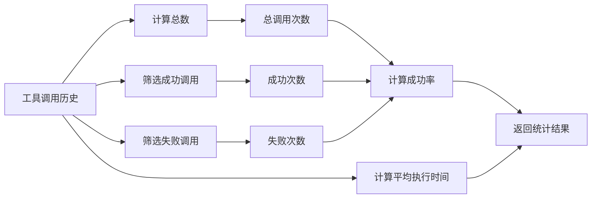
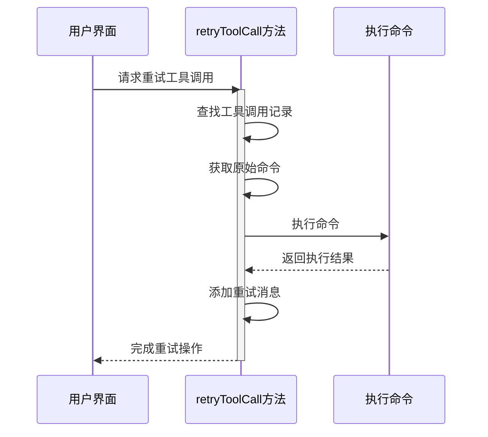
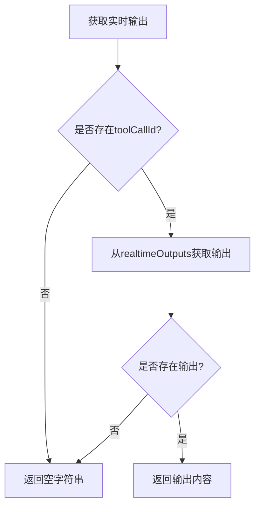
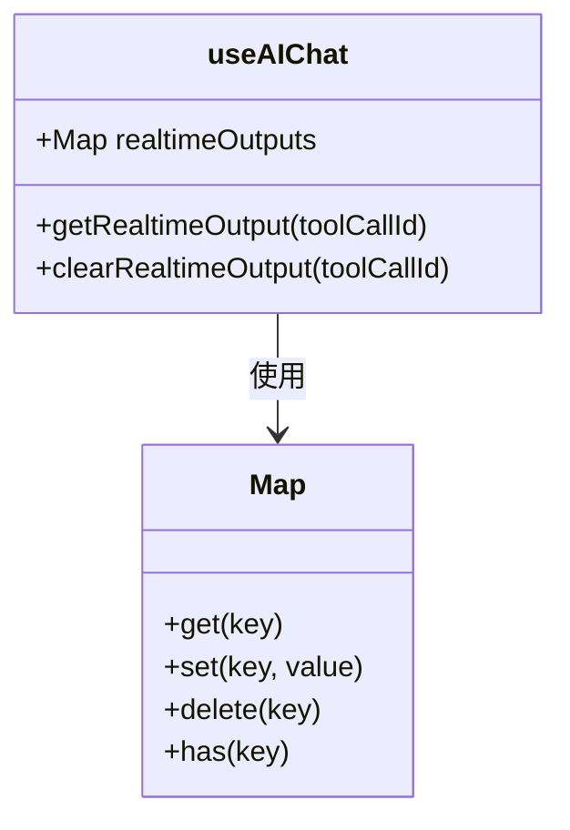
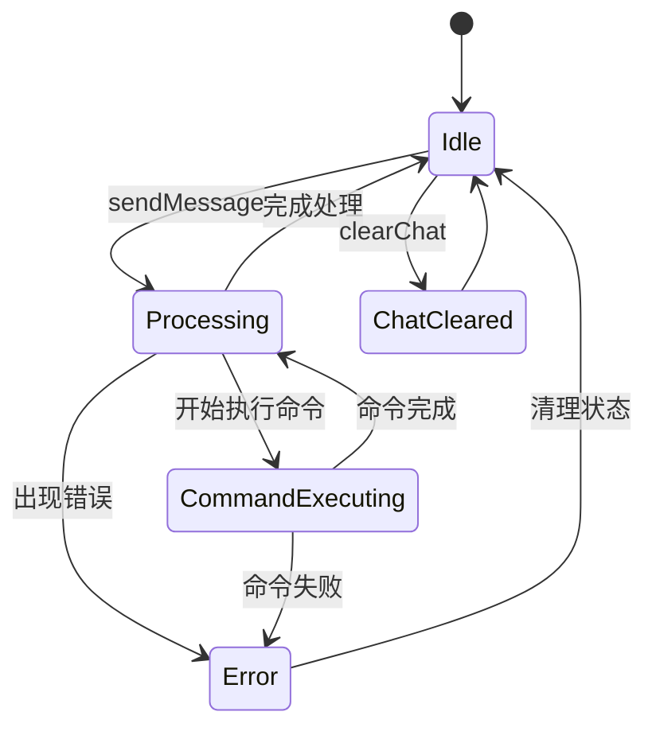

# 会话控制与消息处理

<cite>
**本文档引用的文件**
- [useAIChat.ts](file://src/modules/ai-assistant/composables/useAIChat.ts)
- [aiService.ts](file://src/modules/ai-assistant/utils/aiService.ts)
- [aiCommandExecutor.ts](file://src/modules/ai-assistant/utils/aiCommandExecutor.ts)
- [ai.ts](file://src/types/ai.ts)
</cite>

## 目录
1. [介绍](#介绍)
2. [消息发送流程](#消息发送流程)
3. [消息构建机制](#消息构建机制)
4. [工具调用管理](#工具调用管理)
5. [实时输出管理](#实时输出管理)
6. [会话状态一致性](#会话状态一致性)

## 介绍
本文档全面解析AI助手的会话控制流程，重点分析消息处理的核心机制。系统通过`useAIChat`组合式函数实现完整的会话控制，包括消息发送、用户交互、工具调用和状态管理等功能。会话系统采用事件驱动架构，通过事件系统协调不同组件之间的通信，确保在复杂交互场景下保持会话状态的一致性。

**Section sources**
- [useAIChat.ts](file://src/modules/ai-assistant/composables/useAIChat.ts#L1-L50)

## 消息发送流程

`sendMessage`方法实现了消息发送的完整生命周期，从输入验证到AI API调用及错误处理的全过程。该方法首先对用户输入进行验证，确保消息不为空且系统未处于处理状态。为防止重复消息发送，系统采用基于消息内容和时间戳的唯一性检查机制。

**Diagram sources**
- [useAIChat.ts](file://src/modules/ai-assistant/composables/useAIChat.ts#L120-L183)
- [aiService.ts](file://src/modules/ai-assistant/utils/aiService.ts#L311-L328)

**Section sources**
- [useAIChat.ts](file://src/modules/ai-assistant/composables/useAIChat.ts#L120-L183)

## 消息构建机制

### 用户消息添加
`addMessage`方法负责构建和添加普通用户消息与助手消息。该方法首先验证消息内容的有效性，确保不添加空消息。为防止重复消息，系统检查最近一条消息的内容、角色和时间戳，若在1秒内存在相同内容和角色的消息，则跳过添加。

**Diagram sources**
- [useAIChat.ts](file://src/modules/ai-assistant/composables/useAIChat.ts#L188-L219)

### 系统消息管理
`addSystemMessage`方法专门用于构建系统消息，特别是工具调用相关的提示信息。系统消息具有特殊的属性，如`isCollapsible`和`defaultCollapsed`，用于控制UI中的折叠状态。工具调用结果、完成和错误消息默认为折叠状态，而开始消息则展开显示。

**Diagram sources**
- [useAIChat.ts](file://src/modules/ai-assistant/composables/useAIChat.ts#L224-L251)
- [ai.ts](file://src/types/ai.ts#L100-L120)

**Section sources**
- [useAIChat.ts](file://src/modules/ai-assistant/composables/useAIChat.ts#L188-L251)

## 工具调用管理

### 工具调用统计
`getToolCallStats`方法计算工具调用的历史统计数据，包括总调用次数、成功次数、失败次数、成功率和平均执行时间。这些统计信息为用户提供工具调用性能的概览，帮助评估AI助手的有效性。

**Diagram sources**
- [useAIChat.ts](file://src/modules/ai-assistant/composables/useAIChat.ts#L290-L308)

### 重试与清理机制
`retryToolCall`方法实现工具调用的重试功能，允许用户重新执行失败的命令。该方法从工具调用历史中查找指定ID的调用记录，获取原始命令并重新执行。`clearToolCallHistory`方法则用于清理所有工具调用历史记录，重置相关状态。

**Diagram sources**
- [useAIChat.ts](file://src/modules/ai-assistant/composables/useAIChat.ts#L313-L327)

**Section sources**
- [useAIChat.ts](file://src/modules/ai-assistant/composables/useAIChat.ts#L290-L327)

## 实时输出管理

### 实时输出获取
`getRealtimeOutput`方法提供对命令执行过程中实时输出的访问。该方法通过`toolCallId`从`realtimeOutputs`映射中检索对应的输出内容，支持在命令执行过程中逐步展示输出结果。

### 输出清理机制
`clearRealtimeOutput`方法负责清理指定工具调用的实时输出数据。当命令执行完成或出现错误时，系统调用此方法从`realtimeOutputs`映射中删除对应的数据，释放内存资源。

**Diagram sources**
- [useAIChat.ts](file://src/modules/ai-assistant/composables/useAIChat.ts#L345-L354)

**Section sources**
- [useAIChat.ts](file://src/modules/ai-assistant/composables/useAIChat.ts#L345-L354)

## 会话状态一致性

会话系统通过多种机制确保在不同操作间保持状态一致性。首先，系统使用`isProcessing`状态标志防止并发消息发送。其次，通过`lastMessageId`跟踪最近发送的消息，避免重复提交。工具调用历史与消息列表通过事件系统同步更新，确保UI显示与内部状态一致。

**Section sources**
- [useAIChat.ts](file://src/modules/ai-assistant/composables/useAIChat.ts#L1-L619)