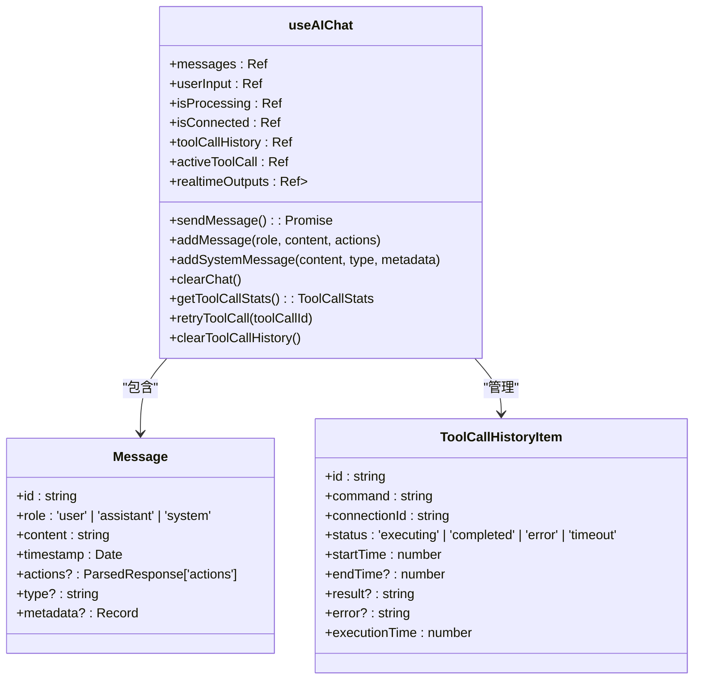
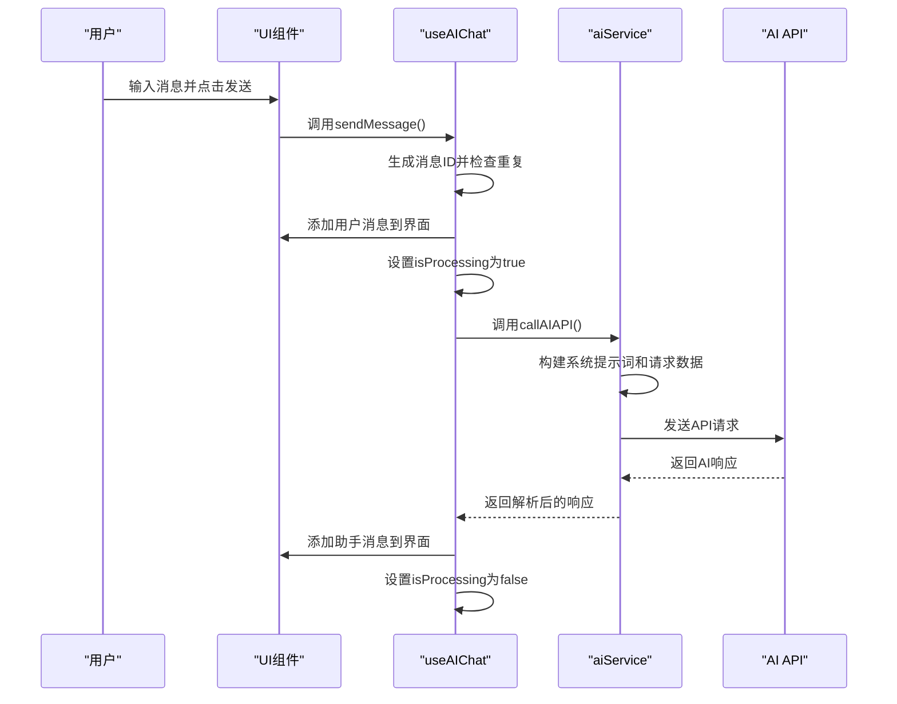
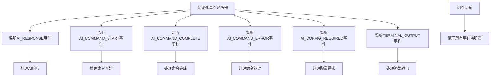
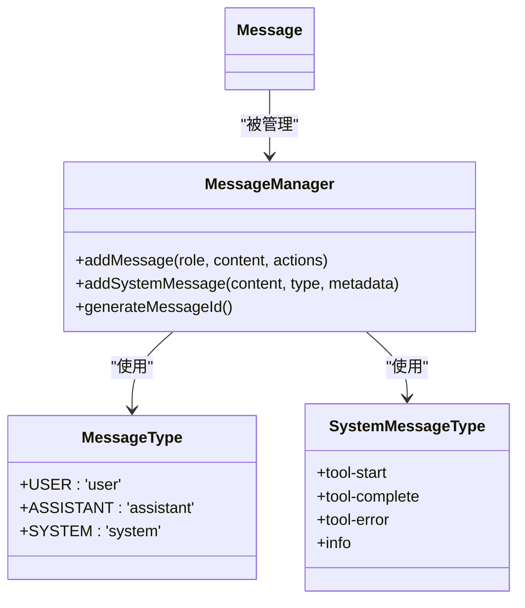
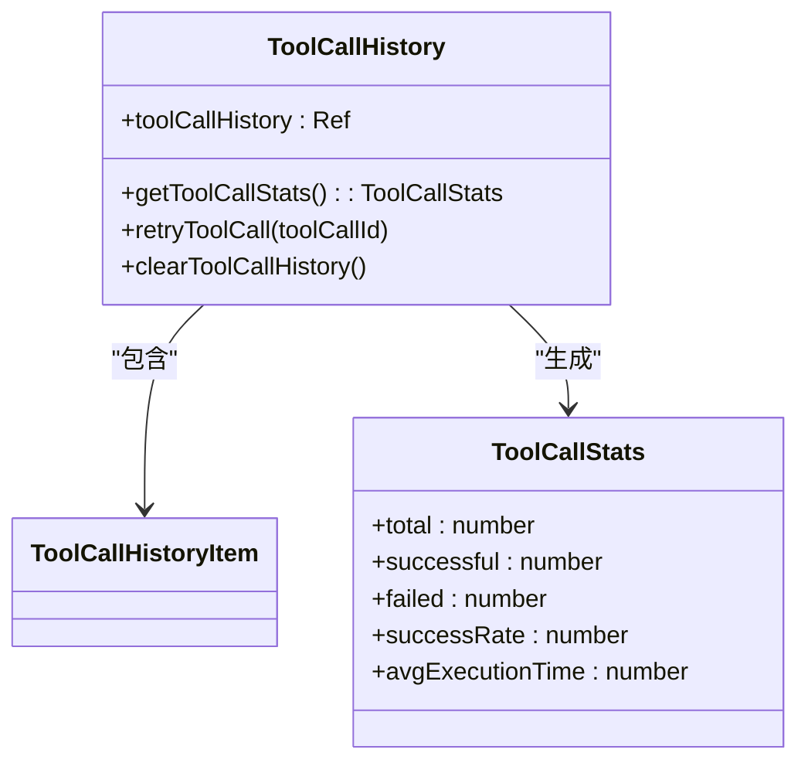
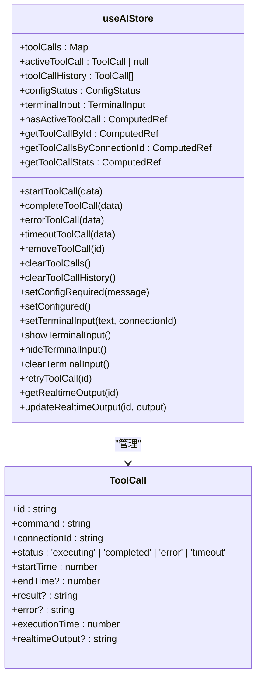
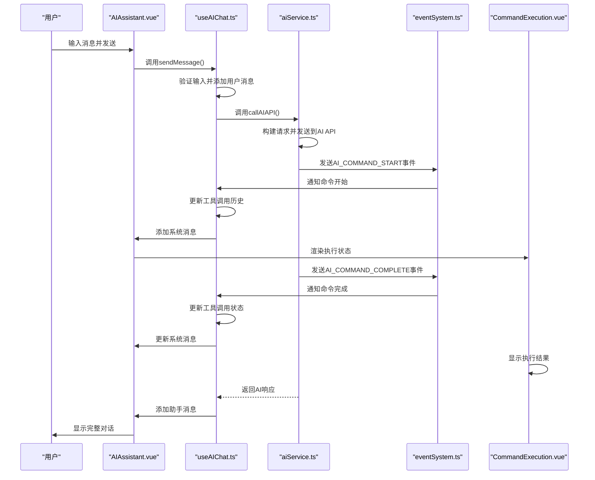

# 对话逻辑管理

<cite>
**Referenced Files in This Document**   
- [useAIChat.ts](file://src/modules/ai-assistant/composables/useAIChat.ts)
- [ai.ts](file://src/modules/ai-assistant/stores/ai.ts)
- [aiService.ts](file://src/modules/ai-assistant/utils/aiService.ts)
- [aiCommandExecutor.ts](file://src/modules/ai-assistant/utils/aiCommandExecutor.ts)
- [eventSystem.ts](file://src/utils/eventSystem.ts)
- [aiConstants.ts](file://src/modules/ai-assistant/constants/aiConstants.ts)
- [CommandExecution.vue](file://src/modules/ai-assistant/components/ai/CommandExecution.vue)
- [AIAssistant.vue](file://src/modules/ai-assistant/components/AIAssistant.vue)
- [ai.js](file://src/types/ai.ts)
- [events.ts](file://src/types/events.ts)
- [index.ts](file://src/types/index.ts)
</cite>

## Table of Contents
1. [对话状态管理机制](#对话状态管理机制)
2. [消息发送与AI请求处理](#消息发送与ai请求处理)
3. [事件监听系统](#事件监听系统)
4. [消息管理与展示逻辑](#消息管理与展示逻辑)
5. [工具调用历史管理](#工具调用历史管理)
6. [跨组件状态共享方案](#跨组件状态共享方案)
7. [组件交互流程](#组件交互流程)

## 对话状态管理机制

`useAIChat`组合式函数通过Vue的响应式系统管理对话的核心状态，包括消息历史、用户输入和处理状态等。这些状态使用`ref`函数创建，确保在UI中能够实时响应变化。

**Diagram sources** 
- [useAIChat.ts](file://src/modules/ai-assistant/composables/useAIChat.ts#L24-L615)
- [ai.js](file://src/types/ai.ts#L78-L88)
- [ai.js](file://src/types/ai.ts#L98-L108)

**Section sources**
- [useAIChat.ts](file://src/modules/ai-assistant/composables/useAIChat.ts#L24-L615)
- [ai.js](file://src/types/ai.ts#L78-L115)

## 消息发送与AI请求处理

`sendMessage`方法是对话逻辑的核心，负责构建AI请求、处理流式响应并管理消息ID去重。该方法首先验证用户输入，然后生成唯一的消息ID以防止重复发送，接着调用AI API并处理响应。

**Diagram sources** 
- [useAIChat.ts](file://src/modules/ai-assistant/composables/useAIChat.ts#L24-L615)
- [aiService.ts](file://src/modules/ai-assistant/utils/aiService.ts#L311-L328)

**Section sources**
- [useAIChat.ts](file://src/modules/ai-assistant/composables/useAIChat.ts#L24-L615)
- [aiService.ts](file://src/modules/ai-assistant/utils/aiService.ts#L311-L720)

## 事件监听系统

事件监听系统通过`onEvent`函数实现，监听AI_RESPONSE、AI_COMMAND_START等事件并更新UI状态。系统使用组件ID进行事件管理，确保事件监听器的正确清理。

**Diagram sources** 
- [useAIChat.ts](file://src/modules/ai-assistant/composables/useAIChat.ts#L24-L615)
- [eventSystem.ts](file://src/utils/eventSystem.ts#L11-L33)

**Section sources**
- [useAIChat.ts](file://src/modules/ai-assistant/composables/useAIChat.ts#L24-L615)
- [eventSystem.ts](file://src/utils/eventSystem.ts#L11-L287)

## 消息管理与展示逻辑

`addMessage`和`addSystemMessage`方法负责维护不同类型消息的展示逻辑。系统消息用于显示工具调用的状态，支持折叠和默认折叠状态。

**Diagram sources** 
- [useAIChat.ts](file://src/modules/ai-assistant/composables/useAIChat.ts#L24-L615)
- [ai.js](file://src/types/ai.ts#L78-L88)
- [aiConstants.ts](file://src/modules/ai-assistant/constants/aiConstants.ts#L24-L31)

**Section sources**
- [useAIChat.ts](file://src/modules/ai-assistant/composables/useAIChat.ts#L24-L615)
- [ai.js](file://src/types/ai.ts#L78-L88)
- [aiConstants.ts](file://src/modules/ai-assistant/constants/aiConstants.ts#L24-L31)

## 工具调用历史管理

工具调用历史通过`toolCallHistory`响应式数组管理，提供统计、重试和清理功能。系统还通过`getToolCallStats`方法提供执行统计信息。

**Diagram sources** 
- [useAIChat.ts](file://src/modules/ai-assistant/composables/useAIChat.ts#L24-L615)
- [ai.js](file://src/types/ai.ts#L98-L108)
- [ai.js](file://src/types/ai.ts#L141-L149)

**Section sources**
- [useAIChat.ts](file://src/modules/ai-assistant/composables/useAIChat.ts#L24-L615)
- [ai.js](file://src/types/ai.ts#L98-L149)

## 跨组件状态共享方案

通过Pinia的`useAIStore`状态管理器实现跨组件状态共享，将关键AI配置和对话上下文持久化。store提供计算属性和方法来访问和修改状态。

**Diagram sources** 
- [ai.ts](file://src/modules/ai-assistant/stores/ai.ts#L18-L271)
- [ai.js](file://src/types/ai.ts#L116-L149)

**Section sources**
- [ai.ts](file://src/modules/ai-assistant/stores/ai.ts#L18-L271)
- [useAIChat.ts](file://src/modules/ai-assistant/composables/useAIChat.ts#L24-L615)

## 组件交互流程

整个对话系统的组件交互流程展示了从用户输入到AI响应的完整过程，包括UI组件、组合式函数、服务层和事件系统的协作。

**Diagram sources** 
- [AIAssistant.vue](file://src/modules/ai-assistant/components/AIAssistant.vue#L1-L695)
- [useAIChat.ts](file://src/modules/ai-assistant/composables/useAIChat.ts#L24-L615)
- [aiService.ts](file://src/modules/ai-assistant/utils/aiService.ts#L311-L720)
- [eventSystem.ts](file://src/utils/eventSystem.ts#L11-L33)
- [CommandExecution.vue](file://src/modules/ai-assistant/components/ai/CommandExecution.vue#L1-L1063)

**Section sources**
- [AIAssistant.vue](file://src/modules/ai-assistant/components/AIAssistant.vue#L1-L695)
- [useAIChat.ts](file://src/modules/ai-assistant/composables/useAIChat.ts#L24-L615)
- [aiService.ts](file://src/modules/ai-assistant/utils/aiService.ts#L311-L720)
- [eventSystem.ts](file://src/utils/eventSystem.ts#L11-L287)
- [CommandExecution.vue](file://src/modules/ai-assistant/components/ai/CommandExecution.vue#L1-L1063)